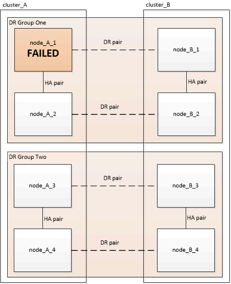
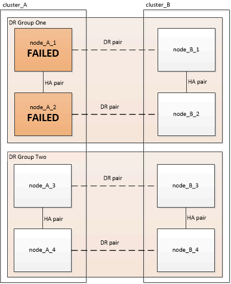

= Choix de la procédure de récupération correcte
:allow-uri-read: 
:icons: font
:imagesdir: ../media/

[role="lead"]
Après un échec de la configuration d'un MetroCluster, vous devez sélectionner la procédure de restauration appropriée. Utilisez le tableau et les exemples suivants pour sélectionner la procédure de récupération appropriée.

Les informations contenues dans ce tableau supposent que l'installation ou la transition est terminée, ce qui signifie que l' `metrocluster configure` exécution de la commande réussie.

|===

| Étendue des défaillances sur le site d'incident | Procédure 

 a| 
* Pas de panne de module de contrôleur
* Un autre matériel est défectueux

 a| 
link:task_recover_from_a_non_controller_failure_mcc_dr.html["Restauration en cas de défaillance sans contrôleur"]

 a| 
* Défaillance d'un module de contrôleur unique ou défaillance de composants FRU dans le module de contrôleur
* Les disques ne sont pas en panne

 a| 
En cas de défaillance limitée à un seul module de contrôleur, vous devez utiliser la procédure de remplacement des FRU du module de contrôleur pour le modèle de plate-forme. Dans une configuration MetroCluster à quatre ou huit nœuds, cette défaillance est isolée de la paire haute disponibilité locale.

*Remarque :* la procédure de remplacement des FRU du module de contrôleur peut être utilisée dans une configuration MetroCluster à deux nœuds en l'absence de pannes de lecteur ou de matériel.

https://docs.netapp.com/platstor/index.jsp["Centre de documentation AFF et FAS"]

 a| 
* Défaillance d'un module de contrôleur unique ou défaillance de composants FRU dans le module de contrôleur
* Les disques sont en panne

 a| 
link:task_recover_from_a_multi_controller_and_or_storage_failure.html["La restauration après une défaillance de plusieurs contrôleurs ou de stockage"]

 a| 
* Défaillance d'un module de contrôleur unique ou défaillance de composants FRU dans le module de contrôleur
* Les disques ne sont pas en panne
* Le matériel supplémentaire en dehors du module de contrôleur est défectueux

 a| 
link:task_recover_from_a_multi_controller_and_or_storage_failure.html["La restauration après une défaillance de plusieurs contrôleurs ou de stockage"]

Vous devez ignorer toutes les étapes pour l'affectation de la conduite.

 a| 
* Panne de plusieurs modules de contrôleur (avec ou sans défaillances supplémentaires) au sein d'un groupe de reprise sur incident

 a| 
link:task_recover_from_a_multi_controller_and_or_storage_failure.html["La restauration après une défaillance de plusieurs contrôleurs ou de stockage"]

|===

== Scénarios de panne du module de contrôleur lors de l'installation de MetroCluster

La réponse à une défaillance du module de contrôleur pendant la procédure de configuration du MetroCluster dépend de la présence ou non du `metrocluster configure` commande terminée avec succès.

* Si le `metrocluster configure` La commande n'a pas encore été exécutée ou a échoué, vous devez redémarrer la procédure de configuration du logiciel MetroCluster depuis le début avec un module de contrôleur de remplacement.
+

NOTE: Vous devez vous assurer d'effectuer les étapes de la section link:https://docs.netapp.com/us-en/ontap-metrocluster/install-ip/task_sw_config_restore_defaults.html["Restauration des valeurs par défaut du système sur un module de contrôleur"] sur chaque contrôleur (y compris le contrôleur de remplacement) pour vérifier que la configuration précédente a été supprimée.

* Si le `metrocluster configure` commande terminée avec succès, puis le module de contrôleur a échoué. utilisez le tableau précédent pour déterminer la procédure de récupération correcte.

== Scénarios de panne du module de contrôleur lors de la transition MetroCluster FC vers IP

La procédure de restauration peut être utilisée en cas de défaillance d'un site pendant la transition. Cependant, elle ne peut être utilisée que si la configuration est une configuration mixte stable, avec un groupe FC DR et un groupe IP DR entièrement configurés. La sortie du `metrocluster node show` La commande doit afficher les deux groupes de reprise sur incident avec les huit nœuds.

IMPORTANT: Si la panne s'est produite lors de la transition lorsque des nœuds sont en cours d'ajout ou de suppression, contactez le support technique.

== Scénarios de défaillance du module de contrôleur dans des configurations MetroCluster à 8 nœuds

Scénarios de défaillance :

* <<Pannes de module de contrôleur unique dans un seul groupe DR>>
* <<Deux pannes de module de contrôleur dans un seul groupe DR>>
* <<Pannes de module de contrôleur unique dans des groupes DR distincts>>
* <<Pannes de trois modules de contrôleur réparties sur les groupes de DR>>

=== Pannes de module de contrôleur unique dans un seul groupe DR

Dans ce cas, la panne est limitée à une paire haute disponibilité.

* Si aucun stockage ne nécessite de remplacement, vous pouvez suivre la procédure de remplacement des FRU du module de contrôleur pour le modèle de plateforme.
+
https://docs.netapp.com/platstor/index.jsp["Centre de documentation AFF et FAS"^]

* Si le stockage nécessite un remplacement, vous pouvez utiliser la procédure de restauration du module multi-contrôleur.
+
link:task_recover_from_a_multi_controller_and_or_storage_failure.html["La restauration après une défaillance de plusieurs contrôleurs ou de stockage"]

+
Ce scénario s'applique également aux configurations MetroCluster à quatre nœuds.

+

=== Deux pannes de module de contrôleur dans un seul groupe DR

Dans ce cas, la défaillance nécessite un basculement. Vous pouvez utiliser la procédure de récupération de panne du module multi-contrôleur.

link:task_recover_from_a_multi_controller_and_or_storage_failure.html["La restauration après une défaillance de plusieurs contrôleurs ou de stockage"]

Ce scénario s'applique également aux configurations MetroCluster à quatre nœuds.

=== Pannes de module de contrôleur unique dans des groupes DR distincts

Dans ce cas, la défaillance est limitée à des paires haute disponibilité distinctes.

* Si aucun stockage ne nécessite de remplacement, vous pouvez suivre la procédure de remplacement des FRU du module de contrôleur pour le modèle de plateforme.
+
La procédure de remplacement des FRU est effectuée deux fois, une fois pour chaque module de contrôleur défaillant.

+
https://docs.netapp.com/platstor/index.jsp["Centre de documentation AFF et FAS"^]

* Si le stockage nécessite un remplacement, vous pouvez utiliser la procédure de restauration du module multi-contrôleur.
+
link:task_recover_from_a_multi_controller_and_or_storage_failure.html["La restauration après une défaillance de plusieurs contrôleurs ou de stockage"]

image::../media/mcc_dr_groups_8_node_with_two_single_controller_failures.gif[mcc dr group 8 nœuds avec deux défaillances de contrôleur unique]

=== Pannes de trois modules de contrôleur réparties sur les groupes de DR

Dans ce cas, la défaillance nécessite un basculement. Vous pouvez utiliser la procédure de récupération de panne du module multi-contrôleur pour le groupe DR un.

link:task_recover_from_a_multi_controller_and_or_storage_failure.html["La restauration après une défaillance de plusieurs contrôleurs ou de stockage"]

Vous pouvez utiliser la procédure de remplacement des FRU du module de contrôleur spécifique à la plate-forme pour le groupe DR deux.

https://docs.netapp.com/platstor/index.jsp["Centre de documentation AFF et FAS"^]

image::../media/mcc_dr_groups_8_node_with_a_3_controller_failure.gif[mcc dr group 8 nœuds avec une panne de contrôleur 3]

== Scénarios de défaillance de module de contrôleur dans des configurations MetroCluster à 2 nœuds

La procédure que vous utilisez dépend de l'étendue de la panne.

* Si aucun stockage ne nécessite de remplacement, vous pouvez suivre la procédure de remplacement des FRU du module de contrôleur pour le modèle de plateforme.
+
https://docs.netapp.com/platstor/index.jsp["Centre de documentation AFF et FAS"^]

* Si le stockage nécessite un remplacement, vous pouvez utiliser la procédure de restauration du module multi-contrôleur.
+
link:task_recover_from_a_multi_controller_and_or_storage_failure.html["La restauration après une défaillance de plusieurs contrôleurs ou de stockage"]

image::../media/mcc_dr_groups_2_node_with_a_single_controller_failure.gif[mcc dr groups 2 nœuds avec une seule panne de contrôleur]
