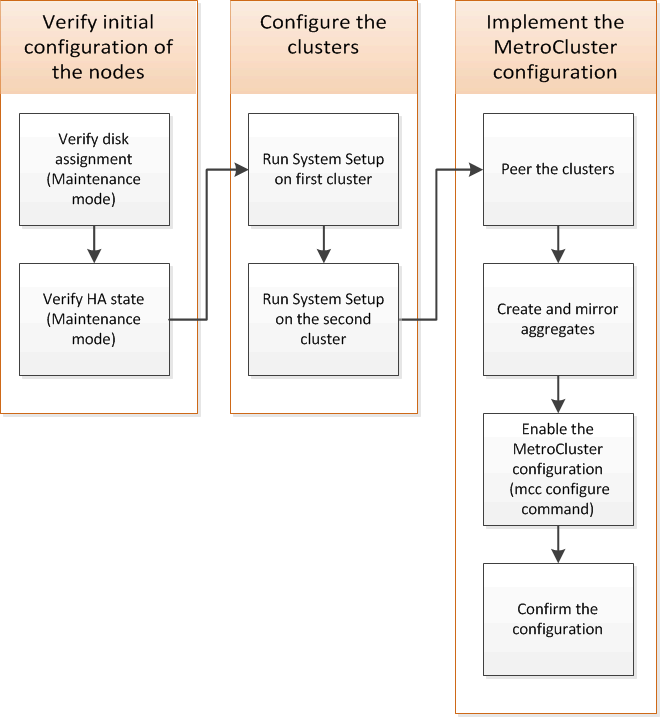

= Configuration du logiciel MetroCluster dans ONTAP
:allow-uri-read: 
:icons: font
:imagesdir: ../media/

[role="lead"]
Vous devez installer chaque nœud dans la configuration MetroCluster de ONTAP, y compris les configurations au niveau des nœuds et la configuration des nœuds en deux sites. Vous devez également implémenter la relation MetroCluster entre les deux sites. Les étapes des systèmes avec tiroirs disques natifs sont légèrement différentes de celles des systèmes avec LUN de baie.

== Collecte des informations requises

Vous devez rassembler les adresses IP requises pour les modules de contrôleur avant de commencer le processus de configuration.

=== Fiche d'informations sur le réseau IP pour le site A

Avant de configurer le système, vous devez obtenir des adresses IP et d'autres informations réseau pour le premier site MetroCluster (site A) de votre administrateur réseau.

==== Informations sur les commutateurs du site A (clusters commutés)

Lorsque vous câconnectez le système, vous avez besoin d'un nom d'hôte et d'une adresse IP de gestion pour chaque commutateur de cluster. Ces informations ne sont pas nécessaires si vous utilisez un cluster sans commutateur à deux nœuds ou si vous disposez d'une configuration MetroCluster à deux nœuds (un nœud sur chaque site).

|===

| Commutateur de cluster | Nom d'hôte | Adresse IP | Masque de réseau | Passerelle par défaut 

 a| 
Interconnexion 1
 a| 
 a| 
 a| 
 a| 

 a| 
Interconnexion 2
 a| 
 a| 
 a| 
 a| 

 a| 
Gestion 1
 a| 
 a| 
 a| 
 a| 

 a| 
Gestion 2
 a| 
 a| 
 a| 
 a| 

|===

==== Informations de création du site À partir d'un cluster

Lors de la création du cluster, vous avez besoin des informations suivantes :

|===

| Type d'information | Vos valeurs 

 a| 
Nom du cluster

Exemple utilisé dans ce guide : site_A
 a| 

 a| 
Domaine DNS
 a| 

 a| 
Serveurs de noms DNS
 a| 

 a| 
Emplacement
 a| 

 a| 
Mot de passe administrateur
 a| 

|===

==== Information sur un nœud du site

Vous avez besoin d'une adresse IP de gestion, d'un masque de réseau et d'une passerelle par défaut pour chaque nœud du cluster.

|===

| Nœud | Port | Adresse IP | Masque de réseau | Passerelle par défaut 

 a| 
Nœud 1

Exemple utilisé dans ce guide : Controller_A_1
 a| 
 a| 
 a| 
 a| 

 a| 
Nœud 2

Non requis si vous utilisez une configuration MetroCluster à deux nœuds (un nœud sur chaque site).

Exemple utilisé dans ce guide : Controller_A_2
 a| 
 a| 
 a| 
 a| 

|===

==== Site A LIFs et ports pour le peering de cluster

Pour chaque nœud du cluster, vous devez disposer des adresses IP de deux LIF intercluster, y compris un masque de réseau et une passerelle par défaut. Les LIFs intercluster sont utilisés pour mutualiser les clusters.

|===

| Nœud | Port | Adresse IP du LIF intercluster | Masque de réseau | Passerelle par défaut 

 a| 
IC node 1 LIF 1
 a| 
 a| 
 a| 
 a| 

 a| 
Nœud 1 ci LIF 2
 a| 
 a| 
 a| 
 a| 

 a| 
Nœud 2 IC LIF 1

Non requis pour les configurations MetroCluster à deux nœuds (un nœud sur chaque site).
 a| 
 a| 
 a| 
 a| 

 a| 
Nœud 2 IC LIF 2

Non requis pour les configurations MetroCluster à deux nœuds (un nœud sur chaque site).
 a| 
 a| 
 a| 
 a| 

|===

==== Informations sur le serveur de temps du site A.

Vous devez synchroniser l'heure, qui nécessite un ou plusieurs serveurs de temps NTP.

|===

| Nœud | Nom d'hôte | Adresse IP | Masque de réseau | Passerelle par défaut 

 a| 
Serveur NTP 1
 a| 
 a| 
 a| 
 a| 

 a| 
Serveur NTP 2
 a| 
 a| 
 a| 
 a| 

|===

==== Site A nbsp; informations AutoSupport

Vous devez configurer le AutoSupport sur chaque nœud, qui nécessite les informations suivantes :

|===

2+| Type d'information | Vos valeurs 

 a| 
De l'adresse e-mail
 a| 

 a| 
Hôtes de messagerie
 a| 
Noms ou adresses IP
 a| 

 a| 
Protocole de transport
 a| 
HTTP, HTTPS OU SMTP
 a| 

 a| 
Serveur proxy
 a| 

 a| 
Adresses e-mail ou listes de distribution du destinataire
 a| 
Messages longs
 a| 

 a| 
Messages concis
 a| 

 a| 
Partenaires
 a| 

|===

==== Site A nbsp; informations SP

Vous devez activer l'accès au processeur de service de chaque nœud pour le dépannage et la maintenance. Pour ce faire, vous devez disposer des informations réseau suivantes pour chaque nœud :

|===

| Nœud | Adresse IP | Masque de réseau | Passerelle par défaut 

 a| 
Nœud 1
 a| 
 a| 
 a| 

 a| 
Nœud 2

Non requis pour les configurations MetroCluster à deux nœuds (un nœud sur chaque site).
 a| 
 a| 
 a| 

|===

=== Fiche d'informations sur le réseau IP pour le site B

Avant de configurer le système, vous devez obtenir des adresses IP et d'autres informations réseau pour le second site MetroCluster (site B) de votre administrateur réseau.

==== Informations sur les commutateurs du site B (clusters avec commutateur)

Lorsque vous câconnectez le système, vous avez besoin d'un nom d'hôte et d'une adresse IP de gestion pour chaque commutateur de cluster. Ces informations ne sont pas nécessaires si vous utilisez un cluster sans commutateur à deux nœuds ou si vous disposez d'une configuration MetroCluster à deux nœuds (un nœud sur chaque site).

|===

| Commutateur de cluster | Nom d'hôte | Adresse IP | Masque de réseau | Passerelle par défaut 

 a| 
Interconnexion 1
 a| 
 a| 
 a| 
 a| 

 a| 
Interconnexion 2
 a| 
 a| 
 a| 
 a| 

 a| 
Gestion 1
 a| 
 a| 
 a| 
 a| 

 a| 
Gestion 2
 a| 
 a| 
 a| 
 a| 

|===

==== Informations de création de cluster du site B

Lors de la création du cluster, vous avez besoin des informations suivantes :

|===

| Type d'information | Vos valeurs 

 a| 
Nom du cluster

Exemple utilisé dans ce guide : site_B
 a| 

 a| 
Domaine DNS
 a| 

 a| 
Serveurs de noms DNS
 a| 

 a| 
Emplacement
 a| 

 a| 
Mot de passe administrateur
 a| 

|===

==== Informations sur le nœud du site B.

Vous avez besoin d'une adresse IP de gestion, d'un masque de réseau et d'une passerelle par défaut pour chaque nœud du cluster.

|===

| Nœud | Port | Adresse IP | Masque de réseau | Passerelle par défaut 

 a| 
Nœud 1

Exemple utilisé dans ce guide : Controller_B_1
 a| 
 a| 
 a| 
 a| 

 a| 
Nœud 2

Non requis pour les configurations MetroCluster à deux nœuds (un nœud sur chaque site).

Exemple utilisé dans ce guide : Controller_B_2
 a| 
 a| 
 a| 
 a| 

|===

==== Les LIF du site B et les ports pour le peering de clusters

Pour chaque nœud du cluster, vous devez disposer des adresses IP de deux LIF intercluster, y compris un masque de réseau et une passerelle par défaut. Les LIFs intercluster sont utilisés pour mutualiser les clusters.

|===

| Nœud | Port | Adresse IP du LIF intercluster | Masque de réseau | Passerelle par défaut 

 a| 
IC node 1 LIF 1
 a| 
 a| 
 a| 
 a| 

 a| 
Nœud 1 ci LIF 2
 a| 
 a| 
 a| 
 a| 

 a| 
Nœud 2 IC LIF 1

Non requis pour les configurations MetroCluster à deux nœuds (un nœud sur chaque site).
 a| 
 a| 
 a| 
 a| 

 a| 
Nœud 2 IC LIF 2

Non requis pour les configurations MetroCluster à deux nœuds (un nœud sur chaque site).
 a| 
 a| 
 a| 
 a| 

|===

==== Informations sur le serveur de temps du site B.

Vous devez synchroniser l'heure, qui nécessite un ou plusieurs serveurs de temps NTP.

|===

| Nœud | Nom d'hôte | Adresse IP | Masque de réseau | Passerelle par défaut 

 a| 
Serveur NTP 1
 a| 
 a| 
 a| 
 a| 

 a| 
Serveur NTP 2
 a| 
 a| 
 a| 
 a| 

|===

==== Site B nbsp;informations AutoSupport

Vous devez configurer le AutoSupport sur chaque nœud, qui nécessite les informations suivantes :

|===

2+| Type d'information | Vos valeurs 

2+| De l'adresse e-mail  a| 

 a| 
Hôtes de messagerie
 a| 
Noms ou adresses IP
 a| 

 a| 
Protocole de transport
 a| 
HTTP, HTTPS OU SMTP
 a| 

 a| 
Serveur proxy
 a| 

 a| 
Adresses e-mail ou listes de distribution du destinataire
 a| 
Messages longs
 a| 

 a| 
Messages concis
 a| 

 a| 
Partenaires
 a| 

|===

==== Site B nbsp;informations SP

Vous devez activer l'accès au processeur de service de chaque nœud pour le dépannage et la maintenance. Pour ce faire, vous devez disposer des informations réseau suivantes pour chaque nœud :

|===

| Nœud | Adresse IP | Masque de réseau | Passerelle par défaut 

 a| 
Nœud 1 (contrôleur_B_1)
 a| 
 a| 
 a| 

 a| 
Nœud 2 (contrôleur_B_2)

Non requis pour les configurations MetroCluster à deux nœuds (un nœud sur chaque site).
 a| 
 a| 
 a| 

|===

== Similarités et différences entre les configurations cluster standard et MetroCluster

La configuration des nœuds de chaque cluster dans une configuration MetroCluster est similaire à celle des nœuds d'un cluster standard.

La configuration MetroCluster est basée sur deux clusters standard. Physiquement, la configuration doit être symétrique. Chaque nœud présente la même configuration matérielle et tous les composants MetroCluster doivent être câblés et configurés. Cependant, la configuration logicielle de base des nœuds dans une configuration MetroCluster est identique à celle des nœuds d'un cluster standard.

|===

| Étape de configuration | Configuration standard en cluster | Configuration MetroCluster 

| Configurez la gestion, le cluster et la LIF de données sur chaque nœud. 2+| La même chose dans les deux types de clusters 

| Configurer l'agrégat root. 2+| La même chose dans les deux types de clusters 

| Configurer les nœuds sur le cluster en tant que paires haute disponibilité 2+| La même chose dans les deux types de clusters 

| Configurez le cluster sur un nœud. 2+| La même chose dans les deux types de clusters 

| Joignez l'autre nœud au cluster. 2+| La même chose dans les deux types de clusters 

 a| 
Créez un agrégat racine en miroir.
 a| 
Facultatif
 a| 
Obligatoire

 a| 
Peer-to-peer des clusters
 a| 
Facultatif
 a| 
Obligatoire

 a| 
Activez la configuration MetroCluster.
 a| 
Ne s'applique pas
 a| 
Obligatoire

|===

== Restauration des paramètres par défaut du système et configuration du type de HBA sur un module de contrôleur

.Description de la tâche
--
Pour garantir la réussite de l'installation de MetroCluster, réinitialisez et restaurez les valeurs par défaut sur les modules de contrôleur.

.Important
Cette tâche n'est requise que pour les configurations étendues utilisant des ponts FC-SAS.

.Étapes
. Dans l'invite DU CHARGEUR, renvoie les variables environnementales à leur paramètre par défaut :
+
`set-defaults`

. Démarrer le nœud en mode Maintenance, puis configurer les paramètres des HBA du système :
+
.. Démarrage en mode maintenance :
+
`boot_ontap maint`

.. Vérifiez les paramètres actuels des ports :
+
`ucadmin show`

.. Mettez à jour les paramètres de port selon vos besoins.

+
|===

| Si vous disposez de ce type de HBA et du mode souhaité... | Utilisez cette commande... 

 a| 
FC CNA
 a| 
`ucadmin modify -m fc -t initiator _adapter_name_`

 a| 
Ethernet CNA
 a| 
`ucadmin modify -mode cna _adapter_name_`

 a| 
Cible FC
 a| 
`fcadmin config -t target _adapter_name_`

 a| 
Initiateur FC
 a| 
`fcadmin config -t initiator _adapter_name_`

|===
. Quitter le mode Maintenance :
+
`halt`

+
Une fois que vous avez exécuté la commande, attendez que le nœud s'arrête à l'invite DU CHARGEUR.

. Redémarrez le nœud en mode maintenance pour que les modifications de configuration prennent effet :
+
`boot_ontap maint`

. Vérifiez les modifications que vous avez effectuées :
+
|===

| Si vous disposez de ce type de HBA... | Utilisez cette commande... 

 a| 
CNA
 a| 
`ucadmin show`

 a| 
FC
 a| 
`fcadmin show`

|===
. Quitter le mode Maintenance :
+
`halt`

+
Une fois que vous avez exécuté la commande, attendez que le nœud s'arrête à l'invite DU CHARGEUR.

. Démarrez le nœud sur le menu de démarrage :
+
`boot_ontap menu`

+
Une fois que vous avez exécuté la commande, attendez que le menu de démarrage s'affiche.

. Effacez la configuration du nœud en tapant « wipconconfig » à l'invite du menu de démarrage, puis appuyez sur entrée.
+
L'écran suivant affiche l'invite du menu de démarrage :

--
....
Please choose one of the following:

     (1) Normal Boot.
     (2) Boot without /etc/rc.
     (3) Change password.
     (4) Clean configuration and initialize all disks.
     (5) Maintenance mode boot.
     (6) Update flash from backup config.
     (7) Install new software first.
     (8) Reboot node.
     (9) Configure Advanced Drive Partitioning.
     Selection (1-9)?  wipeconfig
 This option deletes critical system configuration, including cluster membership.
 Warning: do not run this option on a HA node that has been taken over.
 Are you sure you want to continue?: yes
 Rebooting to finish wipeconfig request.
....
--

--

== Configuration des ports FC-VI sur une carte X1132A-R6 à quatre ports sur les systèmes FAS8020

Si vous utilisez la carte X1132A-R6 à quatre ports sur un système FAS8020, vous pouvez passer en mode de maintenance pour configurer les ports 1a et 1b pour FC-VI et pour l'utilisation d'un initiateur. Cela n'est pas nécessaire pour les systèmes MetroCluster reçus en usine, dans lesquels les ports sont configurés de façon appropriée pour votre configuration.

.Description de la tâche
Cette tâche doit être effectuée en mode Maintenance.

NOTE: La conversion d'un port FC en port FC-VI avec la commande ucadmin n'est prise en charge que sur les systèmes FAS8020 et AFF 8020. La conversion de ports FC en ports FCVI n'est pas prise en charge sur toute autre plateforme.

.Étapes
. Désactiver les ports :
+
`storage disable adapter 1a`

+
`storage disable adapter 1b`

+
[listing]
----
*> storage disable adapter 1a
Jun 03 02:17:57 [controller_B_1:fci.adapter.offlining:info]: Offlining Fibre Channel adapter 1a.
Host adapter 1a disable succeeded
Jun 03 02:17:57 [controller_B_1:fci.adapter.offline:info]: Fibre Channel adapter 1a is now offline.
*> storage disable adapter 1b
Jun 03 02:18:43 [controller_B_1:fci.adapter.offlining:info]: Offlining Fibre Channel adapter 1b.
Host adapter 1b disable succeeded
Jun 03 02:18:43 [controller_B_1:fci.adapter.offline:info]: Fibre Channel adapter 1b is now offline.
*>
----
. Vérifiez que les ports sont désactivés :
+
`ucadmin show`

+
[listing]
----
*> ucadmin show
         Current  Current    Pending  Pending    Admin
Adapter  Mode     Type       Mode     Type       Status
-------  -------  ---------  -------  ---------  -------
  ...
  1a     fc       initiator  -        -          offline
  1b     fc       initiator  -        -          offline
  1c     fc       initiator  -        -          online
  1d     fc       initiator  -        -          online
----
. Définir les ports a et b en mode FC-VI :
+
`ucadmin modify -adapter 1a -type fcvi`

+
La commande définit le mode sur les deux ports de la paire de ports 1a et 1b (même si seul 1a est spécifié dans la commande).

+
[listing]
----

*> ucadmin modify -t fcvi 1a
Jun 03 02:19:13 [controller_B_1:ucm.type.changed:info]: FC-4 type has changed to fcvi on adapter 1a. Reboot the controller for the changes to take effect.
Jun 03 02:19:13 [controller_B_1:ucm.type.changed:info]: FC-4 type has changed to fcvi on adapter 1b. Reboot the controller for the changes to take effect.
----
. Vérifiez que la modification est en attente :
+
`ucadmin show`

+
[listing]
----
*> ucadmin show
         Current  Current    Pending  Pending    Admin
Adapter  Mode     Type       Mode     Type       Status
-------  -------  ---------  -------  ---------  -------
  ...
  1a     fc       initiator  -        fcvi       offline
  1b     fc       initiator  -        fcvi       offline
  1c     fc       initiator  -        -          online
  1d     fc       initiator  -        -          online
----
. Arrêter le contrôleur, puis redémarrer en mode maintenance.
. Confirmer le changement de configuration :
+
`ucadmin show local`

+
[listing]
----

Node           Adapter  Mode     Type       Mode     Type       Status
------------   -------  -------  ---------  -------  ---------  -----------
...
controller_B_1
               1a       fc       fcvi       -        -          online
controller_B_1
               1b       fc       fcvi       -        -          online
controller_B_1
               1c       fc       initiator  -        -          online
controller_B_1
               1d       fc       initiator  -        -          online
6 entries were displayed.
----

== Vérification de l'affectation du disque en mode maintenance dans une configuration à huit ou quatre nœuds

Avant de démarrer entièrement le système sur ONTAP, vous pouvez également démarrer en mode maintenance et vérifier l'affectation des disques sur les nœuds. Les disques doivent être affectés pour créer une configuration active-active entièrement symétrique, où chaque pool a le même nombre de disques qui leur sont affectés.

.Description de la tâche
Les nouveaux systèmes MetroCluster ont une affectation des disques réalisée avant leur expédition.

Le tableau suivant présente des exemples d'affectations de pools pour une configuration MetroCluster. Les disques sont affectés à des pools par tiroir.

*Tiroirs disques du site A*

|===

| Tiroir disque (sample_shelf_name)... | Appartient à... | Et est attribué à ce nœud... 

| Tiroir disque 1 (tiroir_A_1_1) .2+| Nœud A 1 .2+| Pool 0 

| Tiroir disque 2 (tiroir_A_1_3) 

| Tiroir disque 3 (tiroir_B_1_1) .2+| Nœud B 1 .2+| Piscine 1 

| Tiroir disque 4 (tiroir_B_1_3) 

| Tiroir disque 5 (tiroir_A_2_1) .2+| Nœud A 2 .2+| Pool 0 

| Tiroir disque 6 (tiroir_A_2_3) 

| Tiroir disque 7 (tiroir_B_2_1) .2+| Nœud B 2 .2+| Piscine 1 

| Tiroir disque 8 (tiroir_B_2_3) 

| Tiroir disque 1 (tiroir_A_3_1) .2+| Nœud A 3 .2+| Pool 0 

| Tiroir disque 2 (tiroir_A_3_3) 

| Tiroir disque 3 (tiroir_B_3_1) .2+| Nœud B 3 .2+| Piscine 1 

| Tiroir disque 4 (tiroir_B_3_3) 

| Tiroir disque 5 (tiroir_A_4_1) .2+| Nœud A 4 .2+| Pool 0 

| Tiroir disque 6 (tiroir_A_4_3) 

| Tiroir disque 7 (tiroir_B_4_1) .2+| Nœud B 4 .2+| Piscine 1 

| Tiroir disque 8 (tiroir_B_4_3) 
|===
*Tiroirs disques du site B*

|===

| Tiroir disque (sample_shelf_name)... | Appartient à... | Et est attribué à ce nœud... 

 a| 
Tiroir disque 9 (tiroir_B_1_2)
 a| 
Nœud B 1
 a| 
Pool 0

 a| 
Tiroir disque 10 (tiroir_B_1_4)

 a| 
Tiroir disque 11 (tiroir_A_1_2)
 a| 
Nœud A 1
 a| 
Piscine 1

 a| 
Tiroir disque 12 (tiroir_A_1_4)

 a| 
Tiroir disque 13 (tiroir_B_2_2)
 a| 
Nœud B 2
 a| 
Pool 0

 a| 
Tiroir disque 14 (tiroir_B_2_4)

 a| 
Tiroir disque 15 (tiroir_A_2_2)
 a| 
Nœud A 2
 a| 
Piscine 1

 a| 
Tiroir disque 16 (tiroir_A_2_4)

 a| 
Tiroir disque 1 (tiroir_B_3_2)
 a| 
Nœud A 3
 a| 
Pool 0

 a| 
Tiroir disque 2 (tiroir_B_3_4)

 a| 
Tiroir disque 3 (tiroir_A_3_2)
 a| 
Nœud B 3
 a| 
Piscine 1

 a| 
Tiroir disque 4 (tiroir_A_3_4)

 a| 
Tiroir disque 5 (tiroir_B_4_2)
 a| 
Nœud A 4
 a| 
Pool 0

 a| 
Tiroir disque 6 (tiroir_B_4_4)

 a| 
Tiroir disque 7 (tiroir_A_4_2)
 a| 
Nœud B 4
 a| 
Piscine 1

 a| 
Tiroir disque 8 (tiroir_A_4_4)

|===
.Étapes
. Confirmer les attributions de tiroirs :
+
`disk show –v`

. Si nécessaire, affectez explicitement des disques sur les tiroirs disques connectés au pool approprié :
+
`disk assign`

+
L'utilisation de caractères génériques dans la commande vous permet d'affecter tous les disques d'un tiroir disque à l'aide d'une commande. Vous pouvez identifier les ID de tiroir disque et les baies de chaque disque disposant du `storage show disk -x` commande.

=== Assignation de la propriété des disques dans des systèmes non-AFF

Si les nœuds MetroCluster ne sont pas affectés correctement, ou si vous utilisez des tiroirs disques DS460C dans votre configuration, il est nécessaire d'attribuer des disques à chacun des nœuds de la configuration MetroCluster selon le tiroir par tiroir. Vous allez créer une configuration dans laquelle chaque nœud a le même nombre de disques dans ses pools de disques locaux et distants.

.Avant de commencer
Les contrôleurs de stockage doivent être en mode maintenance.

.Description de la tâche
Si votre configuration n'inclut pas de tiroirs disques DS460C, cette tâche n'est pas requise si les disques ont été correctement attribués lors de leur réception par l'usine.

[NOTE]
====
Le pool 0 contient toujours les disques qui se trouvent sur le même site que le système de stockage qui les possède.

Le pool 1 contient toujours les disques distants du système de stockage qui les possèdent.

====
Si votre configuration inclut des tiroirs disques DS460C, il est conseillé d'attribuer manuellement les disques en suivant les instructions suivantes pour chaque tiroir 12 disques :

|===

| Affectez ces disques dans le tiroir... | À ce nœud et pool... 

 a| 
0 - 2
 a| 
Pool du nœud local 0

 a| 
3 - 5
 a| 
Pool 0 du nœud partenaire HA

 a| 
6 - 8
 a| 
Partenaire DR du pool du nœud local 1

 a| 
9 - 11
 a| 
Partenaire de reprise après incident du pool de partenaires de haute disponibilité 1

|===
Ce modèle d'affectation de disque permet de s'assurer qu'un agrégat est au moins affecté en cas de mise hors ligne d'un tiroir.

.Étapes
. Si ce n'est pas le cas, démarrez chaque système en mode maintenance.
. Assigner les tiroirs disques aux nœuds situés sur le premier site (site A) :
+
Les tiroirs disques du même site que le nœud sont affectés au pool 0 et les tiroirs disques situés sur le site partenaire sont affectés au pool 1.

+
Vous devez affecter un nombre égal de tiroirs à chaque pool.

+
.. Sur le premier nœud, attribuer systématiquement les tiroirs disques locaux à pool 0 et les tiroirs disques distants à pool 1 :
+
`disk assign -shelf _local-switch-name:shelf-name.port_ -p _pool_`

+
Si le contrôleur de stockage Controller_A_1 dispose de quatre tiroirs, vous exécutez les commandes suivantes :

+
[listing]
----
*> disk assign -shelf FC_switch_A_1:1-4.shelf1 -p 0
*> disk assign -shelf FC_switch_A_1:1-4.shelf2 -p 0

*> disk assign -shelf FC_switch_B_1:1-4.shelf1 -p 1
*> disk assign -shelf FC_switch_B_1:1-4.shelf2 -p 1
----
.. Répétez le processus pour le second nœud du site local, en affectant systématiquement les tiroirs disques locaux au pool 0 et les tiroirs disques distants au pool 1 :
+
`disk assign -shelf _local-switch-name:shelf-name.port_ -p _pool_`

+
Si le contrôleur de stockage Controller_A_2 dispose de quatre tiroirs, vous exécutez les commandes suivantes :

+
[listing]
----
*> disk assign -shelf FC_switch_A_1:1-4.shelf3 -p 0
*> disk assign -shelf FC_switch_B_1:1-4.shelf4 -p 1

*> disk assign -shelf FC_switch_A_1:1-4.shelf3 -p 0
*> disk assign -shelf FC_switch_B_1:1-4.shelf4 -p 1
----

. Assigner les tiroirs disques aux nœuds situés sur le second site (site B) :
+
Les tiroirs disques du même site que le nœud sont affectés au pool 0 et les tiroirs disques situés sur le site partenaire sont affectés au pool 1.

+
Vous devez affecter un nombre égal de tiroirs à chaque pool.

+
.. Sur le premier nœud du site distant, attribuer systématiquement ses tiroirs disques locaux à regrouper 0 et ses tiroirs disques distants à pool 1 :
+
`disk assign -shelf _local-switch-nameshelf-name_ -p _pool_`

+
Si le contrôleur de stockage Controller_B_1 dispose de quatre tiroirs, vous exécutez les commandes suivantes :

+
[listing]
----
*> disk assign -shelf FC_switch_B_1:1-5.shelf1 -p 0
*> disk assign -shelf FC_switch_B_1:1-5.shelf2 -p 0

*> disk assign -shelf FC_switch_A_1:1-5.shelf1 -p 1
*> disk assign -shelf FC_switch_A_1:1-5.shelf2 -p 1
----
.. Répétez le processus pour le second nœud du site distant en affectant systématiquement ses tiroirs disques locaux au pool 0 et ses tiroirs disques distants au pool 1 :
+
`disk assign -shelf _shelf-name_ -p _pool_`

+
Si le contrôleur de stockage Controller_B_2 dispose de quatre tiroirs, vous exécutez les commandes suivantes :

+
[listing]
----
*> disk assign -shelf FC_switch_B_1:1-5.shelf3 -p 0
*> disk assign -shelf FC_switch_B_1:1-5.shelf4 -p 0

*> disk assign -shelf FC_switch_A_1:1-5.shelf3 -p 1
*> disk assign -shelf FC_switch_A_1:1-5.shelf4 -p 1
----

. Confirmer les attributions de tiroirs :
+
`storage show shelf`

. Quitter le mode Maintenance :
+
`halt`

. Afficher le menu de démarrage :
+
`boot_ontap menu`

. Sur chaque nœud, sélectionnez l'option *4* pour initialiser tous les disques.

=== Assignation de la propriété des disques dans les systèmes AFF

Si vous utilisez des systèmes AFF dans une configuration avec des agrégats en miroir et que les nœuds ne disposent pas des disques (SSD) correctement affectés, vous devez attribuer la moitié des disques de chaque tiroir à un nœud local et l'autre moitié des disques à son nœud partenaire haute disponibilité. Vous devez créer une configuration dans laquelle chaque nœud a le même nombre de disques dans ses pools de disques locaux et distants.

.Avant de commencer
Les contrôleurs de stockage doivent être en mode maintenance.

.Description de la tâche
Cela ne s'applique pas aux configurations qui ne disposent pas d'agrégats en miroir, qui possèdent une configuration active/passive ou qui disposent d'un nombre inégal de disques dans les pools locaux et distants.

Cette tâche n'est pas requise si les disques ont été correctement affectés lorsqu'ils ont été reçus de l'usine.

[NOTE]
====
Le pool 0 contient toujours les disques qui se trouvent sur le même site que le système de stockage qui les possède.

Le pool 1 contient toujours les disques distants du système de stockage qui les possèdent.

====
.Étapes
. Si ce n'est pas le cas, démarrez chaque système en mode maintenance.
. Assigner les disques aux nœuds situés sur le premier site (site A) :
+
Vous devez affecter un nombre égal de disques à chaque pool.

+
.. Sur le premier nœud, attribuer systématiquement la moitié des disques de chaque tiroir afin de regrouper 0 et l'autre moitié au pool du partenaire haute disponibilité 0 :
+
`disk assign -disk _disk-name_ -p _pool_ -n _number-of-disks_`

+
Si le contrôleur de stockage Controller_A_1 dispose de quatre tiroirs, chacun doté de 8 SSD, vous exécutez les commandes suivantes :

+
[listing]
----
*> disk assign -shelf FC_switch_A_1:1-4.shelf1 -p 0 -n 4
*> disk assign -shelf FC_switch_A_1:1-4.shelf2 -p 0 -n 4

*> disk assign -shelf FC_switch_B_1:1-4.shelf1 -p 1 -n 4
*> disk assign -shelf FC_switch_B_1:1-4.shelf2 -p 1 -n 4
----
.. Répéter le processus pour le second nœud sur le site local, en affectant systématiquement la moitié des disques de chaque tiroir au pool 1 et l'autre moitié au pool 1 du partenaire haute disponibilité :
+
`disk assign -disk disk-name -p pool`

+
Si le contrôleur de stockage Controller_A_1 dispose de quatre tiroirs, chacun doté de 8 SSD, vous exécutez les commandes suivantes :

+
[listing]
----
*> disk assign -shelf FC_switch_A_1:1-4.shelf3 -p 0 -n 4
*> disk assign -shelf FC_switch_B_1:1-4.shelf4 -p 1 -n 4

*> disk assign -shelf FC_switch_A_1:1-4.shelf3 -p 0 -n 4
*> disk assign -shelf FC_switch_B_1:1-4.shelf4 -p 1 -n 4
----

. Assigner les disques aux nœuds situés sur le second site (site B) :
+
Vous devez affecter un nombre égal de disques à chaque pool.

+
.. Sur le premier nœud du site distant, attribuer systématiquement la moitié des disques de chaque tiroir dans le pool 0 et l'autre moitié dans le pool 0 du partenaire haute disponibilité :
+
`disk assign -disk _disk-name_ -p _pool_`

+
Si le contrôleur de stockage Controller_B_1 dispose de quatre tiroirs, chacun doté de 8 SSD, vous exécutez les commandes suivantes :

+
[listing]
----
*> disk assign -shelf FC_switch_B_1:1-5.shelf1 -p 0 -n 4
*> disk assign -shelf FC_switch_B_1:1-5.shelf2 -p 0 -n 4

*> disk assign -shelf FC_switch_A_1:1-5.shelf1 -p 1 -n 4
*> disk assign -shelf FC_switch_A_1:1-5.shelf2 -p 1 -n 4
----
.. Répétez le processus pour le second nœud sur le site distant en affectant systématiquement la moitié des disques de chaque tiroir au pool 1 et l'autre moitié au pool 1 du partenaire haute disponibilité :
+
`disk assign -disk _disk-name_ -p _pool_`

+
Si le contrôleur de stockage Controller_B_2 dispose de quatre tiroirs, chacun doté de 8 SSD, vous exécutez les commandes suivantes :

+
[listing]
----
*> disk assign -shelf FC_switch_B_1:1-5.shelf3 -p 0 -n 4
*> disk assign -shelf FC_switch_B_1:1-5.shelf4 -p 0 -n 4

*> disk assign -shelf FC_switch_A_1:1-5.shelf3 -p 1 -n 4
*> disk assign -shelf FC_switch_A_1:1-5.shelf4 -p 1 -n 4
----

. Confirmez les attributions de disques :
+
`storage show disk`

. Quitter le mode Maintenance :
+
`halt`

. Afficher le menu de démarrage :
+
`boot_ontap menu`

. Sur chaque nœud, sélectionnez l'option *4* pour initialiser tous les disques.

== Vérification de l'affectation du disque en mode maintenance dans une configuration à deux nœuds

Avant de démarrer entièrement le système sur ONTAP, vous pouvez également démarrer le système en mode maintenance et vérifier l'affectation des disques sur les nœuds. Il convient d'attribuer aux disques pour créer une configuration entièrement symétrique avec les deux sites possédant leurs propres tiroirs disques et servant les données, où chaque nœud et chaque pool disposent d'un nombre égal de disques en miroir qui leur sont affectés.

.Avant de commencer
Le système doit être en mode Maintenance.

.Description de la tâche
Les nouveaux systèmes MetroCluster ont une affectation des disques réalisée avant leur expédition.

Le tableau suivant présente des exemples d'affectations de pools pour une configuration MetroCluster. Les disques sont affectés à des pools par tiroir.

|===

| Tiroir disque (exemple de nom)... | Sur le site... | Appartient à... | Et est attribué à ce nœud... 

| Tiroir disque 1 (tiroir_A_1_1) .4+| Site A .2+| Nœud A 1 .2+| Pool 0 

| Tiroir disque 2 (tiroir_A_1_3) 

| Tiroir disque 3 (tiroir_B_1_1) .2+| Nœud B 1 .2+| Piscine 1 

| Tiroir disque 4 (tiroir_B_1_3) 

| Tiroir disque 9 (tiroir_B_1_2) .4+| Site B .2+| Nœud B 1 .2+| Pool 0 

| Tiroir disque 10 (tiroir_B_1_4) 

| Tiroir disque 11 (tiroir_A_1_2) .2+| Nœud A 1 .2+| Piscine 1 

| Tiroir disque 12 (tiroir_A_1_4) 
|===
Si votre configuration inclut des tiroirs disques DS460C, il est conseillé d'attribuer manuellement les disques en suivant les instructions suivantes pour chaque tiroir 12 disques :

|===

| Affectez ces disques dans le tiroir... | À ce nœud et pool... 

 a| 
1 - 6
 a| 
Pool du nœud local 0

 a| 
7 - 12
 a| 
Pool du partenaire de reprise après incident 1

|===
Ce modèle d'affectation des disques minimise l'effet sur un agrégat en cas de mise hors ligne d'un tiroir.

.Étapes
. Si vous avez reçu l'usine de votre système, confirmez les attributions de tiroirs :
+
`disk show –v`

. Si nécessaire, vous pouvez explicitement affecter des disques aux tiroirs disques connectés au pool approprié à l'aide de la commande disk assigny.
+
Les tiroirs disques du même site que le nœud sont affectés au pool 0 et les tiroirs disques situés sur le site partenaire sont affectés au pool 1. Vous devez affecter un nombre égal de tiroirs à chaque pool.

+
.. Si ce n'est pas le cas, démarrez chaque système en mode maintenance.
.. Sur le nœud du site A, attribuer systématiquement les tiroirs disques locaux à regrouper 0 et les tiroirs disques distants à regrouper 1 :
+
`disk assign -shelf _disk_shelf_name_ -p _pool_`

+
Si le contrôleur de stockage node_A_1 dispose de quatre tiroirs, vous exécutez les commandes suivantes :

+
[listing]
----
*> disk assign -shelf shelf_A_1_1 -p 0
*> disk assign -shelf shelf_A_1_3 -p 0

*> disk assign -shelf shelf_A_1_2 -p 1
*> disk assign -shelf shelf_A_1_4 -p 1
----
.. Sur le nœud du site distant (site B), attribuer systématiquement ses tiroirs disques locaux à pool 0 et ses tiroirs disques distants à pool 1 :
+
`disk assign -shelf _disk_shelf_name_ -p _pool_`

+
Si le contrôleur de stockage node_B_1 dispose de quatre tiroirs, vous exécutez les commandes suivantes :

+
[listing]
----
*> disk assign -shelf shelf_B_1_2   -p 0
*> disk assign -shelf shelf_B_1_4  -p 0

*> disk assign -shelf shelf_B_1_1 -p 1
 *> disk assign -shelf shelf_B_1_3 -p 1
----
.. Afficher les ID de tiroir disque et les baies pour chaque disque :
+
`disk show –v`

== Vérification et configuration de l'état HA des composants en mode maintenance

Lors de la configuration d'un système de stockage dans une configuration MetroCluster, assurez-vous que l'état haute disponibilité (HA) du module de contrôleur et des composants du châssis est mcc ou mcc-2n afin que ces composants démarrent correctement.

.Avant de commencer
Le système doit être en mode Maintenance.

.Description de la tâche
Cette tâche n'est pas requise sur les systèmes reçus de l'usine.

.Étapes
. En mode Maintenance, afficher l'état HA du module de contrôleur et du châssis :
+
`ha-config show`

+
L'état correct de haute disponibilité dépend de votre configuration MetroCluster.

+
|===

| Nombre de contrôleurs dans la configuration MetroCluster | L'état HAUTE DISPONIBILITÉ de tous les composants doit être... 

 a| 
Configuration FC MetroCluster à huit ou quatre nœuds
 a| 
mcc

 a| 
Configuration FC MetroCluster à deux nœuds
 a| 
mcc-2n

 a| 
Configuration MetroCluster IP
 a| 
ccip

|===
. Si l'état système affiché du contrôleur n'est pas correct, définissez l'état HA pour le module de contrôleur :
+
|===

| Nombre de contrôleurs dans la configuration MetroCluster | Commande 

 a| 
Configuration FC MetroCluster à huit ou quatre nœuds
 a| 
ha-config modifier le contrôleur mcc

 a| 
Configuration FC MetroCluster à deux nœuds
 a| 
ha-config modifier le contrôleur mcc-2n

 a| 
Configuration MetroCluster IP
 a| 
ha-config modifier le contrôleur mcclip

|===
. Si l'état du système affiché du châssis n'est pas correct, définissez l'état de haute disponibilité du châssis :
+
|===

| Nombre de contrôleurs dans la configuration MetroCluster | Commande 

 a| 
Configuration FC MetroCluster à huit ou quatre nœuds
 a| 
ha-config modifier le châssis mcc

 a| 
Configuration FC MetroCluster à deux nœuds
 a| 
ha-config modifier le châssis mcc-2n

 a| 
Configuration MetroCluster IP
 a| 
ha-config modifier le châssis

|===
. Démarrez le nœud sur ONTAP :
+
`boot_ontap`

. Répétez cette procédure sur chaque nœud de la configuration MetroCluster.

== Configuration de ONTAP

Vous devez configurer le protocole ONTAP sur chaque module de contrôleur.

Si vous avez besoin de netboot sur les nouveaux contrôleurs, reportez-vous à la section http://["Démarrage réseau des nouveaux modules de contrôleur"] Dans le _Guide de mise à niveau, de transition et d'extension de MetroCluster_.

.Choix
* <<setup_ontap_2node_MCC,Configuration d'ONTAP dans une configuration MetroCluster à deux nœuds>>
* <<setup_ontap_8node_4node_MCC,Configuration de ONTAP dans une configuration MetroCluster à huit ou quatre nœuds>>

=== Configuration d'ONTAP dans une configuration MetroCluster à deux nœuds

Dans une configuration MetroCluster à deux nœuds, sur chaque cluster, vous devez démarrer le nœud, quitter l'assistant de configuration des clusters et utiliser la commande cluster setup pour configurer le nœud en tant que cluster à un seul nœud.

.Avant de commencer
Vous ne devez pas avoir configuré le processeur de service.

.Description de la tâche
Cette tâche est destinée aux configurations MetroCluster à deux nœuds qui utilisent un stockage NetApp natif.

Les nouveaux systèmes MetroCluster sont préconfigurés, mais il n'est pas nécessaire d'effectuer ces étapes. Toutefois, vous devez configurer AutoSupport.

Cette tâche doit être effectuée sur les deux clusters en configuration MetroCluster.

Pour plus d'informations générales sur la configuration de ONTAP, reportez-vous à la section link:https://docs.netapp.com/us-en/ontap/task_configure_ontap.html["Configurer ONTAP"^].

.Étapes
. Mettez le premier nœud sous tension.
+

NOTE: Vous devez répéter cette étape sur le nœud sur le site de reprise d'activité.

+
Le nœud démarre, puis l'assistant de configuration du cluster démarre sur la console, vous informant que AutoSupport sera activé automatiquement.

+
[listing]
----
::> Welcome to the cluster setup wizard.

You can enter the following commands at any time:
  "help" or "?" - if you want to have a question clarified,
  "back" - if you want to change previously answered questions, and
  "exit" or "quit" - if you want to quit the cluster setup wizard.
     Any changes you made before quitting will be saved.

You can return to cluster setup at any time by typing "cluster setup".
To accept a default or omit a question, do not enter a value.

This system will send event messages and periodic reports to NetApp Technical
Support. To disable this feature, enter
autosupport modify -support disable
within 24 hours.

Enabling AutoSupport can significantly speed problem determination and
resolution, should a problem occur on your system.
For further information on AutoSupport, see:
http://support.netapp.com/autosupport/

Type yes to confirm and continue {yes}: yes

Enter the node management interface port [e0M]:
Enter the node management interface IP address [10.101.01.01]:

Enter the node management interface netmask [101.010.101.0]:
Enter the node management interface default gateway [10.101.01.0]:

Do you want to create a new cluster or join an existing cluster? {create, join}:
----
. Créez un nouveau cluster :
+
`create`

. Indiquez si le nœud doit être utilisé comme un cluster à un seul nœud.
+
[listing]
----
Do you intend for this node to be used as a single node cluster? {yes, no} [yes]:
----
. Acceptez les valeurs par défaut du système `yes` En appuyant sur entrée ou en saisissant vos propres valeurs `no`, Puis appuyez sur entrée.
. Suivez les invites pour compléter l'assistant *Cluster Setup*, en appuyant sur entrée pour accepter les valeurs par défaut ou en saisissant vos propres valeurs, puis en appuyant sur entrée.
+
Les valeurs par défaut sont déterminées automatiquement en fonction de votre plate-forme et de votre configuration réseau.

. Après avoir terminé l'assistant *Cluster Setup* et qu'il se ferme, vérifiez que le cluster est actif et que le premier nœud fonctionne correctement : `
+
`cluster show`

+
L'exemple suivant montre un cluster dans lequel le premier nœud (cluster 1-01) est sain et peut participer :

+
[listing]
----
cluster1::> cluster show
Node                  Health  Eligibility
--------------------- ------- ------------
cluster1-01           true    true
----
+
Si il devient nécessaire de modifier l'un des paramètres que vous avez saisis pour le SVM admin ou le SVM node, vous pouvez accéder à l'assistant Cluster Setup à l'aide de la commande cluster setup.

=== Configuration de ONTAP dans une configuration MetroCluster à huit ou quatre nœuds

Après le démarrage de chaque nœud, vous êtes invité à exécuter l'outil System Setup afin d'effectuer une configuration de nœud et de cluster de base. Une fois le cluster configuré, vous revenez à l'interface de ligne de commandes de ONTAP pour créer des agrégats et créer la configuration MetroCluster.

.Avant de commencer
Vous devez avoir câblé la configuration MetroCluster.

.Description de la tâche
Cette tâche est destinée aux configurations MetroCluster à 8 ou 4 nœuds qui utilisent un stockage NetApp natif.

Les nouveaux systèmes MetroCluster sont préconfigurés, mais il n'est pas nécessaire d'effectuer ces étapes. Toutefois, vous devez configurer l'outil AutoSupport.

Cette tâche doit être effectuée sur les deux clusters en configuration MetroCluster.

Cette procédure utilise l'outil de configuration du système. Vous pouvez utiliser l'assistant de configuration du cluster via l'interface de ligne de commandes.

.Étapes
. Si vous ne l'avez pas encore fait, mettez chaque nœud sous tension et laissez-le démarrer complètement.
+
Si le système est en mode maintenance, lancer la commande halt pour quitter le mode maintenance, puis lancer la commande suivante de l'invite DU CHARGEUR :

+
`boot_ontap`

+
La sortie doit être similaire à ce qui suit :

+
[listing]
----
Welcome to node setup

You can enter the following commands at any time:
  "help" or "?" - if you want to have a question clarified,
  "back" - if you want to change previously answered questions, and
  "exit" or "quit" - if you want to quit the setup wizard.
				Any changes you made before quitting will be saved.

To accept a default or omit a question, do not enter a value.
.
.
.
----
. Activer l'outil AutoSupport en suivant les instructions fournies par le système.
. Répondez aux invites pour configurer l'interface de gestion des nœuds.
+
Les invites sont similaires à ce qui suit :

+
[listing]
----
Enter the node management interface port: [e0M]:
Enter the node management interface IP address: 10.228.160.229
Enter the node management interface netmask: 225.225.252.0
Enter the node management interface default gateway: 10.228.160.1
----
. Vérifier que les nœuds sont configurés en mode haute disponibilité :
+
`storage failover show -fields mode`

+
Dans le cas contraire, vous devez lancer la commande suivante sur chaque nœud et redémarrer le nœud :

+
`storage failover modify -mode ha -node localhost`

+
Cette commande configure le mode haute disponibilité, mais n'active pas le basculement du stockage. Le basculement de stockage est automatiquement activé lorsque la configuration de MetroCluster est effectuée ultérieurement dans le processus de configuration.

. Vérifiez que quatre ports sont configurés en tant qu'interconnexions de cluster :
+
`network port show`

+
L'exemple suivant montre la sortie du cluster_A :

+
[listing]
----
cluster_A::> network port show
                                                             Speed (Mbps)
Node   Port      IPspace      Broadcast Domain Link   MTU    Admin/Oper
------ --------- ------------ ---------------- ----- ------- ------------
node_A_1
       **e0a       Cluster      Cluster          up       1500  auto/1000
       e0b       Cluster      Cluster          up       1500  auto/1000**
       e0c       Default      Default          up       1500  auto/1000
       e0d       Default      Default          up       1500  auto/1000
       e0e       Default      Default          up       1500  auto/1000
       e0f       Default      Default          up       1500  auto/1000
       e0g       Default      Default          up       1500  auto/1000
node_A_2
       **e0a       Cluster      Cluster          up       1500  auto/1000
       e0b       Cluster      Cluster          up       1500  auto/1000**
       e0c       Default      Default          up       1500  auto/1000
       e0d       Default      Default          up       1500  auto/1000
       e0e       Default      Default          up       1500  auto/1000
       e0f       Default      Default          up       1500  auto/1000
       e0g       Default      Default          up       1500  auto/1000
14 entries were displayed.
----
. Si vous créez un cluster sans commutateur à 2 nœuds (un cluster sans commutateurs d'interconnexion de cluster), activez le mode de mise en réseau sans commutateur :
+
.. Changement au niveau de privilège avancé :
+
`set -privilege advanced`

+
Vous pouvez répondre `y` lorsque vous êtes invité à passer en mode avancé. L'invite du mode avancé s'affiche (*).

.. Activer le mode sans commutateur-cluster :
+
`network options switchless-cluster modify -enabled true`

.. Retour au niveau de privilège admin :
+
`set -privilege admin`

. Lancez l'outil de configuration du système comme indiqué dans les informations qui s'affichent sur la console du système après le démarrage initial.
. Utilisez l'outil System Setup pour configurer chaque nœud et créer le cluster, mais ne créez pas d'agrégats.
+

NOTE: Vous créez des agrégats en miroir dans des tâches ultérieures.

.Une fois que vous avez terminé
Revenez à l'interface de ligne de commandes ONTAP et terminez la configuration MetroCluster en effectuant les tâches suivantes.

== Configuration des clusters dans une configuration MetroCluster

Vous devez peer-to-peer les clusters, mettre en miroir les agrégats racine, créer un agrégat de données en miroir, puis lancer la commande pour mettre en œuvre les opérations MetroCluster.

.Description de la tâche
Avant de courir `metrocluster configure`, Le mode HA et la mise en miroir DR ne sont pas activés et un message d'erreur peut s'afficher concernant ce comportement attendu. Vous activez le mode HA et la mise en miroir de reprise après incident plus tard lors de l'exécution de la commande `metrocluster configure` pour implémenter la configuration.

=== Peering des clusters

Les clusters de la configuration MetroCluster doivent être dans une relation de pairs, de sorte qu'ils puissent communiquer entre eux et exécuter la mise en miroir des données essentielle à la reprise sur incident de MetroCluster.

=== Configuration des LIFs intercluster

Vous devez créer des LIFs intercluster sur les ports utilisés pour la communication entre les clusters partenaires MetroCluster. Vous pouvez utiliser des ports ou ports dédiés qui ont également le trafic de données.

.Choix
* <<config_LIFs_dedicated,Configuration des LIFs intercluster sur des ports dédiés>>
* <<config_LIFs_shared_data,Configuration des LIFs intercluster sur des ports data partagés>>

==== Configuration des LIFs intercluster sur des ports dédiés

Vous pouvez configurer les LIFs intercluster sur des ports dédiés. Cela augmente généralement la bande passante disponible pour le trafic de réplication.

.Étapes
. Lister les ports dans le cluster :
+
`network port show`

+
Pour connaître la syntaxe complète de la commande, reportez-vous à la page man.

+
L'exemple suivant montre les ports réseau en « cluster01 » :

+
[listing]
----

cluster01::> network port show
                                                             Speed (Mbps)
Node   Port      IPspace      Broadcast Domain Link   MTU    Admin/Oper
------ --------- ------------ ---------------- ----- ------- ------------
cluster01-01
       e0a       Cluster      Cluster          up     1500   auto/1000
       e0b       Cluster      Cluster          up     1500   auto/1000
       e0c       Default      Default          up     1500   auto/1000
       e0d       Default      Default          up     1500   auto/1000
       e0e       Default      Default          up     1500   auto/1000
       e0f       Default      Default          up     1500   auto/1000
cluster01-02
       e0a       Cluster      Cluster          up     1500   auto/1000
       e0b       Cluster      Cluster          up     1500   auto/1000
       e0c       Default      Default          up     1500   auto/1000
       e0d       Default      Default          up     1500   auto/1000
       e0e       Default      Default          up     1500   auto/1000
       e0f       Default      Default          up     1500   auto/1000
----
. Déterminer les ports disponibles pour dédier aux communications intercluster :
+
`network interface show -fields home-port,curr-port`

+
Pour connaître la syntaxe complète de la commande, reportez-vous à la page man.

+
L'exemple suivant montre que les ports « e0e » et « e0f » n'ont pas été affectés aux LIF :

+
[listing]
----

cluster01::> network interface show -fields home-port,curr-port
vserver lif                  home-port curr-port
------- -------------------- --------- ---------
Cluster cluster01-01_clus1   e0a       e0a
Cluster cluster01-01_clus2   e0b       e0b
Cluster cluster01-02_clus1   e0a       e0a
Cluster cluster01-02_clus2   e0b       e0b
cluster01
        cluster_mgmt         e0c       e0c
cluster01
        cluster01-01_mgmt1   e0c       e0c
cluster01
        cluster01-02_mgmt1   e0c       e0c
----
. Créer un failover group pour les ports dédiés :
+
`network interface failover-groups create -vserver _system_SVM_ -failover-group _failover_group_ -targets _physical_or_logical_ports_`

+
L'exemple suivant attribue les ports « e0e » et « e0f » au groupe de basculement intercluster 01 sur le système « SVMcluster01 » :

+
[listing]
----
cluster01::> network interface failover-groups create -vserver cluster01 -failover-group
intercluster01 -targets
cluster01-01:e0e,cluster01-01:e0f,cluster01-02:e0e,cluster01-02:e0f
----
. Vérifier que le groupe de basculement a été créé :
+
`network interface failover-groups show`

+
Pour connaître la syntaxe complète de la commande, reportez-vous à la page man.

+
[listing]
----
cluster01::> network interface failover-groups show
                                  Failover
Vserver          Group            Targets
---------------- ---------------- --------------------------------------------
Cluster
                 Cluster
                                  cluster01-01:e0a, cluster01-01:e0b,
                                  cluster01-02:e0a, cluster01-02:e0b
cluster01
                 Default
                                  cluster01-01:e0c, cluster01-01:e0d,
                                  cluster01-02:e0c, cluster01-02:e0d,
                                  cluster01-01:e0e, cluster01-01:e0f
                                  cluster01-02:e0e, cluster01-02:e0f
                 intercluster01
                                  cluster01-01:e0e, cluster01-01:e0f
                                  cluster01-02:e0e, cluster01-02:e0f
----
. Créer les LIF intercluster sur le SVM système et les assigner au failover group.
+
[role="tabbed-block"]
====
.ONTAP 9.6 et versions ultérieures
--
`network interface create -vserver _system_SVM_ -lif _LIF_name_ -service-policy default-intercluster -home-node _node_ -home-port _port_ -address _port_IP_ -netmask _netmask_ -failover-group _failover_group_`

--
.ONTAP 9.5 et versions antérieures
--
`network interface create -vserver _system_SVM_ -lif _LIF_name_ -role intercluster -home-node _node_ -home-port _port_ -address _port_IP_ -netmask _netmask_ -failover-group _failover_group_`

--
====
+
Pour connaître la syntaxe complète de la commande, reportez-vous à la page man.

+
L'exemple suivant crée les LIFs intercluster « cluster01_icl01 » et « cluster01_icl02 » dans le groupe de basculement « intercluster01 » :

+
[listing]
----
cluster01::> network interface create -vserver cluster01 -lif cluster01_icl01 -service-
policy default-intercluster -home-node cluster01-01 -home-port e0e -address 192.168.1.201
-netmask 255.255.255.0 -failover-group intercluster01

cluster01::> network interface create -vserver cluster01 -lif cluster01_icl02 -service-
policy default-intercluster -home-node cluster01-02 -home-port e0e -address 192.168.1.202
-netmask 255.255.255.0 -failover-group intercluster01
----
. Vérifier que les LIFs intercluster ont été créés :
+
[role="tabbed-block"]
====
.ONTAP 9.6 et versions ultérieures
--
Lancer la commande : `network interface show -service-policy default-intercluster`

--
.ONTAP 9.5 et versions antérieures
--
Lancer la commande : `network interface show -role intercluster`

--
====
+
Pour connaître la syntaxe complète de la commande, reportez-vous à la page man.

+
[listing]
----
cluster01::> network interface show -service-policy default-intercluster
            Logical    Status     Network            Current       Current Is
Vserver     Interface  Admin/Oper Address/Mask       Node          Port    Home
----------- ---------- ---------- ------------------ ------------- ------- ----
cluster01
            cluster01_icl01
                       up/up      192.168.1.201/24   cluster01-01  e0e     true
            cluster01_icl02
                       up/up      192.168.1.202/24   cluster01-02  e0f     true
----
. Vérifier que les LIFs intercluster sont redondants :
+
[role="tabbed-block"]
====
.ONTAP 9.6 et versions ultérieures
--
Lancer la commande : `network interface show -service-policy default-intercluster -failover`

--
.ONTAP 9.5 et versions antérieures
--
Lancer la commande : `network interface show -role intercluster -failover`

--
====
+
Pour connaître la syntaxe complète de la commande, reportez-vous à la page man.

+
L'exemple suivant montre que les LIFs intercluster « cluster01_icl01 » et « cluster01_icl02 » sur le port SVM « e0e » basculeront vers le port « e0f ».

+
[listing]
----
cluster01::> network interface show -service-policy default-intercluster –failover
         Logical         Home                  Failover        Failover
Vserver  Interface       Node:Port             Policy          Group
-------- --------------- --------------------- --------------- --------
cluster01
         cluster01_icl01 cluster01-01:e0e   local-only      intercluster01
                            Failover Targets:  cluster01-01:e0e,
                                               cluster01-01:e0f
         cluster01_icl02 cluster01-02:e0e   local-only      intercluster01
                            Failover Targets:  cluster01-02:e0e,
                                               cluster01-02:e0f
----

.Informations associées
link:concept_prepare_for_the_mcc_installation.html["Considérations relatives à l'utilisation de ports dédiés"]

Pour déterminer si l'utilisation d'un port dédié pour la réplication intercluster est la bonne solution réseau intercluster, vous devez tenir compte des configurations et des exigences telles que le type de LAN, les bandes WAN disponibles, l'intervalle de réplication, le taux de changement et le nombre de ports.

==== Configuration des LIFs intercluster sur des ports data partagés

Vous pouvez configurer les LIFs intercluster sur des ports partagés avec le réseau de données. Cela réduit le nombre de ports nécessaires pour la mise en réseau intercluster.

.Étapes
. Lister les ports dans le cluster :
+
`network port show`

+
Pour connaître la syntaxe complète de la commande, reportez-vous à la page man.

+
L'exemple suivant montre les ports réseau en cluster01 :

+
[listing]
----

cluster01::> network port show
                                                             Speed (Mbps)
Node   Port      IPspace      Broadcast Domain Link   MTU    Admin/Oper
------ --------- ------------ ---------------- ----- ------- ------------
cluster01-01
       e0a       Cluster      Cluster          up     1500   auto/1000
       e0b       Cluster      Cluster          up     1500   auto/1000
       e0c       Default      Default          up     1500   auto/1000
       e0d       Default      Default          up     1500   auto/1000
cluster01-02
       e0a       Cluster      Cluster          up     1500   auto/1000
       e0b       Cluster      Cluster          up     1500   auto/1000
       e0c       Default      Default          up     1500   auto/1000
       e0d       Default      Default          up     1500   auto/1000
----
. Création des LIFs intercluster sur le SVM système :
+
[role="tabbed-block"]
====
.ONTAP 9.6 et versions ultérieures
--
Lancer la commande : `network interface create -vserver _system_SVM_ -lif _LIF_name_ -service-policy default-intercluster -home-node _node_ -home-port _port_ -address _port_IP_ -netmask _netmask_`

--
.ONTAP 9.5 et versions antérieures
--
Lancer la commande :
`network interface create -vserver system_SVM -lif LIF_name -role intercluster -home-node node -home-port port -address port_IP -netmask netmask`

--
====
+
Pour connaître la syntaxe complète de la commande, reportez-vous à la page man. L'exemple suivant illustre la création des LIFs intercluster cluster01_icl01 et cluster01_icl02 :

+
[listing]
----

cluster01::> network interface create -vserver cluster01 -lif cluster01_icl01 -service-
policy default-intercluster -home-node cluster01-01 -home-port e0c -address 192.168.1.201
-netmask 255.255.255.0

cluster01::> network interface create -vserver cluster01 -lif cluster01_icl02 -service-
policy default-intercluster -home-node cluster01-02 -home-port e0c -address 192.168.1.202
-netmask 255.255.255.0
----
. Vérifier que les LIFs intercluster ont été créés :
+
[role="tabbed-block"]
====
.ONTAP 9.6 et versions ultérieures
--
Lancer la commande : `network interface show -service-policy default-intercluster`

--
.ONTAP 9.5 et versions antérieures
--
Lancer la commande : `network interface show -role intercluster`

--
====
+
Pour connaître la syntaxe complète de la commande, reportez-vous à la page man.

+
[listing]
----
cluster01::> network interface show -service-policy default-intercluster
            Logical    Status     Network            Current       Current Is
Vserver     Interface  Admin/Oper Address/Mask       Node          Port    Home
----------- ---------- ---------- ------------------ ------------- ------- ----
cluster01
            cluster01_icl01
                       up/up      192.168.1.201/24   cluster01-01  e0c     true
            cluster01_icl02
                       up/up      192.168.1.202/24   cluster01-02  e0c     true
----
. Vérifier que les LIFs intercluster sont redondants :
+
[role="tabbed-block"]
====
.ONTAP 9.6 et versions ultérieures
--
Lancer la commande : `network interface show –service-policy default-intercluster -failover`

--
.ONTAP 9.5 et versions antérieures
--
Lancer la commande :
`network interface show -role intercluster -failover`

--
====
+
Pour connaître la syntaxe complète de la commande, reportez-vous à la page man.

+
L'exemple suivant montre que les LIFs intercluster « cluster01_icl01 » et « cluster01_icl02 » sur le port « e0c » basculeront vers le port « e0d ».

+
[listing]
----
cluster01::> network interface show -service-policy default-intercluster –failover
         Logical         Home                  Failover        Failover
Vserver  Interface       Node:Port             Policy          Group
-------- --------------- --------------------- --------------- --------
cluster01
         cluster01_icl01 cluster01-01:e0c   local-only      192.168.1.201/24
                            Failover Targets: cluster01-01:e0c,
                                              cluster01-01:e0d
         cluster01_icl02 cluster01-02:e0c   local-only      192.168.1.201/24
                            Failover Targets: cluster01-02:e0c,
                                              cluster01-02:e0d
----

.Informations associées
link:concept_prepare_for_the_mcc_installation.html["Points à prendre en compte lors du partage de ports de données"]

=== Création d'une relation entre clusters

Vous devez créer la relation entre clusters MetroCluster.

.Description de la tâche
Vous pouvez utiliser le `cluster peer create` commande permettant de créer une relation homologue entre un cluster local et un cluster distant. Une fois la relation homologue créée, vous pouvez exécuter `cluster peer create` sur le cluster distant afin de l'authentifier auprès du cluster local.

.Avant de commencer
* Vous devez avoir créé des LIF intercluster sur chaque nœud des clusters qui sont en cours de peering.
* Les clusters doivent exécuter ONTAP 9.3 ou version ultérieure.

.Étapes
. Sur le cluster destination, créez une relation entre pairs et le cluster source :
+
`cluster peer create -generate-passphrase -offer-expiration _MM/DD/YYYY HH:MM:SS|1...7days|1...168hours_ -peer-addrs _peer_LIF_IPs_ -ipspace _ipspace_`

+
Si vous spécifiez les deux `-generate-passphrase` et `-peer-addrs`, Uniquement le cluster dont les LIFs intercluster sont spécifiés dans `-peer-addrs` peut utiliser le mot de passe généré.

+
Vous pouvez ignorer `-ipspace` Option si vous n'utilisez pas un IPspace personnalisé. Pour connaître la syntaxe complète de la commande, reportez-vous à la page man.

+
L'exemple suivant crée une relation de cluster peer-to-peer sur un cluster distant non spécifié :

+
[listing]
----
cluster02::> cluster peer create -generate-passphrase -offer-expiration 2days

                     Passphrase: UCa+6lRVICXeL/gq1WrK7ShR
                Expiration Time: 6/7/2017 08:16:10 EST
  Initial Allowed Vserver Peers: -
            Intercluster LIF IP: 192.140.112.101
              Peer Cluster Name: Clus_7ShR (temporary generated)

Warning: make a note of the passphrase - it cannot be displayed again.
----
. Sur le cluster source, authentifier le cluster source sur le cluster destination :
+
`cluster peer create -peer-addrs peer_LIF_IPs -ipspace ipspace`

+
Pour connaître la syntaxe complète de la commande, reportez-vous à la page man.

+
L'exemple suivant authentifie le cluster local sur le cluster distant aux adresses IP « 192.140.112.101 » et « 192.140.112.102 » de LIF intercluster :

+
[listing]
----
cluster01::> cluster peer create -peer-addrs 192.140.112.101,192.140.112.102

Notice: Use a generated passphrase or choose a passphrase of 8 or more characters.
        To ensure the authenticity of the peering relationship, use a phrase or sequence of characters that would be hard to guess.

Enter the passphrase:
Confirm the passphrase:

Clusters cluster02 and cluster01 are peered.
----
+
Entrez la phrase de passe de la relation homologue lorsque vous y êtes invité.

. Vérifiez que la relation entre clusters a été créée :
+
`cluster peer show -instance`

+
[listing]
----
cluster01::> cluster peer show -instance

                               Peer Cluster Name: cluster02
                   Remote Intercluster Addresses: 192.140.112.101, 192.140.112.102
              Availability of the Remote Cluster: Available
                             Remote Cluster Name: cluster2
                             Active IP Addresses: 192.140.112.101, 192.140.112.102
                           Cluster Serial Number: 1-80-123456
                  Address Family of Relationship: ipv4
            Authentication Status Administrative: no-authentication
               Authentication Status Operational: absent
                                Last Update Time: 02/05 21:05:41
                    IPspace for the Relationship: Default
----
. Vérifier la connectivité et l'état des nœuds de la relation peer-to-peer :
+
`cluster peer health show`

+
[listing]
----
cluster01::> cluster peer health show
Node       cluster-Name                Node-Name
             Ping-Status               RDB-Health Cluster-Health  Avail…
---------- --------------------------- ---------  --------------- --------
cluster01-01
           cluster02                   cluster02-01
             Data: interface_reachable
             ICMP: interface_reachable true       true            true
                                       cluster02-02
             Data: interface_reachable
             ICMP: interface_reachable true       true            true
cluster01-02
           cluster02                   cluster02-01
             Data: interface_reachable
             ICMP: interface_reachable true       true            true
                                       cluster02-02
             Data: interface_reachable
             ICMP: interface_reachable true       true            true
----

==== Création d'une relation de cluster peer-to-peer (ONTAP 9.2 et versions antérieures)

Vous pouvez utiliser le `cluster peer create` commande permettant de lancer une demande de relation de peering entre un cluster local et distant. Une fois la relation homologue demandée par le cluster local, vous pouvez l'exécuter `cluster peer create` sur le cluster distant pour accepter la relation.

.Avant de commencer
* Vous devez avoir créé des LIFs intercluster sur chaque nœud des clusters en cours de peering.
* Les administrateurs du cluster doivent avoir accepté la phrase secrète que chaque cluster utilisera pour s'authentifier auprès de l'autre.

.Étapes
. Sur le cluster cible de protection des données, créez une relation de pairs avec le cluster source de protection des données :
+
`cluster peer create -peer-addrs _peer_LIF_IPs_ -ipspace _ipspace_`

+
Vous pouvez ignorer l'option _-ipsace_ si vous n'utilisez pas un IPspace personnalisé. Pour connaître la syntaxe complète de la commande, reportez-vous à la page man.

+
L'exemple suivant crée une relation entre clusters et le cluster distant au niveau des adresses IP LIF intercluster « 192.168.2.201 » et « 192.168.2.202 » :

+
[listing]
----
cluster02::> cluster peer create -peer-addrs 192.168.2.201,192.168.2.202
Enter the passphrase:
Please enter the passphrase again:
----
+
Entrez la phrase de passe de la relation homologue lorsque vous y êtes invité.

. Sur le cluster source de protection des données, authentifiez le cluster source sur le cluster destination :
+
`cluster peer create -peer-addrs _peer_LIF_IPs_ -ipspace _ipspace_`

+
Pour connaître la syntaxe complète de la commande, reportez-vous à la page man.

+
L'exemple suivant authentifie le cluster local sur le cluster distant aux adresses IP « 192.140.112.203 » et « 192.140.112.204 » de LIF intercluster :

+
[listing]
----
cluster01::> cluster peer create -peer-addrs 192.168.2.203,192.168.2.204
Please confirm the passphrase:
Please confirm the passphrase again:
----
+
Entrez la phrase de passe de la relation homologue lorsque vous y êtes invité.

. Vérifiez que la relation entre clusters a été créée :
+
`cluster peer show –instance`

+
Pour connaître la syntaxe complète de la commande, reportez-vous à la page man.

+
[listing]
----
cluster01::> cluster peer show –instance
Peer Cluster Name: cluster01
Remote Intercluster Addresses: 192.168.2.201,192.168.2.202
Availability: Available
Remote Cluster Name: cluster02
Active IP Addresses: 192.168.2.201,192.168.2.202
Cluster Serial Number: 1-80-000013
----
. Vérifier la connectivité et l'état des nœuds de la relation peer-to-peer :
+
`cluster peer health show``

+
Pour connaître la syntaxe complète de la commande, reportez-vous à la page man.

+
[listing]
----
cluster01::> cluster peer health show
Node       cluster-Name                Node-Name
             Ping-Status               RDB-Health Cluster-Health  Avail…
---------- --------------------------- ---------  --------------- --------
cluster01-01
           cluster02                   cluster02-01
             Data: interface_reachable
             ICMP: interface_reachable true       true            true
                                       cluster02-02
             Data: interface_reachable
             ICMP: interface_reachable true       true            true
cluster01-02
           cluster02                   cluster02-01
             Data: interface_reachable
             ICMP: interface_reachable true       true            true
                                       cluster02-02
             Data: interface_reachable
             ICMP: interface_reachable true       true            true
----

=== Mise en miroir des agrégats racine

Pour assurer la protection des données, vous devez mettre en miroir les agrégats racine.

.Description de la tâche
Par défaut, l'agrégat root est créé comme un agrégat de type RAID-DP. Vous pouvez changer l'agrégat racine de RAID-DP à l'agrégat de type RAID4 La commande suivante modifie l'agrégat racine pour l'agrégat de type RAID4 :

[listing]
----
storage aggregate modify –aggregate aggr_name -raidtype raid4
----

NOTE: Sur les systèmes non ADP, le type RAID de l'agrégat peut être modifié depuis le RAID-DP par défaut vers le RAID4 avant ou après la mise en miroir de l'agrégat.

.Étapes
. Mettre en miroir l'agrégat racine :
+
`storage aggregate mirror aggr_name`

+
La commande suivante met en miroir l'agrégat root pour Controller_A_1 :

+
[listing]
----
controller_A_1::> storage aggregate mirror aggr0_controller_A_1
----
+
Cela met en miroir l'agrégat, il se compose d'un plex local et d'un plex distant situé sur le site MetroCluster distant.

. Répétez l'étape précédente pour chaque nœud de la configuration MetroCluster.

.Informations associées
link:https://docs.netapp.com/us-en/ontap/volumes/index.html["Gestion du stockage logique avec l'interface de ligne de commandes"^]

=== Crée un agrégat de données en miroir sur chaque nœud

Vous devez créer un agrégat de données en miroir sur chaque nœud du groupe de reprise sur incident.

* Vous devez savoir quels disques ou LUN de baie seront utilisés dans le nouvel agrégat.
* Si votre système compte plusieurs types de disques (stockage hétérogène), vous devez comprendre comment vous assurer que le type de disque approprié est sélectionné.
* Les disques et les LUN de baie sont détenus par un nœud spécifique. Lorsque vous créez un agrégat, tous les disques de cet agrégat doivent être détenus par le même nœud, qui devient le nœud de rattachement de cet agrégat.
* Les noms d'agrégats doivent être conformes au schéma de nommage que vous avez déterminé lors de la planification de votre configuration MetroCluster. Voir link:https://docs.netapp.com/us-en/ontap/disks-aggregates/index.html["Gestion des disques et des agrégats"^].

.Étapes
. Afficher la liste des pièces de rechange disponibles :
+
`storage disk show -spare -owner node_name`

. Créer l'agrégat en utilisant la commande create -mirror true de l'agrégat de stockage.
+
--
Si vous êtes connecté au cluster depuis l'interface de gestion du cluster, vous pouvez créer un agrégat sur n'importe quel nœud du cluster. Pour s'assurer que l'agrégat est créé sur un nœud spécifique, utilisez le `-node` paramètre ou spécifiez les disques qui sont détenus par ce nœud.

Vous pouvez spécifier les options suivantes :

** Nœud de rattachement de l'agrégat (c'est-à-dire le nœud qui détient l'agrégat en fonctionnement normal)
** Liste de disques spécifiques ou de LUN de baies à ajouter à l'agrégat
** Nombre de disques à inclure

NOTE: Dans la configuration minimale prise en charge, dans laquelle un nombre limité de disques sont disponibles, vous devez utiliser le `force-small-aggregate` Option permettant de créer un agrégat RAID-DP à trois disques.

** Style de checksum à utiliser pour l'agrégat
** Type de disques à utiliser
** Taille des disques à utiliser
** Vitesse de conduite à utiliser
** Type RAID des groupes RAID sur l'agrégat
** Nombre maximal de disques ou de LUN de baies pouvant être inclus dans un groupe RAID
** Indique si les disques à régime différent sont autorisés

--
+
Pour plus d'informations sur ces options, reportez-vous au `storage aggregate create` page de manuel.

+
La commande suivante crée un agrégat en miroir avec 10 disques :

+
[listing]
----
cluster_A::> storage aggregate create aggr1_node_A_1 -diskcount 10 -node node_A_1 -mirror true
[Job 15] Job is queued: Create aggr1_node_A_1.
[Job 15] The job is starting.
[Job 15] Job succeeded: DONE
----
. Vérifier le groupe RAID et les disques de votre nouvel agrégat :
+
`storage aggregate show-status -aggregate _aggregate-name_`

=== Création d'agrégats de données sans mise en miroir

Vous pouvez choisir de créer des agrégats de données non mis en miroir pour des données ne nécessitant pas la mise en miroir redondante fournie par les configurations MetroCluster.

.Avant de commencer
* Vous devez savoir quels disques ou LUN de baie seront utilisés dans le nouvel agrégat.
* Si votre système compte plusieurs types de disques (stockage hétérogène), vous devez comprendre comment vous pouvez vérifier que le type de disque approprié est sélectionné.

IMPORTANT: Dans les configurations FC MetroCluster, les agrégats sans miroir ne seront en ligne qu'après un basculement si les disques distants de l'agrégat sont accessibles. En cas de panne de liens ISL, le nœud local risque de ne pas pouvoir accéder aux données dans les disques distants sans mise en miroir. La défaillance d'un agrégat peut entraîner le redémarrage du nœud local.

* Les disques et les LUN de baie sont détenus par un nœud spécifique. Lorsque vous créez un agrégat, tous les disques de cet agrégat doivent être détenus par le même nœud, qui devient le nœud de rattachement de cet agrégat.

NOTE: Les agrégats non mis en miroir doivent être locaux au nœud qu'ils possèdent.

* Les noms d'agrégats doivent être conformes au schéma de nommage que vous avez déterminé lors de la planification de votre configuration MetroCluster.
* _Gestion des disques et des agrégats_ contient plus d'informations sur les agrégats en miroir.

.Étapes
. Afficher la liste des pièces de rechange disponibles :
+
`storage disk show -spare -owner _node_name_`

. Créer l'agrégat :
+
--
`storage aggregate create`

Si vous êtes connecté au cluster depuis l'interface de gestion du cluster, vous pouvez créer un agrégat sur n'importe quel nœud du cluster. Pour vérifier que l'agrégat est créé sur un nœud spécifique, il est important d'utiliser le `-node` paramètre ou spécifiez les disques qui sont détenus par ce nœud.

Vous pouvez spécifier les options suivantes :

** Nœud de rattachement de l'agrégat (c'est-à-dire le nœud qui détient l'agrégat en fonctionnement normal)
** Liste de disques spécifiques ou de LUN de baies à ajouter à l'agrégat
** Nombre de disques à inclure
** Style de checksum à utiliser pour l'agrégat
** Type de disques à utiliser
** Taille des disques à utiliser
** Vitesse de conduite à utiliser
** Type RAID des groupes RAID sur l'agrégat
** Nombre maximal de disques ou de LUN de baies pouvant être inclus dans un groupe RAID
** Indique si les disques à régime différent sont autorisés

Pour plus d'informations sur ces options, consultez la page man relative à la création d'agrégat de stockage.

--
+
La commande suivante crée un agrégat sans mise en miroir avec 10 disques :

+
[listing]
----
controller_A_1::> storage aggregate create aggr1_controller_A_1 -diskcount 10 -node controller_A_1
[Job 15] Job is queued: Create aggr1_controller_A_1.
[Job 15] The job is starting.
[Job 15] Job succeeded: DONE
----
. Vérifier le groupe RAID et les disques de votre nouvel agrégat :
+
`storage aggregate show-status -aggregate _aggregate-name_`

.Informations associées
link:https://docs.netapp.com/us-en/ontap/disks-aggregates/index.html["Gestion des disques et des niveaux (agrégat)"^]

=== Mise en œuvre de la configuration MetroCluster

Vous devez exécuter le `metrocluster configure` Commande pour démarrer la protection des données en configuration MetroCluster.

.Avant de commencer
* Chaque cluster doit contenir au moins deux agrégats de données en miroir non racines.
+
Les agrégats de données supplémentaires peuvent être mis en miroir ou non.

+
Vous pouvez le vérifier à l'aide du `storage aggregate show` commande.

+

NOTE: Si vous souhaitez utiliser un seul agrégat de données en miroir, reportez-vous à la section <<step1_aggr,Étape 1>> pour obtenir des instructions.

* L'état HA-config des contrôleurs et du châssis doit être « mcc ».

.Description de la tâche
Vous émettez le `metrocluster configure` Commande unique, sur l'un des nœuds, pour activer la configuration MetroCluster. Vous n'avez pas besoin d'exécuter la commande sur chacun des sites ou nœuds, et ce n'est pas quel nœud ou site vous choisissez d'exécuter la commande.

Le `metrocluster configure` La commande couple automatiquement les deux nœuds avec les ID système les plus bas dans chacun des deux clusters comme partenaires de reprise d'activité. Dans une configuration MetroCluster à quatre nœuds, il existe deux paires de partenaires pour la reprise après incident. La seconde paire DR est créée à partir des deux nœuds avec des ID système plus élevés.

NOTE: Vous devez *pas* configurer Onboard Key Manager (OKM) ou la gestion externe des clés avant d'exécuter la commande `metrocluster configure`.

.Étapes
. [[step1_aggr]]] configurez le MetroCluster au format suivant :
+
|===

| Si votre configuration MetroCluster possède... | Alors, procédez comme ça... 

 a| 
Plusieurs agrégats de données
 a| 
Depuis n'importe quelle invite de nœud, configurer MetroCluster :

`metrocluster configure node-name`

 a| 
Un seul agrégat de données en miroir
 a| 
.. Depuis l'invite de n'importe quel nœud, passez au niveau de privilège avancé :
+
`set -privilege advanced`

+
Vous devez répondre avec `y` lorsque vous êtes invité à passer en mode avancé et que vous voyez l'invite du mode avancé (*>).

.. Configurez le MetroCluster avec le `-allow-with-one-aggregate true` paramètre :
+
`metrocluster configure -allow-with-one-aggregate true _node-name_`

.. Retour au niveau de privilège admin :
+
`set -privilege admin`

|===
+

NOTE: Il est recommandé d'avoir plusieurs agrégats de données. Si le premier groupe de reprise après incident ne dispose que d'un seul agrégat et que vous souhaitez ajouter un groupe de reprise après incident avec un seul agrégat, vous devez déplacer le volume de métadonnées depuis ce dernier. Pour plus d'informations sur cette procédure, voir http://["Déplacement d'un volume de métadonnées dans les configurations MetroCluster"].

+
La commande suivante permet d'activer la configuration MetroCluster sur tous les nœuds du groupe DR qui contient le Controller_A_1 :

+
[listing]
----
cluster_A::*> metrocluster configure -node-name controller_A_1

[Job 121] Job succeeded: Configure is successful.
----
. Vérifiez l'état de la mise en réseau sur le site A :
+
`network port show`

+
L'exemple suivant montre l'utilisation du port réseau sur une configuration MetroCluster à quatre nœuds :

+
[listing]
----
cluster_A::> network port show
                                                          Speed (Mbps)
Node   Port      IPspace   Broadcast Domain Link   MTU    Admin/Oper
------ --------- --------- ---------------- ----- ------- ------------
controller_A_1
       e0a       Cluster   Cluster          up     9000  auto/1000
       e0b       Cluster   Cluster          up     9000  auto/1000
       e0c       Default   Default          up     1500  auto/1000
       e0d       Default   Default          up     1500  auto/1000
       e0e       Default   Default          up     1500  auto/1000
       e0f       Default   Default          up     1500  auto/1000
       e0g       Default   Default          up     1500  auto/1000
controller_A_2
       e0a       Cluster   Cluster          up     9000  auto/1000
       e0b       Cluster   Cluster          up     9000  auto/1000
       e0c       Default   Default          up     1500  auto/1000
       e0d       Default   Default          up     1500  auto/1000
       e0e       Default   Default          up     1500  auto/1000
       e0f       Default   Default          up     1500  auto/1000
       e0g       Default   Default          up     1500  auto/1000
14 entries were displayed.
----
. Vérifier la configuration MetroCluster des deux sites de la configuration MetroCluster.
+
.. Vérifier la configuration à partir du site A :
+
`metrocluster show`

+
[listing]
----
cluster_A::> metrocluster show

Cluster                   Entry Name          State
------------------------- ------------------- -----------
 Local: cluster_A         Configuration state configured
                          Mode                normal
                          AUSO Failure Domain auso-on-cluster-disaster
Remote: cluster_B         Configuration state configured
                          Mode                normal
                          AUSO Failure Domain auso-on-cluster-disaster
----
.. Vérifier la configuration à partir du site B :
+
`metrocluster show`

+
[listing]
----
cluster_B::> metrocluster show
Cluster                   Entry Name          State
------------------------- ------------------- -----------
 Local: cluster_B         Configuration state configured
                          Mode                normal
                          AUSO Failure Domain auso-on-cluster-disaster
Remote: cluster_A         Configuration state configured
                          Mode                normal
                          AUSO Failure Domain auso-on-cluster-disaster
----

=== Configuration de la livraison en commande ou de la livraison hors commande des trames sur le logiciel ONTAP

Vous devez configurer soit la livraison dans l'ordre (IOD), soit la livraison hors commande (OOD) des trames en fonction de la configuration du commutateur Fibre Channel (FC).

.Description de la tâche
Si le commutateur FC est configuré pour IOD, le logiciel ONTAP doit être configuré pour IOD. De la même façon, si le commutateur FC est configuré pour OOD, ONTAP doit être configuré pour OOD.

NOTE: Vous devez redémarrer le contrôleur pour modifier la configuration.

.Étape
. Configurez ONTAP pour qu'il fonctionne soit IOD ou OOD des trames.
+
** Par défaut, IOD des trames est activé dans ONTAP. Pour vérifier les détails de configuration :
+
... Entrer en mode avancé :
+
`set advanced`

... Vérifiez les paramètres :
+
`metrocluster interconnect adapter show`

+
[listing]
----
mcc4-b12_siteB::*> metrocluster interconnect adapter show
                             Adapter Link   Is OOD
Node         Adapter Name    Type    Status Enabled? IP Address  Port Number
------------ --------------- ------- ------ -------- ----------- -----------
mcc4-b1      fcvi_device_0   FC-VI    Up    false    17.0.1.2 	   	6a
mcc4-b1      fcvi_device_1   FC-VI    Up    false    18.0.0.2   	 	6b
mcc4-b1      mlx4_0          IB       Down  false    192.0.5.193 	 ib2a
mcc4-b1      mlx4_0          IB       Up    false    192.0.5.194 	 ib2b
mcc4-b2      fcvi_device_0   FC-VI    Up    false    17.0.2.2		    6a
mcc4-b2      fcvi_device_1   FC-VI    Up    false    18.0.1.2    	 6b
mcc4-b2      mlx4_0          IB       Down  false    192.0.2.9   	 ib2a
mcc4-b2      mlx4_0          IB       Up    false    192.0.2.10  	 ib2b
8 entries were displayed.
----

** Les étapes suivantes doivent être effectuées sur chaque nœud pour configurer un OOD des trames :
+
... Entrer en mode avancé :
+
`set advanced`

... Vérifiez les paramètres de configuration MetroCluster :
+
`metrocluster interconnect adapter show`

+
[listing]
----
mcc4-b12_siteB::*> metrocluster interconnect adapter show
                             Adapter Link   Is OOD
Node         Adapter Name    Type    Status Enabled? IP Address  Port Number
------------ --------------- ------- ------ -------- ----------- -----------
mcc4-b1      fcvi_device_0   FC-VI    Up    false    17.0.1.2 	   	6a
mcc4-b1      fcvi_device_1   FC-VI    Up    false    18.0.0.2   	 	6b
mcc4-b1      mlx4_0          IB       Down  false    192.0.5.193 	 ib2a
mcc4-b1      mlx4_0          IB       Up    false    192.0.5.194 	 ib2b
mcc4-b2      fcvi_device_0   FC-VI    Up    false    17.0.2.2		    6a
mcc4-b2      fcvi_device_1   FC-VI    Up    false    18.0.1.2    	 6b
mcc4-b2      mlx4_0          IB       Down  false    192.0.2.9   	 ib2a
mcc4-b2      mlx4_0          IB       Up    false    192.0.2.10  	 ib2b
8 entries were displayed.
----
... Activer OOD sur le noeud "cc4-b1" et le noeud "cc4-b2":
+
`metrocluster interconnect adapter modify -node _node_name_ -is-ood-enabled true`

+
[listing]
----
mcc4-b12_siteB::*> metrocluster interconnect adapter modify -node mcc4-b1 -is-ood-enabled true
mcc4-b12_siteB::*> metrocluster interconnect adapter modify -node mcc4-b2 -is-ood-enabled true
----
... Redémarrez le contrôleur en effectuant un basculement haute disponibilité dans les deux sens.
... Vérifiez les paramètres :
+
`metrocluster interconnect adapter show`

+
[listing]
----
mcc4-b12_siteB::*> metrocluster interconnect adapter show
                             Adapter Link   Is OOD
Node         Adapter Name    Type    Status Enabled? IP Address  Port Number
------------ --------------- ------- ------ -------- ----------- -----------
mcc4-b1      fcvi_device_0   FC-VI   Up     true      17.0.1.2   	 6a
mcc4-b1      fcvi_device_1   FC-VI   Up     true      18.0.0.2    	6b
mcc4-b1      mlx4_0          IB      Down   false     192.0.5.193 	ib2a
mcc4-b1      mlx4_0          IB      Up     false     192.0.5.194 	ib2b
mcc4-b2      fcvi_device_0   FC-VI   Up     true      17.0.2.2    	6a
mcc4-b2      fcvi_device_1   FC-VI   Up     true      18.0.1.2    	6b
mcc4-b2      mlx4_0          IB      Down   false     192.0.2.9   	ib2a
mcc4-b2      mlx4_0          IB      Up     false     192.0.2.10  	ib2b
8 entries were displayed.
----

=== Configuration du protocole SNMPv3 dans une configuration MetroCluster

.Avant de commencer
Les protocoles d'authentification et de confidentialité sur les switches et sur le système ONTAP doivent être identiques.

.Description de la tâche
ONTAP prend actuellement en charge le chiffrement AES-128.

.Étapes
. Créer un utilisateur SNMP pour chaque switch à partir de l'invite du contrôleur :
+
`security login create`

+
[listing]
----
Controller_A_1::> security login create -user-or-group-name snmpv3user -application snmp -authentication-method usm -role none -remote-switch-ipaddress 10.10.10.10
----
. Répondez aux invites suivantes si nécessaire sur votre site :
+
[listing]
----

Enter the authoritative entity's EngineID [remote EngineID]:

Which authentication protocol do you want to choose (none, md5, sha, sha2-256) [none]: sha

Enter the authentication protocol password (minimum 8 characters long):

Enter the authentication protocol password again:

Which privacy protocol do you want to choose (none, des, aes128) [none]: aes128

Enter privacy protocol password (minimum 8 characters long):

Enter privacy protocol password again:
----
+

NOTE: Le même nom d'utilisateur peut être ajouté à différents commutateurs avec des adresses IP différentes.

. Créer un utilisateur SNMP pour le reste des commutateurs.
+
L'exemple suivant montre comment créer un nom d'utilisateur pour un commutateur avec l'adresse IP 10.10.10.11.

+
[listing]
----
Controller_A_1::> security login create -user-or-group-name snmpv3user -application snmp -authentication-method usm -role none -remote-switch-ipaddress 10.
10.10.11
----
. Vérifier qu'il y a une entrée de connexion pour chaque commutateur :
+
`security login show`

+
[listing]
----
Controller_A_1::> security login show -user-or-group-name snmpv3user -fields remote-switch-ipaddress

vserver      user-or-group-name application authentication-method remote-switch-ipaddress

------------ ------------------ ----------- --------------------- -----------------------

node_A_1 SVM 1 snmpv3user     snmp        usm                   10.10.10.10

node_A_1 SVM 2 snmpv3user     snmp        usm                   10.10.10.11

node_A_1 SVM 3 snmpv3user    snmp        usm                   10.10.10.12

node_A_1 SVM 4 snmpv3user     snmp        usm                   10.10.10.13

4 entries were displayed.
----
. Configurer SNMPv3 sur les commutateurs à partir de l'invite du commutateur :
+
`snmpconfig --set snmpv3`

+
Si vous avez besoin d'un accès RO, après "User (ro):" préciser "snmpv3user" comme indiqué dans l'exemple :

+
[listing]
----
Switch-A1:admin> snmpconfig --set snmpv3
SNMP Informs Enabled (true, t, false, f): [false] true
SNMPv3 user configuration(snmp user not configured in FOS user database will have physical AD and admin role as the default):
User (rw): [snmpadmin1]
Auth Protocol [MD5(1)/SHA(2)/noAuth(3)]: (1..3) [3]
Priv Protocol [DES(1)/noPriv(2)/AES128(3)/AES256(4)]): (2..2) [2]
Engine ID: [00:00:00:00:00:00:00:00:00]
User (ro): [snmpuser2] snmpv3user
Auth Protocol [MD5(1)/SHA(2)/noAuth(3)]: (1..3) [2]
Priv Protocol [DES(1)/noPriv(2)/AES128(3)/AES256(4)]): (2..2) [3]
----
+
L'exemple montre comment configurer un utilisateur en lecture seule. Vous pouvez régler les utilisateurs RW si nécessaire.

+
Vous devez également définir des mots de passe pour les comptes inutilisés afin de les sécuriser et d'utiliser le meilleur cryptage disponible dans votre version de ONTAP.

. Configurez le cryptage et les mots de passe sur les autres utilisateurs du commutateur, selon les besoins de votre site.

=== Configuration des composants MetroCluster pour le contrôle de l'état du système

Vous devez effectuer certaines étapes de configuration spéciales avant de surveiller les composants dans une configuration MetroCluster.

.Description de la tâche
Ces tâches s'appliquent uniquement aux systèmes avec des ponts FC-SAS.

[NOTE]
====
* Vous devez placer des ponts et une LIF de node-management dans un réseau dédié pour éviter les interférences provenant d'autres sources.
* Si vous utilisez un réseau dédié pour la surveillance de l'état de santé, chaque nœud doit disposer d'une LIF de node-management sur ce réseau dédié.

====

==== Configuration des commutateurs MetroCluster FC pour le contrôle de l'état du système

Dans une configuration MetroCluster Fabric-Attached, vous devez effectuer des étapes de configuration supplémentaires pour surveiller les commutateurs FC.

NOTE: Avec ONTAP 9.8, le `storage switch` la commande est remplacée par `system switch`. Les étapes suivantes présentent le `storage switch` Mais si vous exécutez ONTAP 9.8 ou version ultérieure, le `system switch` commande recommandée.

.Étapes
. Ajouter un commutateur avec une adresse IP à chaque nœud MetroCluster :
+
`storage switch add -address ipaddress`

+
Cette commande doit être répétée sur les quatre commutateurs de la configuration MetroCluster.

+

NOTE: Les commutateurs FC Brocade 7840 et toutes les alertes sont pris en charge dans le cadre de la surveillance de l'état, à l'exception de NoISLPresent_Alert.

+
L'exemple suivant montre la commande d'ajout d'un commutateur avec l'adresse IP 10.10.10.10 :

+
[listing]
----
controller_A_1::> storage switch add -address 10.10.10.10
----
. Vérifier que tous les commutateurs sont correctement configurés :
+
`storage switch show`

+
La prise en compte de toutes les données peut prendre jusqu'à 15 minutes en raison de l'intervalle d'interrogation de 15 minutes.

+
L'exemple suivant montre la commande donnée pour vérifier que les commutateurs MetroCluster FC sont configurés :

+
[listing]
----
controller_A_1::> storage switch show
Fabric           Switch Name     Vendor  Model        Switch WWN       Status
---------------- --------------- ------- ------------ ---------------- ------
1000000533a9e7a6 brcd6505-fcs40  Brocade Brocade6505  1000000533a9e7a6 OK
1000000533a9e7a6 brcd6505-fcs42  Brocade Brocade6505  1000000533d3660a OK
1000000533ed94d1 brcd6510-fcs44  Brocade Brocade6510  1000000533eda031 OK
1000000533ed94d1 brcd6510-fcs45  Brocade Brocade6510  1000000533ed94d1 OK
4 entries were displayed.

controller_A_1::>
----
+
Si le nom universel (WWN) du commutateur est affiché, le contrôle de l'état du ONTAP peut contacter et surveiller le commutateur FC.

.Informations associées
https://["Administration du système"]

==== Configuration de ponts FC-SAS pour le contrôle de l'état du système

Dans les systèmes exécutant des versions ONTAP antérieures à 9.8, vous devez effectuer des étapes de configuration spéciales pour surveiller les ponts FC-SAS dans la configuration MetroCluster.

.Description de la tâche
* Les outils de surveillance SNMP tiers ne sont pas pris en charge pour les ponts FiberBridge.
* Depuis la version ONTAP 9.8, les ponts FC-SAS sont surveillés par défaut via des connexions intrabande, ce qui n'est pas nécessaire.

NOTE: Avec ONTAP 9.8, le `storage bridge` la commande est remplacée par `system bridge`. Les étapes suivantes présentent le `storage bridge` Mais si vous exécutez ONTAP 9.8 ou version ultérieure, le `system bridge` commande recommandée.

.Étapes
. Dans l'invite de cluster ONTAP, ajoutez le pont au contrôle de l'état de santé :
+
.. Ajoutez le pont à l'aide de la commande pour votre version de ONTAP :
+
[cols="1,3"]
|===

| Version ONTAP | Commande 

 a| 
9.5 et versions ultérieures
 a| 
`storage bridge add -address 0.0.0.0 -managed-by in-band -name _bridge-name_`

 a| 
9.4 et versions antérieures
 a| 
`storage bridge add -address _bridge-ip-address_ -name _bridge-name_`

|===
.. Vérifiez que le pont a été ajouté et est correctement configuré :
+
`storage bridge show`

+
La prise en compte de toutes les données peut prendre jusqu'à 15 minutes en raison de l'intervalle d'interrogation. Le contrôle de l'état du système ONTAP peut contacter et surveiller le pont si la valeur de la colonne « État » est « ok » et si d'autres informations, telles que le nom universel (WWN), sont affichées.

+
L'exemple suivant montre que les ponts FC-SAS sont configurés :

+
[listing]
----
controller_A_1::> storage bridge show

Bridge              Symbolic Name Is Monitored  Monitor Status  Vendor Model                Bridge WWN
------------------  ------------- ------------  --------------  ------ -----------------    ----------
ATTO_10.10.20.10  atto01        true          ok              Atto   FibreBridge 7500N   	20000010867038c0
ATTO_10.10.20.11  atto02        true          ok              Atto   FibreBridge 7500N   	20000010867033c0
ATTO_10.10.20.12  atto03        true          ok              Atto   FibreBridge 7500N   	20000010867030c0
ATTO_10.10.20.13  atto04        true          ok              Atto   FibreBridge 7500N   	2000001086703b80

4 entries were displayed

 controller_A_1::>
----

=== Vérification de la configuration MetroCluster

Vous pouvez vérifier que les composants et les relations de la configuration MetroCluster fonctionnent correctement.

Vous devez effectuer un contrôle après la configuration initiale et après avoir apporté des modifications à la configuration MetroCluster. Vous devez également effectuer une vérification avant le basculement (prévu) ou le rétablissement.

.Description de la tâche
Si le `metrocluster check run` la commande est émise deux fois en peu de temps sur l'un des clusters ou les deux clusters. un conflit peut se produire et la commande risque de ne pas collecter toutes les données. Ensuite `metrocluster check show` les commandes n'affichent alors pas la sortie attendue.

.Étapes
. Vérifiez la configuration :
+
`metrocluster check run`

+
La commande s'exécute en arrière-plan et peut ne pas être terminée immédiatement.

+
[listing]
----
cluster_A::> metrocluster check run
The operation has been started and is running in the background. Wait for
it to complete and run "metrocluster check show" to view the results. To
check the status of the running metrocluster check operation, use the command,
"metrocluster operation history show -job-id 2245"
----
+
[listing]
----
cluster_A::> metrocluster check show
Last Checked On: 9/13/2017 20:41:37

Component           Result
------------------- ---------
nodes               ok
lifs                ok
config-replication  ok
aggregates          ok
clusters            ok
5 entries were displayed.
----
. Affiche les résultats les plus récents `metrocluster check run` commande :
+
`metrocluster check aggregate show`

+
`metrocluster check cluster show`

+
`metrocluster check config-replication show`

+
`metrocluster check lif show`

+
`metrocluster check node show`

+

NOTE: Le `metrocluster check show` les commandes affichent les résultats des plus récentes `metrocluster check run` commande. Vous devez toujours exécuter le `metrocluster check run` avant d'utiliser le `metrocluster check show` commandes de manière à ce que les informations affichées soient à jour.

+
L'exemple suivant montre le `metrocluster check aggregate show` Résultat de la commande pour une configuration MetroCluster à quatre nœuds saine :

+
[listing]
----
cluster_A::> metrocluster check aggregate show

Last Checked On: 8/5/2014 00:42:58

Node                  Aggregate                  Check                      Result
---------------       --------------------       ---------------------      ---------
controller_A_1        controller_A_1_aggr0
                                                 mirroring-status           ok
                                                 disk-pool-allocation       ok
                                                 ownership-state            ok
                      controller_A_1_aggr1
                                                 mirroring-status           ok
                                                 disk-pool-allocation       ok
                                                 ownership-state            ok
                      controller_A_1_aggr2
                                                 mirroring-status           ok
                                                 disk-pool-allocation       ok
                                                 ownership-state            ok

controller_A_2        controller_A_2_aggr0
                                                 mirroring-status           ok
                                                 disk-pool-allocation       ok
                                                 ownership-state            ok
                      controller_A_2_aggr1
                                                 mirroring-status           ok
                                                 disk-pool-allocation       ok
                                                 ownership-state            ok
                      controller_A_2_aggr2
                                                 mirroring-status           ok
                                                 disk-pool-allocation       ok
                                                 ownership-state            ok

18 entries were displayed.
----
+
L'exemple suivant montre le `metrocluster check cluster show` Résultat de la commande pour une configuration MetroCluster à quatre nœuds saine. Il indique que les clusters sont prêts à effectuer un basculement négocié si nécessaire.

+
[listing]
----
Last Checked On: 9/13/2017 20:47:04

Cluster               Check                           Result
--------------------- ------------------------------- ---------
mccint-fas9000-0102
                      negotiated-switchover-ready     not-applicable
                      switchback-ready                not-applicable
                      job-schedules                   ok
                      licenses                        ok
                      periodic-check-enabled          ok
mccint-fas9000-0304
                      negotiated-switchover-ready     not-applicable
                      switchback-ready                not-applicable
                      job-schedules                   ok
                      licenses                        ok
                      periodic-check-enabled          ok
10 entries were displayed.
----

.Informations associées
https://["Gestion des disques et des agrégats"]

link:https://docs.netapp.com/us-en/ontap/network-management/index.html["Gestion du réseau et des LIF"^]

== Vérification des erreurs de configuration MetroCluster avec Config Advisor

Vous pouvez accéder au site de support NetApp et télécharger l'outil Config Advisor pour vérifier les erreurs de configuration courantes.

.Description de la tâche
Config Advisor est un outil de validation de la configuration et de vérification de l'état de santé. Vous pouvez le déployer sur des sites sécurisés et sur des sites non sécurisés à des fins de collecte des données et d'analyse du système.

NOTE: Le support pour Config Advisor est limité et n'est disponible qu'en ligne.

.Étapes
. Accédez à la page de téléchargement Config Advisor et téléchargez l'outil.
+
https://["Téléchargement NetApp : Config Advisor"^]

. Exécutez Config Advisor, examinez les résultats de l'outil et suivez les recommandations du produit pour résoudre tous les problèmes détectés.

== Vérification du fonctionnement de la haute disponibilité locale

Si vous disposez d'une configuration MetroCluster à quatre nœuds, vérifiez le fonctionnement des paires haute disponibilité locales dans la configuration MetroCluster. Cette opération n'est pas requise dans les configurations à deux nœuds.

.Description de la tâche
Les configurations MetroCluster à deux nœuds ne se composent pas de paires haute disponibilité locales, mais cette tâche ne s'applique pas.

Les exemples de cette tâche utilisent des conventions de dénomination standard :

* Cluster_A
+
** Controller_A_1
** Contrôleur_A_2

* Cluster_B
+
** Contrôleur_B_1
** Contrôleur_B_2

.Étapes
. Sur cluster_A, effectuer un basculement et un retour dans les deux sens.
+
.. Vérifiez que le basculement du stockage est activé :
+
`storage failover show`

+
Le résultat doit indiquer que le basculement est possible pour les deux nœuds :

+
[listing]
----
cluster_A::> storage failover show
                              Takeover
Node           Partner        Possible State Description
-------------- -------------- -------- ---------------------------
controller_A_1 controller_A_2 true     Connected to controller_A_2

controller_A_2 controller_A_1 true     Connected to controller_A_1
2 entries were displayed.
----
.. Prendre le contrôle Controller_A_2 à partir du contrôleur_A_1 :
+
`storage failover takeover controller_A_2`

+
Vous pouvez utiliser le `storage failover show-takeover` commande permettant de surveiller la progression de l'opération de basculement.

.. Vérifiez que le basculement est terminé :
+
`storage failover show`

+
Le résultat doit indiquer que le contrôleur_A_1 est en état de basculement, ce qui signifie qu'il a pris le relais de la haute disponibilité :

+
[listing]
----
cluster_A::> storage failover show
                              Takeover
Node           Partner        Possible State Description
-------------- -------------- -------- -----------------
controller_A_1 controller_A_2 false    In takeover

controller_A_2 controller_A_1 -        Unknown
2 entries were displayed.
----
.. Remettre le contrôleur_A_2 :
+
`storage failover giveback controller_A_2`

+
Vous pouvez utiliser le `storage failover show-giveback` commande pour contrôler la progression de l'opération de rétablissement.

.. Confirmer que le basculement du stockage est revenu à un état normal :
+
`storage failover show`

+
Le résultat doit indiquer que le basculement est possible pour les deux nœuds :

+
[listing]
----
cluster_A::> storage failover show
                              Takeover
Node           Partner        Possible State Description
-------------- -------------- -------- ---------------------------
controller_A_1 controller_A_2 true     Connected to controller_A_2

controller_A_2 controller_A_1 true     Connected to controller_A_1
2 entries were displayed.
----
.. Répétez les sous-étapes précédentes, en prenant cette fois le contrôleur_A_1 à partir du contrôleur_A_2.

. Répétez les étapes précédentes sur cluster_B.

.Informations associées
link:https://docs.netapp.com/us-en/ontap/cloud/high-availability-concept.html["Configuration haute disponibilité"^]

== Vérification du basculement, de la résolution et du rétablissement

Il est recommandé de vérifier les opérations de basculement, de rétablissement et de rétablissement de la configuration MetroCluster.

.Étape
. Utilisez les procédures négociées de basculement, de rétablissement et de rétablissement https://["Restaurez vos données après un incident"].

== Protection des fichiers de sauvegarde de configuration

Vous pouvez fournir une protection supplémentaire pour les fichiers de sauvegarde de la configuration du cluster en spécifiant une URL distante (HTTP ou FTP) dans laquelle les fichiers de sauvegarde de configuration seront chargés en plus des emplacements par défaut dans le cluster local.

.Étape
. Définissez l'URL de la destination distante pour les fichiers de sauvegarde de configuration :
+
`system configuration backup settings modify _URL-of-destination_`

+
Le https://["Gestion du cluster via l'interface de ligne de commandes"] Contient des informations supplémentaires sous la section _gestion des sauvegardes de configuration_.

