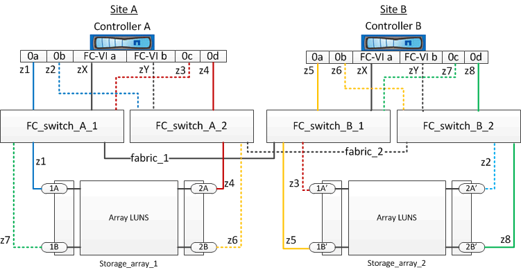

= Exemple de segmentation de switch dans une configuration MetroCluster à deux nœuds avec des LUN de baie
:allow-uri-read: 
:icons: font
:imagesdir: ../media/

[role="lead"]
La segmentation des commutateurs définit les chemins entre les nœuds connectés. La configuration du zoning permet de définir les LUN de baie pouvant être visualisées par des systèmes ONTAP spécifiques.

Vous pouvez utiliser l'exemple suivant comme référence lors de la détermination du zoning pour une configuration MetroCluster reliée à la structure à deux nœuds avec des LUN de baie :

L'exemple montre la segmentation à un seul initiateur sur une seule cible pour les configurations MetroCluster. Les lignes de l'exemple représentent des zones plutôt que des connexions ; chaque ligne est étiquetée avec son numéro de zone.

Dans l'exemple, les LUN de baies sont allouées à chaque baie de stockage. Des LUN de taille égale sont provisionnées sur les baies de stockage de chaque site, ce qui est une exigence de SyncMirror. Chaque système ONTAP possède deux chemins d'accès aux LUN de baie. Les ports de la matrice de stockage sont redondants.

Les paires de ports de la baie redondante pour les deux sites sont les suivantes :

* Baie de stockage du site A :
+
** Ports 1A et 2A
** Ports 1B et 2B

* Baie de stockage du site B :
+
** Ports 1A' et 2A'
** Ports 1B' et 2B'

Les paires de ports redondants sur chaque baie de stockage forment d'autres chemins. Par conséquent, les deux ports des paires de ports peuvent accéder aux LUN sur les baies de stockage respectives.

Le tableau suivant présente les zones des illustrations :

|===

| Zone | Contrôleur ONTAP et port initiateur | Port de la matrice de stockage 

3+| *FC_Switch_A_1* 

 a| 
z1
 a| 
Contrôleur A : port 0a
 a| 
Orifice 1A

 a| 
z3
 a| 
Contrôleur A : port 0C
 a| 
Port 1A'

3+| *FC_Switch_A_2* 

 a| 
z2
 a| 
Contrôleur A : port 0b
 a| 
Port 2A'

 a| 
z4
 a| 
Contrôleur A : port 0d
 a| 
Orifice 2A

3+| *FC_Switch_B_1* 

 a| 
z5
 a| 
Contrôleur B : port 0a
 a| 
Port 1B'

 a| 
z7
 a| 
Contrôleur B : port 0C
 a| 
Port 1B

3+| *FC_Switch_B_2* 

 a| 
z6
 a| 
Contrôleur B : port 0b
 a| 
Orifice 2B

 a| 
z8
 a| 
Contrôleur B : port 0d
 a| 
Orifice 2B'

|===
Le tableau suivant présente les zones pour les connexions FC-VI :

|===

| Zone | Contrôleur ONTAP et port initiateur | Commutateur 

3+| *Site A* 

 a| 
ZX
 a| 
Contrôleur A : port FC-VI a
 a| 
FC_Switch_A_1

 a| 
ZY
 a| 
Contrôleur A : port FC-VI b
 a| 
FC_Switch_A_2

3+| *Site B* 

 a| 
ZX
 a| 
Contrôleur B : port FC-VI a
 a| 
FC_Switch_B_1

 a| 
ZY
 a| 
Contrôleur B : port FC-VI b
 a| 
FC_Switch_B_2

|===
.Informations associées
* La segmentation des commutateurs définit les chemins entre les nœuds connectés. La configuration du zoning permet de définir les LUN de baie pouvant être visualisées par un système ONTAP spécifique.
+
link:reference_requirements_for_switch_zoning_in_a_mcc_configuration_with_array_luns.html["Conditions requises pour la segmentation des commutateurs dans une configuration MetroCluster avec des LUN de baie"]

+
link:concept_example_of_switch_zoning_in_a_four_node_mcc_configuration_with_array_luns.html["Exemple de segmentation de commutateur dans une configuration MetroCluster à quatre nœuds avec des LUN de baie"]

* Lors de l'utilisation de la segmentation de switch dans une configuration MetroCluster avec des LUN de baie, il faut s'assurer que certaines exigences de base sont respectées.
+
link:concept_example_of_switch_zoning_in_an_eight_node_mcc_configuration_with_array_luns.html["Exemple de segmentation de commutateur dans une configuration MetroCluster à huit nœuds avec des LUN de baie"]

