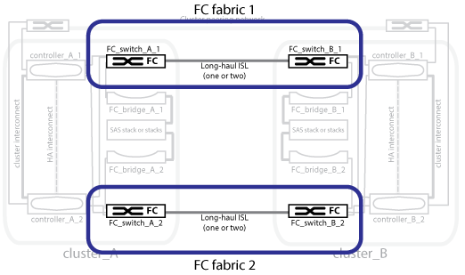

= Commutateurs FC redondants
:allow-uri-read: 
:icons: font
:imagesdir: ../media/

[role="lead"]
Chaque structure de commutation comprend des liens ISL (Inter-switch Links) qui relient les sites. Les données sont répliquées de site à site via le système ISL. Chaque switch doit se trouver sur des chemins physiques différents pour assurer la redondance.

.Informations associées
link:concept_illustration_of_the_local_ha_pairs_in_a_mcc_configuration.html["Illustration des paires haute disponibilité locales dans une configuration MetroCluster"]

link:concept_illustration_of_redundant_fc_to_sas_bridges.html["Illustration de ponts FC-SAS redondants"]

link:concept_cluster_peering_network_mcc.html["Illustration du réseau de peering de cluster"]
