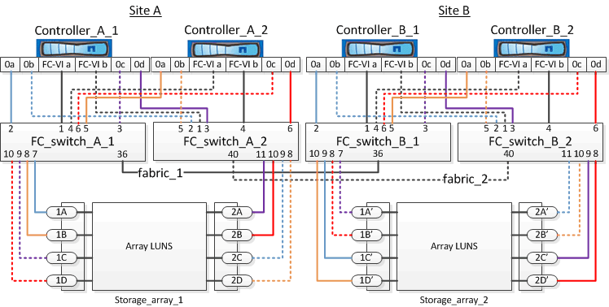

= Exemple de câblage des ports de la baie de stockage aux commutateurs FC dans une configuration MetroCluster à quatre nœuds
:allow-uri-read: 
:icons: font
:imagesdir: ../media/

[role="lead"]
Dans une configuration MetroCluster avec des LUN de baie, vous devez connecter les ports de baie de stockage qui forment une paire de ports redondante avec d'autres commutateurs FC.

L'illustration de référence suivante montre les connexions entre les baies de stockage et les commutateurs FC dans une configuration MetroCluster à quatre nœuds avec des LUN de baie :

[NOTE]
====
Si vous prévoyez d'utiliser des disques en plus des LUN de matrice dans votre configuration MetroCluster, vous devez utiliser les ports de commutateur spécifiés pour la configuration avec des disques.

link:concept_port_assignments_for_fc_switches_when_using_ontap_9_1_and_later.html["Affectation de ports pour les commutateurs FC lors de l'utilisation de ONTAP 9.1 et versions ultérieures"]

====
Dans l'illustration, les paires de ports de matrice redondante pour les deux sites sont les suivantes :

* Baie de stockage du site A :
+
** Ports 1A et 2A
** Ports 1B et 2B
** Ports 1C et 2C
** Ports 1D et 2D

* Baie de stockage du site B :
+
** Ports 1A' et 2A'
** Ports 1B' et 2B'
** Ports 1C' et 2C'
** Ports 1D et 2D'

FC_Switch_A_1 sur le site A et FC_switch_B_1 sur le site B sont connectés pour former Fabric_1. De même, les FC_switch_A_2 du site A et FC_switch_B_2 sont connectés pour former Fabric_2.

Le tableau suivant répertorie les connexions entre les ports de la matrice de stockage et les commutateurs FC pour l'illustration MetroCluster :

|===

| Ports Array LUN | Ports commutés FC | Changez de structure 

3+| *Site A* 

 a| 
1 A.
 a| 
FC_Switch_A_1, port 7
 a| 
fabric_1

 a| 
2A
 a| 
FC_Switch_A_2, port 11
 a| 
fabric_2

 a| 
1B
 a| 
FC_Switch_A_1, port 8
 a| 
fabric_1

 a| 
2B
 a| 
FC_Switch_A_2, port 10
 a| 
fabric_2

 a| 
1C
 a| 
FC_Switch_A_1, port 9
 a| 
fabric_1

 a| 
2C
 a| 
FC_Switch_A_2, port 9
 a| 
fabric_2

 a| 
1D
 a| 
FC_Switch_A_1, port 10
 a| 
fabric_1

 a| 
2D
 a| 
FC_Switch_A_2, port 8
 a| 
fabric_2

3+| *Site B* 

 a| 
1A'
 a| 
FC_Switch_B_1, port 7
 a| 
fabric_1

 a| 
2 A'
 a| 
FC_Switch_B_2, port 11
 a| 
fabric_2

 a| 
1B'
 a| 
FC_Switch_B_1, port 8
 a| 
fabric_1

 a| 
2B'
 a| 
FC_Switch_B_2, port 10
 a| 
fabric_2

 a| 
1C'
 a| 
FC_Switch_B_1, port 9
 a| 
fabric_1

 a| 
2C
 a| 
FC_Switch_B_2, port 9
 a| 
fabric_2

 a| 
1D'
 a| 
FC_Switch_B_1, port 10
 a| 
fabric_1

 a| 
2D'
 a| 
FC_Switch_B_2, port 8
 a| 
fabric_2

|===