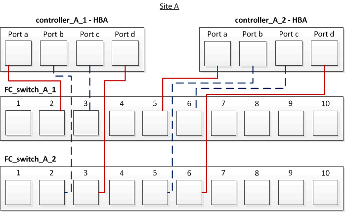

= Câblage des ports FC-VI et HBA dans une configuration MetroCluster à quatre nœuds (Fabric-Attached) avec des LUN de baie
:allow-uri-read: 
:icons: font
:imagesdir: ../media/

[role="lead"]
Si vous configurez une configuration MetroCluster à quatre nœuds (Fabric-Attached) avec des LUN de baie, vous devez câbler les ports FC-VI et les ports HBA aux ports des commutateurs.

.Description de la tâche
* Vous devez répéter cette tâche pour chaque contrôleur des deux sites MetroCluster.
* Si vous prévoyez d'utiliser des disques en plus des LUN de matrice dans votre configuration MetroCluster, vous devez utiliser les ports HBA et les ports de commutation spécifiés pour la configuration avec des disques.
+
** link:concept_port_assignments_for_fc_switches_when_using_ontap_9_1_and_later.html["Affectation de ports pour les commutateurs FC lors de l'utilisation de ONTAP 9.1 et versions ultérieures"]

.Étapes
. Reliez les ports FC-VI de chaque contrôleur aux ports des commutateurs FC secondaires.
+
L'exemple suivant montre les connexions entre les ports FC-VI et les ports de commutateurs du site A :

+
image::../media/four_node_mcc_fc_vi_switch_connections.gif[connexions du commutateur mcc fc vi à quatre nœuds]

. Effectuez le câblage contrôleur-commutateur sur les deux sites MetroCluster.
+
Vous devez assurer la redondance des connexions entre le contrôleur et les commutateurs. Par conséquent, pour chaque contrôleur d'un site, vous devez vous assurer que les deux ports HBA de la même paire de ports sont connectés à d'autres commutateurs FC.

+
L'exemple suivant montre les connexions entre les ports HBA et les ports switch du site A :

+

+
Le tableau suivant répertorie les connexions entre les ports HBA sur le Controller_A_1 et les ports de commutateurs FC sur l'illustration :

+
|===

| Ports HBA | Commutateurs 

2+| *Paire de ports* 

 a| 
Orifice a
 a| 
FC_Switch_A_1, port 2

 a| 
Port d
 a| 
FC_Switch_A_2, port 3

2+| *Paire de ports* 

 a| 
Orifice b
 a| 
FC_Switch_A_2, port 2

 a| 
Port c
 a| 
FC_Switch_A_1, port 3

|===
+
Le tableau suivant répertorie les connexions entre les ports HBA sur le Controller_A_2 et les ports de commutateurs FC sur l'illustration :

+
|===

| Ports HBA | Commutateurs 

2+| *Paire de ports* 

 a| 
Orifice a
 a| 
FC_Switch_A_1, port 5

 a| 
Port d
 a| 
FC_Switch_A_2, port 6

2+| *Paire de ports* 

 a| 
Orifice b
 a| 
FC_Switch_A_2, port 5

 a| 
Port c
 a| 
FC_Switch_A_1, port 6

|===

.Une fois que vous avez terminé
Vous devez relier les câbles ISL entre les commutateurs FC sur les sites MetroCluster.

.Informations associées
Lorsque vous connectez les systèmes ONTAP à des commutateurs FC pour configurer une configuration MetroCluster avec des LUN de baies, vous devez connecter les ports FC-VI et HBA de chaque contrôleur à des ports de commutateurs spécifiques.

link:concept_switch_ports_required_for_a_eight_node_mcc_configuration_with_array_luns.html["Les ports de commutation sont requis pour une configuration MetroCluster avec des LUN de baie"]
