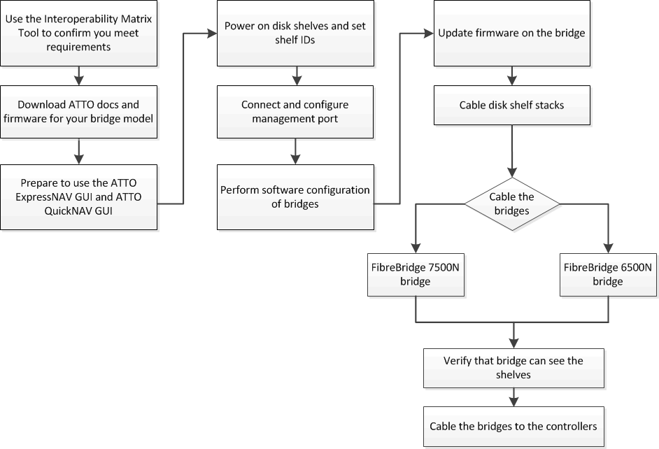

= Installez des ponts FC-SAS et des tiroirs disques SAS
:allow-uri-read: 
:icons: font
:imagesdir: ../media/

[role="lead"]
Lors de l'ajout d'un stockage à la configuration, vous installez et câblez les ponts ATTO FibreBridge et les tiroirs disques SAS.

.Description de la tâche
Pour les systèmes reçus en usine, les ponts FC-SAS sont préconfigurés et ne requièrent pas de configuration supplémentaire.

Cette procédure est rédigée avec l'hypothèse que vous utilisez les interfaces de gestion des ponts recommandées : l'interface graphique utilisateur graphique ATTO ExpressNAV et l'utilitaire ATTO Quickmenu.

L'interface graphique ATTO ExpressNAV permet de configurer et de gérer un pont, ainsi que de mettre à jour le micrologiciel du pont. Utilisez l'utilitaire ATTO Quicknavigation pour configurer le port de gestion Ethernet de pont 1.

Vous pouvez utiliser d'autres interfaces de gestion, si nécessaire, comme un port série ou Telnet pour configurer et gérer un pont et pour configurer le port de gestion Ethernet 1, et FTP pour mettre à jour le micrologiciel du pont.

Cette procédure utilise le workflow suivant :

== Gestion intrabande des ponts FC-SAS

Depuis ONTAP 9.5 avec des ponts FiberBridge 7500N ou 7600N, _gestion intrabande_ des ponts est pris en charge comme alternative à la gestion IP des ponts. Depuis la version ONTAP 9.8, la gestion hors bande est obsolète.

NOTE: Avec ONTAP 9.8, le `storage bridge` la commande est remplacée par `system bridge`. Les étapes suivantes présentent le `storage bridge` Mais si vous exécutez ONTAP 9.8 ou version ultérieure, le `system bridge` commande recommandée.

Lorsque vous utilisez la gestion intrabande, vous pouvez gérer et contrôler les ponts depuis la CLI de ONTAP via la connexion FC au pont. L'accès physique au pont via les ports Ethernet du pont n'est pas nécessaire, ce qui réduit la vulnérabilité de sécurité du pont.

La disponibilité de la gestion intrabande des ponts dépend de la version de ONTAP :

* Depuis ONTAP 9.8, les ponts sont gérés via des connexions intrabande par défaut et la gestion hors bande des ponts via SNMP est déconseillée.
* ONTAP 9.5 à 9.7 : la gestion intrabande ou la gestion SNMP hors bande est prise en charge.
* Avant ONTAP 9.5, seule la gestion SNMP hors bande est prise en charge.

Les commandes CLI Bridge peuvent être émises à partir de l'interface ONTAP `storage bridge run-cli -name _bridge_name_ -command _bridge_command_name_` Commande au niveau de l'interface ONTAP.

NOTE: L'utilisation de la gestion intrabande avec l'accès IP désactivé est recommandée pour améliorer la sécurité en limitant la connectivité physique au pont.

== Limites de pont FibreBridge 7600N et 7500N et règles de connexion

Passez en revue les limites et les considérations lors de la fixation des ponts FibreBridge 7600N et 7500N.

.Limites de pont FibreBridge 7600N et 7500N
* Le nombre maximum de disques durs et SSD combinés est de 240.
* Le nombre maximum de disques SSD est de 96.
* Le nombre maximal de disques SSD par port SAS est de 48.
* Le nombre maximum de tiroirs par port SAS est de 10.

.Règles de connexion des ponts FibreBridge 7600N et 7500N
* Ne mélangez pas des disques SSD et HDD sur le même port SAS.
* Répartissez les tiroirs de manière homogène entre les ports SAS.
* Vous ne devez pas avoir de tiroirs DS460 sur le même port SAS que d'autres types de tiroirs (par exemple, tiroirs DS212 ou DS224).

.Exemple de configuration
Voici un exemple de configuration permettant de connecter quatre tiroirs DS224 avec des disques SSD et six tiroirs DS224 avec des disques durs :

[cols="2*"]
|===
| Port SAS | Tiroirs et disques 

| Port SAS A | 2 tiroirs DS224 avec disques SSD 

| Port SAS B | 2 tiroirs DS224 avec disques SSD 

| Port SAS C | 3 tiroirs DS224 avec disques durs 

| Port SAS D | 3 tiroirs DS224 avec disques durs 
|===

== Préparer l'installation

Lorsque vous vous apprêtez à installer les ponts dans le cadre de votre nouveau système MetroCluster, vous devez vous assurer que votre système répond à certaines exigences, notamment à la configuration requise pour les ponts. Il est également nécessaire de télécharger les documents nécessaires, l'utilitaire ATTO Quickmenu et le firmware du pont.

.Avant de commencer
* Votre système doit déjà être installé dans un rack s'il n'a pas été livré dans une armoire système.
* Votre configuration doit utiliser les modèles matériels et les versions logicielles pris en charge.
+
Dans le https://mysupport.netapp.com/matrix["Matrice d'interopérabilité NetApp (IMT)"], Vous pouvez utiliser le champ solution de stockage pour sélectionner votre solution MetroCluster. Utilisez *Explorateur de composants* pour sélectionner les composants et la version ONTAP pour affiner votre recherche. Vous pouvez cliquer sur *Afficher les résultats* pour afficher la liste des configurations prises en charge qui correspondent aux critères.

* Chaque commutateur FC doit disposer d'un port FC disponible pour qu'un pont puisse se connecter.
* Vous devez vous familiariser avec la manière de gérer les câbles SAS ainsi qu'avec les considérations et les meilleures pratiques d'installation et de câblage des tiroirs disques.
+
Le _Guide d'installation et de services_ de votre modèle de tiroir disque décrit les considérations et les meilleures pratiques.

* L'ordinateur que vous utilisez pour configurer les ponts doit exécuter un navigateur Web pris en charge par ATTO pour utiliser l'interface graphique ATTO ExpressNAV.
+
Les notes de mise à jour _ATTO Product Release Notes_ disposent d'une liste à jour des navigateurs Web pris en charge. Vous pouvez accéder à ce document à partir du site Web ATTO comme décrit dans les étapes suivantes.

.Étapes
. Téléchargez le _Guide d'installation et de maintenance_ pour votre modèle de tiroir disque :
+
.. Accédez au site Web ATTO à l'aide du lien fourni pour votre modèle FibreBridge et téléchargez le manuel et l'utilitaire du menu à navigation rapide.
+
[NOTE]
====
Le Manuel d'installation et d'utilisation _ATTO FibreBridge_ pour votre pont modèle contient plus d'informations sur les interfaces de gestion.

Vous pouvez accéder à ce contenu et à d’autres contenus sur le site Web d’ATTO en utilisant le lien fourni sur la page de description d’ATTO FibreBridge.

====

. Rassemblez le matériel et les informations nécessaires pour utiliser les interfaces de gestion des ponts recommandées, l'interface graphique ATTO ExpressNAV et l'utilitaire ATTO Quicknavigation :
+
.. Déterminez un nom d'utilisateur et un mot de passe non par défaut (pour accéder aux ponts).
+
Vous devez modifier le nom d'utilisateur et le mot de passe par défaut.

.. Si vous configurez la gestion IP des ponts, vous avez besoin du câble Ethernet blindé fourni avec les ponts (qui se connecte du port de gestion Ethernet du pont 1 à votre réseau).
.. Si vous configurez la gestion IP des ponts, vous devez disposer d'une adresse IP, d'un masque de sous-réseau et d'informations de passerelle pour le port de gestion Ethernet 1 de chaque pont.
.. Désactivez les clients VPN sur l'ordinateur que vous utilisez pour la configuration.
+
Les clients VPN actifs provoquent l'échec de la recherche du menu à menu rapide pour les ponts.

== Installez le pont FC à SAS et les tiroirs SAS

Après avoir vérifié que le système répond à toutes les exigences de la section « préparation de l'installation », vous pouvez installer votre nouveau système.

.Description de la tâche
* La configuration de tiroir et de disque au niveau des deux sites doit être identique.
+
Si un agrégat non mis en miroir est utilisé, la configuration du disque et du tiroir sur chaque site peut être différente.

+

NOTE: Tous les disques du groupe de reprise après incident doivent utiliser le même type de connexion et être visibles pour tous les nœuds du groupe de reprise après incident, quels que soient les disques utilisés pour les agrégats en miroir ou non mis en miroir.

* Les exigences de connectivité du système relatives aux distances maximales pour les tiroirs disques, les commutateurs FC et les dispositifs de sauvegarde sur bande à l'aide de câbles fibre optique multimode de 50 microns, s'appliquent également aux ponts FiberBridge.
+
https://hwu.netapp.com["NetApp Hardware Universe"^]

[NOTE]
====
La technologie ACP intrabande est prise en charge sans câblage supplémentaire au niveau des tiroirs et des ponts FiberBridge 7500N ou 7600N :

* IOM12 (DS460C) derrière un pont 7500N ou 7600N avec ONTAP 9.2 et versions ultérieures
* IOM12 (DS212C et DS224C) derrière un pont 7500N ou 7600N avec ONTAP 9.1 et versions ultérieures

====

NOTE: Les tiroirs SAS des configurations MetroCluster ne prennent pas en charge le câblage ACP.

=== Activez l'accès au port IP sur le pont FiberBridge 7600N si nécessaire

Si vous utilisez une version ONTAP antérieure à 9.5 ou si vous prévoyez d'utiliser un accès hors bande au pont FiberBridge 7600N à l'aide de telnet ou d'autres protocoles et services de port IP (FTP, ExpressNAV, ICMP ou Quickmenu), vous pouvez activer les services d'accès via le port de console.

.Description de la tâche
Contrairement aux ponts ATTO FibreBridge 7500N, le pont FibreBridge 7600N est livré avec tous les protocoles et services de port IP désactivés.

Depuis ONTAP 9.5, _gestion intrabande_ des ponts est pris en charge. Cela signifie que les ponts peuvent être configurés et surveillés depuis l'interface de ligne de commande de ONTAP via la connexion FC au pont. L'accès physique au pont via les ports Ethernet du pont n'est pas nécessaire et les interfaces utilisateur du pont ne sont pas requises.

Depuis ONTAP 9.8, la fonction _gestion intrabande_ des ponts est prise en charge par défaut et la gestion SNMP hors bande est déconseillée.

Cette tâche est obligatoire si vous utilisez *pas* la gestion intrabande pour gérer les ponts. Dans ce cas, vous devez configurer le pont via le port de gestion Ethernet.

.Étapes
. Accédez à l'interface de la console du pont en connectant un câble série au port série du pont FibreBridge 7600N.
. À l'aide de la console, activez les services d'accès, puis enregistrez la configuration :
+
`set closeport none`

+
`saveconfiguration`

+
Le `set closeport none` commande active tous les services d'accès sur le pont.

. Désactivez un service, si vous le souhaitez, en émettant le `set closeport` commande et répétition de la commande si nécessaire jusqu'à ce que tous les services souhaités soient désactivés :
+
--
`set closeport _service_`

Le `set closeport` commande désactive un seul service à la fois.

Le paramètre `_service_` peut être spécifié comme l'un des éléments suivants :

** espresso
** ftp
** icmp
** menu à menu rapide
** snmp
** telnet

Vous pouvez vérifier si un protocole spécifique est activé ou désactivé à l'aide du `get closeport` commande.

--
. Si vous activez SNMP, vous devez également lancer la commande suivante :
+
`set SNMP enabled`

+
SNMP est le seul protocole qui nécessite une commande d'activation distincte.

. Enregistrez la configuration :
+
`saveconfiguration`

=== Configurez les ponts FC-SAS

Avant de câbler votre modèle des ponts FC-SAS, vous devez configurer les paramètres du logiciel FibreBridge.

.Avant de commencer
Vous devriez décider si vous allez utiliser la gestion en bande des ponts.

NOTE: Avec ONTAP 9.8, le `storage bridge` la commande est remplacée par `system bridge`. Les étapes suivantes présentent le `storage bridge` Mais si vous exécutez ONTAP 9.8 ou version ultérieure, le `system bridge` commande recommandée.

.Description de la tâche
Si vous utilisez la gestion intrabande du pont plutôt que la gestion IP, les étapes de configuration du port Ethernet et des paramètres IP peuvent être ignorées, comme indiqué dans les étapes correspondantes.

.Étapes
. Configurez le port série console sur ATTO FibreBridge en définissant la vitesse du port sur 115000 bauds :
+
[listing]
----
get serialportbaudrate
SerialPortBaudRate = 115200

Ready.

set serialportbaudrate 115200

Ready. *
saveconfiguration
Restart is necessary....
Do you wish to restart (y/n) ? y
----
. Si vous configurez la gestion intrabande, connectez un câble du port série FibreBridge RS-232 au port série (COM) d'un ordinateur personnel.
+
La connexion série sera utilisée pour la configuration initiale, puis la gestion intrabande via ONTAP et les ports FC peuvent être utilisés pour surveiller et gérer le pont.

. Si vous configurez pour la gestion IP, connectez le port de gestion Ethernet 1 de chaque pont à votre réseau à l'aide d'un câble Ethernet.
+
Dans les systèmes exécutant ONTAP 9.5 ou version ultérieure, la gestion intrabande peut être utilisée pour accéder au pont via les ports FC plutôt que par le port Ethernet. Depuis ONTAP 9.8, seule la gestion intrabande est prise en charge et la gestion SNMP est obsolète.

+
Le port de gestion Ethernet 1 vous permet de télécharger rapidement le micrologiciel de pont (via ATTO ExpressNAV ou des interfaces de gestion FTP) et de récupérer les fichiers principaux et d'extraire les journaux.

. Si vous configurez pour la gestion IP, configurez le port Ethernet de gestion 1 pour chaque pont en suivant la procédure décrite dans la section 2.0 du Manuel d'installation et d'exploitation _ATTO FibreBridge_ pour votre modèle de pont.
+
Dans les systèmes exécutant ONTAP 9.5 ou version ultérieure, la gestion intrabande peut être utilisée pour accéder au pont via les ports FC plutôt que par le port Ethernet. Depuis ONTAP 9.8, seule la gestion intrabande est prise en charge et la gestion SNMP est obsolète.

+
Lors de l'exécution du menu à navigation pour configurer un port de gestion Ethernet, seul le port de gestion Ethernet connecté par le câble Ethernet est configuré. Par exemple, si vous souhaitez également configurer le port Ethernet Management 2, vous devez connecter le câble Ethernet au port 2 et exécuter le menu à navigation rapide.

. Configurer le pont.
+
Notez le nom d'utilisateur et le mot de passe que vous désignez.

+

NOTE: Ne configurez pas la synchronisation de l'heure sur ATTO FibreBridge 7600N ou 7500N. La synchronisation de l'heure pour ATTO FibreBridge 7600N ou 7500N est définie sur l'heure du cluster après la découverte du pont par ONTAP. Il est également synchronisé périodiquement une fois par jour. Le fuseau horaire utilisé est GMT et n'est pas modifiable.

+
.. Si vous configurez pour la gestion IP, configurez les paramètres IP du pont.
+
Dans les systèmes exécutant ONTAP 9.5 ou version ultérieure, la gestion intrabande peut être utilisée pour accéder au pont via les ports FC plutôt que par le port Ethernet. Depuis ONTAP 9.8, seule la gestion intrabande est prise en charge et la gestion SNMP est obsolète.

+
Pour définir l'adresse IP sans l'utilitaire de navigation rapide, vous devez disposer d'une connexion série à FiberBridge.

+
Si vous utilisez l'interface de ligne de commandes, vous devez exécuter les commandes suivantes :

+
`set ipaddress mp1 ip-address`

+
`set ipsubnetmask mp1 subnet-mask`

+
`set ipgateway mp1 x.x.x.x`

+
`set ipdhcp mp1 disabled`

+
`set ethernetspeed mp1 1000`

.. Configurer le nom du pont.
+
--
Les ponts doivent chacun avoir un nom unique dans la configuration MetroCluster.

Exemples de noms de pont pour un groupe de piles sur chaque site :

*** Bridge_A_1a
*** Bridge_A_1b
*** Bridge_B_1a
*** Bridge_B_1b

Si vous utilisez l'interface de ligne de commandes, vous devez exécuter la commande suivante :

`set bridgename _bridge_name_`

--
.. Si vous exécutez ONTAP 9.4 ou une version antérieure, activez SNMP sur le pont :
+
`set SNMP enabled`

+
Dans les systèmes exécutant ONTAP 9.5 ou version ultérieure, la gestion intrabande peut être utilisée pour accéder au pont via les ports FC plutôt que par le port Ethernet. Depuis ONTAP 9.8, seule la gestion intrabande est prise en charge et la gestion SNMP est obsolète.

. Configurez les ports FC du pont.
+
.. Configurer le débit de données/vitesse des ports FC du pont.
+
--
Le débit de données FC pris en charge dépend du pont de votre modèle.

*** Le pont FibreBridge 7600N prend en charge jusqu'à 32, 16 ou 8 Gbit/s.
*** Le pont FibreBridge 7500N prend en charge jusqu'à 16, 8 ou 4 Gbit/s.

NOTE: La vitesse FCDataRate que vous sélectionnez est limitée à la vitesse maximale prise en charge par le pont et le port FC du module de contrôleur auquel le port de pont se connecte. Les distances de câblage ne doivent pas dépasser les limites des SFP et autres matériels.

Si vous utilisez l'interface de ligne de commandes, vous devez exécuter la commande suivante :

`set FCDataRate <port-number> <port-speed>`

--
.. Si vous configurez un pont FibreBridge 7500N, configurez le mode de connexion utilisé par le port sur « ptp ».
+

NOTE: Le paramètre FCConnMode n’est pas nécessaire lors de la configuration d’un pont FiberBridge 7600N.

+
Si vous utilisez l'interface de ligne de commandes, vous devez exécuter la commande suivante :

+
`set FCConnMode <port-number> ptp`

.. Si vous configurez un pont FiberBridge 7600N ou 7500N, vous devez configurer ou désactiver le port FC2.
+
*** Si vous utilisez le second port, vous devez répéter les sous-étapes précédentes pour le port FC2.
*** Si vous n'utilisez pas le second port, vous devez désactiver le port :
+
`FCPortDisable <port-number>`

+
L'exemple suivant montre la désactivation du port FC 2 :

+
[listing]
----
FCPortDisable 2

Fibre Channel Port 2 has been disabled.

----

.. Si vous configurez un pont FiberBridge 7600N ou 7500N, désactivez les ports SAS inutilisés :
+
--
`SASPortDisable _sas-port_`

NOTE: Les ports SAS A à D sont activés par défaut. Vous devez désactiver les ports SAS qui ne sont pas utilisés.

Si seul le port SAS A est utilisé, les ports SAS B, C et D doivent être désactivés. L'exemple suivant montre la désactivation du port SAS B. Vous devez également désactiver les ports SAS C et D :

[listing]
----
SASPortDisable b

SAS Port B has been disabled.
----
--

. Sécuriser l'accès au pont et enregistrer la configuration du pont. Choisissez une option parmi les suivantes en fonction de la version de ONTAP que votre système exécute.
+
[cols="1,3"]
|===

| Version ONTAP | Étapes 

 a| 
*ONTAP 9.5 ou version ultérieure*
 a| 
.. Afficher l'état des ponts :
+
`storage bridge show`

+
La sortie indique quel pont n'est pas sécurisé.

.. Fixer le pont :
+
`securebridge`

 a| 
*ONTAP 9.4 ou version antérieure*
 a| 
.. Afficher l'état des ponts :
+
`storage bridge show`

+
La sortie indique quel pont n'est pas sécurisé.

.. Vérifier l'état des ports du pont non sécurisé :
+
`info`

+
La sortie indique l'état des ports Ethernet MP1 et MP2.

.. Si le port Ethernet MP1 est activé, exécutez :
+
`set EthernetPort mp1 disabled`

+
Si le port Ethernet MP2 est également activé, répétez la sous-étape précédente pour le port MP2.

.. Enregistrez la configuration du pont.
+
Vous devez exécuter les commandes suivantes :

+
`SaveConfiguration`

+
`FirmwareRestart`

+
Vous êtes invité à redémarrer le pont.

|===
. Une fois la configuration MetroCluster terminée, utilisez le `flashimages` Commande pour vérifier votre version du micrologiciel FiberBridge et, si les ponts n'utilisent pas la dernière version prise en charge, mettez à jour le micrologiciel de tous les ponts de la configuration.
+
link:../maintain/index.html["Gérer les composants MetroCluster"]

=== Reliez un pont FibreBridge 7600N ou 7500N aux tiroirs disques à l'aide de modules IOM12

Après avoir configuré le pont, vous pouvez commencer à câbler votre nouveau système.

.Description de la tâche
Pour les tiroirs disques, vous insérez un connecteur de câble SAS avec la languette de retrait orientée vers le bas (sous le connecteur).

.Étapes
. Connectez en série les tiroirs disques de chaque pile :
+
.. En commençant par le premier tiroir logique de la pile, connectez le port 3 du module d'E/S A au port 1 du module d'E/S suivant jusqu'à ce que chaque module A de la pile soit connecté.
.. Répétez la sous-étape précédente pour l'IOM B.
.. Répétez les sous-étapes précédentes pour chaque pile.

+
Le _Guide d'installation et de maintenance_ de votre modèle de tiroir disque fournit des informations détaillées sur la configuration en série des tiroirs disques.

. Mettez les tiroirs sous tension, puis définissez les ID de tiroir.
+
** Vous devez mettre chaque tiroir disque hors tension puis sous tension.
** Ils doivent être uniques pour chaque tiroir disque SAS dans chaque groupe DR MetroCluster (y compris les deux sites).

. Reliez les tiroirs disques aux ponts FiberBridge.
+
.. Pour la première pile de tiroirs disques, reliez le module d'E/S Par câble A du premier tiroir au port SAS A du FibreBridge A, et reliez le module d'E/S par câble B du dernier tiroir au port SAS A du FibreBridge B.
.. Pour les piles de tiroirs supplémentaires, répétez l'étape précédente en utilisant le port SAS suivant disponible sur les ponts FiberBridge, en utilisant le port B pour la deuxième pile, le port C pour la troisième pile et le port D pour la quatrième pile.
.. Lors du câblage, connectez les piles basées sur les modules IOM12 au même pont à condition qu'elles soient connectées à des ports SAS distincts.
+
--

NOTE: Chaque pile peut utiliser différents modèles d'E/S, mais tous les tiroirs disques d'une pile doivent utiliser le même modèle.

L'illustration suivante montre les tiroirs disques connectés à une paire de ponts FiberBridge 7600N ou 7500N :

image::../media/mcc_cabling_bridge_and_sas3_stack_with_7500n_and_multiple_stacks.gif[pont de câblage mcc et pile sas3 avec 7500n et plusieurs piles]

--

=== Vérifiez la connectivité du pont et le câblage des ports FC du pont

Vérifiez que chaque pont peut détecter tous les lecteurs de disque, puis reliez chaque pont aux commutateurs FC locaux.

.Étapes
. [[stepon1_Bridge]] Vérifiez que chaque pont peut détecter tous les disques et tiroirs disques auxquels il est connecté :
+
[cols="1,3"]
|===

| Si vous utilisez... | Alors... 

 a| 
Interface graphique ATTO ExpressNAV
 a| 
.. Dans un navigateur Web pris en charge, entrez l'adresse IP d'un pont dans la zone de navigation.
+
Vous êtes conduit sur la page d'accueil ATTO FibreBridge du pont pour lequel vous avez saisi l'adresse IP, qui comporte un lien.

.. Cliquez sur le lien, puis entrez votre nom d'utilisateur et le mot de passe que vous avez désignés lors de la configuration du pont.
+
La page d'état ATTO FibreBridge du pont s'affiche avec un menu à gauche.

.. Cliquez sur *Avancé*.
.. Affichez les périphériques connectés à l'aide de la commande sastargets, puis cliquez sur *Submit*.

 a| 
Connexion du port série
 a| 
Afficher les périphériques connectés :

`sastargets`

|===
+
Le résultat indique les périphériques (disques et tiroirs disques) auxquels le pont est connecté. Les lignes de sortie sont numérotées de façon séquentielle afin que vous puissiez rapidement compter les périphériques. Par exemple, le résultat suivant indique que 10 disques sont connectés :

+
[listing]
----
Tgt VendorID ProductID        Type        SerialNumber
  0 NETAPP   X410_S15K6288A15 DISK        3QP1CLE300009940UHJV
  1 NETAPP   X410_S15K6288A15 DISK        3QP1ELF600009940V1BV
  2 NETAPP   X410_S15K6288A15 DISK        3QP1G3EW00009940U2M0
  3 NETAPP   X410_S15K6288A15 DISK        3QP1EWMP00009940U1X5
  4 NETAPP   X410_S15K6288A15 DISK        3QP1FZLE00009940G8YU
  5 NETAPP   X410_S15K6288A15 DISK        3QP1FZLF00009940TZKZ
  6 NETAPP   X410_S15K6288A15 DISK        3QP1CEB400009939MGXL
  7 NETAPP   X410_S15K6288A15 DISK        3QP1G7A900009939FNTT
  8 NETAPP   X410_S15K6288A15 DISK        3QP1FY0T00009940G8PA
  9 NETAPP   X410_S15K6288A15 DISK        3QP1FXW600009940VERQ
----
+

NOTE: Si le texte "`reponse tronqué`" apparaît au début de la sortie, vous pouvez utiliser Telnet pour vous connecter au pont et entrer la même commande pour voir toutes les sorties.

. Vérifiez que le résultat de la commande indique que le pont est connecté à tous les disques et tiroirs disques de la pile à laquelle il est supposé être connecté.
+
[cols="1,3"]
|===

| Si la sortie est... | Alors... 

 a| 
Exact
 a| 
Recommencez <<step1_bridge,Étape 1>> pour chaque pont restant.

 a| 
Incorrect
 a| 
.. Vérifiez que les câbles SAS sont desserrés ou corrigez le câblage SAS en répétant le câblage.
+
<<Reliez un pont FibreBridge 7600N ou 7500N aux tiroirs disques à l'aide de modules IOM12>>

.. Recommencez <<step1_bridge,Étape 1>>.

|===
. Reliez chaque pont aux commutateurs FC locaux à l'aide du câblage fourni dans le tableau pour votre configuration et votre modèle de commutateur et du modèle de pont FC-to-SAS :
+

IMPORTANT: La deuxième connexion du port FC du pont FiberBridge 7500N ne doit pas être câblée tant que le zoning n'est pas terminé.

+
Voir les affectations de ports pour votre version de ONTAP.

. Répétez l'étape précédente sur les ponts sur le site du partenaire.

.Informations associées
Vous devez vérifier que vous utilisez les attributions de port spécifiées lorsque vous câblez les commutateurs FC.

link:concept_port_assignments_for_fc_switches_when_using_ontap_9_1_and_later.html["Affectations de ports pour les commutateurs FC"]

== Fixez ou défixez le pont FibreBridge

Pour désactiver facilement les protocoles Ethernet potentiellement non sécurisés sur un pont, à partir de ONTAP 9.5, vous pouvez sécuriser le pont. Ceci désactive les ports Ethernet du pont. Vous pouvez également réactiver l'accès Ethernet.

.Description de la tâche
* La sécurisation du pont désactive les protocoles et services Telnet et d’autres ports IP (FTP, ExpressNAV, ICMP ou Quickmenu) sur le pont.
* Cette procédure utilise la gestion hors bande à l'aide de l'invite ONTAP, disponible à partir de ONTAP 9.5.
+
Vous pouvez lancer les commandes à partir de la CLI de pont si vous n'utilisez pas la gestion hors bande.

* Le `unsecurebridge` La commande peut être utilisée pour réactiver les ports Ethernet.
* Dans ONTAP 9.7 et versions antérieures, exécutant le `securebridge` Il se peut que la commande ATTO FibreBridge ne mette pas à jour correctement l'état du pont sur le cluster partenaire. Dans ce cas, exécutez le `securebridge` commande provenant du cluster partenaire.

NOTE: Avec ONTAP 9.8, le `storage bridge` la commande est remplacée par `system bridge`. Les étapes suivantes présentent le `storage bridge` Mais si vous exécutez ONTAP 9.8 ou version ultérieure, le `system bridge` commande recommandée.

.Étapes
. Dans l'invite ONTAP du cluster contenant le pont, sécuriser ou désécuriser le pont.
+
** La commande suivante sécurise Bridge_A_1 :
+
`cluster_A> storage bridge run-cli -bridge bridge_A_1 -command securebridge`

** La commande suivante désécurise Bridge_A_1 :
+
`cluster_A> storage bridge run-cli -bridge bridge_A_1 -command unsecurebridge`

. Dans l'invite ONTAP du cluster contenant le pont, enregistrez la configuration du pont :
+
`storage bridge run-cli -bridge _bridge-name_ -command saveconfiguration`

+
La commande suivante sécurise Bridge_A_1 :

+
`cluster_A> storage bridge run-cli -bridge bridge_A_1 -command saveconfiguration`

. Dans l'invite ONTAP du cluster contenant le pont, redémarrez le firmware du pont :
+
`storage bridge run-cli -bridge _bridge-name_ -command firmwarerestart`

+
La commande suivante sécurise Bridge_A_1 :

+
`cluster_A> storage bridge run-cli -bridge bridge_A_1 -command firmwarerestart`

