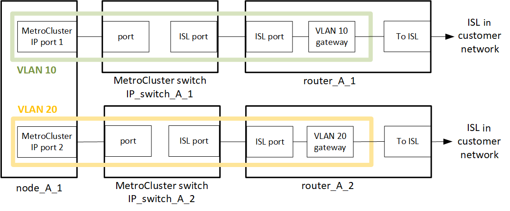

= Considérations relatives au déploiement de MetroCluster sur des réseaux partagés de couche 2 ou 3
:allow-uri-read: 

[role="lead"]
Selon vos besoins, vous pouvez utiliser des réseaux partagés de couche 2 ou 3 pour déployer MetroCluster.

À partir de ONTAP 9.6, les configurations IP MetroCluster avec commutateurs pris en charge peuvent partager des réseaux existants pour des liaisons inter-commutateurs (ISL) au lieu d'utiliser des liens MetroCluster dédiés. Cette topologie est appelée _réseaux de couche 2 partagés_.

Depuis ONTAP 9.9.1, les configurations MetroCluster IP peuvent être implémentées avec des connexions back-end IP-routées (couche 3). Cette topologie est appelée _réseaux de couche 3 partagés_.

[NOTE]
====
* Toutes les fonctionnalités ne sont pas prises en charge dans toutes les topologies réseau.
* Vous devez vérifier que vous disposez d'une capacité réseau adéquate et que la taille de lien ISL est adaptée à votre configuration. Une faible latence est primordiale pour la réplication des données entre les sites MetroCluster. Les problèmes de latence sur ces connexions peuvent affecter les E/S client
* Toutes les références aux switchs Back-end MetroCluster font référence aux switchs validés par NetApp ou compatibles MetroCluster. Voir link:mcc-compliant-netapp-validated-switches.html["Commutateurs validés par NetApp et compatibles MetroCluster"] pour en savoir plus.

====

== Exigences ISL pour les réseaux de couche 2 et 3

Ce qui suit s'applique aux réseaux de couche 2 et 3 :

* Il n'est pas nécessaire que la vitesse et le nombre de liens ISL entre les commutateurs MetroCluster et les commutateurs de réseau intermédiaire correspondent. De même, la vitesse entre les commutateurs de réseau intermédiaire n'a pas besoin de correspondre.
+
Par exemple, les commutateurs MetroCluster peuvent se connecter en utilisant un lien ISL de 40 Gbit/s aux commutateurs intermédiaires, tandis que les commutateurs intermédiaires peuvent se connecter en utilisant deux liens ISL de 100 Gbit/s.

* La surveillance du réseau doit être configurée sur le réseau intermédiaire pour surveiller l'utilisation des liens ISL, les erreurs (DROPs, volets de liaison, corruption, etc.), et les défaillances.
* La taille de MTU doit être définie sur 9216 sur tous les ports transportant le trafic MetroCluster de bout en bout.
* Aucun autre trafic ne peut être configuré avec une priorité plus élevée que la classe de service (COS) 5.
* La notification explicite de congestion (ECN) doit être configurée sur tous les chemins transportant le trafic MetroCluster de bout en bout.
* Les liens ISL transportant du trafic MetroCluster doivent être des liaisons natives entre les commutateurs.
+
Les services de partage de liens tels que les liens MPLS (Multi protocole Label Switching) ne sont pas pris en charge.

* Les VLAN de couche 2 doivent s'étendre nativement sur les sites. Le recouvrement VLAN tel que le LAN extensible virtuel (VXLAN) n'est pas pris en charge.
* Le nombre d'interrupteurs intermédiaires n'est pas limité. Cependant, NetApp vous recommande de conserver le nombre de commutateurs au minimum requis.
* Les liens ISL des commutateurs MetroCluster sont configurés avec les éléments suivants :
+
** Switch port mode 'trunk' dans le cadre d'un port-Channel LACP
** La taille de MTU est 9216
** Aucun VLAN natif n'est configuré
** Seuls les VLAN transportant le trafic MetroCluster intersite sont autorisés
** Le VLAN par défaut du commutateur n'est pas autorisé

== Considérations relatives aux réseaux de couche 2

Les switchs backend MetroCluster sont connectés au réseau du client.

image::../media/MCC_layer2.png[Couche MCC 2]

Les commutateurs intermédiaires fournis par le client doivent répondre aux exigences suivantes :

* Le réseau intermédiaire doit fournir les mêmes VLAN entre les sites. Cela doit correspondre aux VLAN MetroCluster définis dans le fichier RCF.
* RcfFileGenerator ne permet pas la création d'un fichier RCF à l'aide de VLAN non pris en charge par la plate-forme.
* Le RcfFileGenerator peut restreindre l'utilisation de certains ID de VLAN, par exemple, s'ils sont destinés à une utilisation ultérieure. En règle générale, les VLAN réservés sont jusqu'à 100 inclus.
* Les VLAN de couche 2 dont les ID correspondent aux VLAN MetroCluster doivent s'étendre sur le réseau partagé.

.Configuration VLAN dans ONTAP
Vous ne pouvez spécifier le VLAN qu'au cours de la création de l'interface. Vous pouvez configurer les VLAN 10 et 20 par défaut, ou les VLAN compris entre 101 et 4096 (ou le nombre pris en charge par le fournisseur du commutateur, selon le nombre le plus faible). Une fois les interfaces MetroCluster créées, vous ne pouvez pas modifier l'ID du VLAN.

NOTE: Certains fournisseurs de commutateurs peuvent réserver l'utilisation de certains VLAN.

Les systèmes suivants ne nécessitent pas de configuration VLAN dans ONTAP. Le VLAN est spécifié par la configuration des ports de commutateur :

* FAS8200 ET AFF A300
* AFF A320
* FAS9000 et AFF A700
* AFF A800, ASA A800, AFF C800 et ASA C800
+

NOTE: Les systèmes répertoriés ci-dessus peuvent être configurés à l'aide des VLAN 100 et inférieurs. Cependant, certains VLAN de cette plage peuvent être réservés pour une utilisation autre ou future.

Pour tous les autres systèmes, vous devez configurer le VLAN lorsque vous créez les interfaces MetroCluster dans ONTAP. Les restrictions suivantes s'appliquent :

* Le VLAN par défaut est 10 et 20
* Si vous utilisez ONTAP 9.7 ou une version antérieure, vous ne pouvez utiliser que les VLAN 10 et 20 par défaut.
* Si vous utilisez ONTAP 9.8 ou une version ultérieure, vous pouvez utiliser les VLAN 10 et 20 par défaut et un VLAN supérieur à 100 (101 et supérieur) peut également être utilisé.

== Considérations relatives aux réseaux de couche 3

Les commutateurs back-end MetroCluster sont connectés au réseau IP routé, soit directement aux routeurs (comme indiqué dans l'exemple simplifié suivant), soit via d'autres commutateurs.

L'environnement MetroCluster est configuré et câblé sous la forme d'une configuration IP MetroCluster standard, comme décrit dans la link:https://docs.netapp.com/us-en/ontap-metrocluster/install-ip/concept_parts_of_an_ip_mcc_configuration_mcc_ip.html["Configurer les composants matériels de MetroCluster"]. Lorsque vous effectuez la procédure d'installation et de câblage, vous devez effectuer les étapes spécifiques à une configuration de couche 3. Ce qui suit s'applique aux configurations de couche 3 :

* Vous pouvez connecter les commutateurs MetroCluster directement au routeur ou à un ou plusieurs commutateurs intermédiaires.
* Vous pouvez connecter les interfaces IP MetroCluster directement au routeur ou à l'un des commutateurs intermédiaires.
* Le VLAN doit être étendu au périphérique de passerelle.
* Vous utilisez le `-gateway parameter` Pour configurer l'adresse IP de l'interface MetroCluster avec une adresse de passerelle IP.
* Les ID de VLAN pour les VLAN MetroCluster doivent être les mêmes sur chaque site. Cependant, les sous-réseaux peuvent être différents.
* Le routage dynamique n'est pas pris en charge pour le trafic MetroCluster.
* Les fonctions suivantes ne sont pas prises en charge :
+
** Configurations MetroCluster à 8 nœuds
** Actualisation d'une configuration MetroCluster à quatre nœuds
** Transition de MetroCluster FC à MetroCluster IP

* Deux sous-réseaux sont requis sur chaque site MetroCluster : un sur chaque réseau.
* L'affectation auto-IP n'est pas prise en charge.

Lorsque vous configurez des routeurs et des adresses IP de passerelle, vous devez répondre aux exigences suivantes :

* Deux interfaces sur un nœud ne peuvent pas avoir la même adresse IP de passerelle.
* Les interfaces correspondantes sur les paires haute disponibilité sur chaque site doivent avoir la même adresse IP de passerelle.
* Les interfaces correspondantes sur un nœud et ses partenaires DR et aux ne peuvent pas avoir la même adresse IP de passerelle.
* Les interfaces correspondantes sur un nœud et ses partenaires DR et aux doivent avoir le même ID VLAN.

== Réglages requis pour les commutateurs intermédiaires

Lorsque le trafic MetroCluster traverse un lien ISL dans un réseau intermédiaire, vérifiez que la configuration des commutateurs intermédiaires garantit que le trafic MetroCluster (RDMA et stockage) répond aux niveaux de service requis sur l'ensemble du chemin entre les sites MetroCluster.

Le schéma suivant présente les paramètres requis lors de l'utilisation de commutateurs Cisco validés par NetApp :

image::../media/switch_traffic_with_cisco_switches.png[changez de trafic avec des commutateurs cisco]

Le diagramme suivant présente les paramètres requis pour un réseau partagé lorsque les commutateurs externes sont des commutateurs IP Broadcom.

image::../media/switch_traffic_with_broadcom_switches.png[changez de trafic avec les commutateurs broadcom]

Dans cet exemple, les stratégies et mappages suivants sont créés pour le trafic MetroCluster :

* Le `MetroClusterIP_ISL_Ingress` La politique s'applique aux ports du commutateur intermédiaire qui se connecte aux commutateurs IP MetroCluster.
+
Le `MetroClusterIP_ISL_Ingress` la stratégie mappe le trafic marqué entrant à la file d'attente appropriée sur le commutateur intermédiaire.

* A `MetroClusterIP_ISL_Egress` La règle s'applique aux ports du commutateur intermédiaire qui se connectent aux liens ISL entre les commutateurs intermédiaires.
* Vous devez configurer les commutateurs intermédiaires avec des mappages d'accès QoS, des classes et des règles correspondants le long du chemin d'accès entre les commutateurs IP MetroCluster. Les commutateurs intermédiaires associent le trafic RDMA à COS5 et le trafic de stockage à COS4.

Les exemples suivants concernent les switchs Cisco Nexus 3232C et 9336C-FX2. Selon le fournisseur et le modèle de votre commutateur, vous devez vérifier que vos commutateurs intermédiaires ont une configuration appropriée.

.Configurez le mappage de classes pour le port ISL du commutateur intermédiaire
L'exemple suivant montre les définitions de carte de classe selon que vous devez classer ou faire correspondre le trafic lors de l'entrée.

[role="tabbed-block"]
====
.Classer le trafic à l'entrée :
--
[listing]
----
ip access-list rdma
  10 permit tcp any eq 10006 any
  20 permit tcp any any eq 10006
ip access-list storage
  10 permit tcp any eq 65200 any
  20 permit tcp any any eq 65200

class-map type qos match-all rdma
  match access-group name rdma
class-map type qos match-all storage
  match access-group name storage
----
--
.Correspondance du trafic à l'entrée :
--
[listing]
----
class-map type qos match-any c5
  match cos 5
  match dscp 40
class-map type qos match-any c4
  match cos 4
  match dscp 32
----
--
====
.Créer un mappage de règles d'entrée sur le port ISL du commutateur intermédiaire :
Les exemples suivants montrent comment créer une carte de règles d'entrée selon que vous devez classifier ou faire correspondre le trafic lors de l'entrée.

[role="tabbed-block"]
====
.Classer le trafic à l'entrée :
--
[listing]
----
policy-map type qos MetroClusterIP_ISL_Ingress_Classify
  class rdma
    set dscp 40
    set cos 5
    set qos-group 5
  class storage
    set dscp 32
    set cos 4
    set qos-group 4
  class class-default
    set qos-group 0
----
--
.Faire correspondre le trafic à l'entrée :
--
[listing]
----
policy-map type qos MetroClusterIP_ISL_Ingress_Match
  class c5
    set dscp 40
    set cos 5
    set qos-group 5
  class c4
    set dscp 32
    set cos 4
    set qos-group 4
  class class-default
    set qos-group 0
----
--
====
.Configurez la règle de mise en file d'attente de sortie pour les ports ISL
L'exemple suivant montre comment configurer la règle de mise en file d'attente de sortie :

[listing]
----
policy-map type queuing MetroClusterIP_ISL_Egress
   class type queuing c-out-8q-q7
      priority level 1
   class type queuing c-out-8q-q6
      priority level 2
   class type queuing c-out-8q-q5
      priority level 3
      random-detect threshold burst-optimized ecn
   class type queuing c-out-8q-q4
      priority level 4
      random-detect threshold burst-optimized ecn
   class type queuing c-out-8q-q3
      priority level 5
   class type queuing c-out-8q-q2
      priority level 6
   class type queuing c-out-8q-q1
      priority level 7
   class type queuing c-out-8q-q-default
      bandwidth remaining percent 100
      random-detect threshold burst-optimized ecn
----
Ces paramètres doivent être appliqués à tous les commutateurs et liens ISL transportant du trafic MetroCluster.

Dans cet exemple, Q4 et Q5 sont configurés avec `random-detect threshold burst-optimized ecn`. En fonction de votre configuration, vous devrez peut-être définir les seuils minimal et maximal, comme indiqué dans l'exemple suivant :

[listing]
----
class type queuing c-out-8q-q5
  priority level 3
  random-detect minimum-threshold 3000 kbytes maximum-threshold 4000 kbytes drop-probability 0 weight 0 ecn
class type queuing c-out-8q-q4
  priority level 4
  random-detect minimum-threshold 2000 kbytes maximum-threshold 3000 kbytes drop-probability 0 weight 0 ecn
----

NOTE: Les valeurs minimale et maximale varient en fonction du commutateur et de vos besoins.

.Exemple 1 : Cisco
Si votre configuration comporte des commutateurs Cisco, vous n'avez pas besoin de classer sur le premier port d'entrée du commutateur intermédiaire. Vous configurez ensuite les mappages et les règles suivants :

* `class-map type qos match-any c5`
* `class-map type qos match-any c4`
* `MetroClusterIP_ISL_Ingress_Match`

Vous attribuez le `MetroClusterIP_ISL_Ingress_Match` Mappage de règles sur les ports ISL transportant le trafic MetroCluster.

.Exemple 2 : Broadcom
Si votre configuration comporte des commutateurs Broadcom, vous devez classer le premier port d'entrée du commutateur intermédiaire. Vous configurez ensuite les mappages et les règles suivants :

* `ip access-list rdma`
* `ip access-list storage`
* `class-map type qos match-all rdma`
* `class-map type qos match-all storage`
* `MetroClusterIP_ISL_Ingress_Classify`
* `MetroClusterIP_ISL_Ingress_Match`

Vous attribuez `the MetroClusterIP_ISL_Ingress_Classify` La stratégie est mappée sur les ports ISL du commutateur intermédiaire qui connecte le commutateur Broadcom.

Vous attribuez le `MetroClusterIP_ISL_Ingress_Match` La stratégie est mappée sur les ports ISL du commutateur intermédiaire qui transportent le trafic MetroCluster mais ne connecte pas le commutateur Broadcom.
