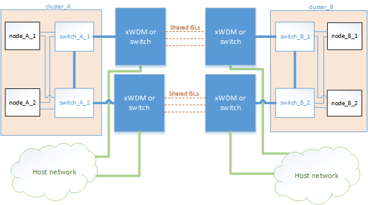

= Considérations relatives au partage de réseaux privés de couche 2
:allow-uri-read: 
:icons: font
:imagesdir: ../media/

[role="lead"]
Depuis la version ONTAP 9.6, les configurations IP de MetroCluster avec des commutateurs Cisco pris en charge peuvent partager les réseaux existants entre des liens ISL, au lieu de recourir à des liens ISL dédiés de MetroCluster. Les versions antérieures de ONTAP requièrent des liens ISL dédiés.

Les commutateurs IP MetroCluster sont dédiés à la configuration MetroCluster et ne peuvent pas être partagés. Par conséquent, un ensemble de commutateurs IP MetroCluster ne peut connecter qu'une seule configuration MetroCluster. Seuls les ports ISL MetroCluster des commutateurs IP MetroCluster peuvent se connecter aux commutateurs partagés.

CAUTION: Si vous utilisez un réseau partagé, le client est responsable du respect des exigences du réseau MetroCluster dans le réseau partagé.

== Exigences ISL

Vous devez répondre aux exigences suivantes :

* link:../install-ip/concept_considerations_isls.html#basic-metrocluster-isl-requirements["Exigences de base en matière de liaison ISL MetroCluster"]
* link:../install-ip/concept_considerations_isls.html#isl-requirements-in-shared-layer-2-networks["Exigences ISL dans des réseaux partagés de couche 2"]

== Réglages requis sur les commutateurs intermédiaires

Lors du partage du trafic ISL dans un réseau partagé, la configuration des commutateurs intermédiaires fournie par le client doit s'assurer que le trafic MetroCluster (RDMA et stockage) respecte les niveaux de service requis sur l'ensemble du chemin entre les sites MetroCluster.

Les exemples suivants concernent les commutateurs Cisco Nexus 3000 et IP Broadcom. En fonction de votre fournisseur de commutateur et de vos modèles, vous devez vous assurer que vos commutateurs intermédiaires ont une configuration équivalente.

=== Commutateurs Cisco Nexus

Le diagramme suivant présente les paramètres requis pour un réseau partagé lorsque les commutateurs externes sont des commutateurs Cisco.

image::../media/switch_traffic_with_cisco_switches.png[changez de trafic avec des commutateurs cisco]

Dans cet exemple, les stratégies et mappages suivants sont créés pour le trafic MetroCluster :

* Une politique MetroClusterIP_Ingress est appliquée aux ports du commutateur intermédiaire qui se connectent aux commutateurs IP MetroCluster.
+
La stratégie MetroClusterIP_Ingress mappe le trafic entrant étiqueté sur la file d'attente appropriée sur le commutateur intermédiaire. Le balisage se produit sur le port nœud, pas sur le lien ISL. Le trafic non MetroCluster qui utilise les mêmes ports sur le ISL reste dans la file d'attente par défaut.

* Une politique MetroClusterIP_Egress est appliquée aux ports du commutateur intermédiaire qui se connectent aux liens ISL entre les commutateurs intermédiaires

Vous devez configurer les commutateurs intermédiaires avec des mappages d'accès QoS, des classes et des règles correspondants le long du chemin d'accès entre les commutateurs IP MetroCluster. Les commutateurs intermédiaires associent le trafic RDMA à COS5 et le trafic de stockage à COS4.

L'exemple suivant montre la configuration d'un commutateur Cisco Nexus 3000 fourni par le client. Si vous avez des commutateurs Cisco, vous pouvez utiliser l'exemple pour configurer le commutateur sur le chemin sans beaucoup de difficulté. Si vous ne disposez pas de commutateurs Cisco, vous devez déterminer et appliquer la configuration équivalente à vos commutateurs intermédiaires.

L'exemple suivant montre les définitions de mappage de classe :

NOTE: Cet exemple concerne les configurations utilisant des commutateurs IP Cisco MetroCluster. Vous pouvez suivre cet exemple quels que soient les types de commutateur des commutateurs qui transportent du trafic MetroCluster qui ne se connectent pas à un commutateur IP MetroCluster.

[listing]
----
class-map type qos match-all rdma
   match cos 5
class-map type qos match-all storage
   match cos 4
----
L'exemple suivant montre les définitions de mappage de règles :

[listing]
----
policy-map type qos MetroClusterIP_Ingress
   class rdma
      set dscp 40
      set cos 5
      set qos-group 5
   class storage
      set dscp 32
      set cos 4
      set qos-group 4
policy-map type queuing MetroClusterIP_Egress
   class type queuing c-out-8q-q7
      priority level 1
   class type queuing c-out-8q-q6
      priority level 2
   class type queuing c-out-8q-q5
      priority level 3
      random-detect threshold burst-optimized ecn
   class type queuing c-out-8q-q4
      priority level 4
      random-detect threshold burst-optimized ecn
   class type queuing c-out-8q-q3
      priority level 5
   class type queuing c-out-8q-q2
      priority level 6
   class type queuing c-out-8q-q1
      priority level 7
   class type queuing c-out-8q-q-default
      bandwidth remaining percent 100
      random-detect threshold burst-optimized ecn
----

=== Commutateurs Broadcom IP MetroCluster

Le schéma suivant donne une vue d'ensemble des paramètres requis pour un réseau partagé lorsque les commutateurs externes sont des commutateurs Broadcom IP.

image::../media/switch_traffic_with_broadcom_switches.png[changez de trafic avec les commutateurs broadcom]

Les configurations utilisant des commutateurs MetroCluster IP Broadcom nécessitent une configuration supplémentaire :

* Pour les commutateurs extérieurs, vous devez configurer les cartes d'accès et de classe pour classer le trafic en entrée sur le réseau client.
+

NOTE: Cela n'est pas nécessaire pour les configurations utilisant des commutateurs IP MetroCluster.

+
L'exemple suivant montre comment configurer les cartes d'accès et de classe sur le premier et le dernier commutateur client connectant les liens ISL entre les commutateurs MetroCluster IP Broadcom.

[listing]
----
ip access-list storage
  10 permit tcp any eq 65200 any
  20 permit tcp any any eq 65200
ip access-list rdma
  10 permit tcp any eq 10006 any
  20 permit tcp any any eq 10006

class-map type qos match-all storage
  match access-group name storage
class-map type qos match-all rdma
  match access-group name rdma
----
* Vous devez attribuer la règle d'entrée au port de commutateur ISL sur le premier commutateur client.
+
L'exemple suivant montre les définitions de mappage de classe :

+

NOTE: Cet exemple concerne les configurations utilisant des commutateurs IP Cisco MetroCluster. Vous pouvez suivre cet exemple quels que soient les types de commutateur des commutateurs qui transportent du trafic MetroCluster qui ne se connectent pas à un commutateur IP MetroCluster.

+
[listing]
----
class-map type qos match-all rdma
   match cos 5
class-map type qos match-all storage
   match cos 4
----
+
L'exemple suivant montre les définitions de mappage de règles :

+
[listing]
----
policy-map type qos MetroClusterIP_Ingress
   class rdma
      set dscp 40
      set cos 5
      set qos-group 5
   class storage
      set dscp 32
      set cos 4
      set qos-group 4
policy-map type queuing MetroClusterIP_Egress
   class type queuing c-out-8q-q7
      priority level 1
   class type queuing c-out-8q-q6
      priority level 2
   class type queuing c-out-8q-q5
      priority level 3
      random-detect threshold burst-optimized ecn
   class type queuing c-out-8q-q4
      priority level 4
      random-detect threshold burst-optimized ecn
   class type queuing c-out-8q-q3
      priority level 5
   class type queuing c-out-8q-q2
      priority level 6
   class type queuing c-out-8q-q1
      priority level 7
   class type queuing c-out-8q-q-default
      bandwidth remaining percent 100
      random-detect threshold burst-optimized ecn
----

=== Commutateurs clients intermédiaires

* Pour les commutateurs clients intermédiaires, vous devez attribuer la règle de sortie aux ports de commutateur ISL.
* Pour tous les autres commutateurs intérieurs le long du chemin qui transporte le trafic MetroCluster, suivez la carte des classes et les exemples de carte des règles de la section _commutateurs Cisco Nexus 3000_.

== Exemples de topologies réseau MetroCluster

Depuis ONTAP 9.6, certaines configurations réseau ISL partagées sont prises en charge dans les configurations IP d'MetroCluster.

=== Configuration réseau partagée avec liens directs

Dans cette topologie, deux sites distincts sont connectés par des liens directs. Ces liaisons peuvent être entre les équipements de multiplexage par répartition de longueur d'onde (xWDM) ou les commutateurs. La capacité des liens ISL n'est pas dédiée au trafic MetroCluster, mais est partagée avec d'autres trafics.

La capacité ISL doit être conforme aux exigences minimales. Selon que vous utilisez ou non des périphériques xWDM ou des commutateurs, une combinaison différente de configurations réseau peut s'appliquer.

=== Infrastructure partagée avec réseaux intermédiaires

Dans cette topologie, le trafic du commutateur principal IP de MetroCluster et le trafic hôte transite par un réseau non fourni par NetApp. L'infrastructure réseau et les liaisons (y compris les liens directs loués) ne sont pas dans la configuration MetroCluster. Le réseau peut être composé d'une série de xWDM et de commutateurs, mais contrairement à la configuration partagée avec des liens ISL directs, les liaisons ne sont pas directes entre les sites. En fonction de l'infrastructure entre les sites, toute combinaison de configurations réseau est possible. L'infrastructure intermédiaire est représentée par un « nuage » (plusieurs périphériques peuvent exister entre les sites), mais elle reste sous le contrôle du client. La capacité via cette infrastructure intermédiaire n'est pas dédiée au trafic MetroCluster, mais est partagée avec d'autres trafics.

La configuration VLAN et xWDM réseau ou commutateur doit répondre aux exigences minimales.

image::../media/mcc_ip_networking_with_intermediate_private_networks.gif[réseau ip mcc avec réseaux privés intermédiaires]

=== Deux configurations MetroCluster partageant un réseau intermédiaire

Dans cette topologie, deux configurations MetroCluster distinctes partagent le même réseau intermédiaire. Dans l'exemple, MetroCluster ONE switch_A_1 et MetroCluster deux switch_A_1 se connectent tous deux au même commutateur intermédiaire.

L'exemple est simplifié à des fins d'illustration uniquement :

image::../media/mcc_ip_two_mccs_sharing_the_same_shared_network_sx.gif[mcc ip deux ccm partageant le même réseau sx partagé]

=== Deux configurations MetroCluster avec une connexion directe au réseau intermédiaire

Cette topologie est prise en charge à partir de ONTAP 9.7. Deux configurations MetroCluster distinctes partagent le même réseau intermédiaire et un nœud de configuration MetroCluster est directement connecté au commutateur intermédiaire.

MetroCluster One est une configuration MetroCluster utilisant des commutateurs validés NetApp, ONTAP 9.6 et une topologie partagée. MetroCluster deux est une configuration MetroCluster utilisant des commutateurs compatibles NetApp et ONTAP 9.7.

NOTE: Les commutateurs intermédiaires doivent être conformes aux spécifications NetApp.

L'exemple est simplifié à des fins d'illustration uniquement :

image::../media/mcc_ip_unsupported_two_mccs_direct_to_shared_switches.png[mcc ip non pris en charge deux ccm directs à commutateurs partagés]
