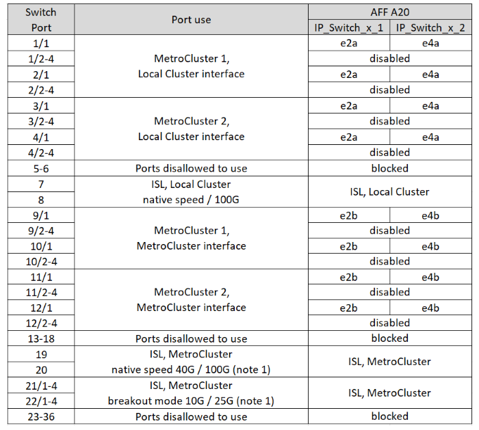

= Affectations de ports de plate-forme pour les commutateurs Cisco 9336C-FX2 à 12 ports
:allow-uri-read: 
:icons: font
:imagesdir: ../media/

[role="lead"]
L'utilisation du port dans une configuration MetroCluster IP dépend du modèle de commutateur et du type de plate-forme.

Consultez les considérations suivantes avant d'utiliser les tableaux de configuration :

* Les tableaux de cette section concernent les commutateurs Cisco 9336C-FX2 à 12 ports.
+
Si vous disposez d'un commutateur Cisco 9336C-FX2 à 36 ports qui ne connecte pas d'étagères NS224, utilisez les tableaux de link:port_usage_3232c_9336c.html["Affectations de ports de plate-forme pour les commutateurs Cisco 3232C ou Cisco 9336C-FX2 à 36 ports"] .

+
Si vous disposez d'un commutateur Cisco 9336C-FX2 à 36 ports et qu'au moins une configuration MetroCluster ou un groupe DR connecte des étagères NS224 au commutateur MetroCluster, utilisez les tableaux de link:port_usage_9336c_shared.html["Affectations de ports de plate-forme pour un commutateur Cisco 9336C-FX2 à 36 ports connectant un stockage NS224"] .

NOTE: Le commutateur Cisco 9336C-FX2 à 12 ports ne prend pas en charge la connexion des étagères NS224 au commutateur MetroCluster.

* Les tableaux suivants indiquent l'utilisation des ports pour le site A. Le même câblage est utilisé pour le site B.
* Vous ne pouvez pas configurer les commutateurs avec des ports de vitesses différentes (par exemple, un mélange de ports 100 Gbit/s et de ports 40 Gbit/s).
* Si vous configurez un seul MetroCluster avec les commutateurs, utilisez le groupe de ports *MetroCluster 1*.
+
Suivez le groupe de ports MetroCluster (MetroCluster 1, MetroCluster 2). Vous en aurez besoin pour utiliser l'outil RcfFileGenerator, comme décrit plus loin dans cette procédure de configuration.

* Le RcfFileGenerator pour MetroCluster IP fournit également une vue d'ensemble du câblage par port pour chaque commutateur.

== Choisissez la table de câblage adaptée à votre configuration

Utilisez le tableau suivant pour déterminer la table de câblage que vous devez suivre.

[cols="25,75"]
|===
| Si votre système est... | Utilisez ce tableau de câblage... 

| AFF A150, ASA A150 FAS500f AFF C250, ASA C250 AFF A250, ASA A250 | <<table_1_cisco_12port_9336c,Affectations de ports de la plateforme Cisco 9336C-FX2 à 12 ports (groupe 1)>> 

| AFF A20 | <<table_2_cisco_12port_9336c,Affectations de ports de la plateforme Cisco 9336C-FX2 à 12 ports (groupe 2)>> 

| AFF A30, AFF C30 FAS50 AFF C60  a| 
Le tableau suivant dépend de l'utilisation d'une carte Ethernet 25G (groupe 3a) ou 100G (groupe 3b).

* <<table_3a_cisco_12port_9336c,Affectations de ports de la plateforme Cisco 9336C-FX2 à 12 ports (groupe 3a - 25G)>>
* <<table_3b_cisco_12port_9336c,Affectations de ports de la plateforme Cisco 9336C-FX2 à 12 ports (groupe 3b - 100G)>>

| FAS8300, AFF C400, ASA C400, FAS8700 AFF A400, ASA A400 | <<table_4_cisco_12port_9336c,Affectations de ports de la plateforme Cisco 9336C-FX2 à 12 ports (groupe 4)>> 

| AFF A50 | <<table_5_cisco_12port_9336c,Affectations de ports de la plateforme Cisco 9336C-FX2 à 12 ports (groupe 5)>> 

| AFF C800, ASA C800, AFF A800, ASA A800 FAS9500, AFF A900, ASA A900 | <<table_6_cisco_12port_9336c,Affectations de ports de la plateforme Cisco 9336C-FX2 à 12 ports (groupe 6)>> 

| FAS70, AFF A70 AFF C80 FAS90, AFF A90 AFF A1K | <<table_7_cisco_12port_9336c,Affectations de ports de la plateforme Cisco 9336C-FX2 à 12 ports (groupe 7)>> 
|===
.Affectations de ports de la plateforme Cisco 9336C-FX2 à 12 ports (groupe 1)
Passez en revue les affectations de ports de la plate-forme pour câbler un système AFF A150, ASA A150, FAS500f, AFF C250, ASA C250, AFF A250 ou ASA A250 à un commutateur Cisco 9336C-FX2 à 12 ports :

image:../media/mccip-cabling-9336c-12-port-a150-fas500f-a250-c250.png["Affiche les affectations de ports de la plate-forme Cisco 9336C-FX2 à 12 ports"]

*Remarque 1 :* vous ne pouvez configurer que les ports 19 et 20 *ou* les ports 21 et 22. Si vous utilisez d'abord les ports 19 et 20, les ports 21 et 22 sont bloqués. Si vous utilisez d'abord les ports 21 et 22, les ports 19 et 20 sont bloqués.

.Affectations de ports de la plateforme Cisco 9336C-FX2 à 12 ports (groupe 2)
Passez en revue les affectations de ports de la plate-forme pour câbler un système AFF A20 à un commutateur Cisco 9336C-FX2 à 12 ports :

*Remarque 1 :* vous ne pouvez configurer que les ports 19 et 20 *ou* les ports 21 et 22. Si vous utilisez d'abord les ports 19 et 20, les ports 21 et 22 sont bloqués. Si vous utilisez d'abord les ports 21 et 22, les ports 19 et 20 sont bloqués.

.Affectations de ports de la plateforme Cisco 9336C-FX2 à 12 ports (groupe 3a)
Passez en revue les affectations de ports de la plate-forme pour câbler un système AFF A30, AFF C30, AFF C60 ou FAS50 à un commutateur Cisco 9336C-FX2 à 12 ports à l'aide d'une carte Ethernet 25G à quatre ports.

NOTE: Cette configuration nécessite une carte Ethernet 25G à quatre ports dans le logement 4 pour connecter le cluster local et les interfaces haute disponibilité.

image:../media/mccip-cabling-9336c-12-port-a30-c30-fas50-c60-25g.png["Affiche les affectations de ports de la plate-forme Cisco 9336C-FX2 à 12 ports"]

*Remarque 1 :* vous ne pouvez configurer que les ports 19 et 20 *ou* les ports 21 et 22. Si vous utilisez d'abord les ports 19 et 20, les ports 21 et 22 sont bloqués. Si vous utilisez d'abord les ports 21 et 22, les ports 19 et 20 sont bloqués.

.Affectations de ports de la plateforme Cisco 9336C-FX2 à 12 ports (groupe 3b)
Passez en revue les affectations de ports de la plate-forme pour câbler un système AFF A30, AFF C30, AFF C60 ou FAS50 à un commutateur Cisco 9336C-FX2 à 12 ports à l'aide d'une carte Ethernet 100G à deux ports.

NOTE: Cette configuration nécessite une carte Ethernet 100G à deux ports dans le logement 4 pour connecter le cluster local et les interfaces haute disponibilité.

image:../media/mccip-cabling-9336c-12-port-a30-c30-fas50-c60-100g.png["Affiche les affectations de ports de la plate-forme Cisco 9336C-FX2 à 12 ports"]

*Remarque 1 :* vous ne pouvez configurer que les ports 19 et 20 *ou* les ports 21 et 22. Si vous utilisez d'abord les ports 19 et 20, les ports 21 et 22 sont bloqués. Si vous utilisez d'abord les ports 21 et 22, les ports 19 et 20 sont bloqués.

.Affectations de ports de la plateforme Cisco 9336C-FX2 à 12 ports (groupe 4)
Passez en revue les affectations de ports de la plate-forme pour câbler un système FAS8300, AFF C400, ASA C400, FAS8700, AFF A400 ou ASA A400 à un commutateur Cisco 9336C-FX2 à 12 ports :

image::../media/mccip-cabling-9336c-12-port-a400-c400-fas8300-fas8700.png[Affiche les affectations de ports de la plate-forme Cisco 9336C-FX2 à 12 ports]

*Remarque 1 :* vous ne pouvez configurer que les ports 19 et 20 *ou* les ports 21 et 22. Si vous utilisez d'abord les ports 19 et 20, les ports 21 et 22 sont bloqués. Si vous utilisez d'abord les ports 21 et 22, les ports 19 et 20 sont bloqués.

.Affectations de ports de la plateforme Cisco 9336C-FX2 à 12 ports (groupe 5)
Passez en revue les affectations de ports de la plate-forme pour câbler un système AFF A50 à un commutateur Cisco 9336C-FX2 à 12 ports :

image::../media/mccip-cabling-9336c-12-port-a50.png[Affiche les affectations de ports de la plate-forme Cisco 9336C-FX2 à 12 ports]

*Remarque 1 :* vous ne pouvez configurer que les ports 19 et 20 *ou* les ports 21 et 22. Si vous utilisez d'abord les ports 19 et 20, les ports 21 et 22 sont bloqués. Si vous utilisez d'abord les ports 21 et 22, les ports 19 et 20 sont bloqués.

.Affectations de ports de la plateforme Cisco 9336C-FX2 à 12 ports (groupe 6)
Passez en revue les affectations de ports de la plate-forme pour câbler un système AFF C800, ASA C800, AFF A800, ASA A800, FAS9500, AFF A900 ou ASA A900 à un commutateur Cisco 9336C-FX2 à 12 ports :

image::../media/mccip-cabling-9336c-12-port-c800-a800-fas9500-a900.png[Affiche les affectations de ports de la plate-forme Cisco 9336C-FX2 à 12 ports]

*Remarque 1 :* vous ne pouvez configurer que les ports 19 et 20 *ou* les ports 21 et 22. Si vous utilisez d'abord les ports 19 et 20, les ports 21 et 22 sont bloqués. Si vous utilisez d'abord les ports 21 et 22, les ports 19 et 20 sont bloqués.

*Remarque 2 :* utilisez les ports e4a et e4e ou e4a et e8a si vous utilisez un adaptateur X91440A (40 Gbit/s). Utilisez les ports e4a et e4b ou e4a et e8a si vous utilisez un adaptateur X91153A (100 Gbit/s).

.Affectations de ports de la plateforme Cisco 9336C-FX2 à 12 ports (groupe 7)
Passez en revue les affectations de ports de la plate-forme pour câbler un système AFF A70, FAS70, AFF C80, FAS90, AFF A90 ou AFF A1K à un commutateur Cisco 9336C-FX2 à 12 ports :

image:../media/mccip-cabling-9336c-12-port-fas70-a70-c80-fas90-a90-a1k.png["Affiche les affectations de ports de la plate-forme Cisco 9336C-FX2 à 12 ports"]

*Remarque 1 :* vous ne pouvez configurer que les ports 19 et 20 *ou* les ports 21 et 22. Si vous utilisez d'abord les ports 19 et 20, les ports 21 et 22 sont bloqués. Si vous utilisez d'abord les ports 21 et 22, les ports 19 et 20 sont bloqués.
