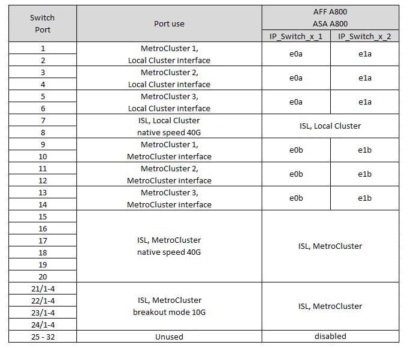

= Affectation des ports de plateforme pour les commutateurs Cisco 3132Q-V.
:allow-uri-read: 
:icons: font
:imagesdir: ../media/

[role="lead"]
L'utilisation du port dans une configuration MetroCluster IP dépend du modèle de commutateur et du type de plate-forme.

Consultez ces directives avant d'utiliser les tableaux :

* Si vous configurez le commutateur pour la transition FC vers IP MetroCluster, le port 5, le port 6, le port 13 ou le port 14 peuvent être utilisés pour connecter les interfaces de cluster locales du nœud FC MetroCluster. Reportez-vous à la link:https://mysupport.netapp.com/site/tools/tool-eula/rcffilegenerator["RcfFileGenerator"^] et les fichiers de câblage générés pour plus de détails sur le câblage de cette configuration. Pour toutes les autres connexions, vous pouvez utiliser les affectations d'utilisation des ports répertoriées dans les tableaux.

== Choisissez la table de câblage adaptée à votre configuration

Utilisez le tableau suivant pour déterminer la table de câblage que vous devez suivre.

[cols="25,75"]
|===
| Si votre système est... | Utilisez ce tableau de câblage... 

 a| 
FAS2750, AFF A220
| <<table_1_cisco_3132q,Attributions des ports de la plate-forme Cisco 3132Q-V (groupe 1)>> 

| FAS9000, AFF A700 | <<table_2_cisco_3132q,Attributions des ports de la plate-forme Cisco 3132Q-V (groupe 2)>> 

| AFF A800, ASA A800 | <<table_3_cisco_3132q,Attributions des ports de la plate-forme Cisco 3132Q-V (groupe 3)>> 
|===
.Attributions des ports de la plate-forme Cisco 3132Q-V (groupe 1)
Vérifiez les attributions de ports de la plateforme pour connecter un système FAS2750 ou AFF A220 à un commutateur Cisco 3132Q-V :

image::../media/mcc-ip-cabling-a-fas2750-or-a220-to-a-cisco-3132q-v-switch.png[Affiche les attributions de port de la plate-forme Cisco 3132Q-V.]

.Attributions des ports de la plate-forme Cisco 3132Q-V (groupe 2)
Vérifiez les attributions de ports de plateforme pour connecter un système FAS9000 ou AFF A700 à un commutateur Cisco 3132Q-V :

image::../media/mcc-ip-cabling-a-fas9000-or-aff-a700-to-a-cisco-3132q-v-switch.png[Affiche les attributions de port de la plate-forme Cisco 3132Q-V.]

.Attributions des ports de la plate-forme Cisco 3132Q-V (groupe 3)
Vérifiez les affectations des ports de la plateforme pour relier un système AFF A800 ou ASA A800 à un commutateur Cisco 3132Q-V :

