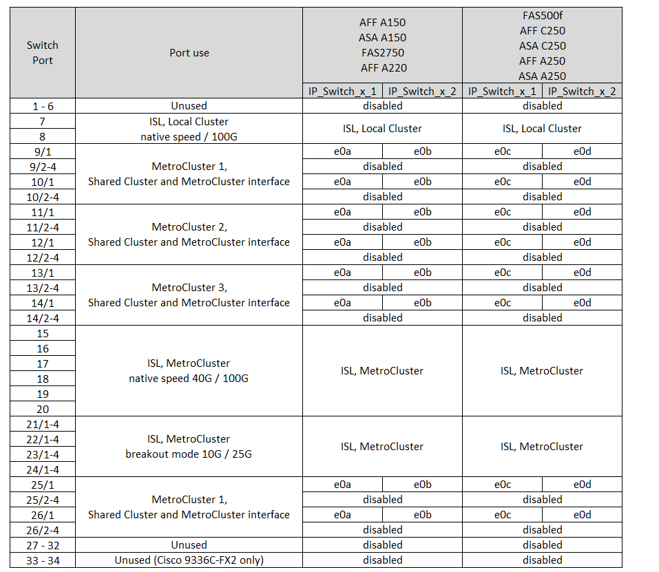
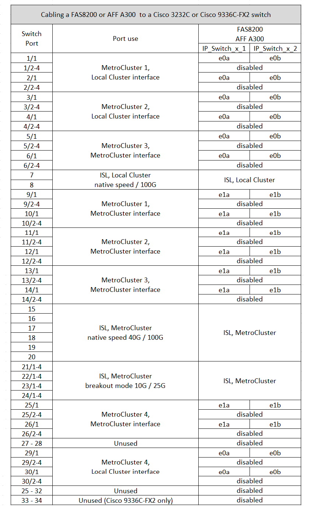
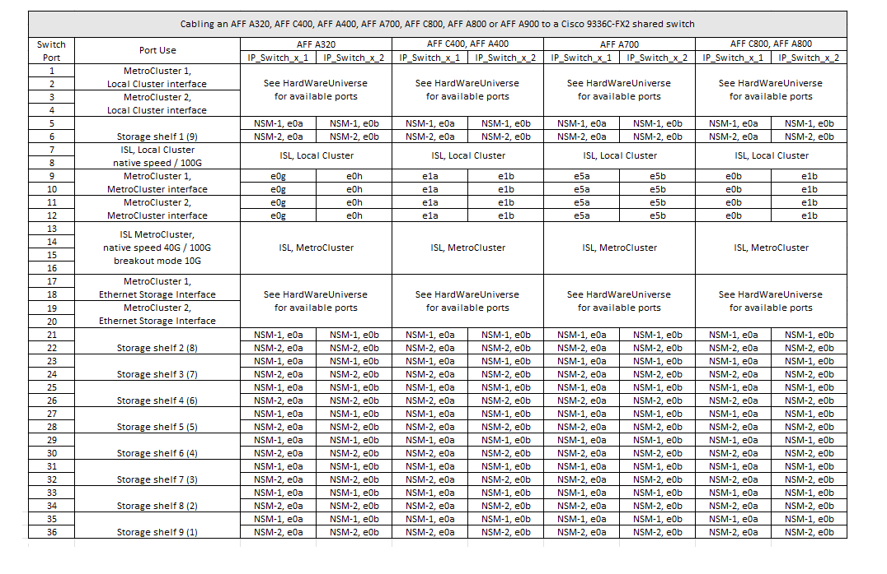

= Affectation des ports de plateforme pour les switchs Cisco 3232C ou Cisco 9336C
:allow-uri-read: 
:icons: font
:imagesdir: ../media/

[role="lead"]
L'utilisation du port dans une configuration MetroCluster IP dépend du modèle de commutateur et du type de plate-forme.

Vérifiez les points suivants avant d'utiliser les tableaux :

* Les tableaux suivants indiquent l'utilisation des ports pour le site A. Le même câblage est utilisé pour le site B.
* Les commutateurs ne peuvent pas être configurés avec des ports de différentes vitesses (par exemple, un mélange de ports 100 Gbit/s et de ports 40 Gbit/s).
* Si vous configurez un seul MetroCluster avec les commutateurs, utilisez le groupe de ports *MetroCluster 1*.
+
Conservez une trace du groupe de ports MetroCluster (MetroCluster 1, MetroCluster 2 ou MetroCluster 3). Vous en aurez besoin lorsque vous utilisez l'outil RcfFileGenerator comme décrit plus loin dans cette procédure de configuration.

* Le RcfFileGenerator pour MetroCluster IP fournit également une vue d'ensemble du câblage par port pour chaque commutateur.
+
Utilisez cette présentation du câblage pour vérifier votre câblage.

== Câblage de deux configurations MetroCluster aux commutateurs

Lorsque vous câblez plusieurs configurations MetroCluster à un commutateur Cisco 3132Q-V, vous devez câbler chaque MetroCluster selon le tableau approprié. Par exemple, si vous connectez un système FAS2750 et un système AFF A700 au même commutateur Cisco 3132Q-V. Connectez ensuite le système FAS2750 selon la norme « MetroCluster 1 » du Tableau 1 et le système AFF A700 selon la norme « MetroCluster 2 » ou « MetroCluster 3 » du Tableau 2. Vous ne pouvez pas connecter physiquement les systèmes FAS2750 et AFF A700 comme « MetroCluster 1 ».

== Câblage d'un système AFF A150, FAS2750, AFF A220, FAS500f, AFF C250 ou AFF A250 à un switch Cisco 3232C ou Cisco 9336-FX2C

== Câblage d'un système FAS8200 ou d'un système AFF A300 à un switch Cisco 3232C ou Cisco 9336C

== Câblage d'un système AFF A320, FAS8300, AFF C400, AFF A400, FAS8700, FAS9000, AFF A700, AFF C800, AFF A800, FAS9500 ou AFF A900

image::../media/mcc_ip_cabling_a320_a400_a700_a800_a900 _cisco_3232C or_9336c_switch.png[Câblage ip mcc a400 a320 a800 a900 cisco 3232C ou switch 9336c]

== Câblage d'un système AFF A320, AFF C400, AFF A400, AFF A700, AFF C800 Ou AFF A800 à un commutateur partagé Cisco 9336C-FX2

