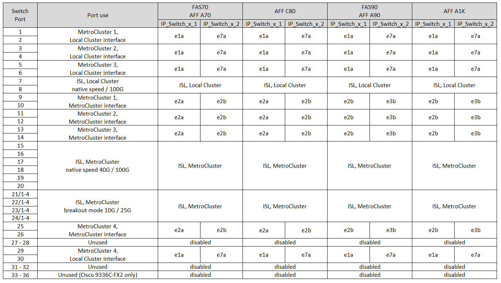

= Affectation des ports de plateforme pour les switchs Cisco 3232C ou Cisco 9336C
:allow-uri-read: 
:icons: font
:imagesdir: ../media/

[role="lead"]
L'utilisation du port dans une configuration MetroCluster IP dépend du modèle de commutateur et du type de plate-forme.

Consultez les considérations suivantes avant d'utiliser les tableaux de configuration :

* Les tableaux suivants indiquent l'utilisation des ports pour le site A. Le même câblage est utilisé pour le site B.
* Les commutateurs ne peuvent pas être configurés avec des ports de différentes vitesses (par exemple, un mélange de ports 100 Gbit/s et de ports 40 Gbit/s).
* Si vous configurez un seul MetroCluster avec les commutateurs, utilisez le groupe de ports *MetroCluster 1*.
+
Gardez une trace du groupe de ports MetroCluster (MetroCluster 1, MetroCluster 2, MetroCluster 3 ou MetroCluster 4). Vous en aurez besoin lorsque vous utilisez l'outil RcfFileGenerator comme décrit plus loin dans cette procédure de configuration.

* Le RcfFileGenerator pour MetroCluster IP fournit également une vue d'ensemble du câblage par port pour chaque commutateur.
+
Utilisez cette présentation du câblage pour vérifier votre câblage.

* Le fichier RCF version 2.10 ou ultérieure est requis pour le mode d'écorché 25G pour les liens ISL MetroCluster.
* ONTAP 9.13.1 ou version ultérieure et le fichier RCF version 2.00 sont requis pour utiliser une plateforme autre que FAS8200 ou AFF A300 dans le groupe « MetroCluster 4 ».

NOTE: La version du fichier RCF est différente de celle de l'outil RCFfilegenerator utilisé pour générer le fichier. Par exemple, vous pouvez générer un fichier RCF version 2.00 à l'aide de RCFfilegenerator v1.6c.

== Câblage de deux configurations MetroCluster aux commutateurs

Lorsque vous câblez plusieurs configurations MetroCluster à un commutateur Cisco 3132Q-V, vous devez câbler chaque MetroCluster selon le tableau approprié. Par exemple, si vous connectez un système FAS2750 et un système AFF A700 au même commutateur Cisco 3132Q-V. Connectez ensuite le système FAS2750 selon la norme « MetroCluster 1 » du Tableau 1 et le système AFF A700 selon la norme « MetroCluster 2 » ou « MetroCluster 3 » du Tableau 2. Vous ne pouvez pas connecter physiquement les systèmes FAS2750 et AFF A700 comme « MetroCluster 1 ».

== Choisissez la table de câblage adaptée à votre configuration

Utilisez le tableau suivant pour déterminer la table de câblage que vous devez suivre.

[cols="2*"]
|===
| Si votre système est... | Utilisez ce tableau de câblage... 

| AFF A150, ASA A150, FAS2750, AFF A220 FAS500f, AFF C250, ASA C250, AFF A250, ASA A250 | <<table_1_cisco_3232c_9336c,Attributions de ports de la plateforme Cisco 3232C ou Cisco 9336C (groupe 1)>> 

| AFF A20 | <<table_2_cisco_3232c_9336c,Attributions de port de la plateforme Cisco 3232C ou Cisco 9336C (groupe 2)>> 

| AFF A30, AFF C30 AFF C60 | <<table_3_cisco_3232c_9336c,Attributions de port de la plateforme Cisco 3232C ou Cisco 9336C (groupe 3)>> 

| FAS8200, AFF A300 | <<table_4_cisco_3232c_9336c,Attributions de port de la plateforme Cisco 3232C ou Cisco 9336C (groupe 4)>> 

| AFF A320, AFF C400, ASA C400, FAS8700 AFF A400, ASA A400 | <<table_5_cisco_3232c_9336c,Attributions de port de la plateforme Cisco 3232C ou Cisco 9336C (groupe 5)>> 

| AFF A50 | <<table_6_cisco_3232c_9336c,Attributions de ports de la plateforme Cisco 3232C ou Cisco 9336C (groupe 6)>> 

| FAS9000, AFF A700 AFF C800, ASA C800, AFF A800, ASA A800 FAS9500, AFF A900, ASA A900 | <<table_7_cisco_3232c_9336c,Attributions de ports de la plateforme Cisco 3232C ou Cisco 9336C (groupe 7)>> 

| FAS70, AFF A70 AFF C80 FAS90, AFF A90 AFF A1K | <<table_8_cisco_3232c_9336c,Attributions de ports de la plateforme Cisco 3232C ou Cisco 9336C (groupe 8)>> 
|===
.Attributions de ports de la plateforme Cisco 3232C ou Cisco 9336C (groupe 1)
Passez en revue les affectations des ports de la plateforme pour connecter les câbles des systèmes AFF A150, ASA A150, FAS2750, AFF A220, FAS500f, système AFF C250, ASA C250, AFF A250 ou ASA A250 vers un switch Cisco 3232C ou 9336C :

image:../media/mcc-ip-cabling-a150-a220-a250-to-a-cisco-3232c-or-cisco-9336c-switch-9161.png["Affiche les attributions de ports de la plateforme Cisco 3232C ou Cisco 9336C"]

.Attributions de port de la plateforme Cisco 3232C ou Cisco 9336C (groupe 2)
Vérifier les attributions de ports de plateforme pour relier un système AFF A20 à un switch Cisco 3232C ou 9336C :

image:../media/mcc-ip-cabling-aff-a20-9161.png["Affiche les attributions de ports de la plateforme Cisco 3232C ou Cisco 9336C"]

.Attributions de port de la plateforme Cisco 3232C ou Cisco 9336C (groupe 3)
Vérifiez les attributions de ports de plateforme pour câbler un système AFF A30, AFF C30 ou AFF C60 à un switch Cisco 3232C ou 9336C :

image:../media/mcc-ip-cabling-aff-a30-c30-c60-9161.png["Affiche les attributions de ports de la plateforme Cisco 3232C ou Cisco 9336C"]

.Attributions de port de la plateforme Cisco 3232C ou Cisco 9336C (groupe 4)
Vérifiez les attributions de ports de plateforme pour connecter un système FAS8200 ou AFF A300 à un switch Cisco 3232C ou 9336C :

image::../media/mcc-ip-cabling-a-aff-a300-or-fas8200-to-a-cisco-3232c-or-cisco-9336c-switch-9161.png[Affiche les attributions de ports de la plateforme Cisco 3232C ou Cisco 9336C]

Si vous effectuez une mise à niveau à partir d'anciens fichiers RCF, la configuration du câblage peut utiliser des ports du groupe « MetroCluster 4 » (ports 25/26 et 29/30).

.Attributions de port de la plateforme Cisco 3232C ou Cisco 9336C (groupe 5)
Consultez les attributions de ports de plateforme pour connecter les systèmes AFF A320, FAS8300, AFF C400, ASA C400, FAS8700, système AFF A400 ou ASA A400 vers un switch Cisco 3232C ou 9336C :

image::../media/mcc_ip_cabling_a320_a400_cisco_3232C_or_9336c_switch.png[Affiche les attributions de ports de la plateforme Cisco 3232C ou Cisco 9336C]

NOTE: L'utilisation de ports dans le groupe « MetroCluster 4 » nécessite ONTAP 9.13.1 ou version ultérieure.

.Attributions de ports de la plateforme Cisco 3232C ou Cisco 9336C (groupe 6)
Vérifier les attributions de ports de plateforme pour relier un système AFF A50 à un switch Cisco 3232C ou 9336C :

image::../media/mcc-ip-cabling-aff-a50-cisco-3232c-9336c-9161.png[Affiche les attributions de ports de la plateforme Cisco 3232C ou Cisco 9336C]

.Attributions de ports de la plateforme Cisco 3232C ou Cisco 9336C (groupe 7)
Consultez les affectations des ports de plateforme pour connecter les câbles des systèmes FAS9000, AFF A700, AFF C800, ASA C800, AFF A800, système ASA A800, FAS9500, AFF A900 ou ASA A900 vers un switch Cisco 3232C ou 9336C :

image::../media/mcc_ip_cabling_fas9000_a700_fas9500_a800_a900_cisco_3232C_or_9336c_switch.png[Affiche les attributions de ports de la plateforme Cisco 3232C ou Cisco 9336C]

*Remarque 1* : utilisez les ports e4a et e4e ou e4a et e8a si vous utilisez un adaptateur X91440A (40 Gbit/s). Utilisez les ports e4a et e4b ou e4a et e8a si vous utilisez un adaptateur X91153A (100 Gbit/s).

NOTE: L'utilisation de ports dans le groupe « MetroCluster 4 » nécessite ONTAP 9.13.1 ou version ultérieure.

.Attributions de ports de la plateforme Cisco 3232C ou Cisco 9336C (groupe 8)
Vérifier les attributions de ports de plateforme pour connecter un système AFF A70, FAS70, AFF C80, FAS90, AFF A90 ou AFF A1K à un switch Cisco 3232C ou 9336C :

