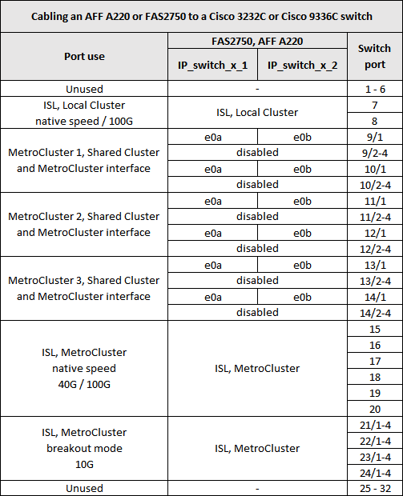
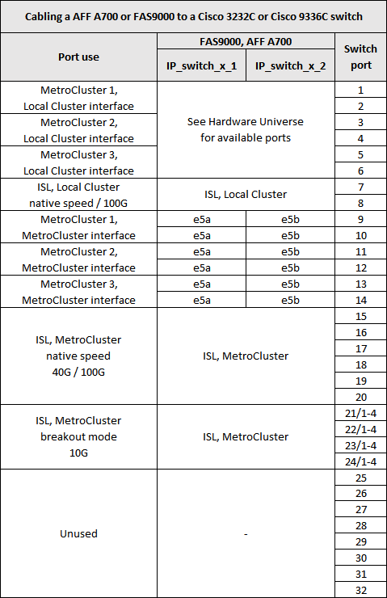
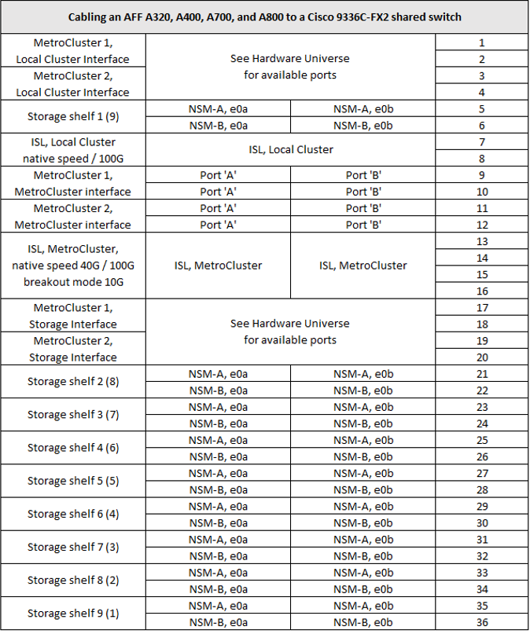

= Affectation des ports de plateforme pour les switchs Cisco 3232C ou Cisco 9336C
:allow-uri-read: 
:icons: font
:imagesdir: ../media/

[role="lead"]
L'utilisation du port dans une configuration MetroCluster IP dépend du modèle de commutateur et du type de plate-forme.

Vérifiez les points suivants avant d'utiliser les tableaux :

* Les tableaux suivants indiquent l'utilisation des ports pour le site A. Le même câblage est utilisé pour le site B.
* Les commutateurs ne peuvent pas être configurés avec des ports de différentes vitesses (par exemple, un mélange de ports 100 Gbit/s et de ports 40 Gbit/s).
* Si vous configurez un seul MetroCluster avec les commutateurs, utilisez le groupe de ports *MetroCluster 1*.
+
Conservez une trace du groupe de ports MetroCluster (MetroCluster 1, MetroCluster 2 ou MetroCluster 3). Vous en aurez besoin lorsque vous utilisez l'outil RcfFileGenerator comme décrit plus loin dans cette procédure de configuration.

* Le RcfFileGenerator pour MetroCluster IP fournit également une vue d'ensemble du câblage par port pour chaque commutateur.
+
Utilisez cette présentation du câblage pour vérifier votre câblage.

== Câblage de deux configurations MetroCluster aux commutateurs

Lors du câblage de plusieurs configurations MetroCluster à un commutateur Cisco 3132Q-V, reliez chaque MetroCluster conformément au tableau approprié. Par exemple, en cas de câblage d'un FAS2750 ou d'un A700 vers le même commutateur Cisco 3132Q-V. Ensuite, vous câconnectez le FAS2750 au MetroCluster Tableau 1 et le A700 conformément aux MetroCluster 2 ou MetroCluster 3 dans le Tableau 2. Vous ne pouvez pas connecter physiquement les FAS2750 et A700 comme 'MetroCluster 1'.

== Câblage d'un système FAS2750 ou AFF A220 à un switch Cisco 3232C ou Cisco 9336C

== Câblage d'un système AFF A300 ou FAS8200 à un switch Cisco 3232C ou Cisco 9336C

image::../media/mcc_ip_cabling_a_aff_a300_or_fas8200_to_a_cisco_3232c_or_cisco_9336c_switch.png[mcc ip reliant un AFF a300 ou fas8200 à un commutateur cisco 3232c ou cisco 9336c]

== Câblage d'un AFF A250 ou FAS500f à un switch Cisco 3232C ou Cisco 9336C

image::../media/mcc_ip_cabling_an_aff_a250_or_fas500f_to_a_cisco_3232c_or_cisco_9336c_switch.png[mcc câblage ip d’un AFF a250 ou fas500f vers un commutateur cisco 3232c ou cisco 9336c]

== Câblage d'un système AFF A320 à un switch Cisco 3232C ou Cisco 9336C

image::../media/cabling_a_aff_a320_to_a_cisco_3232c_or_cisco_9336c_switch.png[câblage d'un système AFF a320 à un commutateur cisco 32336c ou cisco 9336c]

== Câblage d'un système AFF A400, FAS8300 ou FAS8700 vers un switch Cisco 3232C ou Cisco 9336C

image::../media/cabling_a_mcc_ip_aff_a400_fas8300_or_fas8700_to_a_cisco_3232c_or_cisco_9336c_switch.png[câblage d'un module mcc ip AFF a400 fas8300 ou fas8700 à un commutateur cisco 3232c ou cisco 9336c]

== Câblage d'un système AFF A700 ou FAS9000 à un switch Cisco 3232C ou Cisco 9336C

== Câblage d'un AFF A800 à un switch Cisco 3232C ou Cisco 9336C

image::../media/cabling_an_aff_a800_to_a_cisco_3232c_or_cisco_9336c_switch.png[câblage d'un AFF a800 à un commutateur cisco 3232c ou cisco 9336c]

== Câblage d'un AFF A900 ou FAS9500 à un switch Cisco 3232C ou Cisco 9336C

NOTE: Vous avez la possibilité d'utiliser les ports e5a et e7a en tant que LIFs intercluster dans une configuration MetroCluster IP.

image:../media/cabling_an_aff_a900_or_FAS9500_to_a_cisco_3232c_or_cisco_9336c_switch.png[""]

== Câblage d'un système AFF A320, AFF A400, AFF A700 ou AFF A800 à un commutateur partagé Cisco 9336C-FX2

image::../media/mcc_interfaces_per_platform_9336-shared.png[interfaces mcc par plate-forme 9336 partagée]
