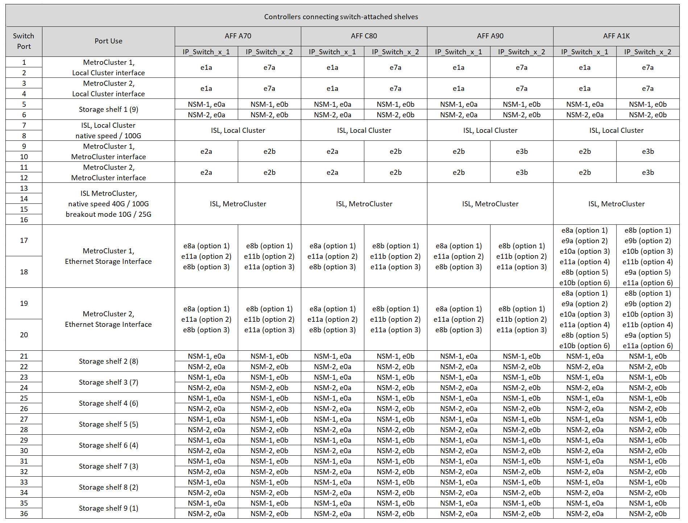
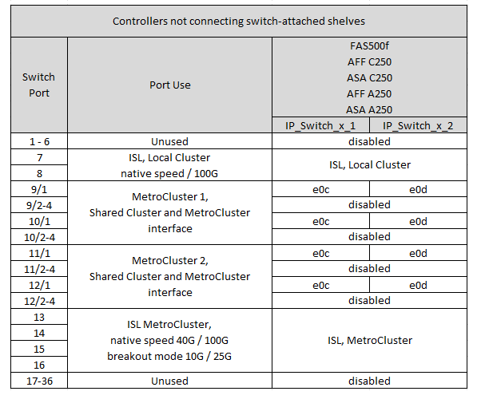
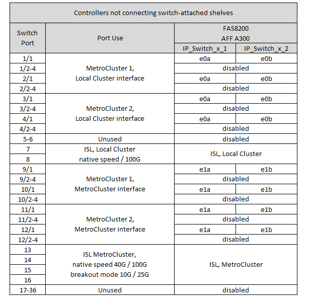

= Affectations de ports de plate-forme pour un commutateur Cisco 9336C-FX2 à 36 ports connectant un stockage NS224 dans une configuration IP MetroCluster
:allow-uri-read: 
:icons: font
:imagesdir: ../media/

[role="lead"]
L'utilisation du port dans une configuration MetroCluster IP dépend du modèle de commutateur et du type de plate-forme.

Consultez les considérations suivantes avant d'utiliser les tableaux de configuration :

* Les tableaux de cette section concernent les commutateurs Cisco 9336C-FX2 à 36 ports lorsqu'au moins une configuration MetroCluster ou un groupe DR connecte des étagères NS224 au commutateur MetroCluster.
+
Si vous disposez d'un commutateur Cisco 9336C-FX2 à 36 ports qui ne connecte pas le stockage NS224, utilisez les tableaux de link:port_usage_3232c_9336c.html["Affectations de ports de plate-forme pour les commutateurs Cisco 3232C ou Cisco 9336C-FX2 à 36 ports"] .

+
Si vous disposez d'un commutateur Cisco 9336C-FX2 à 12 ports, utilisez les tableaux de link:port-usage-9336c-fx-2-12-port.html["Affectations de ports de plate-forme pour les commutateurs Cisco 9336C-FX2 à 12 ports"] .

+

NOTE: Le commutateur Cisco 9336C-FX2 à 12 ports ne prend pas en charge la connexion des étagères NS224 au commutateur MetroCluster.

* Lorsque vous connectez un commutateur Cisco 9336C-FX2 à un stockage NS224, vous ne pouvez utiliser que deux configurations MetroCluster ou groupes de reprise après sinistre (DR). Au moins une configuration MetroCluster ou un groupe de reprise après sinistre doit connecter des tiroirs NS224 au commutateur MetroCluster. Vous ne pouvez connecter que des plateformes qui ne connectent pas de tiroirs NS224 connectés au commutateur comme deuxième configuration MetroCluster ou deuxième groupe de reprise après sinistre (DR).
+
Si votre deuxième groupe MetroCluster ou DR ne connecte pas les étagères NS224 au commutateur MetroCluster, suivez les instructions <<tables_not_connecting_ns224,Tableaux de câblage pour les contrôleurs ne connectant pas les étagères NS224 connectées par commutateur>> .

* Le RcfFileGenerator affiche uniquement les plates-formes éligibles lorsque la première plate-forme est sélectionnée.
* La connexion d'une configuration MetroCluster à huit ou deux nœuds requiert ONTAP 9.14.1 ou version ultérieure.

== Choisissez la table de câblage adaptée à votre configuration

Consultez le tableau d'affectation des ports correspondant à votre configuration. Cette section comporte deux ensembles de tables de câblage :

* <<tables_connecting_ns224,Tableaux de câblage pour contrôleurs connectant des tiroirs NS224 reliés par un commutateur>>
* <<tables_not_connecting_ns224,Tableaux de câblage pour les contrôleurs ne connectant pas les tiroirs NS224 reliés par un commutateur>>

=== Contrôleurs connectant des tiroirs NS224 reliés par un commutateur

Déterminez le tableau d'affectation des ports à suivre pour les contrôleurs qui connectent des tiroirs NS224 reliés par un commutateur.

[cols="25,75"]
|===
| Plateforme | Utilisez ce tableau de câblage... 

| AFF C30, AFF A30 AFF C60  a| 
Le tableau suivant dépend de l'utilisation d'une carte Ethernet 25G (groupe 1a) ou 100G (groupe 1b).

* <<table_1a_cisco_9336c_fx2,Affectation des ports de la plateforme de stockage NS224 via le commutateur Cisco 9336C-FX2 (groupe 1a - 25G)>>
* <<table_1b_cisco_9336c_fx2,Affectation des ports de la plateforme de stockage NS224 via le commutateur Cisco 9336C-FX2 (groupe 1b - 100G)>>

| AFF A320 AFF C400, ASA C400 AFF A400, ASA A400 | <<table_2_cisco_9336c_fx2,Commutateur Cisco 9336C-FX2 connectant les attributions de ports de la plateforme de stockage NS224 (groupe 2)>> 

| AFF A50 | <<table_3_cisco_9336c_fx2,Affectation des ports de la plateforme de stockage NS224 via le commutateur Cisco 9336C-FX2 (groupe 3)>> 

| AFF A700 AFF C800, ASA C800, AFF A800 AFF A900, ASA A900 | <<table_4_cisco_9336c_fx2,Affectation des ports de la plateforme de stockage NS224 via le commutateur Cisco 9336C-FX2 (groupe 4)>> 

| AFF A90 AFF A1K AFF A70 AFF C80 | <<table_5_cisco_9336c_fx2,Affectation des ports de la plateforme de stockage NS224 via le commutateur Cisco 9336C-FX2 (groupe 5)>> 
|===
.Affectation des ports de la plateforme de stockage NS224 via le commutateur Cisco 9336C-FX2 (groupe 1a)
Passez en revue les attributions de port de la plateforme pour connecter un système AFF A30, AFF C30 ou AFF C60 qui connecte des tiroirs NSS24 reliés par commutateur à un commutateur Cisco 9336C-FX2 à l'aide d'une carte Ethernet 25G à quatre ports.

NOTE: Cette configuration nécessite une carte Ethernet 25G à quatre ports dans le logement 4 pour connecter le cluster local et les interfaces haute disponibilité.

image:../media/mccip-cabling-greeley-connecting-a30-c30-fas50-c60-25G.png["La présente les attributions de ports du commutateur Cisco 9336C-FX2 qui connecte la plateforme de stockage NS224"]

.Affectation des ports de la plateforme de stockage NS224 via le commutateur Cisco 9336C-FX2 (groupe 1b)
Passez en revue les attributions de port de la plateforme pour connecter un système AFF A30, AFF C30 ou AFF C60 qui connecte des tiroirs NSS24 reliés par commutateur à un commutateur Cisco 9336C-FX2 à l'aide d'une carte Ethernet 100 Gbit à deux ports.

NOTE: Cette configuration nécessite une carte Ethernet 100G à deux ports dans le logement 4 pour connecter le cluster local et les interfaces haute disponibilité.

image:../media/mccip-cabling-greeley-connecting-a30-c30-fas50-c60-100G.png["La présente les attributions de ports du commutateur Cisco 9336C-FX2 qui connecte la plateforme de stockage NS224"]

.Commutateur Cisco 9336C-FX2 connectant les attributions de ports de la plateforme de stockage NS224 (groupe 2)
Vérifiez les attributions de ports de la plateforme pour connecter un système AFF A320, AFF C400, ASA C400, AFF A400 ou ASA A400 qui connecte des tiroirs NSS24 reliés par commutateur à un commutateur Cisco 9336C-FX2 :

image::../media/mcc_ip_cabling_a320_c400_a400_to_cisco_9336c_shared_switch.png[La présente les attributions de ports du commutateur Cisco 9336C-FX2 qui connecte la plateforme de stockage NS224]

.Affectation des ports de la plateforme de stockage NS224 via le commutateur Cisco 9336C-FX2 (groupe 3)
Vérifiez les attributions de ports de la plateforme pour câbler un système AFF A50 qui connecte des tiroirs NSS24 reliés par un commutateur Cisco 9336C-FX2 :

image:../media/mccip-cabling-greeley-connecting-a50-updated.png["La présente les attributions de ports du commutateur Cisco 9336C-FX2 qui connecte la plateforme de stockage NS224"]

.Affectation des ports de la plateforme de stockage NS224 via le commutateur Cisco 9336C-FX2 (groupe 4)
Vérifiez les attributions de ports de la plateforme pour connecter un système AFF A700, AFF C800, ASA C800, AFF A800, AFF A900 ou ASA A900 qui connecte des tiroirs NSS24 reliés par un commutateur Cisco 9336C-FX2 :

image:../media/mcc_ip_cabling_a700_c800_a800_a900_to_cisco_9336c_shared_switch.png["La présente les attributions de ports du commutateur Cisco 9336C-FX2 qui connecte la plateforme de stockage NS224"]

*Remarque 1* : utilisez les ports e4a et e4e ou e4a et e8a si vous utilisez un adaptateur X91440A (40 Gbit/s). Utilisez les ports e4a et e4b ou e4a et e8a si vous utilisez un adaptateur X91153A (100 Gbit/s).

.Affectation des ports de la plateforme de stockage NS224 via le commutateur Cisco 9336C-FX2 (groupe 5)
Vérifiez les attributions de ports de la plateforme pour connecter un système AFF A70, AFF C80, AFF A90 ou AFF A1K qui connecte des tiroirs NSS24 reliés par commutateur à un commutateur Cisco 9336C-FX2 :

=== Les contrôleurs ne connectent pas les tiroirs NS224 reliés par un commutateur

Déterminez le tableau d'affectation des ports à suivre pour les contrôleurs qui ne connectent pas les tiroirs NS224 reliés par un commutateur.

[cols="25,75"]
|===
| Plateforme | Utilisez ce tableau de câblage... 

| AFF A150, ASA A150 FAS2750, AFF A220 | <<table_6_cisco_9336c_fx2,Le commutateur Cisco 9336C-FX2 ne connecte pas les attributions de ports de la plateforme de stockage NS224 (groupe 6)>> 

| AFF A20 | <<table_7_cisco_9336c_fx2,Le commutateur Cisco 9336C-FX2 ne connecte pas les attributions de ports de la plateforme de stockage NS224 (groupe 7)>> 

| FAS500f AFF C250, ASA C250 AFF A250, ASA A250 | <<table_8_cisco_9336c_fx2,Le commutateur Cisco 9336C-FX2 ne connecte pas les attributions de ports de la plateforme de stockage NS224 (groupe 8)>> 

| AFF C30, AFF A30 FAS50 AFF C60  a| 
Le tableau suivant dépend de l'utilisation d'une carte Ethernet 25G (groupe 9a) ou 100G (groupe 9b).

* <<table_9a_cisco_9336c_fx2,Le commutateur Cisco 9336C-FX2 ne connecte pas les attributions de ports de la plateforme de stockage NS224 (groupe 9a)>>
* <<table_9b_cisco_9336c_fx2,Le commutateur Cisco 9336C-FX2 ne connecte pas les attributions de ports de la plateforme de stockage NS224 (groupe 9b)>>

| FAS8200, AFF A300 | <<table_10_cisco_9336c_fx2,Le commutateur Cisco 9336C-FX2 ne connecte pas les attributions de ports de la plateforme de stockage NS224 (groupe 10)>> 

| AFF A320, AFF C400, ASA C400, FAS8700 AFF A400, ASA A400 | <<table_11_cisco_9336c_fx2,Le commutateur Cisco 9336C-FX2 ne connecte pas les attributions de ports de la plateforme de stockage NS224 (groupe 11)>> 

| AFF A50 | <<table_12_cisco_9336c_fx2,Le commutateur Cisco 9336C-FX2 ne connecte pas les attributions de ports de la plateforme de stockage NS224 (groupe 12)>> 

| FAS9000, AFF A700 AFF C800, ASA C800, AFF A800, ASA A800 FAS9500, AFF A900, ASA A900 | <<table_13_cisco_9336c_fx2,Le commutateur Cisco 9336C-FX2 ne connecte pas les attributions de ports de la plateforme de stockage NS224 (groupe 13)>> 

| FAS70, AFF A70 AFF C80 FAS90, AFF A90 AFF A1K | <<table_14_cisco_9336c_fx2,Le commutateur Cisco 9336C-FX2 ne connecte pas les attributions de ports de la plateforme de stockage NS224 (groupe 14)>> 
|===
.Le commutateur Cisco 9336C-FX2 ne connecte pas les attributions de ports de la plateforme de stockage NS224 (groupe 6)
Vérifiez les attributions de ports de la plateforme pour câbler un système AFF A150, ASA A150, FAS2750 ou AFF A220 qui ne connecte pas les tiroirs NSS24 reliés par un commutateur Cisco 9336C-FX2 :

image::../media/mcc-ip-cabling-a-aff-a150-asa-a150-fas2750-aff-a220-to-a-cisco-9336c-shared-switch.png[Illustre la non-connexion des attributions de ports de la plateforme de stockage NS224 par le commutateur Cisco 9336C-FX2]

.Le commutateur Cisco 9336C-FX2 ne connecte pas les attributions de ports de la plateforme de stockage NS224 (groupe 7)
Vérifiez les attributions de ports de la plateforme pour câbler un système AFF A20 qui ne connecte pas les tiroirs NSS24 reliés par un commutateur Cisco 9336C-FX2 :

image:../media/mcc-ip-aff-a20-to-a-cisco-9336c-shared-switch-not-connecting.png["Illustre la non-connexion des attributions de ports de la plateforme de stockage NS224 par le commutateur Cisco 9336C-FX2"]

.Le commutateur Cisco 9336C-FX2 ne connecte pas les attributions de ports de la plateforme de stockage NS224 (groupe 8)
Vérifiez les attributions de ports de la plateforme pour câbler un système FAS500f, AFF C250, ASA C250, AFF A250 ou ASA A250 qui ne connecte pas les tiroirs NSS24 reliés par un commutateur Cisco 9336C-FX2 :

.Le commutateur Cisco 9336C-FX2 ne connecte pas les attributions de ports de la plateforme de stockage NS224 (groupe 9a)
Vérifiez les attributions de ports de la plateforme pour câbler un système AFF A30, AFF C30, AFF C60 ou FAS50 qui ne connecte pas les tiroirs NSS24 reliés par commutateur à un commutateur Cisco 9336C-FX2 utilisant une carte Ethernet 25G à quatre ports :

NOTE: Cette configuration nécessite une carte Ethernet 25G à quatre ports dans le logement 4 pour connecter le cluster local et les interfaces haute disponibilité.

image:../media/mccip-cabling-greeley-not-connecting-a30-c30-fas50-c60-25G.png["Illustre la non-connexion des attributions de ports de la plateforme de stockage NS224 par le commutateur Cisco 9336C-FX2"]

.Le commutateur Cisco 9336C-FX2 ne connecte pas les attributions de ports de la plateforme de stockage NS224 (groupe 9b)
Passez en revue les attributions de ports de la plateforme pour câbler un système AFF A30, AFF C30, AFF C60 ou FAS50 qui ne connecte pas les tiroirs NSS24 reliés par commutateur à un commutateur Cisco 9336C-FX2 utilisant une carte Ethernet 100G à deux ports :

NOTE: Cette configuration nécessite une carte Ethernet 100G à deux ports dans le logement 4 pour connecter le cluster local et les interfaces haute disponibilité.

image:../media/mccip-cabling-greeley-not-connecting-a30-c30-fas50-c60-100G.png["La présente les attributions de ports du commutateur Cisco 9336C-FX2 qui connecte la plateforme de stockage NS224"]

.Le commutateur Cisco 9336C-FX2 ne connecte pas les attributions de ports de la plateforme de stockage NS224 (groupe 10)
Vérifiez les attributions de ports de la plateforme pour connecter un système FAS8200 ou AFF A300 qui ne connecte pas les tiroirs NSS24 reliés par un commutateur Cisco 9336C-FX2 :

.Le commutateur Cisco 9336C-FX2 ne connecte pas les attributions de ports de la plateforme de stockage NS224 (groupe 11)
Vérifiez les attributions de ports de la plateforme pour câbler un système AFF A320, FAS8300, AFF C400, ASA C400, FAS8700, AFF A400 ou ASA A400 qui ne connecte pas les tiroirs NSS24 reliés par un commutateur Cisco 9336C-FX2 :

image::../media/mcc_ip_cabling_a320_fas8300_a400_fas8700_to_a_cisco_9336c_shared_switch.png[Illustre la non-connexion des attributions de ports de la plateforme de stockage NS224 par le commutateur Cisco 9336C-FX2]

.Le commutateur Cisco 9336C-FX2 ne connecte pas les attributions de ports de la plateforme de stockage NS224 (groupe 12)
Vérifiez les attributions de ports de la plateforme pour câbler un système AFF A50 qui ne connecte pas les tiroirs NSS24 reliés par un commutateur Cisco 9336C-FX2 :

image::../media/mcc-ip-cabling-aff-a50-cisco-9336c-shared-switch-not-connecting.png[Illustre la non-connexion des attributions de ports de la plateforme de stockage NS224 par le commutateur Cisco 9336C-FX2]

.Le commutateur Cisco 9336C-FX2 ne connecte pas les attributions de ports de la plateforme de stockage NS224 (groupe 13)
Vérifiez les attributions de ports de la plateforme pour câbler un système FAS9000, AFF A800, AFF C800, ASA C800, AFF A700, ASA A800, FAS9500, AFF A900 ou ASA A900 qui ne connecte pas les tiroirs NSS24 reliés par un commutateur Cisco 9336C-FX2 :

image::../media/mcc_ip_cabling_a700_a800_fas9000_fas9500_to_cisco_9336c_shared_switch.png[Illustre la non-connexion des attributions de ports de la plateforme de stockage NS224 par le commutateur Cisco 9336C-FX2]

*Remarque 1* : utilisez les ports e4a et e4e ou e4a et e8a si vous utilisez un adaptateur X91440A (40 Gbit/s). Utilisez les ports e4a et e4b ou e4a et e8a si vous utilisez un adaptateur X91153A (100 Gbit/s).

.Le commutateur Cisco 9336C-FX2 ne connecte pas les attributions de ports de la plateforme de stockage NS224 (groupe 14)
Vérifiez les attributions de ports de la plateforme pour câbler un système AFF A70, FAS70, AFF C80, FAS90, AFF A90 ou AFF A1K qui ne connecte pas les tiroirs NSS24 reliés par un commutateur Cisco 9336C-FX2 :

image::../media/mccip-cabling-greeley-not-connecting-a70-c80-a-90-fas90-a1k.png[Illustre la non-connexion des attributions de ports de la plateforme de stockage NS224 par le commutateur Cisco 9336C-FX2]
