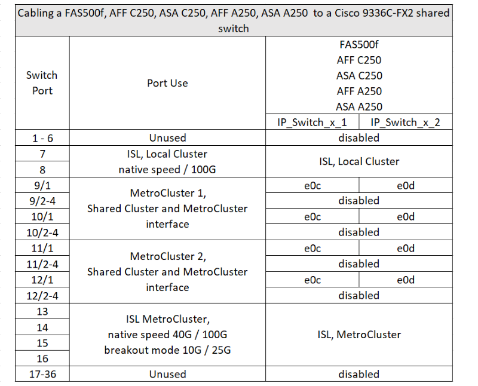
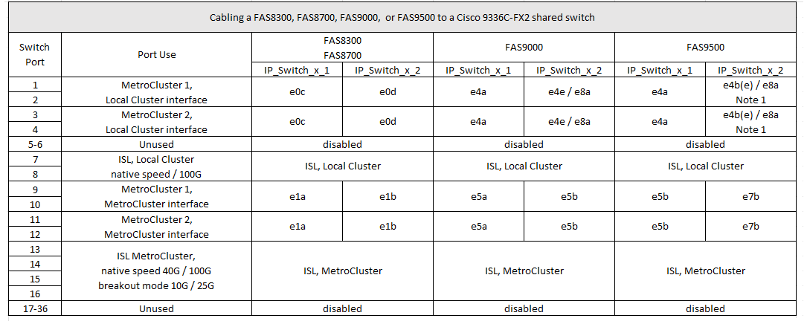

= Attribution des ports de plate-forme pour un commutateur partagé Cisco 9336C-FX2
:allow-uri-read: 
:icons: font
:imagesdir: ../media/

[role="lead"]
L'utilisation du port dans une configuration MetroCluster IP dépend du modèle de commutateur et du type de plate-forme.

Vérifiez les points suivants avant d'utiliser les tableaux :

* Au moins une configuration MetroCluster ou un groupe de reprise sur incident doit prendre en charge les tiroirs NS224 reliés par commutateur.
* Les plateformes qui ne prennent pas en charge les tiroirs NS224 reliés par un commutateur peuvent uniquement être connectées comme une deuxième configuration MetroCluster ou comme un second groupe de reprise après incident.
* Le RcfFileGenerator affiche uniquement les plates-formes éligibles lorsque la première plate-forme est sélectionnée.
* La connexion d'une configuration MetroCluster à huit ou deux nœuds requiert ONTAP 9.14.1 ou version ultérieure.

== Câblage d'un système AFF A320, AFF C400, ASA C400, AFF A400, ASA A400, AFF A700, AFF C800, ASA C800, AFF A800, AFF A900, ou du système ASA A900 vers un commutateur partagé Cisco 9336C-FX2

image::../media/mcc_ip_cabling_a320_c400_a400_a700_c800_a800_a900_to_cisco_9336c_shared_switch.png[câblage ip mcc a320 c400 a400 c800 a800 a900 vers le commutateur partagé cisco 9336c]

*Remarque 1* : si vous utilisez un adaptateur X91440A (40 Gbit/s), utilisez les ports e4a et e4e ou e4a et e8a. Si vous utilisez un adaptateur X91153A (100 Gbit/s), utilisez les ports e4a et e4b ou e4a et e8a.

== Câblage d'un système AFF A150, ASA A150, FAS2750 ou AFF A220 vers un commutateur partagé Cisco 9336C-FX2

image::../media/mcc_ip_cabling_a_aff_a150_asa_a150_fas27500_aff_a220_to_a_cisco_9336c_shared_switch.png[mcc ip reliant un AFF a150 ASA a150 fas27500 AFF a220 à un commutateur partagé cisco 9336c]

== Câblage d'un système FAS500f, AFF C250, ASA C250, AFF A250 ou ASA A250 à un commutateur partagé Cisco 9336C-FX2

== Câblage entre un système FAS8200 ou AFF A300 et un commutateur partagé Cisco 9336C-FX2

image::../media/mcc_ip_cabling_fas8200_affa300_to_cisco_9336c_shared_switch.png[câblage ip mcc fas8200 affa300 vers commutateur partagé cisco 9336c]

== Câblage d'un système FAS8300, FAS8700, FAS9000 ou FAS9500 à un commutateur partagé Cisco 9336C-FX2

*Remarque 1* : si vous utilisez un adaptateur X91440A (40 Gbit/s), utilisez les ports e4a et e4e ou e4a et e8a. Si vous utilisez un adaptateur X91153A (100 Gbit/s), utilisez les ports e4a et e4b ou e4a et e8a.
