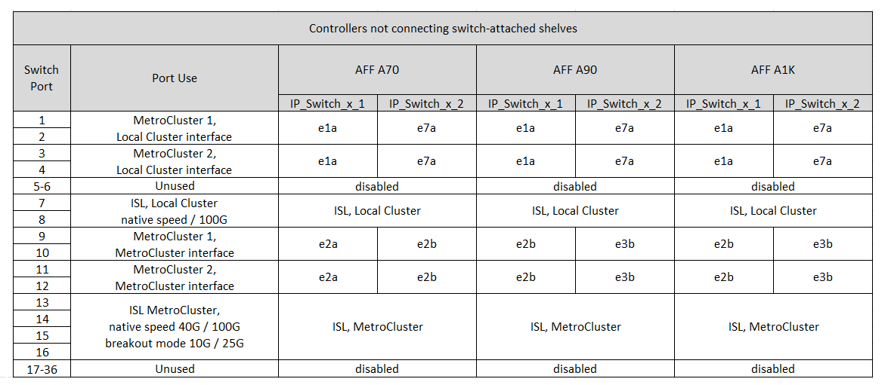

= Attribution des ports de plate-forme pour un commutateur partagé Cisco 9336C-FX2
:allow-uri-read: 
:icons: font
:imagesdir: ../media/

[role="lead"]
L'utilisation du port dans une configuration MetroCluster IP dépend du modèle de commutateur et du type de plate-forme.

Vérifiez les points suivants avant d'utiliser les tableaux :

* Au moins une configuration MetroCluster ou un groupe de reprise sur incident doit prendre en charge les tiroirs NS224 reliés par commutateur.
* Les plateformes qui ne prennent pas en charge les tiroirs NS224 reliés par un commutateur peuvent uniquement être connectées comme une deuxième configuration MetroCluster ou comme un second groupe de reprise après incident.
* Le RcfFileGenerator affiche uniquement les plates-formes éligibles lorsque la première plate-forme est sélectionnée.
* La connexion d'une configuration MetroCluster à huit ou deux nœuds requiert ONTAP 9.14.1 ou version ultérieure.

== Choisissez la table de câblage adaptée à votre configuration

Consultez le tableau d'affectation des ports correspondant à votre configuration. Cette section comporte deux ensembles de tables de câblage :

* <<tables_connecting_ns224,Tableaux de câblage pour les contrôleurs se connectant aux tiroirs NS224 reliés par un commutateur>>
* <<tables_not_connecting_ns224,Tableaux de câblage pour les contrôleurs ne se connectant pas aux tiroirs NS224 reliés par un commutateur>>

=== Contrôleurs se connectant aux tiroirs NS224 reliés par un commutateur

Déterminez le tableau d'affectation des ports à suivre pour les contrôleurs qui se connectent à des tiroirs NS224 reliés par un commutateur.

[cols="2*"]
|===
| Plateforme | Utilisez ce tableau de câblage... 

| AFF A320 AFF C400, ASA C400 AFF A400, ASA A400 | <<table_1_cisco_9336c_fx2,Attributions de ports de plate-forme de commutateur partagé Cisco 9336C-FX2 (groupe 1)>> 

| AFF A700 AFF C800, ASA C800, AFF A800 AFF A900, ASA A900 | <<table_2_cisco_9336c_fx2,Attributions de ports de plate-forme de commutateur partagé Cisco 9336C-FX2 (groupe 2)>> 

| AFF A90 AFF A70 AFF A1K *Remarque :* ces systèmes nécessitent ONTAP 9.15.1 ou une version ultérieure. | <<table_3_cisco_9336c_fx2,Attributions de ports de plate-forme de commutateur partagé Cisco 9336C-FX2 (groupe 3)>> 
|===
.Attributions de ports de plate-forme de commutateur partagé Cisco 9336C-FX2 (groupe 1)
Vérifiez les attributions de ports de la plateforme pour connecter un système AFF A320, AFF C400, ASA C400, AFF A400 ou ASA A400 qui connecte des tiroirs NSS24 reliés par commutateur à un commutateur partagé Cisco 9336C-FX2 :

image::../media/mcc_ip_cabling_a320_c400_a400_to_cisco_9336c_shared_switch.png[La présente les attributions de ports de plate-forme de commutateur partagé Cisco 9336C-FX2]

*Remarque 1* : si vous utilisez un adaptateur X91440A (40 Gbit/s), utilisez les ports e4a et e4e ou e4a et e8a. Si vous utilisez un adaptateur X91153A (100 Gbit/s), utilisez les ports e4a et e4b ou e4a et e8a.

.Attributions de ports de plate-forme de commutateur partagé Cisco 9336C-FX2 (groupe 2)
Passez en revue les affectations des ports de plateforme pour câbler un AFF A700, AFF C800, ASA C800, AFF A800, AFF A900, ou le système ASA A900 qui connecte des tiroirs NSS24 reliés par commutateur à un commutateur partagé Cisco 9336C-FX2 :

image::../media/mcc_ip_cabling_a700_c800_a800_a900_to_cisco_9336c_shared_switch.png[La présente les attributions de ports de plate-forme de commutateur partagé Cisco 9336C-FX2]

*Remarque 1* : si vous utilisez un adaptateur X91440A (40 Gbit/s), utilisez les ports e4a et e4e ou e4a et e8a. Si vous utilisez un adaptateur X91153A (100 Gbit/s), utilisez les ports e4a et e4b ou e4a et e8a.

.Attributions de ports de plate-forme de commutateur partagé Cisco 9336C-FX2 (groupe 3)
Vérifiez les attributions de ports de la plateforme pour câbler un système AFF A90, AFF A70 ou AFF A1K qui connecte des tiroirs NSS24 reliés par commutateur à un commutateur partagé Cisco 9336C-FX2 :

NOTE: Les systèmes de ce tableau nécessitent ONTAP 9.15.1 ou une version ultérieure.

image::../media/mcc_ip_cabling_a70_a90_a1k_to_cisco_9336c_shared_switch.png[La présente les attributions de ports de plate-forme de commutateur partagé Cisco 9336C-FX2]

Dans le cas d'un cluster connecté par commutateur, les ports de cluster identiques des nœuds AFF A90 ou AFF A70 doivent être sur le même commutateur. Par exemple, e1a sur le nœud 1 et e1a sur le nœud 2 doivent être connectés à un commutateur de cluster. De même, le second port de cluster des deux nœuds doit être connecté au second commutateur de cluster. La connexion croisée des ports HA du cluster partagé, où e1a du nœud 1 est connecté à IP_Switch_x_1 et e1a du nœud 2 est connecté à IP_Switch_x_2, empêche les défaillances de communication HA.

=== Contrôleurs ne se connectant pas aux tiroirs NS224 reliés par un commutateur

Déterminez le tableau d'affectation des ports à suivre pour les contrôleurs qui ne se connectent pas aux tiroirs NS224 reliés par un commutateur.

[cols="2*"]
|===
| Plateforme | Utilisez ce tableau de câblage... 

| AFF A150, ASA A150 FAS2750, AFF A220 | <<table_4_cisco_9336c_fx2,Attributions de ports de plate-forme de commutateur partagé Cisco 9336C-FX2 (groupe 4)>> 

| FAS500f AFF C250, ASA C250 AFF A250, ASA A250 | <<table_5_cisco_9336c_fx2,Attributions de ports de plate-forme de commutateur partagé Cisco 9336C-FX2 (groupe 5)>> 

| FAS8200, AFF A300 | <<table_6_cisco_9336c_fx2,Attributions de ports de plate-forme de commutateur partagé Cisco 9336C-FX2 (groupe 6)>> 

| AFF A320, AFF C400, ASA C400, FAS8700 AFF A400, ASA A400 | <<table_7_cisco_9336c_fx2,Attributions de ports de plate-forme de commutateur partagé Cisco 9336C-FX2 (groupe 7)>> 

| FAS9000, AFF A700 AFF C800, ASA C800, AFF A800, ASA A800 FAS9500, AFF A900, ASA A900 | <<table_8_cisco_9336c_fx2,Attributions de ports de plate-forme de commutateur partagé Cisco 9336C-FX2 (groupe 8)>> 

| AFF A70 AFF A90 AFF A1K *Remarque :* ces systèmes nécessitent ONTAP 9.15.1 ou une version ultérieure. | <<table_9_cisco_9336c_fx2,Attributions de ports de plate-forme de commutateur partagé Cisco 9336C-FX2 (groupe 9)>> 
|===
.Attributions de ports de plate-forme de commutateur partagé Cisco 9336C-FX2 (groupe 4)
Vérifiez les attributions de ports de la plateforme pour câbler un système AFF A150, ASA A150, FAS2750 ou AFF A220 qui ne connecte pas les tiroirs NSS24 reliés par commutateur à un commutateur partagé Cisco 9336C-FX2 :

image::../media/mcc-ip-cabling-a-aff-a150-asa-a150-fas2750-aff-a220-to-a-cisco-9336c-shared-switch.png[La présente les attributions de ports de plate-forme de commutateur partagé Cisco 9336C-FX2]

.Attributions de ports de plate-forme de commutateur partagé Cisco 9336C-FX2 (groupe 5)
Vérifiez les affectations des ports de la plateforme pour câbler un système FAS500f, AFF C250, ASA C250, AFF A250 ou ASA A250 qui ne connecte pas les tiroirs NSS24 reliés par commutateur à un commutateur partagé Cisco 9336C-FX2 :

image::../media/mcc-ip-cabling-c250-asa-c250-a250-asa-a250-to-cisco-9336c-shared-switch.png[La présente les attributions de ports de plate-forme de commutateur partagé Cisco 9336C-FX2]

.Attributions de ports de plate-forme de commutateur partagé Cisco 9336C-FX2 (groupe 6)
Vérifiez les attributions de ports de la plateforme pour connecter un système FAS8200 ou AFF A300 qui ne connecte pas les tiroirs NSS24 reliés par commutateur à un commutateur partagé Cisco 9336C-FX2 :

image::../media/mcc-ip-cabling-fas8200-affa300-to-cisco-9336c-shared-switch.png[La présente les attributions de ports de plate-forme de commutateur partagé Cisco 9336C-FX2]

.Attributions de ports de plate-forme de commutateur partagé Cisco 9336C-FX2 (groupe 7)
Consultez les attributions de ports de plateforme pour connecter les systèmes AFF A320, FAS8300, AFF C400, ASA C400, FAS8700, système AFF A400 ou ASA A400 ne connectant pas des tiroirs NSS24 reliés par un commutateur partagé Cisco 9336C-FX2 :

image::../media/mcc_ip_cabling_a320_fas8300_a400_fas8700_to_a_cisco_9336c_shared_switch.png[La présente les attributions de ports de plate-forme de commutateur partagé Cisco 9336C-FX2]

*Remarque 1* : si vous utilisez un adaptateur X91440A (40 Gbit/s), utilisez les ports e4a et e4e ou e4a et e8a. Si vous utilisez un adaptateur X91153A (100 Gbit/s), utilisez les ports e4a et e4b ou e4a et e8a.

.Attributions de ports de plate-forme de commutateur partagé Cisco 9336C-FX2 (groupe 8)
Consultez les affectations des ports de plateforme pour connecter les câbles des systèmes FAS9000, AFF A700, AFF C800, ASA C800, AFF A800, système ASA A800, FAS9500, AFF A900 ou ASA A900 ne connectant pas les tiroirs NSS24 reliés par commutateur à un commutateur partagé Cisco 9336C-FX2 :

image::../media/mcc_ip_cabling_a700_a800_fas9000_fas9500_to_cisco_9336c_shared_switch.png[La présente les attributions de ports de plate-forme de commutateur partagé Cisco 9336C-FX2]

*Remarque 1* : si vous utilisez un adaptateur X91440A (40 Gbit/s), utilisez les ports e4a et e4e ou e4a et e8a. Si vous utilisez un adaptateur X91153A (100 Gbit/s), utilisez les ports e4a et e4b ou e4a et e8a.

.Attributions de ports de plate-forme de commutateur partagé Cisco 9336C-FX2 (groupe 9)
Vérifiez les attributions de ports de la plateforme pour câbler un système AFF A70, AFF A90 ou AFF A1K qui ne connecte pas de tiroirs NSS24 reliés par commutateur à un commutateur partagé Cisco 9336C-FX2 :

NOTE: Les systèmes de ce tableau nécessitent ONTAP 9.15.1 ou une version ultérieure.

