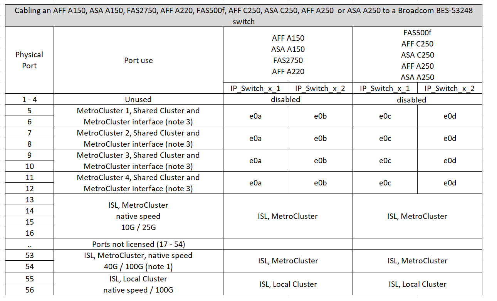
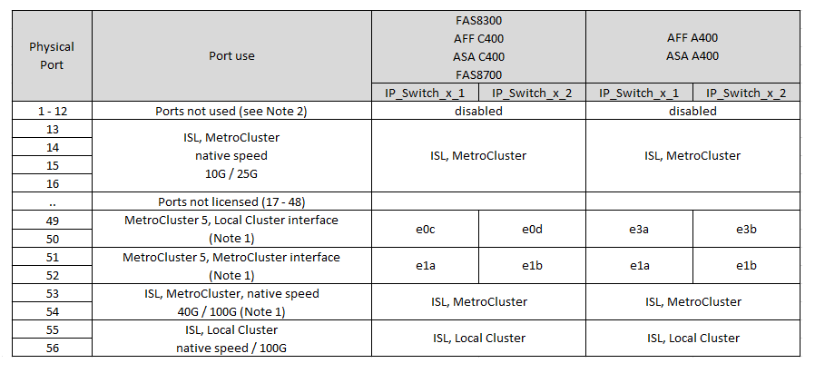

= Affectation de ports de plate-forme pour les commutateurs IP BES-53248 pris en charge par Broadcom
:allow-uri-read: 
:icons: font
:imagesdir: ../media/

[role="lead"]
L'utilisation du port dans une configuration MetroCluster IP dépend du modèle de commutateur et du type de plate-forme.

Les commutateurs ne peuvent pas être utilisés avec des ports ISL distants de différentes vitesses (par exemple, un port 25 Gbits/s connecté à un port ISL de 10 Gbits/s).

.Consultez ces informations avant d'utiliser les tableaux :
* Si vous configurez le switch pour la transition MetroCluster FC vers IP, les ports suivants sont utilisés selon la plateforme cible que vous choisissez :
+
[cols="75,25"]
|===
| Plate-forme cible | Port 

| FAS500f, AFF C250, ASA C250, AFF A250, ASA A250, FAS8300, AFF C400, ASA C400, AFF A400, ASA A400, ou FAS8700 | Ports 1 à 6, 10 Gbits/s. 

| Plateformes FAS8200 ou AFF A300 | Ports 3 - 4 et 9 - 12, 10 Gbits/s. 
|===
* Les systèmes AFF A320 configurés avec des switchs Broadcom BES-53248 peuvent ne pas prendre en charge toutes les fonctionnalités.
+
Toute configuration ou fonctionnalité qui nécessite la connexion du cluster local à un commutateur n'est pas prise en charge. Par exemple, les configurations et procédures suivantes ne sont pas prises en charge :

+
** Configurations MetroCluster à 8 nœuds
** Passez des configurations FC MetroCluster aux configurations IP MetroCluster
** Mise à jour d'une configuration IP MetroCluster à quatre nœuds (ONTAP 9.8 et versions ultérieures)

.Notes référencées dans les tableaux :
* *Remarque 1* : l'utilisation de ces ports nécessite une licence supplémentaire.
* *Remarque 2* : seul un MetroCluster à quatre nœuds utilisant des systèmes AFF A320 peut être connecté au commutateur.
+
Les fonctionnalités nécessitant un cluster commuté ne sont pas prises en charge dans cette configuration, y compris la transition FC vers IP de MetroCluster et les procédures de mise à jour technologique.

* *Remarque 3* : le commutateur BES-53248 nécessite que tous les ports d'un groupe à quatre ports fonctionnent à la même vitesse. Pour connecter un mélange de plateformes AFF 150, ASA A150, FAS2750, AFF A220 et FAS500f, AFF C250, ASA C250, AFF A250 et ASA A250, vous devez utiliser des ports de commutation situés dans des groupes de quatre ports distincts. Si vous avez besoin de ce type de configuration, les conditions suivantes s'appliquent :
+
** Dans le https://mysupport.netapp.com/site/tools/tool-eula/rcffilegenerator["RcfFileGenerator pour MetroCluster IP"], Les champs de la liste déroulante "MetroCluster 1" et "MetroCluster 2" sont remplis uniquement après avoir sélectionné une plate-forme pour MetroCluster 3 ou "MetroCluster 4".  Reportez-vous à la section link:../install-ip/using_rcf_generator.html["Utilisation des tables de ports avec l'outil RcfFileGenerator ou de plusieurs configurations MetroCluster"] pour plus d'informations sur l'utilisation des tables de ports.
** Si les deux configurations MetroCluster utilisent la même plate-forme, NetApp vous recommande de sélectionner le groupe « MetroCluster 3 » pour une configuration et le groupe « MetroCluster 4 » pour l'autre. Si les plates-formes sont différentes, vous devez sélectionner « MetroCluster 3 » ou « MetroCluster 4 » pour la première configuration, puis sélectionner « MetroCluster 1 » ou « MetroCluster 2 » pour la deuxième configuration.

== Câblage d'un système AFF A150, ASA A150, FAS2750, AFF A220, FAS500f, AFF C250, ASA C250, AFF A250 ou ASA A250 vers un commutateur Broadcom BES-53248

== Câblage d'un système FAS8200, AFF A300 ou AFF A320 à un commutateur Broadcom BES-53248

image::../media/mcc_ip_cabling_a_aff_a300_or_fas8200_to_a_broadcom_bes_53248_switch.png[mcc ip reliant un AFF a300 ou fas8200 à un commutateur broadcom bes 53248]

image::../media/mcc_ip_cabling_a_aff_a320_to_a_broadcom_bes_53248_switch.png[mcc ip relie un AFF a320 à un commutateur broadcom bes 53248]

== Raccordement d'un système FAS8300, AFF C400, ASA C400, AFF A400, ASA A400 ou FAS8700 à un commutateur Broadcom BES-53248

