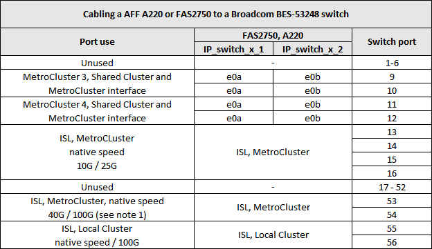
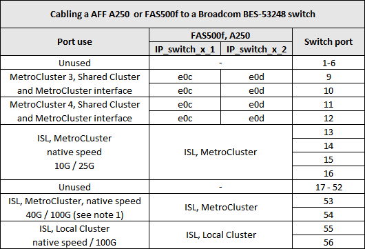
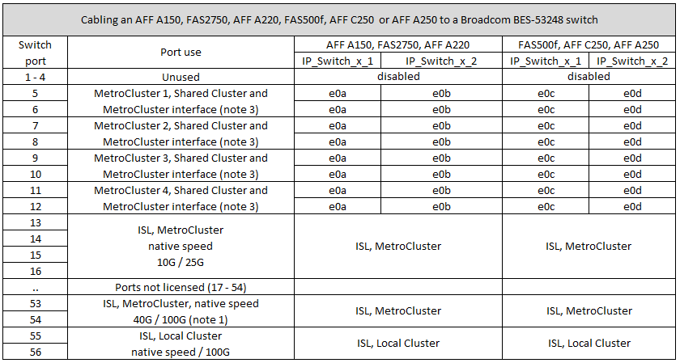

= Affectation de ports de plate-forme pour les commutateurs IP BES-53248 pris en charge par Broadcom
:allow-uri-read: 
:icons: font
:imagesdir: ../media/

[role="lead"]
L'utilisation du port dans une configuration MetroCluster IP dépend du modèle de commutateur et du type de plate-forme.

Les commutateurs ne peuvent pas être utilisés avec des ports ISL distants de différentes vitesses (par exemple, un port 25 Gbits/s connecté à un port ISL de 10 Gbits/s).

.Remarques pour les tableaux ci-dessous :
. Sur certaines plateformes, vous pouvez utiliser les ports 49 à 54 pour les connexions MetroCluster ISL ou MetroCluster.
+
Ces ports requièrent une licence supplémentaire.

. Seul un système MetroCluster à quatre nœuds utilisant les systèmes A320 peut être connecté au commutateur.
+
Les fonctionnalités qui nécessitent un cluster commuté ne sont pas prises en charge dans cette configuration, notamment les procédures de transition FC vers IP et de mise à jour technologique de MetroCluster.

. Les systèmes AFF A320 configurés avec des switchs Broadcom BES-53248 peuvent ne pas prendre en charge toutes les fonctionnalités.
+
Toute configuration ou fonctionnalité qui nécessite la connexion du cluster local à un commutateur n'est pas prise en charge. Par exemple, les configurations et procédures suivantes ne sont pas prises en charge :

+
** Configurations MetroCluster à 8 nœuds
** Passez des configurations FC MetroCluster aux configurations IP MetroCluster
** Mise à jour d'une configuration IP MetroCluster à quatre nœuds (ONTAP 9.8 et versions ultérieures)

. Si vous connectez deux configurations MetroCluster et que les deux utilisent le même type de contrôleur, vous devez utiliser les groupes de ports MetroCluster 3 et 4. Si les contrôleurs sont différents, vous devez utiliser les groupes de ports MetroCluster 3 et 4 pour un type et les groupes de ports MetroCluster 1 et 2 pour l'autre.
+
** Par exemple, si vous vous connectez :
+
*** Deux configurations MetroCluster composées uniquement de FAS2750/AFF A220 ou FAS500f/AFF A250, vous devez sélectionner les groupes de ports MetroCluster 3 et 4.
*** Deux configurations MetroCluster dans lesquelles un MetroCluster est de type FAS2750/AFF A220 et l'autre est FAS500f/AFF A250, vous devez sélectionner les groupes de ports 3 et 4 pour une, et les groupes de ports 1 et 2 pour l'autre. Dans le https://mysupport.netapp.com/site/tools/tool-eula/rcffilegenerator["RcfFileGenerator pour MetroCluster IP"], les champs 1 et 2 ne sont remplis que de la plate-forme prise en charge après avoir sélectionné des plates-formes dans les zones déroulantes 3 et 4. Reportez-vous à la section link:../install-ip/using_rcf_generator.html["Utilisation des tables de ports avec l'outil RcfFileGenerator ou de plusieurs configurations MetroCluster"] pour plus d'informations sur l'utilisation des tables de ports.

== Utilisation des ports de switch pour les systèmes AFF A220 ou FAS2750

== Utilisation des ports de switch pour les systèmes AFF A250 ou FAS500f

== Utilisation des ports de switch pour une utilisation combinée des systèmes AFF A250, FAS500f et AFF A220 ou FAS2750

== Utilisation des ports par switch pour les systèmes AFF A300 ou FAS8200

image::../media/mcc_ip_cabling_a_aff_a300_or_fas8200_to_a_broadcom_bes_53248_switch.png[mcc ip reliant un AFF a300 ou fas8200 à un commutateur broadcom bes 53248]

image::../media/mcc_ip_cabling_a_aff_a320_to_a_broadcom_bes_53248_switch.png[mcc ip relie un AFF a320 à un commutateur broadcom bes 53248]

== Utilisation des ports par commutateur pour les systèmes AFF A400, FAS8300 ou FAS8700

image::../media/mcc_ip_cabling_a_fas8300_a400_or_fas8700_to_a_broadcom_bes_53248_switch.png[mcc ip relie une carte fas8300 a400 ou fas8700 à un commutateur broadcom bes 53248]
