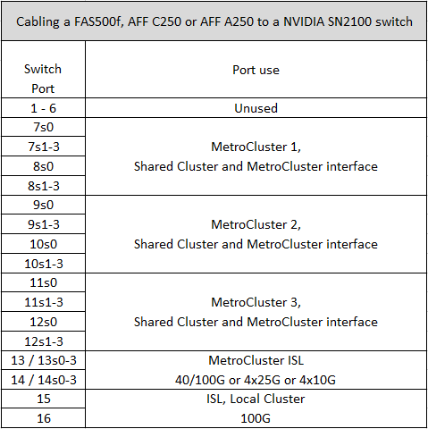

= Affectations des ports de plateforme pour les switchs IP SN2100 pris en charge par NVIDIA
:allow-uri-read: 
:icons: font
:imagesdir: ../media/

[role="lead"]
L'utilisation du port dans une configuration MetroCluster IP dépend du modèle de commutateur et du type de plate-forme.

== Configurations compatibles

Les plates-formes suivantes sont actuellement prises en charge :

* FAS500f / AFF C250 / AFF A250
* FAS8300 / AFF C400 / AFF A400
* FAS8700
* FAS9000/AFF A700
* AFF C800 / AFF A800
* FAS9500 / AFF A900

Les plates-formes et configurations suivantes ne sont pas actuellement prises en charge :

* Transition FC-à-IP de MetroCluster
* Configuration MetroCluster à 8 nœuds

.Vérifiez ces considérations avant d'utiliser les tables de configuration
Si vous câconnectez plusieurs configurations MetroCluster, suivez le tableau correspondant. Par exemple :

* Si vous câblez deux configurations MetroCluster à quatre nœuds de type AFF A700, connectez le premier MetroCluster indiqué sous la forme « MetroCluster 1 » et le second MetroCluster sous la forme « MetroCluster 2 » dans le tableau AFF A700.

NOTE: Les ports 13 et 14 peuvent être utilisés en mode de vitesse native prenant en charge 40 Gbits/s et 100 Gbits/s, ou en mode d'arrachage pour prendre en charge 4 × 25 Gbits/s ou 4 × 10 Gbits/s. S'ils utilisent le mode de vitesse natif, ils sont représentés par les ports 13 et 14. S'ils utilisent le mode écorché, soit 4 × 25 Gbit/s, soit 4 × 10 Gbit/s, ils sont représentés sous la forme de ports 13s0-3 et 14s0-3.

Les sections suivantes décrivent le schéma de câblage physique. Vous pouvez également vous reporter à la https://mysupport.netapp.com/site/tools/tool-eula/rcffilegenerator["RcfFileGenerator"] pour des informations détaillées sur le câblage.

== Utilisation des ports de commutation pour FAS500f, AFF C250 ou AFF A250

== Utilisation des ports de switch pour AFF C400, AFF A400, AFF A700, FAS9000, FAS8300 FAS8700, AFF A800, FAS9500 ou AFF A900

image::../media/mcc_ip_cabling_aff250_400_700_800_cseriesMSN2100.png[Câblage mcc ip aff250 400 700 800 cseriesMSN2100]
