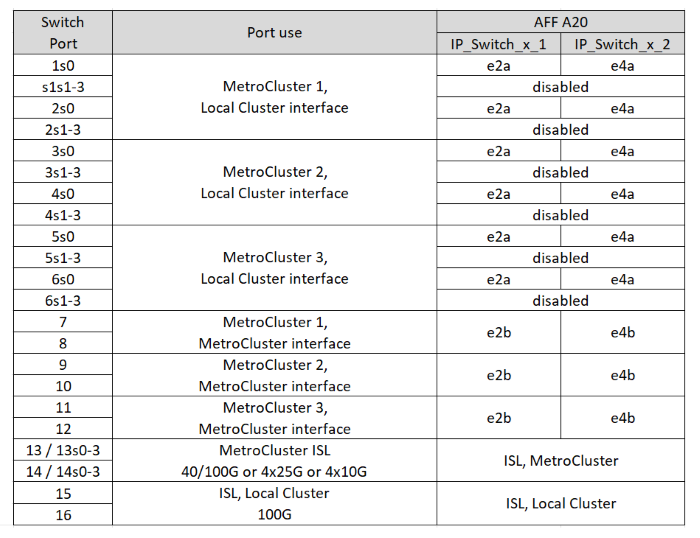
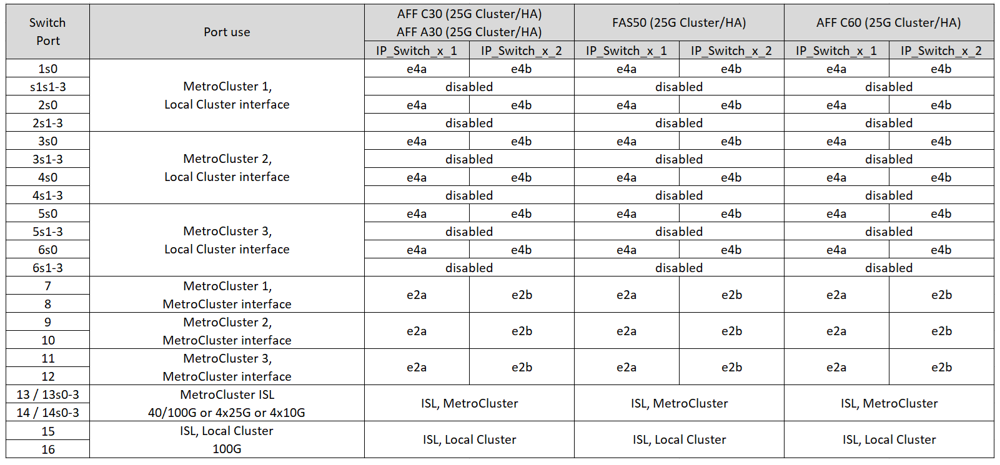

= Affectations de ports de plate-forme pour les commutateurs IP SN2100 pris en charge par NVIDIA dans une configuration IP MetroCluster
:allow-uri-read: 
:icons: font
:imagesdir: ../media/

[role="lead"]
L'utilisation du port dans une configuration MetroCluster IP dépend du modèle de commutateur et du type de plate-forme.

Consultez les considérations suivantes avant d'utiliser les tableaux de configuration :

* La connexion d'une configuration MetroCluster à huit ou deux nœuds requiert ONTAP 9.14.1 ou version ultérieure et le fichier RCF version 2.00 ou version ultérieure.
+

NOTE: La version du fichier RCF est différente de celle de l'outil RCFfilegenerator utilisé pour générer le fichier. Par exemple, vous pouvez générer un fichier RCF version 2.00 à l'aide de RCFfilegenerator v1.6c.

* Si vous câconnectez plusieurs configurations MetroCluster, suivez le tableau correspondant. Par exemple :
+
** Si vous câblez deux configurations MetroCluster à quatre nœuds de type AFF A700, connectez le premier MetroCluster indiqué sous la forme « MetroCluster 1 » et le second MetroCluster sous la forme « MetroCluster 2 » dans le tableau AFF A700.

NOTE: Les ports 13 et 14 peuvent être utilisés en mode de vitesse native prenant en charge 40 Gbits/s et 100 Gbits/s, ou en mode d'arrachage pour prendre en charge 4 × 25 Gbits/s ou 4 × 10 Gbits/s. S'ils utilisent le mode de vitesse natif, ils sont représentés par les ports 13 et 14. S'ils utilisent le mode écorché, soit 4 × 25 Gbit/s, soit 4 × 10 Gbit/s, ils sont représentés sous la forme de ports 13s0-3 et 14s0-3.

Les sections suivantes décrivent le schéma de câblage physique. Vous pouvez également vous reporter à la https://mysupport.netapp.com/site/tools/tool-eula/rcffilegenerator["RcfFileGenerator"] pour des informations détaillées sur le câblage.

== Choisissez la table de câblage adaptée à votre configuration

Utilisez le tableau suivant pour déterminer la table de câblage que vous devez suivre.

[cols="25,75"]
|===
| Si votre système est... | Utilisez ce tableau de câblage... 

 a| 
AFF A150, ASA A150

FAS500f

AFF C250, ASA C250

AFF A250, ASA A250
| <<table_1_nvidia_sn2100,Affectations des ports de la plate-forme NVIDIA SN2100 (groupe 1)>> 

| AFF A20 | <<table_2_nvidia_sn2100,Affectations des ports de la plate-forme NVIDIA SN2100 (groupe 2)>> 

| AFF C30, AFF A30 FAS50 AFF C60  a| 
Le tableau suivant dépend de l'utilisation d'une carte Ethernet 25G (groupe 3a) ou 100G (groupe 3b).

* <<table_3a_nvidia_sn2100,Affectations des ports de la plate-forme NVIDIA SN2100 (groupe 3a -25G)>>
* <<table_3b_nvidia_sn2100,Affectations des ports de la plate-forme NVIDIA SN2100 (groupe 3b -100G)>>

| FAS8300 AFF C400, ASA C400 AFF A400, ASA A400 FAS8700 FAS9000, AFF A700 | <<table_4_nvidia_sn2100,Affectations des ports de la plate-forme NVIDIA SN2100 (groupe 4)>> 

| AFF A50 | <<table_5_nvidia_sn2100,Affectations des ports de la plate-forme NVIDIA SN2100 (groupe 5)>> 

| AFF C800, ASA C800 AFF A800, ASA A800 FAS9500 AFF A900, ASA A900 | <<table_6_nvidia_sn2100,Affectations des ports de la plate-forme NVIDIA SN2100 (groupe 6)>> 

| FAS70, AFF A70 AFF C80 FAS90, AFF A90 AFF A1K | <<table_7_nvidia_sn2100,Affectations des ports de la plate-forme NVIDIA SN2100 (groupe 7)>> 
|===
.Affectations des ports de la plate-forme NVIDIA SN2100 (groupe 1)
Passez en revue les attributions de port de la plate-forme pour câbler un AFF A150, ASA A150, FAS500f, AFF C250, ASA C250, système AFF A250 ou ASA A250 vers un commutateur NVIDIA SN2100 :

[#table_1_nvidia_sn2100]
image::../media/mcc-ip-cabling-aff-asa-a150-fas500f-a25-c250-MSN2100.png[Affiche les attributions de port de la plate-forme NVIDIA SN2100]

.Affectations des ports de la plate-forme NVIDIA SN2100 (groupe 2)
Passez en revue les affectations de port de plate-forme pour relier un système AFF A20 à un commutateur NVIDIA SN2100 :

[#table_2_nvidia_sn2100]

.Affectations des ports de la plate-forme NVIDIA SN2100 (groupe 3a)
Passez en revue les attributions de port de la plate-forme pour connecter un système AFF A30, AFF C30, AFF C60 ou FAS50 à un commutateur NVIDIA SN2100 à l'aide d'une carte Ethernet 25G à quatre ports :

NOTE: Cette configuration nécessite une carte Ethernet 25G à quatre ports dans le logement 4 pour connecter le cluster local et les interfaces haute disponibilité.

[#table_3a_nvidia_sn2100]

.Affectations des ports de la plate-forme NVIDIA SN2100 (groupe 3b)
Passez en revue les attributions de port de la plate-forme pour connecter un système AFF A30, AFF C30, AFF C60 ou FAS50 à un commutateur NVIDIA SN2100 à l'aide d'une carte Ethernet 100G à deux ports :

NOTE: Cette configuration nécessite une carte Ethernet 100G à deux ports dans le logement 4 pour connecter le cluster local et les interfaces haute disponibilité.

[#table_3b_nvidia_sn2100]
image::../media/mccip-cabling-nvidia-a30-c30-fas50-c60-100G.png[Affiche les attributions de port de la plate-forme NVIDIA SN2100]

.Affectations des ports de la plate-forme NVIDIA SN2100 (groupe 4)
Consultez les affectations des ports de la plateforme pour connecter un système FAS8300, AFF C400, ASA C400, AFF A400, ASA A400, système FAS8700, FAS9000 ou AFF A700 vers un commutateur NVIDIA SN2100 :

image::../media/mccip-cabling-fas8300-aff-a400-c400-a700-fas900-nvidaia-sn2100.png[Affiche les attributions de port de la plate-forme NVIDIA SN2100]

*Remarque 1* : utilisez les ports e4a et e4e ou e4a et e8a si vous utilisez un adaptateur X91440A (40 Gbit/s). Utilisez les ports e4a et e4b ou e4a et e8a si vous utilisez un adaptateur X91153A (100 Gbit/s).

.Affectations des ports de la plate-forme NVIDIA SN2100 (groupe 5)
Passez en revue les affectations de port de plate-forme pour connecter un système AFF A50 à un commutateur NVIDIA SN2100 :

[#table_5_nvidia_sn2100]
image::../media/mccip-cabling-aff-a50-nvidia-sn2100.png[Affiche les attributions de port de la plate-forme NVIDIA SN2100]

.Affectations des ports de la plate-forme NVIDIA SN2100 (groupe 6)
Passez en revue les affectations des ports de la plateforme pour câbler un AFF C800, ASA C800, AFF A800, ASA A800, FAS9500, système AFF A900 ou ASA A900 vers un commutateur NVIDIA SN2100 :

image::../media/mcc_ip_cabling_fas8300_aff_asa_a800_a900_fas9500_MSN2100.png[Affiche les attributions de port de la plate-forme NVIDIA SN2100]

*Remarque 1* : utilisez les ports e4a et e4e ou e4a et e8a si vous utilisez un adaptateur X91440A (40 Gbit/s). Utilisez les ports e4a et e4b ou e4a et e8a si vous utilisez un adaptateur X91153A (100 Gbit/s).

.Affectations des ports de la plate-forme NVIDIA SN2100 (groupe 7)
Vérifiez les affectations des ports de la plate-forme pour connecter un système FAS70, AFF A70, AFF C80, FAS90, AFF A90 ou AFF A1K à un commutateur NVIDIA SN2100 :

image::../media/mccip-cabling-nvidia-a70-c80-fas90-fas70-a1k.png[Affiche les attributions de port de la plate-forme NVIDIA SN2100]
