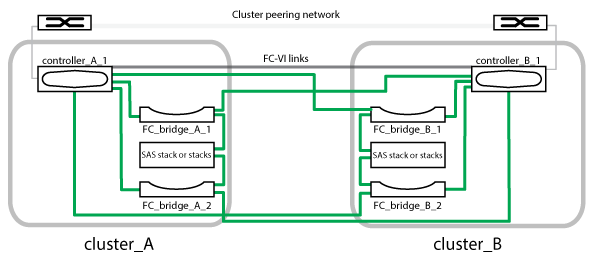

= Composants d'une configuration Stretch MetroCluster à deux nœuds avec connexion Bridge-Attached
:allow-uri-read: 
:icons: font
:imagesdir: ../media/

[role="lead"]
Lorsque vous planifiez votre configuration MetroCluster, vous devez comprendre les éléments de la configuration et leur fonctionnement commun.

La configuration MetroCluster inclut les éléments matériels clés suivants :

* Contrôleurs de stockage
+
Les contrôleurs de stockage ne sont pas directement connectés au stockage, mais sont connectés à des ponts FC-SAS. Les contrôleurs de stockage sont reliés par des câbles FC entre les adaptateurs FC-VI de chaque contrôleur.

+
Chaque contrôleur de stockage est configuré comme partenaire de reprise après incident sur un contrôleur de stockage du site partenaire.

* Ponts FC-SAS
+
Le pont FC-to-SAS relie les piles de stockage SAS aux ports d'initiateur FC des contrôleurs, offrant ainsi une passerelle entre les deux protocoles.

* Réseau de peering de cluster
+
Le réseau de peering de cluster assure la connectivité en miroir de la configuration de la machine virtuelle de stockage (SVM). La configuration de tous les SVM sur un cluster est mise en miroir sur le cluster partenaire.

L'illustration suivante présente une vue simplifiée de la configuration MetroCluster. Pour certaines connexions, une seule ligne représente plusieurs connexions redondantes entre les composants. Les connexions du réseau de gestion et de données ne sont pas affichées.

* La configuration se compose de deux clusters à un seul nœud.
* Chaque site dispose d'une ou plusieurs piles de stockage SAS.
+

NOTE: Les tiroirs SAS des configurations MetroCluster ne sont pas pris en charge avec le câblage ACP.

+
D'autres piles de stockage sont prises en charge, mais une seule s'affiche sur chaque site.

