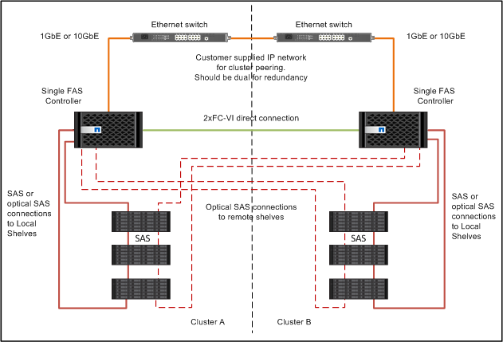

= Câblage des contrôleurs les uns aux autres et des tiroirs de stockage
:allow-uri-read: 
:icons: font
:imagesdir: ../media/

[role="lead"]
Les adaptateurs FC-VI du contrôleur doivent être câblés directement les uns aux autres. Les ports SAS du contrôleur doivent être câblés à la fois aux piles de stockage distantes et locales.

Cette tâche doit être effectuée sur les deux sites MetroCluster.

.Étapes
. Brancher les ports FC-VI.
+
image::../media/mcc_cabling_fc_vi_controller_to_partner.gif[mcc relie le contrôleur fc vi au partenaire]

+
L'illustration ci-dessus est une connexion de câble représentative type. Les ports FC-VI spécifiques varient en fonction du module de contrôleur.

+
** Vous pouvez commander des modules de contrôleur FAS8200 et AFF A300 avec l'une des deux options de connectivité FC-VI :
+
*** Les ports intégrés 0e et 0f sont configurés en mode FC-VI.
*** Les ports 1a et 1b sur une carte FC-VI sont placés dans l'emplacement 1.

** Les modules de contrôleur des systèmes de stockage AFF A700 et FAS9000 utilisent chacun quatre ports FC-VI.
** Les modules contrôleurs des systèmes de stockage AFF A400 et FAS8300 utilisent les ports FC-VI 2a et 2b.

. Reliez les ports SAS.
+
L'illustration suivante montre les connexions. L'utilisation de vos ports peut être différente selon les ports SAS et FC-VI disponibles sur le module de contrôleur.

+

