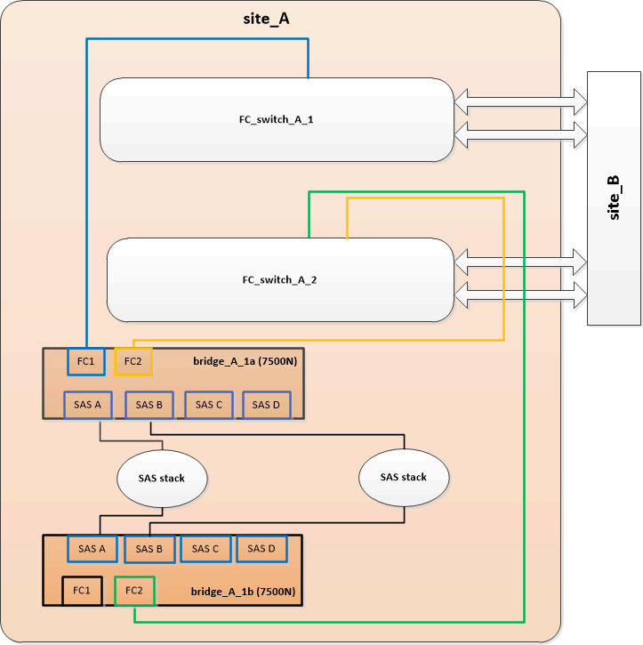

= Remplacement d'une paire de ponts FiberBridge 6500N par des ponts 7600N ou 7500N
:allow-uri-read: 
:icons: font
:imagesdir: ../media/

[role="lead"]
Pour profiter du port FC2 supplémentaire sur les ponts FiberBridge 7600N ou 7500N et réduire l'utilisation du rack, vous pouvez remplacer sans interruption des ponts 6500N et consolider jusqu'à quatre piles de stockage derrière une seule paire de ponts FiberBridge 7600N ou 7500N.

.Avant de commencer
Vous avez besoin du mot de passe d'administration et de l'accès à un serveur FTP ou SCP.

.Description de la tâche
Cette procédure doit être utilisée dans les cas suivants :

* Vous remplacez une paire de ponts FiberBridge 6500N par des ponts FiberBridge 7600N ou 7500N.
+
Après le remplacement, les deux ponts de la paire doivent être du même modèle.

* Vous avez précédemment remplacé un pont FiberBridge 6500N par un pont 7600N ou 7500N et remplacez maintenant le deuxième pont de la paire.
* Vous disposez d'une paire de ponts FiberBridge 7600N ou 7500N avec des ports SAS disponibles et vous consolidez les piles de stockage SAS actuellement connectées par des ponts FiberBridge 6500N.

Cette procédure ne génère aucune interruption et peut être effectuée en deux heures environ.

.Informations associées
link:task_replace_a_sle_fc_to_sas_bridge.html["Remplacement d'un pont FC-SAS unique"]

== Vérification de la connectivité du stockage

Avant de remplacer les ponts, vérifiez la connectivité du pont et du stockage. Vous vous familiarisation avec la sortie de commande vous permet de confirmer ultérieurement la connectivité après avoir effectué des modifications de configuration.

Vous pouvez lancer ces commandes depuis l'invite d'administration de n'importe lequel des modules de contrôleur dans la configuration MetroCluster sur le site en cours de maintenance.

. Vérifier la connectivité sur les disques en saisissant la commande suivante sur l'un des nœuds MetroCluster :
+
`run local sysconfig -v`

+
Le résultat montre les disques connectés aux ports initiateurs du contrôleur, et identifie les tiroirs connectés aux ponts FC-SAS :

+
[listing]
----

node_A_1> run local sysconfig -v
NetApp Release 9.3.2X18: Sun Dec 13 01:23:24 PST 2017
System ID: 4068741258 (node_A_1); partner ID: 4068741260 (node_B_1)
System Serial Number: 940001025471 (node_A_1)
System Rev: 70
System Storage Configuration: Multi-Path HA**<=== Configuration should be multi-path HA**
.
.
.
slot 0: FC Host Adapter 0g (QLogic 8324 rev. 2, N-port, <UP>)**<=== Initiator port**
		Firmware rev:      7.5.0
		Flash rev:         0.0.0
		Host Port Id:      0x60130
		FC Node Name:      5:00a:098201:bae312
		FC Port Name:      5:00a:098201:bae312
		SFP Vendor:        UTILITIES CORP.
		SFP Part Number:   FTLF8529P3BCVAN1
		SFP Serial Number: URQ0Q9R
		SFP Capabilities:  4, 8 or 16 Gbit
		Link Data Rate:    16 Gbit
		Switch Port:       brcd6505-fcs40:1
  **<List of disks visible to port\>**
		 ID     Vendor   Model            FW    Size
		brcd6505-fcs29:12.126L1527     : NETAPP   X302_HJUPI01TSSM NA04 847.5GB (1953525168 512B/sect)
		brcd6505-fcs29:12.126L1528     : NETAPP   X302_HJUPI01TSSA NA02 847.5GB (1953525168 512B/sect)
		.
		.
		.
		**<List of FC-to-SAS bridges visible to port\>**
		FC-to-SAS Bridge:
		brcd6505-fcs40:12.126L0        : ATTO     FibreBridge6500N 1.61  FB6500N102980
		brcd6505-fcs42:13.126L0        : ATTO     FibreBridge6500N 1.61  FB6500N102980
		brcd6505-fcs42:6.126L0         : ATTO     FibreBridge6500N 1.61  FB6500N101167
		brcd6505-fcs42:7.126L0         : ATTO     FibreBridge6500N 1.61  FB6500N102974
		.
		.
		.
  **<List of storage shelves visible to port\>**
		brcd6505-fcs40:12.shelf6: DS4243  Firmware rev. IOM3 A: 0200  IOM3 B: 0200
		brcd6505-fcs40:12.shelf8: DS4243  Firmware rev. IOM3 A: 0200  IOM3 B: 0200
		.
		.
		.
----

== Ponts FiberBridge 6500N permutant à chaud pour créer une paire de ponts FiberBridge 7600N ou 7500N

Pour remplacer à chaud un ou deux ponts FibreBridge 6500N afin de créer une configuration avec une paire de ponts FiberBridge 7600N ou 7500N, vous devez remplacer les ponts un par un et suivre la procédure de câblage correcte. Le nouveau câblage est différent du câblage d'origine.

.Description de la tâche
Vous pouvez également utiliser cette procédure si les conditions suivantes sont vraies :

* Vous remplacez une paire de ponts FibreBridge 6500N reliés à la même pile de stockage SAS.
* Vous avez précédemment remplacé un pont FibreBridge 6500N dans la paire, et votre pile de stockage est configurée avec un pont FibreBridge 6500N et un pont FibreBridge 7600N ou 7500N.
+
Dans ce cas, vous devez commencer par l'étape ci-dessous pour échanger à chaud le pont FibreBridge 6500N avec un pont FibreBridge 7600N ou 7500N.

Le schéma suivant présente un exemple de configuration initiale, dans laquelle quatre ponts FibreBridge 6500N connectent deux piles de stockage SAS :

image::../media/consolidating_stacks_before.gif[consolidation des piles auparavant]

.Étapes
. À l'aide des directives suivantes, intervertir à chaud le pont FibreBridge 6500N avec un pont FibreBridge 7600N ou 7500N en suivant la procédure de la section link:task_replace_a_sle_fc_to_sas_bridge.html["Remplacement à chaud d'un pont FibreBridge 6500N avec un pont FibreBridge 7600N ou 7500N"]:
+
** Connectez le port FC1 du pont FibreBridge 7600N ou 7500N au commutateur ou au contrôleur.
+
Il s'agit de la même connexion qui a été établie au port FC1 du pont FibreBridge 6500N.

** Ne connectez pas le port FC2 du pont FibreBridge 7600N ou 7500N à ce stade. Le schéma suivant montre que Bridge_A_1a a été remplacé et qu'il s'agit désormais d'un pont FiberBridge 7600N ou 7500N :

+
image::../media/consolidating_stacks_1st_7500n_in_place.gif[consolidation des piles du 1er 7500n en place]

. Vérifier la connectivité aux disques connectés par pont et que le nouveau FibreBridge 7500N est visible dans la configuration :
+
`run local sysconfig -v`

+
[listing]
----

node_A_1> run local sysconfig -v
NetApp Release 9.3.2X18: Sun Dec 13 01:23:24 PST 2015
System ID: 0536872165 (node_A_1); partner ID: 0536872141 (node_B_1)
System Serial Number: 940001025465 (node_A_1)
System Rev: 70
System Storage Configuration: Multi-Path HA**<=== Configuration should be multi-path HA**
.
.
.
slot 0: FC Host Adapter 0g (QLogic 8324 rev. 2, N-port, <UP>)**<=== Initiator port**
		Firmware rev:      7.5.0
		Flash rev:         0.0.0
		Host Port Id:      0x60100
		FC Node Name:      5:00a:098201:bae312
		FC Port Name:      5:00a:098201:bae312
		SFP Vendor:        FINISAR CORP.
		SFP Part Number:   FTLF8529P3BCVAN1
		SFP Serial Number: URQ0R1R
		SFP Capabilities:  4, 8 or 16 Gbit
		Link Data Rate:    16 Gbit
		Switch Port:       brcd6505-fcs40:1
  **<List of disks visible to port\>**
		 ID     Vendor   Model            FW    Size
		brcd6505-fcs40:12.126L1527     : NETAPP   X302_HJUPI01TSSM NA04 847.5GB (1953525168 512B/sect)
		brcd6505-fcs40:12.126L1528     : NETAPP   X302_HJUPI01TSSA NA02 847.5GB (1953525168 512B/sect)
		.
		.
		.
		**<List of FC-to-SAS bridges visible to port\>**
		FC-to-SAS Bridge:
		brcd6505-fcs40:12.126L0        : ATTO     FibreBridge7500N A30H  FB7500N100104**<===**
		brcd6505-fcs42:13.126L0        : ATTO     FibreBridge6500N 1.61  FB6500N102980
		brcd6505-fcs42:6.126L0         : ATTO     FibreBridge6500N 1.61  FB6500N101167
		brcd6505-fcs42:7.126L0         : ATTO     FibreBridge6500N 1.61  FB6500N102974
		.
		.
		.
  **<List of storage shelves visible to port\>**
		brcd6505-fcs40:12.shelf6: DS4243  Firmware rev. IOM3 A: 0200  IOM3 B: 0200
		brcd6505-fcs40:12.shelf8: DS4243  Firmware rev. IOM3 A: 0200  IOM3 B: 0200
		.
		.
		.
----
. À l'aide des directives suivantes, intervertir à chaud le pont FibreBridge 6500N à l'aide d'un pont FibreBridge 7600N ou 7500N en suivant la procédure de la section link:task_replace_a_sle_fc_to_sas_bridge.html["Remplacement à chaud d'un pont FibreBridge 6500N avec un pont FibreBridge 7600N ou 7500N"]:
+
** Connectez le port FC2 du pont FibreBridge 7600N ou 7500N au commutateur ou au contrôleur.
+
Il s'agit de la même connexion qui a été établie au port FC1 du pont FibreBridge 6500N.

** Ne connectez pas le port FC1 du pont FibreBridge 7600N ou 7500N pour le moment.image:../media/consolidating_stacks_2nd_7500n_in_place.gif[""]

. Vérifiez la connectivité aux disques connectés au pont :
+
`run local sysconfig -v`

+
Le résultat montre les disques connectés aux ports initiateurs du contrôleur, et identifie les tiroirs connectés aux ponts FC-SAS :

+
[listing]
----

node_A_1> run local sysconfig -v
NetApp Release 9.3.2X18: Sun Dec 13 01:23:24 PST 2015
System ID: 0536872165 (node_A_1); partner ID: 0536872141 (node_B_1)
System Serial Number: 940001025465 (node_A_1)
System Rev: 70
System Storage Configuration: Multi-Path HA**<=== Configuration should be multi-path HA**
.
.
.
slot 0: FC Host Adapter 0g (QLogic 8324 rev. 2, N-port, <UP>)**<=== Initiator port**
		Firmware rev:      7.5.0
		Flash rev:         0.0.0
		Host Port Id:      0x60100
		FC Node Name:      5:00a:098201:bae312
		FC Port Name:      5:00a:098201:bae312
		SFP Vendor:        FINISAR CORP.
		SFP Part Number:   FTLF8529P3BCVAN1
		SFP Serial Number: URQ0R1R
		SFP Capabilities:  4, 8 or 16 Gbit
		Link Data Rate:    16 Gbit
		Switch Port:       brcd6505-fcs40:1
  **<List of disks visible to port\>**
		 ID     Vendor   Model            FW    Size
		brcd6505-fcs40:12.126L1527     : NETAPP   X302_HJUPI01TSSM NA04 847.5GB (1953525168 512B/sect)
		brcd6505-fcs40:12.126L1528     : NETAPP   X302_HJUPI01TSSA NA02 847.5GB (1953525168 512B/sect)
		.
		.
		.
		**<List of FC-to-SAS bridges visible to port\>**
		FC-to-SAS Bridge:
		brcd6505-fcs40:12.126L0        : ATTO     FibreBridge7500N A30H  FB7500N100104
		brcd6505-fcs42:13.126L0        : ATTO     FibreBridge7500N A30H  FB7500N100104
		.
		.
		.
  **<List of storage shelves visible to port\>**
		brcd6505-fcs40:12.shelf6: DS4243  Firmware rev. IOM3 A: 0200  IOM3 B: 0200
		brcd6505-fcs40:12.shelf8: DS4243  Firmware rev. IOM3 A: 0200  IOM3 B: 0200
		.
		.
		.
----

== Câblage des ports SAS du pont lors de la consolidation du stockage derrière les ponts FiberBridge 7600N ou 7500N

Si vous consolidez plusieurs piles de stockage SAS derrière une seule paire de ponts FiberBridge 7600N ou 7500N avec les ports SAS disponibles, vous devez déplacer les câbles SAS supérieur et inférieur vers les nouveaux ponts.

.Description de la tâche
Les ports SAS du pont FibreBridge 6500N utilisent des connecteurs QSFP. Les ports SAS du pont FiberBridge 7600N ou 7500N utilisent des connecteurs mini-SAS.

IMPORTANT: Si vous insérez un câble SAS dans le mauvais port, lorsque vous retirez le câble d'un port SAS, vous devez attendre au moins 120 secondes avant de brancher le câble sur un autre port SAS. Si vous ne le faites pas, le système ne reconnaîtra pas que le câble a été déplacé vers un autre port.

NOTE: Attendez au moins 10 secondes avant de connecter le port. Les connecteurs de câble SAS sont clavetés ; lorsqu'ils sont orientés correctement dans un port SAS, le connecteur s'enclenche et le voyant LNK du port SAS du tiroir disque s'allume en vert. Pour les tiroirs disques, vous insérez un connecteur de câble SAS avec la languette de retrait orientée vers le bas (sous le connecteur).

.Étapes
. Retirez le câble qui connecte le port SAS A du pont Fibre Bridge 6500N supérieur au tiroir SAS supérieur, en veillant à bien noter le port SAS du tiroir de stockage auquel il est connecté.
+
Le câble est indiqué en bleu dans l'exemple suivant :

+
image::../media/consolidating_stacks_sas_top_before.gif[consolidation des piles sas avant]

. À l'aide d'un câble équipé d'un connecteur mini-SAS, connectez le même port SAS du shelf de stockage au port SAS B du pont FibreBridge 7600N ou 7500N supérieur.
+
Le câble est indiqué en bleu dans l'exemple suivant :

+
image::../media/consolidating_stacks_sas_top_after.gif[consolidation des piles sas sur la partie supérieure après]

. Retirez le câble qui connecte le port SAS A du pont Fibre Bridge 6500N inférieur au tiroir SAS supérieur, en veillant à bien noter le port SAS du tiroir de stockage auquel il est connecté.
+
Ce câble s'affiche en vert dans l'exemple suivant :

+
image::../media/consolidating_stacks_sas_bottom_before.gif[consolidation des piles sas inférieure auparavant]

. À l'aide d'un câble équipé d'un connecteur mini-SAS, connectez le même port SAS du shelf de stockage au port SAS B du pont Fibre Bridge 7600N ou 7500N inférieur.
+
Ce câble s'affiche en vert dans l'exemple suivant :

+
image::../media/consolidating_stacks_sas_bottom_after.gif[consolidation des piles sas sur la base après]

. Vérifiez la connectivité aux disques connectés au pont :
+
`run local sysconfig -v`

+
Le résultat montre les disques connectés aux ports initiateurs du contrôleur, et identifie les tiroirs connectés aux ponts FC-SAS :

+
[listing]
----

node_A_1> run local sysconfig -v
NetApp Release 9.3.2X18: Sun Dec 13 01:23:24 PST 2015
System ID: 0536872165 (node_A_1); partner ID: 0536872141 (node_B_1)
System Serial Number: 940001025465 (node_A_1)
System Rev: 70
System Storage Configuration: Multi-Path HA**<=== Configuration should be multi-path HA**
.
.
.
slot 0: FC Host Adapter 0g (QLogic 8324 rev. 2, N-port, <UP>)**<=== Initiator port**
		Firmware rev:      7.5.0
		Flash rev:         0.0.0
		Host Port Id:      0x60100
		FC Node Name:      5:00a:098201:bae312
		FC Port Name:      5:00a:098201:bae312
		SFP Vendor:        FINISAR CORP.
		SFP Part Number:   FTLF8529P3BCVAN1
		SFP Serial Number: URQ0R1R
		SFP Capabilities:  4, 8 or 16 Gbit
		Link Data Rate:    16 Gbit
		Switch Port:       brcd6505-fcs40:1
  **<List of disks visible to port\>**
		 ID     Vendor   Model            FW    Size
		brcd6505-fcs40:12.126L1527     : NETAPP   X302_HJUPI01TSSM NA04 847.5GB (1953525168 512B/sect)
		brcd6505-fcs40:12.126L1528     : NETAPP   X302_HJUPI01TSSA NA02 847.5GB (1953525168 512B/sect)
		.
		.
		.
		**<List of FC-to-SAS bridges visible to port\>**
		FC-to-SAS Bridge:
		brcd6505-fcs40:12.126L0        : ATTO     FibreBridge7500N A30H  FB7500N100104
		brcd6505-fcs42:13.126L0        : ATTO     FibreBridge7500N A30H  FB7500N100104
		.
		.
		.
  **<List of storage shelves visible to port\>**
		brcd6505-fcs40:12.shelf6: DS4243  Firmware rev. IOM3 A: 0200  IOM3 B: 0200
		brcd6505-fcs40:12.shelf8: DS4243  Firmware rev. IOM3 A: 0200  IOM3 B: 0200
		.
		.
		.
----
. Retirez les anciens ponts FiberBridge 6500N qui ne sont plus connectés au stockage SAS.
. Attendez deux minutes pour que le système reconnaisse les modifications.
. Si le système n'a pas été correctement câblé, retirez le câble, corrigez le câblage, puis reconnectez le câble approprié.
. Si nécessaire, répétez les étapes précédentes pour passer jusqu'à deux piles SAS supplémentaires derrière les nouveaux ponts FiberBridge 7600N ou 7500N, à l'aide des ports SAS C, puis D.
+
Chaque pile SAS doit être connectée au même port SAS sur le pont supérieur et inférieur. Par exemple, si la connexion supérieure de la pile est connectée au port SAS B du pont supérieur, la connexion inférieure doit être connectée au port SAS B du pont inférieur.

+
image::../media/consolidation_sas_bottom_connection_4_stacks.gif[connexion au fond sas de consolidation 4 piles]

== Mise à jour du zoning lors de l'ajout de ponts FiberBridge 7600N ou 7500N à une configuration

La segmentation doit être modifiée lors du remplacement des ponts FiberBridge 6500N par des ponts FiberBridge 7600N ou 7500N et en utilisant les deux ports FC sur les ponts FiberBridge 7600N ou 7500N. Les modifications requises dépendent du fait que vous exécutez une version de ONTAP antérieure à 9.1 ou 9.1 et ultérieure.

=== Mise à jour de la segmentation lors de l'ajout de ponts FiberBridge 7500N à une configuration (avant ONTAP 9.1)

Le zoning doit être changé lors du remplacement des ponts FibreBridge 6500N par des ponts FiberBridge 7500N et de l'utilisation des deux ports FC sur les ponts FiberBridge 7500N. Chaque zone ne peut posséder pas plus de quatre ports initiateurs. La segmentation que vous utilisez dépend du type d'exécution de ONTAP antérieure à la version 9.1 ou 9.1 et ultérieure

.Description de la tâche
La segmentation spécifique dans cette tâche concerne les versions de ONTAP antérieures à la version 9.1.

Les modifications de zoning sont requises pour éviter les problèmes avec ONTAP, qui nécessite qu'au plus quatre ports FC initiator ne puissent pas disposer d'un chemin d'accès à un disque. Après avoir été rebute pour consolider les tiroirs, le zoning existant entraînerait l'accessibilité de chaque disque par huit ports FC. Vous devez modifier le zoning pour réduire les ports initiateurs de chaque zone à quatre.

Le schéma suivant présente la segmentation sur site_A avant les modifications :

image::../media/zoning_consolidation_site_a_before.gif[site de consolidation de zonage a avant]

.Étapes
. Mettre à jour les zones de stockage des commutateurs FC en retirant la moitié des ports d'initiateur de chaque zone existante et en créant de nouvelles zones pour les ports FC2 FibreBridge 7500N.
+
Les zones des nouveaux ports FC2 contiennent les ports d'initiateur retirés des zones existantes. Dans les schémas, ces zones sont affichées avec des lignes en pointillés.

+
Pour plus de détails sur les commandes de zoning, voir les sections FC switch du système link:../install-fc/index.html["Installation et configuration de la solution Fabric-Attached MetroCluster"] ou link:../install-stretch/concept_considerations_differences.html["Installation et configuration d'Stretch MetroCluster"].

+
Les exemples suivants présentent les zones de stockage et les ports dans chaque zone avant et après la consolidation. Les ports sont identifiés par _domain, port_ binômes.

+
** Le domaine 5 se compose du commutateur FC_Switch_A_1.
** Le domaine 6 se compose du commutateur FC_Switch_A_2.
** Le domaine 7 se compose du commutateur FC_Switch_B_1.
** Le domaine 8 se compose du commutateur FC_Switch_B_2.

|===

| Avant ou après la consolidation | Zone | Domaines et ports | Les couleurs dans les diagrammes (les diagrammes affichent uniquement le site A) 

 a| 
Zones avant la consolidation. Il y a une zone pour chaque port FC sur les quatre ponts FibreBridge 6500N.
 a| 
STOR_A_1A-FC1
 a| 
5,1 ; 5,2 ; 5,4 ; 5,5 ; 7,1 ; 7,2 ; 7,4 ; 7,5 ; 5,6
 a| 
Violet + violet en pointillés + bleu

 a| 
STOR_A_1B-FC1
 a| 
6,1 ; 6,2 ; 6,4 ; 6,5 ; 8,1 ; 8,2 ; 8,4 ; 8,5 ; 6,6
 a| 
Marron + marron en pointillés + vert

 a| 
STOR_A_2A-FC1
 a| 
5,1 ; 5,2 ; 5,4 ; 5,5 ; 7,1 ; 7,2 ; 7,4 ; 7,5 ; 5,7
 a| 
Violet + violet en pointillés + rouge

 a| 
STOR_A_2B-FC1
 a| 
6,1 ; 6,2 ; 6,4 ; 6,5 ; 8,1 ; 8,2 ; 8,4 ; 8,5 ; 6,7
 a| 
Marron + marron en pointillés + orange

 a| 
Zones après la consolidation. Il y a une zone pour chaque port FC sur les deux ponts FiberBridge 7500N.
 a| 
STOR_A_1A-FC1
 a| 
7,1 ; 7,4 ; 5,1 ; 5,4 ; 5,6
 a| 
Violet + bleu

 a| 
STOR_A_1B-FC1
 a| 
7,2 ; 7,5 ; 5,2 ; 5,5 ; 5,7
 a| 
Violet pointillé + rouge

 a| 
STOR_A_1A-FC2
 a| 
8,1 ; 8,4 ; 6,1 ; 6,4 ; 6,6
 a| 
Marron + vert

 a| 
STOR_A_1B-FC2
 a| 
8,2 ; 8,5 ; 6,2 ; 6,5 ; 6,7
 a| 
Marron en pointillés + orange

|===
Le schéma suivant montre la segmentation à site_A après la consolidation :

image::../media/zoning_consolidation_site_a_after.gif[site de consolidation de zonage a après]

=== Mise à jour de la segmentation lors de l'ajout de ponts FiberBridge 7600N ou 7500N à une configuration (ONTAP 9.1 et versions ultérieures)

La segmentation doit être modifiée lors du remplacement des ponts FiberBridge 6500N par des ponts FiberBridge 7600N ou 7500N et en utilisant les deux ports FC sur les ponts FiberBridge 7600N ou 7500N. Chaque zone ne peut posséder pas plus de quatre ports initiateurs.

.Description de la tâche
* Cette tâche s'applique à ONTAP 9.1 et versions ultérieures.
* Les ponts FiberBridge 7600N sont pris en charge par ONTAP 9.6 et versions ultérieures.
* Le zonage spécifique de cette tâche est pour ONTAP 9.1 et versions ultérieures.
* Les modifications de zoning sont requises pour éviter les problèmes avec ONTAP, qui nécessite qu'au plus quatre ports FC initiator ne puissent pas disposer d'un chemin d'accès à un disque.
+
Après avoir été rebute pour consolider les tiroirs, le zoning existant entraînerait l'accessibilité de chaque disque par huit ports FC. Vous devez modifier le zoning pour réduire les ports initiateurs de chaque zone à quatre.

.Étape
. Mettre à jour les zones de stockage des commutateurs FC en retirant la moitié des ports d'initiateur de chaque zone existante et en créant de nouvelles zones pour les ports FC2 FiberBridge 7600N ou 7500N.
+
Les zones des nouveaux ports FC2 contiennent les ports d'initiateur retirés des zones existantes.

+
Reportez-vous à la section commutateur FC du link:../install-fc/index.html["Installation et configuration de la solution Fabric-Attached MetroCluster"] pour plus d'informations sur les commandes de zoning.

== Câblage du second port FC pont lors de l'ajout de ponts FiberBridge 7600N ou 7500N à une configuration

Pour fournir plusieurs chemins vers les piles de stockage, vous pouvez connecter le second port FC à chaque pont FiberBridge 7600N ou 7500N lorsque vous avez ajouté le pont FiberBridge 7600N ou 7500N à votre configuration.

.Avant de commencer
La segmentation doit avoir été ajustée afin de fournir des zones pour le second port FC.

.Étapes
. Reliez le port FC2 du pont supérieur au port correct du FC_Switch_A_2.
+

. Reliez le port FC1 du pont inférieur au port correct du FC_Switch_A_1.
+
image::../media/consolidating_stacks_final.gif[consolidation finale des piles]

. Vérifiez la connectivité aux disques connectés au pont :
+
`run local sysconfig -v`

+
Le résultat montre les disques connectés aux ports initiateurs du contrôleur, et identifie les tiroirs connectés aux ponts FC-SAS :

+
[listing]
----

node_A_1> run local sysconfig -v
NetApp Release 9.3.2X18: Sun Dec 13 01:23:24 PST 2015
System ID: 0536872165 (node_A_1); partner ID: 0536872141 (node_B_1)
System Serial Number: 940001025465 (node_A_1)
System Rev: 70
System Storage Configuration: Multi-Path HA**<=== Configuration should be multi-path HA**
.
.
.
slot 0: FC Host Adapter 0g (QLogic 8324 rev. 2, N-port, <UP>)**<=== Initiator port**
		Firmware rev:      7.5.0
		Flash rev:         0.0.0
		Host Port Id:      0x60100
		FC Node Name:      5:00a:098201:bae312
		FC Port Name:      5:00a:098201:bae312
		SFP Vendor:        FINISAR CORP.
		SFP Part Number:   FTLF8529P3BCVAN1
		SFP Serial Number: URQ0R1R
		SFP Capabilities:  4, 8 or 16 Gbit
		Link Data Rate:    16 Gbit
		Switch Port:       brcd6505-fcs40:1
  **<List of disks visible to port\>**
		 ID     Vendor   Model            FW    Size
		brcd6505-fcs40:12.126L1527     : NETAPP   X302_HJUPI01TSSM NA04 847.5GB (1953525168 512B/sect)
		brcd6505-fcs40:12.126L1528     : NETAPP   X302_HJUPI01TSSA NA02 847.5GB (1953525168 512B/sect)
		.
		.
		.
		**<List of FC-to-SAS bridges visible to port\>**
		FC-to-SAS Bridge:
		brcd6505-fcs40:12.126L0        : ATTO     FibreBridge7500N A30H  FB7500N100104
		brcd6505-fcs42:13.126L0        : ATTO     FibreBridge7500N A30H  FB7500N100104
		.
		.
		.
  **<List of storage shelves visible to port\>**
		brcd6505-fcs40:12.shelf6: DS4243  Firmware rev. IOM3 A: 0200  IOM3 B: 0200
		brcd6505-fcs40:12.shelf8: DS4243  Firmware rev. IOM3 A: 0200  IOM3 B: 0200
		.
		.
		.
----

== Désactivation des ports SAS inutilisés sur les ponts FC-SAS

Une fois les modifications de câblage apportées au pont, désactivez les ports SAS inutilisés sur les ponts FC-SAS pour éviter les alertes du contrôle de l'état liées aux ports inutilisés.

.Étapes
. Désactivez les ports SAS inutilisés sur le pont FC-to-SAS supérieur :
+
.. Connectez-vous à l'interface de ligne de commande du pont.
.. Désactivez les ports inutilisés.
+
[NOTE]
====
Si vous avez configuré un pont ATTO 7500N, tous les ports SAS (A à D) sont activés par défaut et vous devez désactiver les ports SAS qui ne sont pas utilisés :

`SASPortDisable _sas port_`

====
+
Si les ports SAS A et B sont utilisés, les ports SAS C et D doivent être désactivés. Dans l'exemple suivant, les ports SAS inutilisés C et D sont désactivés :

+
[listing]
----
Ready. *
SASPortDisable C

SAS Port C has been disabled.

Ready. *
SASPortDisable D

SAS Port D has been disabled.

Ready. *
----
.. Enregistrez la configuration du pont : +
`SaveConfiguration`
+
L'exemple suivant montre que les ports SAS C et D ont été désactivés. Notez que l'astérisque n'apparaît plus, indiquant que la configuration a été enregistrée.

+
[listing]
----
Ready. *
SaveConfiguration

Ready.
----

. Répétez l'étape précédente sur le pont FC-to-SAS inférieur.

