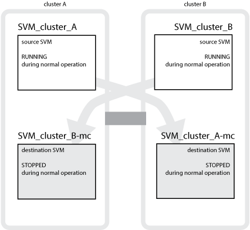

= Tout savoir sur la protection des données et la reprise après incident MetroCluster
:allow-uri-read: 
:icons: font
:imagesdir: ../media/

[role="lead"]
MetroCluster vous aide à mieux comprendre comment protéger les données et garantit une restauration transparente en cas de défaillance, afin que vous puissiez gérer facilement et efficacement vos activités de basculement et de rétablissement.

MetroCluster utilise la mise en miroir pour protéger les données d'un cluster. Il assure la reprise après incident via une seule commande MetroCluster, qui active un serveur secondaire sur le site survivant et sert les données en miroir qui appartiennent à l'origine à un site primaire affecté par un incident.

== Comment les configurations MetroCluster à 8 et 4 nœuds permettent le basculement et le basculement local

Les configurations MetroCluster à 8 et 4 nœuds protègent les données au niveau local et du cluster. Si vous configurez une configuration MetroCluster, vous devez savoir comment les configurations MetroCluster protègent vos données.

Les configurations MetroCluster protègent les données à l'aide de deux clusters en miroir séparés physiquement. Chaque cluster met en miroir de manière synchrone la configuration des machines virtuelles de stockage et de données de l'autre. Lorsqu'un incident se produit sur un site, un administrateur peut activer la SVM en miroir et commencer à transmettre les données en miroir depuis le site survivant. En outre, les nœuds de chaque cluster sont configurés en tant que paire haute disponibilité, offrant un niveau de basculement local.

=== Fonctionnement de la protection des données locales haute disponibilité dans une configuration MetroCluster

Il faut comprendre le fonctionnement des paires haute disponibilité dans la configuration MetroCluster.

Les deux clusters du réseau peering fournissent la reprise après incident bidirectionnelle, où chaque cluster peut être la source et la sauvegarde de l'autre cluster. Chaque cluster inclut deux nœuds, qui sont configurés en tant que paire haute disponibilité. En cas de défaillance ou de maintenance requise au sein de la configuration d'un nœud unique, le basculement du stockage peut transférer les opérations de ce nœud vers son partenaire haute disponibilité local.

L'illustration suivante présente une configuration MetroCluster FC. La fonctionnalité de haute disponibilité est identique dans les configurations IP d'MetroCluster, sauf que l'interconnexion haute disponibilité est assurée par les commutateurs du cluster.

image::../media/mcc_hw_architecture_local_ha.gif[architecture matérielle mcc haute disponibilité locale]

.Informations associées
https://docs.netapp.com/ontap-9/topic/com.netapp.doc.dot-cm-hacg/home.html["Configuration haute disponibilité"^]

== Réplication des données et des configurations MetroCluster

Les configurations MetroCluster utilisent plusieurs fonctionnalités ONTAP pour assurer une réplication synchrone des données et une configuration entre les deux sites MetroCluster.

=== Configurez la protection avec le service de réplication de configuration

Le service de réplication de configuration de ONTAP protège la configuration de MetroCluster en répliquant automatiquement les informations sur le partenaire de reprise après incident.

Le CRS réplique de manière synchrone la configuration du nœud local au partenaire DR dans le cluster partenaire. Cette réplication est effectuée sur le réseau de peering de cluster.

Les informations répliquées incluent la configuration du cluster et la configuration des SVM.

=== Réplication des SVM au cours des opérations MetroCluster

Le service de réplication de configuration (CRS) de ONTAP permet la configuration redondante des serveurs de données et la mise en miroir des volumes de données appartenant à la SVM. En cas de basculement, le SVM source est désactivé et le SVM de destination, situé sur le cluster survivant, devient actif.

NOTE: Les SVM de destination dans la configuration MetroCluster ont le suffixe «`-mc » automatiquement ajouté à leur nom pour aider à les identifier. Une configuration MetroCluster ajoute le suffixe «`-mc » au nom des SVM de destination, si le nom du SVM contient une période, le suffixe «`-mc » est appliqué avant la première période. Par exemple, si le nom d'un SVM est SVM.DNS.NAME, le suffixe «`-mc` » est ajouté en tant que SVM-MC.DNS.NAME.

L'exemple suivant montre les SVM pour une configuration MetroCluster, où « `SVM_cluster_A` » est un SVM sur le site source et « `SVM_cluster_A-mcs' » est un agrégat de destination synchrone sur le site de reprise d'activité.

* SVM_cluster_A transmet des données sur le cluster A.
+
Il s'agit d'un SVM source synchrone représentant la configuration du SVM (LIFs, protocoles et services) et les données dans des volumes appartenant au SVM. La configuration et les données sont répliquées vers SVM_cluster_A-mc, un SVM de destination synchrone situé sur le cluster B.

* SVM_cluster_B transmet les données au cluster B.
+
Il s'agit d'un SVM source synchrone, qui représente la configuration et les données au SVM_cluster_B-mc situé sur le cluster A.

* SVM_cluster_B-mc est un SVM de destination synchrone arrêté en fonctionnement normal et sain de la configuration de MetroCluster.
+
Dans le cas d'un basculement réussi du cluster B vers le cluster A, SVM_cluster_B est arrêté et SVM_cluster_B-mc est activé et commence à transmettre les données du cluster A.

* SVM_cluster_A-mc est un SVM de destination synchrone arrêté en fonctionnement normal et sain de la configuration de MetroCluster.
+
Dans le cas d'un basculement réussi du cluster A vers le cluster B, SVM_cluster_A est arrêté et SVM_cluster_A-mc est activé et commence à transmettre les données du cluster B.

En cas de basculement, le plex distant sur le cluster survivant est mis en ligne et le SVM secondaire commence à transmettre les données.

image::../media/mcc_svms_after_switchover.gif[mcc svm après le basculement]

La disponibilité des plexes distants après basculement dépend du type de configuration MetroCluster :

* Pour les configurations FC MetroCluster, après le basculement, les plexes locaux et distants restent en ligne si le stockage sur le site d'incident est accessible via les liens ISL.
+
Si les liens ISL sont défaillants et que le stockage sur le site de reprise d'activité n'est pas disponible, la SVM destination de la synchronisation commence à transmettre les données du site survivant.

* Pour les configurations IP MetroCluster, la disponibilité des plexes distants dépend de la version de ONTAP :
+
** Depuis ONTAP 9.5, les plexes locaux et distants restent en ligne si les nœuds du site de secours restent démarrés.
** Avant ONTAP 9.5, le stockage n'est disponible que sur le plex local sur le site survivant.
+
Le SVM de destination synchrone commence à transmettre les données depuis le site survivant.

.Informations associées
https://docs.netapp.com/ontap-9/topic/com.netapp.doc.dot-cm-sag/home.html["Administration du système"^]

=== Comment les configurations MetroCluster assurent la redondance des données grâce à SyncMirror

Les agrégats en miroir utilisant la fonctionnalité SyncMirror assurent la redondance des données et contiennent les volumes détenus par le SVM (Storage Virtual machine) source et de destination. Les données sont répliquées dans des pools de disques sur le cluster partenaire. Les agrégats non mis en miroir sont également pris en charge.

Le tableau ci-dessous montre l'état (en ligne ou hors ligne) d'un agrégat non mis en miroir après un basculement :

|===

| Type de basculement | État 

 a| 
Basculement négocié (NSO)
 a| 
En ligne

 a| 
Basculement automatique non planifié (AUSO)
 a| 
En ligne

 a| 
Basculement non planifié (USO)
 a| 
* Si le stockage n'est pas disponible : hors ligne
* Si le stockage est disponible : en ligne

|===

NOTE: Après un basculement, si l'agrégat sans miroir est au niveau du nœud partenaire de reprise après incident et qu'une panne de lien ISL (Inter-switch Link) se produit, ce nœud local risque d'échouer.

L'illustration suivante montre comment les pools de disques sont mis en miroir entre les clusters partenaires. Les données des plexes locaux (dans les domaines distants (dans la pool0) sont répliquées vers des plexes distants (dans la pool1).

IMPORTANT: Si des agrégats hybrides sont utilisés, une dégradation des performances peut se produire après une défaillance SyncMirror plex en raison du remplissage de la couche SSD.

image::../media/mcc_mirroring_of_pools.gif[duplication des pools mcc]

=== Fonctionnement de la mise en miroir de cache NVRAM ou NVMEM et de la mise en miroir dynamique dans les configurations MetroCluster

La mémoire non volatile (NVRAM ou NVMEM, selon le modèle de plateforme) des contrôleurs de stockage est mise en miroir localement vers un partenaire de haute disponibilité locale, et à distance vers un partenaire de reprise sur incident à distance sur le site du partenaire. En cas de basculement ou de basculement local, cette configuration permet de préserver les données du cache non volatile.

Dans une paire haute disponibilité qui ne fait pas partie d'une configuration MetroCluster, chaque contrôleur de stockage conserve deux partitions de cache non volatile : une pour elle-même et une pour son partenaire haute disponibilité.

Dans une configuration MetroCluster à quatre nœuds, le cache non volatile de chaque contrôleur de stockage est divisé en quatre partitions. Dans une configuration MetroCluster à deux nœuds, la partition partenaire haute disponibilité et la partition auxiliaire DR ne sont pas utilisées, car les contrôleurs de stockage ne sont pas configurés en tant que paire haute disponibilité.

|===

2+| Caches non volatiles pour un contrôleur de stockage 

| Dans une configuration MetroCluster | Dans une paire HA non MetroCluster 

 a| 
image:../media/mcc_nvram_quartering.gif[""]
 a| 
image:../media/mcc_nvram_split_in_non_mcc_ha_pair.gif[""]

|===
Les caches non volatiles stockent le contenu suivant :

* La partition locale contient les données que le contrôleur de stockage n'a pas encore écrites sur le disque.
* La partition partenaire haute disponibilité contient une copie du cache local du partenaire haute disponibilité du contrôleur de stockage.
+
Dans une configuration MetroCluster à deux nœuds, il n'existe pas de partition partenaire haute disponibilité car les contrôleurs de stockage ne sont pas configurés comme une paire haute disponibilité.

* La partition partenaire DR contient une copie du cache local du partenaire DR du contrôleur de stockage.
+
Le partenaire DR est un nœud du cluster partenaire qui est associé au nœud local.

* La partition du partenaire auxiliaire DR contient une copie du cache local du partenaire auxiliaire DR du contrôleur de stockage.
+
Le partenaire auxiliaire de DR est le partenaire de haute disponibilité du nœud local DR. Ce cache est nécessaire en cas de basculement haute disponibilité (lorsque la configuration fonctionne normalement ou après un basculement MetroCluster).

+
Dans une configuration MetroCluster à deux nœuds, il n'existe pas de partition partenaire auxiliaire de reprise après incident, car les contrôleurs de stockage ne sont pas configurés comme une paire haute disponibilité.

Par exemple, le cache local d'un nœud (node_A_1) est mis en miroir localement et à distance au niveau des sites MetroCluster. L'illustration suivante montre que le cache local du nœud_A_1 est mis en miroir sur le partenaire HA (nœud_A_2) et sur le partenaire DR (nœud_B_1) :

image::../media/mcc_nvram_mirroring_example.gif[exemple de mise en miroir nvram mcc]

==== Mise en miroir dynamique en cas de basculement haute disponibilité locale

En cas de basculement haute disponibilité locale dans une configuration MetroCluster à quatre nœuds, le nœud pris en charge ne peut plus servir de miroir pour son partenaire de reprise après incident. Pour permettre la mise en miroir de reprise après incident, la mise en miroir passe automatiquement sur le partenaire auxiliaire de reprise après incident. Une fois le retour réussi, la mise en miroir est automatiquement renvoyée au partenaire de reprise sur incident.

Par exemple, le noeud_B_1 échoue et est repris par le noeud_B_2. Le cache local du noeud_A_1 ne peut plus être mis en miroir sur le noeud_B_1. La mise en miroir passe au partenaire auxiliaire DR, nœud_B_2.

image::../media/mcc_nvram_mirroring_example_dynamic_dr_aux.gif[exemple de mise en miroir nvram mcc exemple de reprise après incident dynamique aux]

== Types d'incidents et de méthodes de reprise

Vous devez être familiarisé avec différents types de défaillances et d'incidents afin de pouvoir utiliser la configuration MetroCluster pour réagir de manière appropriée.

* Panne d'un seul nœud
+
Panne d'un seul composant de la paire haute disponibilité locale.

+
Dans une configuration MetroCluster à quatre nœuds, cette défaillance peut entraîner un basculement automatique ou négocié du nœud, selon le composant défaillant. La récupération de données est décrite dans le _High Availability Configuration Guide_.

+
Dans une configuration MetroCluster à deux nœuds, cette défaillance entraîne un basculement automatique non planifié.

* Les défaillances du contrôleur au niveau du site
+
Tous les modules de contrôleur tombent en panne sur un site en raison d'une panne d'alimentation, d'un remplacement d'équipement ou d'un incident. En général, les configurations MetroCluster ne permettent pas de différencier les défaillances et les incidents. Toutefois, certains logiciels, comme le logiciel MetroCluster Tiebreaker, peuvent faire la différence. Une défaillance de contrôleur à l'échelle du site peut entraîner un basculement automatique si les liaisons et les commutateurs ISL (Inter-Switch Link) sont défaillants et que le stockage est accessible.

+
Le _High-Availability Configuration Guide_ contient plus d'informations sur la procédure de restauration suite à des défaillances de contrôleur au niveau du site qui n'incluent pas les défaillances de contrôleur, ainsi que les défaillances incluant un ou plusieurs contrôleurs.

* Défaillance de lien ISL
+
Les liens entre les sites échouent. La configuration MetroCluster ne prend aucune action. Chaque nœud continue de diffuser les données normalement, mais les miroirs ne sont pas écrits sur les sites de reprise sur incident respectifs, car leur accès est perdu.

* Défaillances séquentielles multiples
+
Plusieurs composants échouent dans une séquence. Par exemple, un module de contrôleur, une structure de commutateur et un tiroir tombent en panne en séquence. Résultat : un basculement du stockage, une redondance de la structure et des SyncMirror protègent de façon séquentielle contre les temps d'indisponibilité et les pertes de données.

Le tableau ci-dessous présente les types de défaillance, ainsi que le mécanisme de reprise d'activité et la méthode de restauration correspondants :

NOTE: L'option AUSO (basculement automatique non planifié) n'est pas prise en charge sur les configurations IP MetroCluster.

|===

.2+| Type de panne 2+| Mécanisme de reprise après incident 2+| Résumé de la méthode de récupération 

| Configuration à quatre nœuds | Configuration à deux nœuds | Configuration à quatre nœuds | Configuration à deux nœuds 

| Panne d'un seul nœud | Basculement de haute disponibilité locale | AUSO | Non requis si le basculement et le rétablissement automatiques sont activés. | Une fois le nœud restauré, utilisez la fonctionnalité de rétablissement manuel et de rétablissement `metrocluster heal -phase aggregates`, `metrocluster heal -phase root-aggregates`, et `metrocluster switchback` des commandes sont requises. REMARQUE : le `metrocluster heal` Les commandes ne sont pas nécessaires sur les configurations IP de MetroCluster exécutant ONTAP 9.5 ou version ultérieure. 

| Panne du site 2+| Le basculement entre les MetroCluster 2.3+| Une fois le nœud restauré, utilisez la fonctionnalité de rétablissement manuel et de rétablissement `metrocluster healing` et `metrocluster switchback` des commandes sont requises. Le `metrocluster heal` Les commandes ne sont pas nécessaires sur les configurations IP de MetroCluster exécutant ONTAP 9.5. 

| Les défaillances du contrôleur au niveau du site | AUSO uniquement si le stockage sur le site de secours est accessible. | AUSO (identique à la défaillance d'un seul nœud) 

| Défaillances séquentielles multiples | Basculement haute disponibilité local, suivi du basculement forcé par MetroCluster à l'aide de la commande MetroCluster Failover -force-On-Disaster. REMARQUE : selon le composant défectueux, un basculement forcé peut ne pas être nécessaire. | MetroCluster bascule forcée avec le `metrocluster switchover -forced-on-disaster` commande. 

| Défaillance de lien ISL 2+| L'absence de basculement MetroCluster ; les deux clusters sont indépendants 2+| Non requis pour ce type de défaillance. Après avoir restauré la connectivité, le système de stockage s'resynchronise automatiquement. 
|===

== Continuité de l'activité grâce à une configuration MetroCluster à huit ou quatre nœuds

Dans le cas d'un problème limité à un seul nœud, un basculement et un retour au sein de la paire haute disponibilité locale assurent un fonctionnement sans interruption. Dans ce cas, la configuration MetroCluster ne nécessite pas de basculement vers le site distant.

La configuration MetroCluster à huit ou quatre nœuds étant constituée d'une ou plusieurs paires HA sur chaque site, chaque site peut résister aux défaillances locales et assurer une continuité d'activité sans basculement vers le site partenaire. Le fonctionnement de la paire haute disponibilité est le même que celui des paires haute disponibilité dans les configurations non-MetroCluster.

Dans le cas de configurations MetroCluster à quatre et huit nœuds, les défaillances de nœuds dues à des risques de défaillance d'alimentation ou de panique peuvent provoquer un basculement automatique.

http://docs.netapp.com/ontap-9/topic/com.netapp.doc.dot-cm-hacg/home.html["Configuration haute disponibilité"^]

En cas de seconde défaillance après un basculement local, l'événement MetroCluster Failover assure la continuité de l'activité. De même, après une opération de basculement, en cas de seconde panne sur l'un des nœuds survivants, un événement de basculement local assure une continuité de l'activité. Dans ce cas, le nœud survivant transmet des données aux trois autres nœuds du groupe de reprise après incident.

=== Basculement et rétablissement lors de la transition MetroCluster

La transition FC-à-IP de MetroCluster implique l'ajout de nœuds IP MetroCluster et de commutateurs IP à une configuration FC MetroCluster existante, puis le retrait des nœuds FC MetroCluster. En fonction du stade du processus de transition, les opérations de basculement, de rétablissement et de rétablissement de MetroCluster utilisent des flux de travail différents.

Voir http://docs.netapp.com/ontap-9/topic/com.netapp.doc.dot-mcc-upgrade/GUID-1870FDC4-1774-4604-86A7-5C979C297ADA.html["Opérations de basculement, de rétablissement et de rétablissement lors de la transition"^].

=== Conséquences du basculement local après le basculement

En cas de basculement MetroCluster et lorsqu'un problème survient sur un site survivant, un basculement local assure une continuité de l'activité continue. Toutefois, le système est exposé à un risque, car il ne se trouve plus dans une configuration redondante.

En cas de basculement local après un basculement, un contrôleur unique transmet les données à tous les systèmes de stockage de la configuration MetroCluster, ce qui entraîne des problèmes de ressources et est vulnérable à d'autres défaillances.

== Comment une configuration MetroCluster à deux nœuds assure la continuité de l'activité

Si le problème rencontré par l'un des deux sites est très critique, le basculement MetroCluster assure une continuité de l'activité. Si les pannes d'alimentation affectent à la fois le nœud et le stockage, le basculement n'est pas automatique et une perturbation s'effectue jusqu'à ce que le `metrocluster switchover` la commande est émise.

Comme tout le stockage est en miroir, il est possible d'utiliser une opération de basculement pour assurer la résilience sans interruption en cas de défaillance de site semblable à celle d'un basculement de stockage dans une paire haute disponibilité en cas de défaillance de nœud.

Dans le cas de configurations à deux nœuds, les mêmes événements qui déclenchent un basculement automatique du stockage dans une paire haute disponibilité déclenchent un basculement automatique non planifié (AUSO). Cela signifie qu'une configuration MetroCluster à deux nœuds offre le même niveau de protection qu'une paire haute disponibilité.

.Informations associées
link:concept_understanding_mcc_data_protection_and_disaster_recovery.html["Basculement non planifié automatique dans les configurations MetroCluster FC"]

== Présentation du processus de basculement

Le basculement MetroCluster assure une reprise immédiate des services à la suite d'un incident en déplaçant l'accès du client et du stockage depuis le cluster source vers le site distant. Vous devez connaître les changements à attendre et les actions à effectuer en cas de basculement.

Lors d'une opération de basculement, le système prend les mesures suivantes :

* Les disques qui appartiennent au site d'incident sont remplacés par le partenaire de reprise après incident.
+
Cela est similaire au cas d'un basculement local dans une paire haute disponibilité (HA), dans laquelle l'appartenance des disques du partenaire qui est arrêté est remplacé par le partenaire en bonne santé.

* Les plexes qui se trouvent sur le site survivant grâce aux nœuds du cluster de reprise après incident sont mis en ligne sur le cluster, sur le site survivant.
* Le serveur SVM (Storage Virtual machine) à source synchrone appartenant au site de reprise d'activité est arrêté uniquement lors d'un basculement négocié.
+

NOTE: Ceci n'est applicable qu'à un basculement négocié.

* Le SVM de destination synchrone appartenant au site d'incident est UP.

Lors du basculement, les agrégats racine du partenaire de reprise après incident ne sont pas mis en ligne.

Le `metrocluster switchover` La commande bascule les nœuds dans tous les groupes DR dans la configuration MetroCluster. Par exemple, dans une configuration MetroCluster à 8 nœuds, il bascule les nœuds sur les deux groupes de reprise après incident.

Si vous passez uniquement sur le site distant, vous devez effectuer un basculement négocié sans esquiver le site. Si le stockage ou l'équipement ne sont pas fiables, vous devriez périmètre le site de la reprise après incident et effectuer un basculement non planifié. Le recel empêche les reconstructions RAID lorsque les disques sont remis sous tension de manière échelonnée.

NOTE: Cette procédure ne doit être utilisée que si l'autre site est stable et ne doit pas être mis hors ligne.

=== Disponibilité des commandes lors du basculement

Le tableau suivant indique la disponibilité des commandes lors du basculement :

|===

| Commande | Disponibilité 

 a| 
`storage aggregate create`
 a| 
Vous pouvez créer un agrégat :

* S'il est possédé par un nœud faisant partie du cluster survivant

Vous ne pouvez pas créer un agrégat :

* D'un nœud sur le site de reprise sur incident
* Pour un nœud qui fait partie du cluster survivant

 a| 
`storage aggregate delete`
 a| 
Vous pouvez supprimer un agrégat de données.

 a| 
`storage aggregate mirror`
 a| 
Vous pouvez créer un plex pour un agrégat non mis en miroir.

 a| 
`storage aggregate plex delete`
 a| 
Vous pouvez supprimer un plex pour un agrégat en miroir.

 a| 
`vserver create`
 a| 
Vous pouvez créer un SVM :

* Si son volume root réside dans un agrégat de données détenu par le cluster survivant

On ne peut pas créer un SVM :

* Si son volume racine réside dans un agrégat de données détenu par le cluster site de reprise sur incident

 a| 
`vserver delete`
 a| 
Vous pouvez supprimer des SVM source et destination synchrone.

 a| 
`network interface create -lif`
 a| 
Vous pouvez créer une LIF de SVM de données pour les SVM source et synchrone.

 a| 
`network interface delete -lif`
 a| 
Vous pouvez supprimer une LIF de SVM de données pour les SVM source et synchrone.

 a| 
`volume create`
 a| 
Vous pouvez créer un volume pour les SVM source et de destination synchrone.

* Dans le cas d'un SVM source synchrone, le volume doit résider dans un agrégat de données détenu par le cluster survivant
* Dans le cas d'un SVM de destination synchrone, le volume doit résider dans un agrégat de données détenu par le cluster du site de reprise après incident

 a| 
`volume delete`
 a| 
Vous pouvez supprimer un volume pour les SVM source et de destination synchrone.

 a| 
`volume move`
 a| 
Vous pouvez déplacer un volume pour les SVM source et de destination synchrone.

* Dans le cas d'un SVM source synchrone, le cluster survivant doit posséder l'agrégat de destination
* Pour un SVM de destination synchrone, le cluster du site de reprise doit être propriétaire de l'agrégat de destination

 a| 
`snapmirror break`
 a| 
Il est possible d'interrompre une relation SnapMirror entre un terminal source et de destination d'un miroir de protection des données.

|===

=== Différences de basculement entre les configurations FC et IP de MetroCluster

Dans les configurations IP MetroCluster, les disques distants étant accessibles via les nœuds partenaires DR distants qui agissent comme des cibles iSCSI, les disques distants ne sont pas accessibles en cas de panne des nœuds distants. Cette situation se traduit par des différences avec les configurations MetroCluster FC :

* Les agrégats en miroir qui appartiennent au cluster local sont dégradés.
* Les agrégats en miroir qui ont été basculés à partir du cluster distant sont devenus dégradés.

NOTE: Lorsque des agrégats non mis en miroir sont pris en charge sur une configuration MetroCluster IP, les agrégats non mis en miroir qui ne sont pas commutés à partir du cluster distant ne sont pas accessibles.

=== Modification de la propriété des disques lors du basculement haute disponibilité et du basculement du MetroCluster dans une configuration MetroCluster à quatre nœuds

La propriété des disques évolue temporairement automatiquement lors des opérations de haute disponibilité et de MetroCluster. Il est utile de savoir comment le système suit quel nœud possède quels disques.

Dans ONTAP, l'ID système unique d'un module de contrôleur (obtenu à partir de la carte NVRAM ou de la carte NVMEM d'un nœud) est utilisé pour identifier le nœud qui possède un disque spécifique. Selon l'état de haute disponibilité ou de reprise après incident du système, la propriété du disque peut changer temporairement. En cas de modification de la propriété en raison d'un basculement haute disponibilité ou d'un basculement de reprise après incident, le système enregistre quel nœud est le propriétaire initial du disque, de sorte que celui-ci puisse revenir en arrière-plan après un rétablissement de la haute disponibilité ou un rétablissement de la reprise après incident. Le système utilise les champs suivants pour suivre la propriété du disque :

* Propriétaire
* Propriétaire de la maison
* Propriétaire de la maison DR

En configuration MetroCluster, en cas de basculement, un nœud peut être propriétaire d'un agrégat initialement détenu par les nœuds du cluster partenaire. Ces agrégats sont appelés agrégats à l'étranger cluster. La caractéristique distinctive d'un agrégat étranger du cluster est qu'il s'agit d'un agrégat qui ne est pas actuellement connu du cluster. Le champ propriétaire de reprise après incident permet de montrer qu'il est détenu par un nœud du cluster partenaire. Un agrégat étranger traditionnel au sein d'une paire HA est identifié par les valeurs propriétaire et propriétaire d'origine étant différentes, mais les valeurs propriétaire et propriétaire d'origine sont les mêmes pour un agrégat étranger par cluster ; vous pouvez ainsi identifier un agrégat étranger par cluster en fonction de la valeur propriétaire DR Home.

Au fur et à mesure que l'état du système change, les valeurs des champs changent, comme indiqué dans le tableau suivant :

|===

.2+| Champ 4+| Valeur pendant... 

| Fonctionnement normal | Basculement en haute disponibilité locale | Le basculement entre les MetroCluster | Basculement lors du basculement 

 a| 
Propriétaire
 a| 
ID du nœud qui a accès au disque.
 a| 
ID du partenaire haute disponibilité, qui a temporairement accès au disque.
 a| 
ID du partenaire de reprise sur incident, qui a temporairement accès au disque.
 a| 
ID du partenaire auxiliaire DR, qui a temporairement accès au disque.

 a| 
Propriétaire de la maison
 a| 
ID du propriétaire d'origine du disque dans la paire haute disponibilité.
 a| 
ID du propriétaire d'origine du disque dans la paire haute disponibilité.
 a| 
ID du partenaire DR, propriétaire du domicile dans la paire HA pendant le basculement.
 a| 
ID du partenaire DR, propriétaire du domicile dans la paire HA pendant le basculement.

 a| 
Propriétaire de la maison DR
 a| 
Vide
 a| 
Vide
 a| 
ID du propriétaire d'origine du disque dans la configuration MetroCluster.
 a| 
ID du propriétaire d'origine du disque dans la configuration MetroCluster.

|===
L'illustration et le tableau suivants fournissent un exemple de modification de la propriété pour un disque du pool de disques du nœud_A_1, situé physiquement dans cluster_B.

image::../media/mcc_disk_ownership.gif[propriété du disque mcc]

|===

| État du disque MetroCluster | Propriétaire | Propriétaire de la maison | Propriétaire de la maison DR | Remarques 

 a| 
Fonctionnement normal avec tous les nœuds.
 a| 
Nœud_A_1
 a| 
Nœud_A_1
 a| 
sans objet
 a| 

 a| 
Basculement haute disponibilité locale, nœud_A_2 a repris le contrôle des disques appartenant à son partenaire HA node_A_1.
 a| 
Nœud_A_2
 a| 
Nœud_A_1
 a| 
sans objet
 a| 

 a| 
Le basculement DR, node_B_1 a pris le plus de disques appartiennent à son partenaire DR, node_A_1.
 a| 
Nœud_B_1
 a| 
Nœud_B_1
 a| 
Nœud_A_1
 a| 
L'ID du nœud de départ est déplacé dans le champ propriétaire de l'origine DR. Une fois le rétablissement ou l'autorétablissement de l'agrégat, la propriété est remise au nœud_A_1.

 a| 
En cas de basculement pour reprise après incident et de basculement haute disponibilité locale (double défaillance), le nœud_B_2 a récupéré les disques appartenant à son nœud HA_B_1.
 a| 
Nœud_B_2
 a| 
Nœud_B_1
 a| 
Nœud_A_1
 a| 
Après le retour, la propriété revient au nœud_B_1. Après rétablissement ou rétablissement, la propriété revient au nœud_A_1.

 a| 
Après le rétablissement haute disponibilité et le rétablissement de la reprise après incident, tous les nœuds sont pleinement opérationnels.
 a| 
Nœud_A_1
 a| 
Nœud_A_1
 a| 
sans objet
 a| 

|===

=== Considérations relatives à l'utilisation d'agrégats non mis en miroir

Si votre configuration inclut des agrégats sans mise en miroir, vous devez connaître les problèmes d'accès potentiels après les opérations de basculement.

==== Considérations relatives aux agrégats non mis en miroir lors de tâches de maintenance nécessitant l'arrêt d'alimentation

Si vous effectuez un basculement négocié pour des raisons de maintenance requérant une coupure d'alimentation à l'échelle du site, vous devez d'abord mettre manuellement hors ligne tous les agrégats non mis en miroir détenus par le site de secours.

Si vous ne le faites pas, les nœuds du site survivant peuvent tomber en panne en raison de incohérences des disques. Cela peut se produire si les agrégats sans mise en miroir sont mis hors ligne ou manquants en raison de la perte de connectivité au stockage sur le site en cas de panne de courant ou de perte de liens ISL.

==== Considérations relatives aux agrégats non mis en miroir et aux espaces de noms hiérarchiques

Si vous utilisez des espaces de noms hiérarchiques, vous devez configurer le chemin de jonction de sorte que tous les volumes de ce chemin soient sur des agrégats en miroir uniquement ou sur des agrégats non mis en miroir uniquement. La configuration d'agrégats non mis en miroir et en miroir dans le chemin de jonction peut empêcher l'accès aux agrégats non mis en miroir après le basculement.

==== Considérations relatives aux agrégats non mis en miroir et aux volumes de métadonnées CRS et aux volumes racines des SVM de données

Le volume des métadonnées du service de réplication de la configuration (CRS) et les volumes root du SVM de données doivent se trouver sur un agrégat en miroir. Vous ne pouvez pas déplacer ces volumes vers des agrégats non mis en miroir. S'ils sont sur des agrégats sans miroir, les opérations négociées de basculement et de rétablissement sont vetotées. Le `metrocluster check` la commande fournit un avertissement si c'est le cas.

==== Considérations relatives aux SVM et aux agrégats sans miroir

Les SVM doivent être configurés sur des agrégats en miroir uniquement ou sur des agrégats sans miroir uniquement. La configuration d'une combinaison d'agrégats non mis en miroir et en miroir peut entraîner un basculement supérieur à 120 secondes et entraîner une panne des données en cas d'indisponibilité des agrégats non mis en miroir.

==== Considérations relatives aux agrégats sans miroir et à SAN

Une LUN ne doit pas être située sur un agrégat sans miroir. La configuration d'une LUN sur un agrégat non mis en miroir peut entraîner un basculement supérieur à 120 secondes et une panne de données.

=== Basculement non planifié automatique dans les configurations MetroCluster FC

Dans les configurations FC MetroCluster, certains scénarios peuvent déclencher un basculement automatique non planifié dans le cas d'une défaillance de contrôleur au niveau du site. La fonction AUSO peut être désactivée si vous le souhaitez.

NOTE: Le basculement automatique non planifié n'est pas pris en charge dans les configurations IP MetroCluster.

Dans une configuration MetroCluster FC, un AUSO peut être déclenché si tous les nœuds d'un site sont défaillants pour les raisons suivantes :

* Hors tension
* Perte de puissance
* Panique

NOTE: Dans une configuration FC MetroCluster à 8 nœuds, vous pouvez définir une option de déclenchement d'une AUSO en cas de défaillance des deux nœuds d'une paire haute disponibilité.

Puisqu'il n'existe pas de basculement haute disponibilité local dans une configuration MetroCluster à deux nœuds, le système effectue une opération AUSO afin de poursuivre l'opération après une panne de contrôleur. Cette fonctionnalité est similaire à la fonctionnalité de basculement haute disponibilité dans une paire haute disponibilité. Dans une configuration MetroCluster à deux nœuds, un AUSO peut être déclenché dans les scénarios suivants :

* Le nœud est hors tension
* Perte d'alimentation du nœud
* Problème au niveau des nœuds
* Redémarrage de nœud

En cas de problème avec un AUSO, la propriété des disques du nœud pour facultés affaiblies par la pool0 et la pool1 est remplacée par un partenaire de reprise après incident. Ce changement de propriété empêche les agrégats de passer en état dégradé après le basculement.

Après le basculement automatique, vous devez effectuer manuellement les opérations de rétablissement et de rétablissement afin de rétablir le fonctionnement normal du contrôleur.

==== AUSO assistée par matériel dans des configurations MetroCluster à deux nœuds

Dans une configuration MetroCluster à deux nœuds, le processeur de service du module de contrôleur surveille la configuration. Dans certains cas, le processeur de service peut détecter une défaillance plus rapidement que le logiciel ONTAP. Dans ce cas, le SP déclenche AUSO. Cette fonctionnalité est automatiquement activée.

Le processeur de service envoie et reçoit le trafic SNMP vers et depuis son partenaire de reprise après incident afin de contrôler son état de santé.

==== Modification du paramètre AUSO dans les configurations MetroCluster FC

AUSO est défini par défaut sur « auso-on-cluster-Disaster ». Son état peut être affiché dans la commande MetroCluster show.

NOTE: Le paramètre AUSO ne s'applique pas aux configurations IP MetroCluster.

Vous pouvez désactiver l'AUSO à l'aide du `metrocluster modify -auto-switchover-failure-domain auto-disabled` commande. Cette commande empêche le déclenchement d'AUSO en cas de panne du contrôleur au niveau du site de reprise après incident. Il doit être exécuté sur les deux sites si vous souhaitez désactiver AUSO sur les deux sites.

AUSO peut être réactivé à l'aide du `metrocluster modify -auto-switchover-failure-domain auso-on-cluster-disaster` commande.

AUSO peut également être défini sur « auso-on-dr-group-Disaster ». Cette commande de niveau avancé déclenche un AUSO lors du basculement haute disponibilité sur un site unique. Il doit être exécuté sur les deux sites avec `metrocluster modify -auto-switchover-failure-domain auso-on-dr-group-disaster` commande.

==== Le paramètre AUSO pendant le basculement

En cas de basculement, le paramètre AUSO est désactivé en interne car si un site est en basculement, il ne peut pas basculer automatiquement.

==== Récupération depuis AUSO

Pour effectuer une restauration à partir d'un AUSO, effectuez les mêmes opérations que pour un basculement planifié.

link:task_perform_switchover_for_tests_or_maintenance.html["Effectuer un basculement pour les tests ou la maintenance"]

=== Basculement automatique non planifié assisté par médiateur dans les configurations IP MetroCluster

Dans les configurations IP MetroCluster, le système peut utiliser le médiateur ONTAP pour détecter des défaillances et effectuer un basculement automatique non planifié assisté par un médiateur (MAUSO).

NOTE: La fonction MAUSO n'est pas prise en charge dans les configurations FC MetroCluster.

Le médiateur ONTAP fournit des LUN de boîtes aux lettres pour les nœuds IP MetroCluster. Ces LUN sont co-localisés avec le médiateur ONTAP, qui s'exécute sur un hôte Linux physiquement séparé des sites MetroCluster.

Les nœuds MetroCluster utilisent les informations de la boîte aux lettres pour déterminer si un module MAUSO est nécessaire. La fonction MAUSO n'est pas lancée si la mémoire non volatile (NVRAM ou NVMEM, selon le modèle de plateforme) des contrôleurs de stockage n'est pas mise en miroir sur le partenaire de reprise après incident à distance sur le site partenaire

== Que se passe-t-il lors de la correction (configurations MetroCluster FC)

Lors de la réparation dans les configurations FC MetroCluster, la resynchronisation des agrégats en miroir consiste à réaliser une étape qui prépare les nœuds sur le site réparé pour assurer le rétablissement. Cet événement est planifié et vous offre ainsi un contrôle total sur chaque étape afin de réduire les temps d'arrêt. La fonctionnalité de correction est un processus en deux étapes survenant sur les composants de stockage et de contrôleur.

=== Réparation d'agrégats de données

Une fois le problème résolu sur le site d'incident, vous démarrez la phase de résolution du stockage :

. Vérifie que tous les nœuds sont opérationnels sur le site survivant.
. Change la propriété de tous les disques du pool 0 sur le site de secours, y compris les agrégats racine.

Au cours de cette phase de réparation, le sous-système RAID resynchronise les agrégats en miroir et le sous-système WAFL relit les fichiers nvsave des agrégats en miroir qui possédaient un pool 1 plex défaillant au moment du basculement.

Si certains composants de stockage source ont échoué, la commande signale les erreurs aux niveaux applicables : Storage, Sanown ou RAID.

Si aucune erreur n'est signalée, les agrégats sont resynchronisés. Ce processus peut parfois prendre des heures.

link:../manage/task_verifiy_that_your_system_is_ready_for_a_switchover.html["Corrigez la configuration"]

=== Autorétablissement d'agrégat racine

Une fois les agrégats synchronisés, vous démarrez la phase de résolution du contrôleur en rédonnant les agrégats CFO et les agrégats racine à leurs partenaires de reprise après incident respectifs.

link:../manage/task_verifiy_that_your_system_is_ready_for_a_switchover.html["Corrigez la configuration"]

== Que se passe-t-il lors de la correction (configurations MetroCluster IP)

Lors de la réparation dans les configurations IP MetroCluster, la resynchronisation des agrégats en miroir consiste à réaliser une étape qui prépare les nœuds sur le site réparé pour assurer le rétablissement. Cet événement est planifié et vous offre ainsi un contrôle total sur chaque étape afin de réduire les temps d'arrêt. La fonctionnalité de correction est un processus en deux étapes survenant sur les composants de stockage et de contrôleur.

=== Différences avec les configurations MetroCluster FC

Dans les configurations IP MetroCluster, vous devez démarrer les nœuds du cluster sur le site de reprise après incident avant l'opération de réparation.

Les nœuds du cluster du site de reprise doivent être en cours d'exécution afin que les disques iSCSI distants soient accessibles lorsque les agrégats sont resynchronisés.

Si les nœuds du site de reprise ne sont pas en cours d'exécution, l'opération de réparation échoue car le nœud de reprise ne peut pas effectuer les modifications de propriété du disque requises.

=== Réparation d'agrégats de données

Une fois le problème résolu sur le site d'incident, vous démarrez la phase de résolution du stockage :

. Vérifie que tous les nœuds sont opérationnels sur le site survivant.
. Change la propriété de tous les disques du pool 0 sur le site de secours, y compris les agrégats racine.

Au cours de cette phase de réparation, le sous-système RAID resynchronise les agrégats en miroir et le sous-système WAFL relit les fichiers nvsave des agrégats en miroir qui possédaient un pool 1 plex défaillant au moment du basculement.

Si certains composants de stockage source ont échoué, la commande signale les erreurs aux niveaux applicables : Storage, Sanown ou RAID.

Si aucune erreur n'est signalée, les agrégats sont resynchronisés. Ce processus peut parfois prendre des heures.

link:../manage/task_verifiy_that_your_system_is_ready_for_a_switchover.html["Corrigez la configuration"]

=== Autorétablissement d'agrégat racine

Une fois les agrégats synchronisés, la phase de réparation des agrégats racines s'effectue. Dans les configurations IP MetroCluster, cette phase confirme que les agrégats ont été guéris.

link:../manage/task_verifiy_that_your_system_is_ready_for_a_switchover.html["Corrigez la configuration"]

== Autorétablissement des agrégats sur les configurations IP MetroCluster après le basculement

Depuis ONTAP 9.5, la fonctionnalité de correction est automatisée lors des opérations de basculement négociées sur les configurations IP MetroCluster. Depuis ONTAP 9.6, la correction automatisée après le basculement non planifié est prise en charge. Cela supprime l'exigence d'émettre le `metrocluster heal` commandes.

=== Autorétablissement après basculement négocié (à partir de ONTAP 9.5)

Après avoir effectué un basculement négocié (une commande de basculement émise sans l'option « force-on-Disaster true »), la fonctionnalité d'autorétablissement simplifie la procédure à suivre pour rétablir le fonctionnement normal du système. Sur les systèmes avec correction automatique, les actions suivantes se produisent après le basculement :

* Les nœuds des sites de reprise d'activité restent actifs.
+
Ils sont en état de basculement, ce qui signifie qu'ils ne transmet pas les données depuis leur plex local en miroir.

* Les nœuds du site de secours sont déplacés vers l'état « attente de rétablissement ».
+
Vous pouvez vérifier l'état des nœuds du site de reprise sur incident à l'aide de la commande MetroCluster opération show.

* Vous pouvez exécuter l'opération de rétablissement sans avoir à émettre les commandes de correction.

Cette fonctionnalité s'applique aux configurations IP MetroCluster exécutant ONTAP 9.5 et versions ultérieures. Elle ne s'applique pas aux configurations FC de MetroCluster.

Les commandes de correction manuelle sont toujours nécessaires sur les configurations IP MetroCluster exécutant ONTAP 9.4 et versions antérieures.

image::../media/mcc_so_sb_with_autoheal.gif[mcc so sb avec auto-rétablissement]

=== Correction automatique après un basculement non programmé (à partir de ONTAP 9.6)

La correction automatique après un basculement non planifié est prise en charge sur les configurations IP MetroCluster à partir de ONTAP 9.6. Un basculement non planifié est un basculement dans lequel vous émettez le `switchover` commande avec `-forced-on-disaster true` option.

La correction automatique après un basculement non planifié n'est pas prise en charge dans les configurations FC MetroCluster et les commandes de correction manuelle sont toujours nécessaires après un basculement non planifié sur les configurations IP MetroCluster exécutant ONTAP 9.5 et versions antérieures.

Sur les systèmes exécutant ONTAP 9.6 et versions ultérieures, les événements suivants se produisent après le basculement non planifié :

* Selon l'étendue de l'incident, les nœuds du site de reprise d'activité peuvent être en panne.
+
Comme ils sont en état de basculement, ils ne transmet pas les données depuis leur plex local en miroir, même s'ils sont sous tension.

* Si les sites de secours étaient en panne, au démarrage, les nœuds du site de secours sont déplacés vers l'état « en attente de rétablissement ».
+
Si les sites de catastrophe sont restés en service, ils sont immédiatement transférés à l'état « en attente de rétablissement ».

* Les opérations de correction sont effectuées automatiquement.
+
Vous pouvez confirmer l'état des nœuds du site de secours et effectuer les opérations de correction correctement, en utilisant le `metrocluster operation show` commande.

image::../media/mcc_uso_with_autoheal.gif[mcc uso avec auto-rétablissement]

=== En cas d'échec de la correction automatique

Si l'opération de correction automatique échoue pour une raison quelconque, vous devez émettre le `metrocluster heal` Commandes manuelles comme effectuées dans les versions ONTAP antérieures à ONTAP 9.6. Vous pouvez utiliser le `metrocluster operation show` et `metrocluster operation history show -instance` commandes permettant de contrôler l'état de la correction et de déterminer la cause d'une défaillance.

== La création de SVM pour une configuration MetroCluster

Vous pouvez créer des SVM pour une configuration MetroCluster afin d'assurer une reprise après incident synchrone et une haute disponibilité des données dans les clusters configurés pour une configuration MetroCluster.

* Les deux clusters doivent être en configuration MetroCluster.
* Les agrégats doivent être disponibles et en ligne dans les deux clusters.
* Si nécessaire, les IPspaces avec le même nom doivent être créées dans les deux clusters.
* Si l'un des clusters qui forme la configuration MetroCluster est redémarré sans utiliser de basculement, les SVM source-sync peuvent alors être mis en ligne comme « ``cattés'' » au lieu de « bâtté ».

Lorsque vous créez un SVM sur l'un des clusters dans une configuration MetroCluster, la SVM est créée en tant que SVM source, et le SVM partenaire est automatiquement créé avec le même nom, mais avec le suffixe «`-mc » sur le cluster partenaire. Si le nom du SVM contient un point, le suffixe «`-mc` » est appliqué avant la première période, par exemple, SVM-MC.DNS.NAME.

Dans une configuration MetroCluster, il est possible de créer 64 SVM sur un cluster. Une configuration MetroCluster prend en charge 128 SVM.

. Utilisez le `vserver create` commande.
+
L'exemple suivant montre le SVM avec le sous-type « sync-source » sur le site local et le SVM avec le sous-type « sync-destination » sur le site partenaire :

+
[listing]
----
cluster_A::>vserver create -vserver vs4 -rootvolume vs4_root -aggregate aggr1
-rootvolume-security-style mixed
[Job 196] Job succeeded:
Vserver creation completed
----
+
La SVM « vs4 » est créée sur le site local et la SVM « vs4-mc » est créée sur le site partenaire.

. Afficher les nouveaux SVM
+
** Sur le cluster local, vérifier l'état de configuration des SVM :
+
`metrocluster vserver show`

+
L'exemple suivant montre les SVM partenaires et leur état de configuration :

+
[listing]
----
cluster_A::> metrocluster vserver show

                      Partner    Configuration
Cluster     Vserver   Vserver    State
---------  --------  --------- -----------------
cluster_A   vs4       vs4-mc     healthy
cluster_B   vs1       vs1-mc     healthy
----
** Depuis les clusters locaux et partenaires, vérifier l'état des SVM nouvellement configurés :
+
`vserver show command`

+
L'exemple suivant affiche les États administratif et opérationnel des SVM :

+
[listing]
----
cluster_A::> vserver show

                             Admin   Operational Root
Vserver Type  Subtype        State   State       Volume     Aggregate
------- ----- -------       ------- --------    ----------- ----------
vs4     data  sync-source   running   running    vs4_root   aggr1

cluster_B::> vserver show

                               Admin   Operational  Root
Vserver Type  Subtype          State   State        Volume      Aggregate
------- ----- -------          ------  ---------    ----------- ----------
vs4-mc  data  sync-destination running stopped      vs4_root    aggr1
----

+
La création d'un SVM peut échouer si des opérations intermédiaires, telles que la création du volume root, échouent et si la SVM est à l'état « initialisation ». Vous devez supprimer le SVM et le recréer.

Les SVM pour la configuration MetroCluster sont créés avec une taille de volume root de 1 Go. La SVM source synchrone est dans l'état « en cours d'exécution » et la SVM destination synchrone est dans l'état « en tête ».

== Que se passe-t-il lors d'un rétablissement

Une fois que le site de reprise sur incident et que les agrégats ont été résolus, le processus de rétablissement MetroCluster renvoie l'accès au client et au stockage depuis le site de reprise sur incident vers le cluster de base.

Le `metrocluster switchback` La commande renvoie le site principal à un fonctionnement MetroCluster normal. Toute modification de la configuration est propagée au SVM d'origine. L'opération du serveur de données est ensuite renvoyée vers les SVM source synchrone sur le site de reprise après incident et les SVM du système Sync-dest qui avaient été utilisés sur le site survivant sont désactivés.

Si des SVM ont été supprimés sur le site survivant lorsque la configuration MetroCluster était à l'état de basculement, le processus de rétablissement s'effectue comme suit :

* Supprime les SVM correspondants sur le site partenaire (ancien site de catastrophe).
* Supprime toute relation de peering des SVM supprimés.

