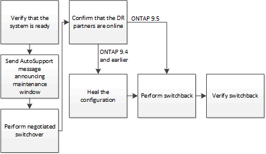

= Effectuer un basculement pour les tests ou la maintenance
:allow-uri-read: 
:icons: font
:imagesdir: ../media/

[role="lead"]
Si vous souhaitez tester la fonctionnalité MetroCluster ou effectuer une maintenance planifiée, vous pouvez effectuer un basculement négocié qui permet d'basculer correctement un cluster sur le cluster partenaire. Vous pouvez ensuite réparer et revenir à la configuration.

NOTE: Depuis ONTAP 9.6, les opérations de basculement et de rétablissement peuvent être effectuées sur les configurations IP de MetroCluster avec ONTAP System Manager.
