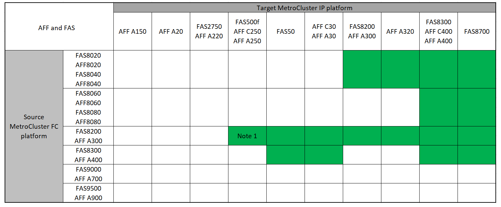

= Choisissez la procédure de transition
:allow-uri-read: 
:icons: font
:imagesdir: ../media/

[role="lead"]
Lors de votre transition vers une configuration MetroCluster IP, vous devez avoir une combinaison de modèles de plateforme pris en charge.

Vous devez également vous assurer que la plateforme IP MetroCluster est une taille appropriée pour la charge que vous passez de la configuration FC MetroCluster à la configuration IP MetroCluster.

== Combinaisons de plateformes prises en charge

* Les procédures de transition nécessitent toutes ONTAP 9.8 ou une version ultérieure, sauf indication contraire dans les notes ou comme requis par une plateforme individuelle.
* Tous les nœuds de la configuration MetroCluster doivent exécuter la même version de ONTAP. Par exemple, si vous avez une configuration à huit nœuds, les huit nœuds doivent exécuter la même version de ONTAP. Reportez-vous au link:https://hwu.netapp.com["Hardware Universe"^]pour connaître la version minimale de ONTAP prise en charge pour votre combinaison.

[NOTE]
====
* Ne dépassez pas les limites d'objet du « bas » des plates-formes de la combinaison. Appliquez la limite inférieure des objets des deux plates-formes.
* Si les limites de la plateforme cible sont inférieures aux limites de la MetroCluster, vous devez reconfigurer la MetroCluster pour qu'elle se situe au niveau ou en dessous des limites de la plateforme cible avant d'ajouter les nouveaux nœuds.
* Reportez-vous à la link:https://hwu.netapp.com["Hardware Universe"^] pour les limites de plateforme.

====

=== Prise en charge des combinaisons de transition AFF et FAS

Les tableaux suivants présentent les combinaisons de plates-formes prises en charge. Vous pouvez passer des plates-formes de la première colonne aux plates-formes répertoriées comme prises en charge dans les colonnes de droite, comme indiqué par les cellules de table colorées.

Par exemple, le passage d'une configuration FC MetroCluster composée de modules de contrôleur AFF8060 à une configuration IP composée de modules de contrôleur AFF A400 est pris en charge.

Les tables sont divisées en deux groupes :

* *Le Groupe 1* présente des combinaisons pour les transitions vers les systèmes AFF A150, AFF A20, FAS2750, FAS8300, FAS500f, AFF C250, AFF A250, FAS50, AFF C30, AFF A30, FAS8200, AFF A300, AFF A320, AFF A220, AFF C400, AFF A400 et FAS8700.
* *Le Groupe 2* présente des combinaisons pour les transitions vers les systèmes AFF C60, AFF A50, FAS70, AFF C800, AFF A800, AFF A70, FAS9000, AFF A700, FAS9500, AFF A900, AFF C80, FAS90, AFF A90 et AFF A1K.

Les remarques suivantes s'appliquent aux deux groupes :

* Remarque 1 : cette combinaison de plateformes nécessite ONTAP 9.11.1 ou une version ultérieure.
* Remarque 2 : vous devez disposer d'une interface 40 GbE pour les interfaces de cluster locales sur les nœuds FC.
* Remarque 3 : une interface de 100 GbE est nécessaire pour les interfaces de cluster locales sur les nœuds FC.

[role="tabbed-block"]
====
.Combinaisons AFF et FAS groupe 1
--
Consultez les combinaisons prises en charge pour les transitions vers les systèmes AFF A150, AFF A20, FAS2750, FAS8300, FAS500f, AFF C250, AFF A250, FAS50, AFF C30, AFF A30, FAS8200, AFF A300, AFF A400, AFF A220, AFF C400, AFF A320 et FAS8700.

--
.Combinaisons AFF et FAS groupe 2
--
Consultez les combinaisons prises en charge pour les transitions vers les systèmes AFF C60, AFF A50, FAS70, AFF C800, AFF A800, AFF A70, FAS9000, AFF A700, FAS9500, AFF A900, AFF C80, FAS90, AFF A90 et AFF A1K.

image:../media/transition-combinations-group-2.png["Affiche les transitions prises en charge pour les plates-formes du groupe 2"]

--
====

=== Prise en charge de combinaisons de plateformes de transition ASA

Le tableau suivant présente les combinaisons de plateformes prises en charge par les systèmes ASA.

[cols="3*"]
|===
| Source : plateforme FC MetroCluster | Plate-forme IP MetroCluster cible | Pris en charge ? 

.2+| ASA A400 | ASA A400 | Oui. 

| ASA A900 | Non 

.2+| ASA A900 | ASA A400 | Non 

| ASA A900 | Oui. 
|===

== Choisissez la procédure de transition

Vous devez sélectionner une procédure de transition selon votre configuration MetroCluster FC existante.

Une procédure de transition remplace la structure du commutateur FC interne ou la connexion FC-VI par un réseau de commutateurs IP. La procédure exacte dépend de votre configuration de départ.

Les plateformes d'origine et les commutateurs FC (le cas échéant) sont retirés à la fin de la procédure de transition.

[cols="20,20,20,40"]
|===

| Démarrage de la configuration | Perturbation ou continuité de l'activité | De formation | Procédure 

 a| 
Quatre ou huit nœuds
 a| 
Continuité de l'activité
 a| 
De nouvelles étagères de rangement sont nécessaires sur les nouvelles plateformes.  Une fois la transition terminée, les anciens contrôleurs, étagères et disques sont retirés du cluster.
 a| 
link:concept_nondisruptively_transitioning_from_a_four_node_mcc_fc_to_a_mcc_ip_configuration.html["Lien vers la procédure"]

*Remarque :* Cette procédure prend en charge les transitions FC vers IP suivantes :

* D'une configuration MetroCluster FC à quatre nœuds à une configuration MetroCluster IP à quatre nœuds
* D'une configuration MetroCluster FC à huit nœuds à une configuration MetroCluster IP à huit nœuds

 a| 
Deux nœuds
 a| 
Perturbation
 a| 
Les nouveaux tiroirs de stockage sont pris en charge sur les plateformes d'origine comme sur les nouvelles.
 a| 
link:task_disruptively_transition_from_a_two_node_mcc_fc_to_a_four_node_mcc_ip_configuration.html["Lien vers la procédure"]

 a| 
Deux nœuds
 a| 
Perturbation
 a| 
Les nouveaux tiroirs de stockage sont pris en charge sur les plateformes d'origine comme sur les nouvelles. Les anciens tiroirs de stockage doivent être retirés.
 a| 
link:task_disruptively_transition_while_move_volumes_from_old_shelves_to_new_shelves.html["Lien vers la procédure"]

 a| 
Deux nœuds
 a| 
Perturbation
 a| 
Les anciens tiroirs de stockage ne sont pas pris en charge sur les nouvelles plateformes. Les anciens tiroirs de stockage doivent être retirés.
 a| 
link:task_disruptively_transition_when_exist_shelves_are_not_supported_on_new_controllers.html["Lien vers la procédure"]

|===