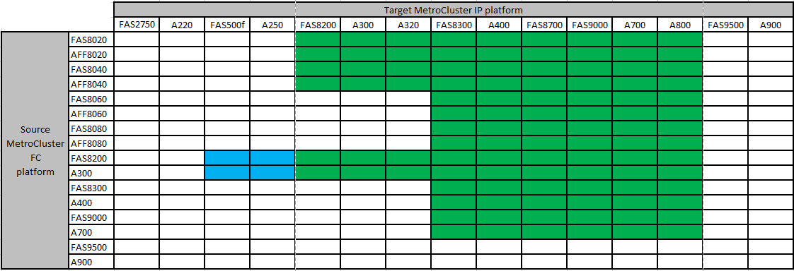

= Plateformes prises en charge pour une transition sans interruption
:allow-uri-read: 
:icons: font
:imagesdir: ../media/

[role="lead"]
Lors de votre transition vers une configuration MetroCluster IP, vous devez avoir une combinaison de modèles de plateforme pris en charge. Vous devez également vous assurer que la plateforme IP MetroCluster est une taille appropriée pour la charge que vous passez de la configuration FC MetroCluster à la configuration IP MetroCluster.

Le tableau suivant présente les combinaisons de plates-formes prises en charge. Vous pouvez passer des plates-formes de la colonne de gauche à des plates-formes répertoriées comme pris en charge dans les colonnes de droite, comme indiqué par les cellules de tableau colorées.

* Une cellule verte indique que la combinaison est prise en charge.
* Une cellule blanche (vide) indique que la combinaison n'est pas prise en charge.
* Une cellule bleue indique que la combinaison est prise en charge à partir de ONTAP 9.11.1.

Par exemple, le passage d'une configuration FC MetroCluster composée de modules de contrôleur AFF8060 à une configuration IP composée de modules de contrôleur AFF A400 est pris en charge.

== Transition vers une configuration de commutateur partagé Cisco 9336C-FX2

La transition vers une configuration de commutateur partagé Cisco 9336C-FX2 n'est pas prise en charge. Une _configuration de commutateur partagée_ est une configuration où les commutateurs fournissent à la fois des connexions MetroCluster et des connexions du tiroir de stockage.

Les configurations dans lesquelles le commutateur Cisco 9336C-FX2 fournit uniquement les connexions MetroCluster sont prises en charge.
