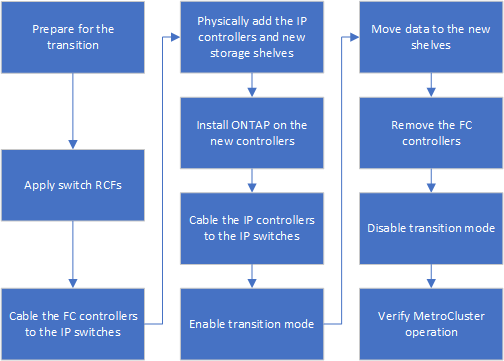

= Flux de travail pour une transition MetroCluster sans interruption
:allow-uri-read: 
:icons: font
:imagesdir: ../media/

[role="lead"]
Vous devez suivre le workflow spécifique pour assurer une transition sans interruption. Choisissez le flux de travail de votre configuration :

* <<Flux de production de la transition d'une configuration FC à quatre nœuds>>
* <<Workflow de transition de la configuration FC à huit nœuds>>

== Flux de production de la transition d'une configuration FC à quatre nœuds

Le processus de transition commence par une configuration FC MetroCluster à quatre nœuds saine.

image::../media/transition_dr_group_1_fc_nodes.png[Nœuds FC de transition dans le groupe DR 1]

Les nouveaux nœuds IP MetroCluster sont ajoutés en tant que second groupe DR.

image::../media/transition_dr_groups_fc_and_ip.png[Groupe DR de transition avec présence de nœuds FC et IP]

Les données sont transférées de l'ancien groupe de reprise après incident vers le nouveau groupe de reprise après incident, puis les anciens nœuds et leur stockage sont retirés de la configuration et désaffectés. Le processus se termine par une configuration IP MetroCluster à quatre nœuds.

image::../media/transition_dr_group_2_ip.png[Transition DR groupe 2 Nœuds IP]

== Workflow de transition de la configuration FC à huit nœuds

Le processus de transition commence par une configuration FC MetroCluster saine à huit nœuds.

image::../media/mcc_dr_group_c1.png[Configuration MetroCluster FC à huit nœuds avant la transition]

Les nouveaux nœuds IP MetroCluster sont ajoutés en troisième groupe de reprise après incident.

image::../media/mcc_dr_group_c2.png[Configuration à huit nœuds avec ajout de nœuds IP en tant que troisième groupe DR]

Les données sont transférées de DR_Group_1-FC vers DR_Group_1-IP, puis les anciens nœuds et leur stockage sont supprimés de la configuration et désaffectés.

NOTE: Si vous souhaitez passer d'une configuration FC à huit nœuds à une configuration IP à quatre nœuds, vous devez transférer toutes les données de DR_Group_1-FC et DR_Group_2-FC au nouveau groupe IP DR (DR_Group_1-IP). Vous pouvez ensuite désaffecter les deux groupes DR FC. Après la suppression des groupes DR FC, le processus se termine par une configuration IP MetroCluster à quatre nœuds.

image::../media/mcc_dr_group_c8.png[Configuration à huit nœuds après la première transition de groupe DR]

Ajoutez les nœuds IP MetroCluster restants à la configuration MetroCluster existante. Répétez le processus pour transférer les données des nœuds DR_Group_2-FC aux nœuds DR_Group_2-IP.

image::../media/mcc_dr_group_c7.png[Configuration à huit nœuds avec ajout des nœuds IP restants]

Après avoir supprimé DR_Group_2-FC, le processus se termine par une configuration IP MetroCluster à huit nœuds.

image::../media/mcc_dr_group_c6.png[Configuration IP de MetroCluster à huit nœuds après la transition]

== Processus de transition

Vous utiliserez le workflow suivant pour effectuer la transition de la configuration MetroCluster.

