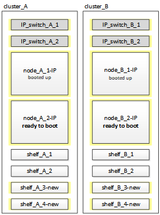

= Connexion des modules de contrôleur IP MetroCluster
:allow-uri-read: 
:icons: font
:imagesdir: ../media/

[role="lead"]
Vous devez ajouter les quatre nouveaux modules de contrôleur et tous les tiroirs de stockage supplémentaires à la configuration. Les nouveaux modules de contrôleur sont ajoutés deux à la fois.

== Configuration des nouveaux contrôleurs

Vous devez installer et connecter les nouveaux contrôleurs IP MetroCluster aux tiroirs de stockage précédemment connectés aux contrôleurs FC MetroCluster.

Ces étapes doivent être réalisées sur chacun des nœuds IP MetroCluster.

* Node_A_1-IP
* Node_A_2-IP
* Node_B_1-IP
* Node_B_2-IP

Dans l'exemple suivant, deux tiroirs de stockage supplémentaires sont ajoutés sur chaque site afin de fournir du stockage pour s'adapter aux nouveaux modules de contrôleur.

image::../media/transition_2n_4_new_ip_nodes_and_shelves.png[effectuez la transition de 2 n 4 nouveaux nœuds et tiroirs ip]

.Étapes
. Planifiez le positionnement des nouveaux modules de contrôleur et tiroirs de stockage en fonction des besoins.
+
L'espace rack dépend du modèle de plateforme des modules de contrôleur, des types de switchs et du nombre de tiroirs de stockage de votre configuration.

. Mettez-vous à la terre.
. Installez le nouvel équipement : contrôleurs, tiroirs de stockage et commutateurs IP.
+
Ne câconnectez pas encore les tiroirs de stockage ni les commutateurs IP.

. Branchez les câbles d'alimentation et la connexion de la console de gestion aux contrôleurs.
. Vérifier que tous les tiroirs de stockage sont hors tension.
. Vérifiez qu'aucun disque n'est connecté en effectuant les étapes suivantes sur les quatre nœuds :
+
.. À l'invite DU CHARGEUR, lancez le menu de démarrage :
+
`boot_ontap maint`

.. Vérifiez qu'aucun lecteur n'est connecté :
+
`disk show -v`

+
La sortie ne doit pas afficher de lecteurs.

.. Arrêter le nœud :
+
`halt`

. Démarrez les quatre nœuds à l'aide de l'option 9a du menu de démarrage.
+
.. À l'invite DU CHARGEUR, lancez le menu de démarrage :
+
`boot_ontap menu`

.. Dans le menu de démarrage, sélectionnez l'option « 9a » pour redémarrer le contrôleur.
.. Laissez le module de contrôleur terminer le démarrage avant de passer au module de contrôleur suivant.

+
Une fois que « 9a » est terminé, les nœuds retournent automatiquement au menu d'amorçage.

. Reliez les tiroirs de stockage.
+
Pour plus d'informations sur le câblage, reportez-vous aux procédures d'installation et de configuration du contrôleur correspondant à votre modèle.

+
https://docs.netapp.com/platstor/index.jsp["Centre de documentation AFF et FAS"^]

. Reliez les contrôleurs aux commutateurs IP, comme décrit dans la link:../install-ip/using_rcf_generator.html["Câblage des commutateurs IP"].
. Préparez les commutateurs IP pour l'application des nouveaux fichiers RCF.
+
Suivez les étapes pour votre fournisseur de commutateur :

+
** link:../install-ip/task_switch_config_broadcom.html["Réinitialisation des paramètres d'usine du commutateur IP Broadcom"]
** link:../install-ip/task_switch_config_cisco.html["Réinitialisation des paramètres d'usine du commutateur IP Cisco"]

. Téléchargez et installez les fichiers RCF.
+
Suivez les étapes pour votre fournisseur de commutateur :

+
** link:../install-ip/task_switch_config_broadcom.html["Téléchargement et installation des fichiers RCF Broadcom"]
** link:../install-ip/task_switch_config_cisco.html["Téléchargement et installation des fichiers Cisco IP RCF"]

. Mettez le premier contrôleur sous tension (node_A_1-IP) et appuyez sur Ctrl-C pour interrompre le processus de démarrage et afficher l'invite DU CHARGEUR.
. Démarrer le contrôleur en mode maintenance :
+
`boot_ontap_maint`

. Afficher l'ID système du contrôleur :
+
`sysconfig -v`

. Vérifier que les tiroirs de la configuration existante sont visibles depuis le nouveau nœud IP MetroCluster :
+
`storage show shelf``disk show -v`

. Arrêter le nœud :
+
`halt`

. Répétez les étapes précédentes sur l'autre nœud du site partenaire (site_B).

== Connexion et démarrage du noeud_A_1-IP et du noeud_B_1-IP

Après avoir connecté les contrôleurs IP MetroCluster et les commutateurs IP, vous effectuez la transition et le démarrage du nœud_A_1-IP et du nœud_B_1-IP.

=== Mise en service du noeud_A_1-IP

Vous devez démarrer le nœud avec l'option de transition appropriée.

.Étapes
. Boot node_A_1-IP vers le menu de démarrage :
+
`boot_ontap menu`

. Pour lancer la transition, exécutez la commande suivante à l'invite du menu de démarrage :
+
`boot_after_mcc_transition`

+
** Cette commande réaffecte tous les disques appartenant au node_A_1-FC au node_A_1-IP.
+
*** Les disques node_A_1-FC sont affectés au nœud_A_1-IP
*** Les disques node_B_1-FC sont affectés au nœud_B_1-IP

** La commande permet également de réassignations d'ID système nécessaire pour que les nœuds IP MetroCluster puissent démarrer à l'invite ONTAP.
** Si la commande boot_After_mcc_transition échoue pour une raison quelconque, elle doit être exécutée à nouveau à partir du menu de démarrage.
+
[NOTE]
====
*** Si l'invite suivante s'affiche, entrez Ctrl-C pour continuer. Vérification de l'état du MCC DR... [Entrer Ctrl-C(RESUME), S(STATUS), L(LINK)]_
*** Si le volume racine a été chiffré, le nœud s'arrête avec le message suivant. Arrêt du système, car le volume racine est chiffré (NetApp Volume Encryption) et l'importation de la clé a échoué. Si le cluster est configuré avec un gestionnaire de clés externe (KMIP), vérifiez l'état de santé des serveurs de clés.

====
+
[listing]
----

Please choose one of the following:
(1) Normal Boot.
(2) Boot without /etc/rc.
(3) Change password.
(4) Clean configuration and initialize all disks.
(5) Maintenance mode boot.
(6) Update flash from backup config.
(7) Install new software first.
(8) Reboot node.
(9) Configure Advanced Drive Partitioning. Selection (1-9)? `boot_after_mcc_transition`
This will replace all flash-based configuration with the last backup to disks. Are you sure you want to continue?: yes

MetroCluster Transition: Name of the MetroCluster FC node: `node_A_1-FC`
MetroCluster Transition: Please confirm if this is the correct value [yes|no]:? y
MetroCluster Transition: Disaster Recovery partner sysid of MetroCluster FC node node_A_1-FC: `systemID-of-node_B_1-FC`
MetroCluster Transition: Please confirm if this is the correct value [yes|no]:? y
MetroCluster Transition: Disaster Recovery partner sysid of local MetroCluster IP node: `systemID-of-node_B_1-IP`
MetroCluster Transition: Please confirm if this is the correct value [yes|no]:? y
----

. Si les volumes de données sont chiffrés, restaurez les clés à l'aide de la commande appropriée pour votre configuration de gestion des clés.
+
[cols="1,2"]
|===

| Si vous utilisez... | Utilisez cette commande... 

 a| 
*Gestion intégrée des clés*
 a| 
`security key-manager onboard sync`

Pour plus d'informations, voir https://docs.netapp.com/ontap-9/topic/com.netapp.doc.pow-nve/GUID-E4AB2ED4-9227-4974-A311-13036EB43A3D.html["Restauration des clés de chiffrement intégrées de gestion des clés"^].

 a| 
*Gestion externe des clés*
 a| 
`security key-manager key query -node node-name`

Pour plus d'informations, voir https://docs.netapp.com/ontap-9/topic/com.netapp.doc.pow-nve/GUID-32DA96C3-9B04-4401-92B8-EAF323C3C863.html["Restauration des clés de chiffrement externes de gestion des clés"^].

|===
. Si le volume racine est chiffré, utilisez la procédure décrite dans la section link:../transition/task_connect_the_mcc_ip_controller_modules_2n_mcc_transition_supertask.html#recovering-key-management-if-the-root-volume-is-encrypted["Récupération de la gestion des clés si le volume racine est chiffré"].

=== Récupération de la gestion des clés si le volume racine est chiffré

Si le volume racine est chiffré, vous devez utiliser des commandes de démarrage spéciales pour restaurer la gestion des clés.

Vous devez avoir les phrases clés rassemblées plus tôt.

.Étapes
. Si vous utilisez la gestion intégrée des clés, procédez comme suit pour restaurer la configuration.
+
.. Depuis l'invite DU CHARGEUR, afficher le menu de démarrage :
+
`boot_ontap menu`

.. Sélectionnez l'option «»(10) définissez les secrets de récupération de la gestion intégrée des clés» dans le menu de démarrage.
+
Répondez au besoin aux invites :

+
[listing]
----
This option must be used only in disaster recovery procedures. Are you sure? (y or n): y
Enter the passphrase for onboard key management: passphrase
Enter the passphrase again to confirm: passphrase

Enter the backup data: backup-key
----
+
Le système démarre dans le menu de démarrage.

.. Entrer l'option « 6 » dans le menu de démarrage.
+
Répondez au besoin aux invites :

+
[listing]
----
This will replace all flash-based configuration with the last backup to
disks. Are you sure you want to continue?: y

Following this, the system will reboot a few times and the following prompt will be available continue by saying y

WARNING: System ID mismatch. This usually occurs when replacing a boot device or NVRAM cards!
Override system ID? {y|n} y
----
+
Après le redémarrage, le système se trouve à l'invite DU CHARGEUR.

.. Depuis l'invite DU CHARGEUR, afficher le menu de démarrage :
+
`boot_ontap menu`

.. Encore une fois, choisissez l'option ""(10) définissez les secrets de récupération de la gestion des clés à bord" dans le menu de démarrage.
+
Répondez au besoin aux invites :

+
[listing]
----
This option must be used only in disaster recovery procedures. Are you sure? (y or n): `y`
Enter the passphrase for onboard key management: `passphrase`
Enter the passphrase again to confirm:`passphrase`

Enter the backup data:`backup-key`
----
+
Le système démarre dans le menu de démarrage.

.. Entrer l'option « 1 » dans le menu de démarrage.
+
Si l'invite suivante s'affiche, vous pouvez appuyer sur Ctrl+C pour reprendre le processus.

+
....
 Checking MCC DR state... [enter Ctrl-C(resume), S(status), L(link)]
....
+
Le système démarre dans l'invite de ONTAP.

.. Restauration de la gestion intégrée des clés :
+
`security key-manager onboard sync`

+
Répondez au besoin aux invites à l'aide de la phrase de passe que vous avez recueillie plus tôt :

+
[listing]
----
cluster_A::> security key-manager onboard sync
Enter the cluster-wide passphrase for onboard key management in Vserver "cluster_A":: passphrase
----

. Si vous utilisez la gestion externe des clés, procédez comme suit pour restaurer la configuration.
+
.. Définissez les bootargs requis :
+
`setenv bootarg.kmip.init.ipaddr ip-address`

+
`setenv bootarg.kmip.init.netmask netmask`

+
`setenv bootarg.kmip.init.gateway gateway-address`

+
`setenv bootarg.kmip.init.interface interface-id`

.. Depuis l'invite DU CHARGEUR, afficher le menu de démarrage :
+
`boot_ontap menu`

.. Sélectionnez l'option "`(11) configurer le noeud pour la gestion externe des clés» dans le menu de démarrage.
+
Le système démarre dans le menu de démarrage.

.. Entrer l'option « 6 » dans le menu de démarrage.
+
Le système démarre plusieurs fois. Vous pouvez répondre de manière affirmative lorsque vous êtes invité à poursuivre le processus d'amorçage.

+
Après le redémarrage, le système se trouve à l'invite DU CHARGEUR.

.. Définissez les bootargs requis :
+
`setenv bootarg.kmip.init.ipaddr ip-address`

+
`setenv bootarg.kmip.init.netmask netmask`

+
`setenv bootarg.kmip.init.gateway gateway-address`

+
`setenv bootarg.kmip.init.interface interface-id`

.. Depuis l'invite DU CHARGEUR, afficher le menu de démarrage :
+
`boot_ontap menu`

.. Sélectionnez à nouveau l'option «»(11) configurer le nœud pour la gestion externe des clés» dans le menu de démarrage et répondez aux invites si nécessaire.
+
Le système démarre dans le menu de démarrage.

.. Restaurez la gestion externe des clés :
+
`security key-manager external restore`

=== Création de la configuration réseau

Vous devez créer une configuration réseau qui correspond à la configuration sur les nœuds FC. En effet, le nœud IP MetroCluster relit la même configuration au démarrage, ce qui signifie qu'au démarrage du nœud_A_1-IP et du nœud_B_1-IP, ONTAP essaiera d'héberger les LIF sur les mêmes ports que ceux utilisés respectivement sur le nœud_A_1-FC et le nœud_B_1-FC.

Au fur et à mesure que vous créez la configuration réseau, utilisez le plan créé dans link:concept_requirements_for_fc_to_ip_transition_2n_mcc_transition.html["Mappage des ports des nœuds FC MetroCluster sur les nœuds IP MetroCluster"] pour vous aider.

NOTE: Une configuration supplémentaire peut être nécessaire pour afficher les LIF de données après la configuration des nœuds IP MetroCluster.

.Étapes
. Vérifier que tous les ports de cluster se trouvent dans le broadcast domain approprié :
+
L'IPspace et le Cluster broadcast domain sont requis pour créer les LIFs de cluster

+
.. Afficher les espaces IP :
+
`network ipspace show`

.. Créez des espaces IP et attribuez les ports au cluster si nécessaire.
+
http://docs.netapp.com/ontap-9/topic/com.netapp.doc.dot-cm-nmg/GUID-69120CF0-F188-434F-913E-33ACB8751A5D.html["Configuration des IPspaces (administrateurs du cluster uniquement)"^]

.. Afficher les domaines de diffusion :
+
`network port broadcast-domain show`

.. Il est possible d'ajouter n'importe quel port de cluster à un broadcast domain.
+
https://docs.netapp.com/ontap-9/topic/com.netapp.doc.dot-cm-nmg/GUID-003BDFCD-58A3-46C9-BF0C-BA1D1D1475F9.html["Ajout ou suppression de ports d'un broadcast domain"^]

.. Recréez les VLAN et les groupes d'interfaces selon les besoins.
+
L'appartenance au VLAN et aux groupes d'interfaces peut être différente de celle de l'ancien nœud.

+
https://docs.netapp.com/ontap-9/topic/com.netapp.doc.dot-cm-nmg/GUID-8929FCE2-5888-4051-B8C0-E27CAF3F2A63.html["Création d'un VLAN"^]

+
https://docs.netapp.com/ontap-9/topic/com.netapp.doc.dot-cm-nmg/GUID-DBC9DEE2-EAB7-430A-A773-4E3420EE2AA1.html["Combinaison de ports physiques pour créer des groupes d'interfaces"^]

. Vérifiez que les paramètres MTU sont définis correctement pour les ports et le domaine de diffusion et effectuez des modifications à l'aide des commandes suivantes :
+
`network port broadcast-domain show`

+
`network port broadcast-domain modify -broadcast-domain _bcastdomainname_ -mtu _mtu-value_`

=== Configuration des ports du cluster et des LIFs du cluster

Vous devez configurer les ports et les LIFs de cluster. Les étapes suivantes doivent être réalisées sur le site A, nœud a démarré avec des agrégats racine.

.Étapes
. Identifier la liste des LIFs à l'aide du port Cluster souhaité :
+
`network interface show -curr-port portname`

+
`network interface show -home-port portname`

. Pour chaque port de cluster, modifier le port de home port de l'une des LIFs de ce port sur un autre port,
+
.. Entrer en mode de privilège avancé et entrer « y » lorsque vous êtes invité à continuer :
+
`set priv advanced`

.. Si le LIF en cours de modification est une LIF de données :
+
`vserver config override -command "network interface modify -lif _lifname_ -vserver _vservername_ -home-port _new-datahomeport_"`

.. Si le LIF n'est pas une LIF de données :
+
`network interface modify -lif _lifname_ -vserver _vservername_ -home-port _new-datahomeport_`

.. Revert les LIFs modifiées sur leur port de origine :
+
`network interface revert * -vserver _vserver_name_`

.. Vérifier qu'il n'y a pas de LIFs sur le port du cluster :
+
`network interface show -curr-port _portname_`

+
`network interface show -home-port _portname_`

.. Supprimez le port du broadcast domain actuel :
+
`network port broadcast-domain remove-ports -ipspace _ipspacename_ -broadcast-domain _bcastdomainname_ -ports _node_name:port_name_`

.. Ajoutez le port au cluster IPspace et broadcast domain :
+
`network port broadcast-domain add-ports -ipspace Cluster -broadcast-domain Cluster -ports _node_name:port_name_`

.. Vérifiez que le rôle du port a changé : `network port show`
.. Répétez ces sous-étapes pour chaque port de cluster.
.. Revenir en mode admin:
+
`set priv admin`

. Création des LIFs de cluster sur les nouveaux ports du cluster :
+
.. Pour autoconfiguration utilisant l'adresse lien-local pour le LIF de cluster, utilisez la commande suivante :
+
`network interface create -vserver Cluster -lif _cluster_lifname_ -service-policy _default-cluster_ -home-node _a1name_ -home-port clusterport -auto true`

.. Pour attribuer une adresse IP statique pour le LIF de cluster, utilisez la commande suivante :
+
`network interface create -vserver Cluster -lif _cluster_lifname_ -service-policy default-cluster -home-node _a1name_ -home-port _clusterport_ -address _ip-address_ -netmask _netmask_ -status-admin up`

=== Vérification de la configuration de LIF

Le LIF node management, la LIF cluster management et les LIF intercluster seront toujours présents après le déplacement du stockage en provenance de l'ancien contrôleur. Si nécessaire, vous devez déplacer les LIFs vers les ports appropriés.

.Étapes
. Vérifier si la LIF de management et les LIFs de cluster management sont déjà sur le port désiré:
+
`network interface show -service-policy default-management`

+
`network interface show -service-policy default-intercluster`

+
Si les LIF se trouvent sur les ports souhaités, vous pouvez ignorer les autres étapes de cette tâche et passer à la tâche suivante.

. Pour chaque nœud, cluster management ou intercluster qui ne sont pas sur le port désiré, modifiez le port de rattachement des LIFs de ce port sur un autre port.
+
.. Reconvertir le port souhaité en déplaçant les LIF hébergées sur le port souhaité vers un autre port :
+
`vserver config override -command "network interface modify -lif _lifname_ -vserver _vservername_ -home-port _new-datahomeport_"`

.. Revert les LIF modifiées sur leur nouveau port de base :
+
`vserver config override -command "network interface revert -lif _lifname_ -vserver _vservername"`

.. Si le port désiré n'est pas dans le Right IPspace et le broadcast domain, supprimez le port de l'IPspace et du broadcast domain :
+
`network port broadcast-domain remove-ports -ipspace _current-ipspace_ -broadcast-domain _current-broadcast-domain_ -ports _controller-name:current-port_`

.. Déplacez le port souhaité vers l'IPspace et le domaine de diffusion :
+
`network port broadcast-domain add-ports -ipspace _new-ipspace_ -broadcast-domain _new-broadcast-domain_ -ports _controller-name:new-port_`

.. Vérifiez que le rôle du port a changé :
+
`network port show`

.. Répétez ces sous-étapes pour chaque port.

. Déplacer le nœud, les LIFs de cluster management et les LIF intercluster vers le port souhaité :
+
.. Modifier le port de base du LIF :
+
`network interface modify -vserver _vserver_ -lif _node_mgmt_ -home-port _port_ -home-node _homenode_`

.. Revert la LIF sur son nouveau port de home port :
+
`network interface revert -lif _node_mgmt_ -vserver _vservername_`

.. Modifier le port d'accueil de la LIF de gestion de cluster :
+
`network interface modify -vserver _vserver_ -lif _cluster-mgmt-LIF-name_ -home-port _port_ -home-node _homenode_`

.. Ne rétablit pas la LIF de cluster management à son nouveau port home port :
+
`network interface revert -lif _cluster-mgmt-LIF-name_ -vserver _vservername_`

.. Changer le port de base du LIF intercluster :
+
`network interface modify -vserver _vserver_ -lif _intercluster-lif-name_ -home-node _nodename_ -home-port _port_`

.. Revert le LIF intercluster sur son nouveau port de home port :
+
`network interface revert -lif _intercluster-lif-name_ -vserver _vservername_`

== Mise en service du noeud_A_2-IP et du noeud_B_2-IP

Vous devez installer et configurer le nouveau nœud IP MetroCluster sur chaque site, créant ainsi une paire haute disponibilité sur chaque site.

=== Mise en service du noeud_A_2-IP et du noeud_B_2-IP

Vous devez démarrer les nouveaux modules de contrôleur un par un en utilisant l'option correcte dans le menu de démarrage.

Lors de ces étapes, vous démarrez les deux nouveaux nœuds, en étendant ce qui était une configuration à deux nœuds en une configuration à quatre nœuds.

Ces étapes sont réalisées sur les nœuds suivants :

* Node_A_2-IP
* Node_B_2-IP

.Étapes
. Démarrez les nouveaux nœuds à l'aide de l'option d'amorçage « 9c ».
+
[listing]
----
Please choose one of the following:
(1) Normal Boot.
(2) Boot without /etc/rc.
(3) Change password.
(4) Clean configuration and initialize all disks.
(5) Maintenance mode boot.
(6) Update flash from backup config.
(7) Install new software first.
(8) Reboot node.
(9) Configure Advanced Drive Partitioning. Selection (1-9)? 9c
----
+
Le nœud initialise et démarre sur l'assistant de configuration du nœud, comme suit.

+
[listing]
----
Welcome to node setup
You can enter the following commands at any time:
"help" or "?" - if you want to have a question clarified,
"back" - if you want to change previously answered questions, and
"exit" or "quit" - if you want to quit the setup wizard.
Any changes you made before quitting will be saved.
To accept a default or omit a question, do not enter a value. .
.
.
----
+
Si l'option « 9c » ne fonctionne pas, prenez les mesures suivantes pour éviter toute perte de données :

+
** N'essayez pas d'exécuter l'option 9a.
** Déconnecter physiquement les tiroirs existants qui contiennent des données de la configuration FC MetroCluster d'origine (shelf_A_1, shelf_A_2, shelf_B_1, shelf_B_2).
** Contactez le support technique en consultant l'article de la base de connaissances https://kb.netapp.com/Advice_and_Troubleshooting/Data_Protection_and_Security/MetroCluster/MetroCluster_FC_to_IP_transition_-_Option_9c_Failing["Transition FC MetroCluster vers IP : échec de l'option 9c"^].
+
https://mysupport.netapp.com/site/global/dashboard["Support NetApp"^]

. Activez l'outil AutoSupport en suivant les instructions fournies par l'assistant.
. Répondez aux invites pour configurer l'interface de gestion des nœuds.
+
[listing]
----
Enter the node management interface port: [e0M]:
Enter the node management interface IP address: 10.228.160.229
Enter the node management interface netmask: 225.225.252.0
Enter the node management interface default gateway: 10.228.160.1
----
. Vérifier que le mode de basculement du stockage est défini sur HA :
+
`storage failover show -fields mode`

+
Si le mode n'est pas HA, définissez-le :

+
`storage failover modify -mode ha -node _localhost_`

+
Vous devez ensuite redémarrer le nœud pour que la modification prenne effet.

. Lister les ports dans le cluster :
+
`network port show`

+
Pour connaître la syntaxe complète de la commande, reportez-vous à la page man.

+
L'exemple suivant montre les ports réseau en cluster01 :

+
[listing]
----

cluster01::> network port show
                                                             Speed (Mbps)
Node   Port      IPspace      Broadcast Domain Link   MTU    Admin/Oper
------ --------- ------------ ---------------- ----- ------- ------------
cluster01-01
       e0a       Cluster      Cluster          up     1500   auto/1000
       e0b       Cluster      Cluster          up     1500   auto/1000
       e0c       Default      Default          up     1500   auto/1000
       e0d       Default      Default          up     1500   auto/1000
       e0e       Default      Default          up     1500   auto/1000
       e0f       Default      Default          up     1500   auto/1000
cluster01-02
       e0a       Cluster      Cluster          up     1500   auto/1000
       e0b       Cluster      Cluster          up     1500   auto/1000
       e0c       Default      Default          up     1500   auto/1000
       e0d       Default      Default          up     1500   auto/1000
       e0e       Default      Default          up     1500   auto/1000
       e0f       Default      Default          up     1500   auto/1000
----
. Quittez l'assistant de configuration des nœuds :
+
`exit`

. Connectez-vous au compte admin avec le nom d'utilisateur admin.
. Associez le cluster existant à l'aide de l'assistant de configuration du cluster.
+
[listing]
----
:> cluster setup
Welcome to the cluster setup wizard.
You can enter the following commands at any time:
"help" or "?" - if you want to have a question clarified,
"back" - if you want to change previously answered questions, and "exit" or "quit" - if you want to quit the cluster setup wizard.
Any changes you made before quitting will be saved.
You can return to cluster setup at any time by typing "cluster setup". To accept a default or omit a question, do not enter a value.
Do you want to create a new cluster or join an existing cluster?
{create, join}:
join
----
. Une fois l'assistant de configuration du cluster terminé et qu'il quitte, vérifiez que le cluster est actif et que le nœud fonctionne correctement :
+
`cluster show`

. Désactiver l'affectation automatique des disques :
+
`storage disk option modify -autoassign off -node node_A_2-IP`

. Si le chiffrement est utilisé, restaurez les clés à l'aide de la commande correcte pour la configuration de la gestion des clés.
+
[cols="1,2"]
|===

| Si vous utilisez... | Utilisez cette commande... 

 a| 
*Gestion intégrée des clés*
 a| 
`security key-manager onboard sync`

Pour plus d'informations, voir https://docs.netapp.com/ontap-9/topic/com.netapp.doc.pow-nve/GUID-E4AB2ED4-9227-4974-A311-13036EB43A3D.html["Restauration des clés de chiffrement intégrées de gestion des clés"].

 a| 
*Gestion externe des clés*
 a| 
`security key-manager key query -node _node-name_`

Pour plus d'informations, voir https://docs.netapp.com/ontap-9/topic/com.netapp.doc.pow-nve/GUID-32DA96C3-9B04-4401-92B8-EAF323C3C863.html["Restauration des clés de chiffrement externes de gestion des clés"^].

|===
. Répétez les étapes ci-dessus sur le deuxième nouveau module de contrôleur (node_B_2-IP).

=== Vérification des paramètres MTU

Vérifiez que les paramètres MTU sont définis correctement pour les ports et le domaine de diffusion et effectuez des modifications.

.Étapes
. Vérifiez la taille de MTU utilisée dans le domaine de diffusion en cluster :
+
`network port broadcast-domain show`

. Si nécessaire, mettez à jour la taille de MTU au besoin :
+
`network port broadcast-domain modify -broadcast-domain _bcast-domain-name_ -mtu _mtu-size_`

=== Configuration des LIFs intercluster

Configurer les LIFs intercluster nécessaires au peering de clusters

Cette tâche doit être effectuée sur les deux nouveaux nœuds, Node_A_2-IP et node_B_2-IP.

.Étape
. Configurer les LIFs intercluster Voir link:../install-ip/task_sw_config_configure_clusters.html#configuring-intercluster-lifs-for-cluster-peering["Configuration des LIFs intercluster"]

=== Vérification du peering de cluster

Vérifiez que cluster_A et cluster_B sont associés et que les nœuds de chaque cluster peuvent communiquer entre eux.

.Étapes
. Vérifier la relation de peering de cluster :
+
`cluster peer health show`

+
[listing]
----
cluster01::> cluster peer health show
Node       cluster-Name                Node-Name
             Ping-Status               RDB-Health Cluster-Health  Avail…
---------- --------------------------- ---------  --------------- --------
node_A_1-IP
           cluster_B                   node_B_1-IP
             Data: interface_reachable
             ICMP: interface_reachable true       true            true
                                       node_B_2-IP
             Data: interface_reachable
             ICMP: interface_reachable true       true            true
node_A_2-IP
           cluster_B                   node_B_1-IP
             Data: interface_reachable
             ICMP: interface_reachable true       true            true
                                       node_B_2-IP
             Data: interface_reachable
             ICMP: interface_reachable true       true            true
----
. Ping pour vérifier que les adresses des pairs sont accessibles :
+
`cluster peer ping -originating-node _local-node_ -destination-cluster _remote-cluster-name_`

