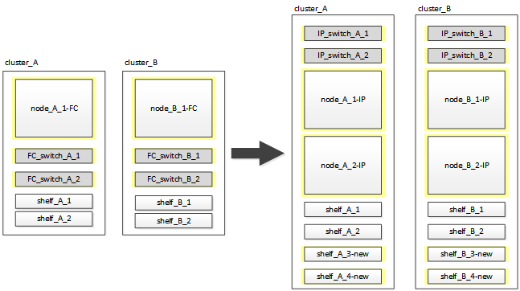

= Transition sans interruption d'un FC MetroCluster à deux nœuds vers une configuration IP MetroCluster à quatre nœuds (ONTAP 9.8 et versions ultérieures)
:allow-uri-read: 
:icons: font
:imagesdir: ../media/

[role="lead"]
Depuis ONTAP 9.8, vous pouvez effectuer la transition des charges de travail et des données d'une configuration FC MetroCluster à deux nœuds vers une nouvelle configuration IP MetroCluster à quatre nœuds. Les tiroirs disques des nœuds FC MetroCluster sont déplacés vers les nœuds IP.

L'illustration suivante présente la configuration simplifiée avant et après cette procédure de transition.

* Cette procédure est prise en charge sur les systèmes exécutant ONTAP 9.8 et versions ultérieures.
* Cette procédure est perturbatrice.
* Cette procédure s'applique uniquement à une configuration FC MetroCluster à deux nœuds.
+
Si vous disposez d'une configuration FC MetroCluster à quatre nœuds, reportez-vous à la section link:concept_choosing_your_transition_procedure_mcc_transition.html["Choix de la procédure de transition"].

* ADP n'est pas pris en charge sur la configuration IP MetroCluster à quatre nœuds créée par cette procédure.
* Vous devez répondre à toutes les exigences et suivre toutes les étapes de la procédure.
* Les tiroirs de stockage existants sont déplacés vers les nouveaux nœuds IP MetroCluster.
* Il est possible d'ajouter des tiroirs de stockage supplémentaires à la configuration, le cas échéant.
+
Voir link:concept_requirements_for_fc_to_ip_transition_2n_mcc_transition.html["Réutilisation des tiroirs disques et des exigences des disques pour une transition FC vers IP sans interruption"].

