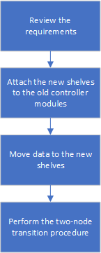

= Transition sans interruption lorsque les tiroirs existants ne sont pas pris en charge sur les nouveaux contrôleurs (ONTAP 9.8 et versions ultérieures)
:allow-uri-read: 
:icons: font
:imagesdir: ../media/

[role="lead"]
Depuis ONTAP 9.8, vous pouvez effectuer la transition sans interruption d'une configuration FC MetroCluster à deux nœuds et déplacer les données depuis les tiroirs disques existants, même si les tiroirs de stockage existants ne sont pas pris en charge par les nouveaux nœuds IP MetroCluster.

* Cette procédure ne doit être utilisée que si les modèles de tiroirs de stockage existants ne sont pas pris en charge par les nouveaux modèles de plateforme IP MetroCluster.
* Cette procédure est prise en charge sur les systèmes exécutant ONTAP 9.8 et versions ultérieures.
* Cette procédure est perturbatrice.
* Cette procédure s'applique uniquement à une configuration FC MetroCluster à deux nœuds.
+
Si vous disposez d'une configuration FC MetroCluster à quatre nœuds, reportez-vous à la section link:concept_choosing_your_transition_procedure_mcc_transition.html["Choix de la procédure de transition"].

* Vous devez répondre à toutes les exigences et suivre toutes les étapes de la procédure.

== Activer la journalisation de la console

NetApp vous recommande vivement d'activer la journalisation de la console sur les périphériques que vous utilisez et d'effectuer les actions suivantes lors de l'exécution de cette procédure :

* Laissez AutoSupport activé pendant la maintenance.
* Déclencher un message AutoSupport de maintenance avant et après la maintenance pour désactiver la création de dossiers pendant la durée de l'activité de maintenance.
+
Consultez l'article de la base de connaissances link:https://kb.netapp.com/Support_Bulletins/Customer_Bulletins/SU92["Comment supprimer la création automatique de dossier pendant les fenêtres de maintenance planifiées"^].

* Activer la journalisation de session pour toute session CLI. Pour obtenir des instructions sur l'activation de la journalisation des sessions, consultez la section « consignation des sorties de session » de l'article de la base de connaissances link:https://kb.netapp.com/on-prem/ontap/Ontap_OS/OS-KBs/How_to_configure_PuTTY_for_optimal_connectivity_to_ONTAP_systems["Comment configurer PuTTY pour une connectivité optimale aux systèmes ONTAP"^].

== Exigences à réaliser lorsque les tiroirs ne sont pas pris en charge sur les nouveaux nœuds

Avant de lancer le processus de transition, vous devez vérifier que la configuration répond aux exigences.

.Avant de commencer
* La configuration existante doit être une configuration Stretch MetroCluster à deux nœuds et tous les nœuds doivent exécuter ONTAP 9.8 ou une version ultérieure.
+
Les nouveaux modules de contrôleur IP MetroCluster doivent exécuter la même version de ONTAP 9.8.

* Les plateformes existantes et nouvelles doivent être prises en charge pour la transition.
+
link:concept_supported_platforms_for_transition.html["Plateformes prises en charge pour une transition sans interruption"]

* Il doit répondre à toutes les exigences et à tous les câbles, comme décrit dans le link:../install-fc/index.html["Installation et configuration de la solution Fabric-Attached MetroCluster"].
* Les anciens contrôleurs (node_A_1-IP, node_A_2-IP, node_B_1-IP et node_B_2-IP) doivent être pris en charge par les nouveaux contrôleurs (node_A_1-FC et node_B_1-FC).
+
https://hwu.netapp.com["NetApp Hardware Universe"^]

* Les anciens tiroirs de stockage ne sont *pas* pris en charge par les nouveaux modèles de plateforme IP MetroCluster.
+
https://hwu.netapp.com["NetApp Hardware Universe"^]

* En fonction des disques de spare disponibles dans les tiroirs existants, il faut ajouter des disques supplémentaires.
+
Cela peut nécessiter des tiroirs disques supplémentaires.

+
Vous devez disposer de 14 à 18 disques supplémentaires pour chaque contrôleur :

+
** Trois disques dans un pool
** Trois disques dans un pool 1
** Deux disques de secours
** Six à dix lecteurs pour le volume système

* Vous devez vous assurer que la configuration, y compris les nouveaux nœuds, ne dépasse pas les limites de plateforme pour la configuration, y compris le nombre de disques, la capacité de la taille de l'agrégat racine, etc
+
Ces informations sont disponibles pour chaque modèle de plateforme auprès de _NetApp Hardware Universe_.

+
https://hwu.netapp.com["NetApp Hardware Universe"]

* Vous devez disposer d'un accès à distance à la console pour les six nœuds depuis le site MetroCluster ou prévoir un déplacement entre les sites, selon la procédure à suivre.

== Flux de production permettant une transition sans interruption lorsque les tiroirs ne sont pas pris en charge par les nouveaux contrôleurs

Si les modèles de tiroirs existants ne sont pas pris en charge par les nouveaux modèles de plateforme, vous devez associer les nouveaux tiroirs à l'ancienne configuration, transférer les données vers les nouveaux tiroirs, puis effectuer un transition vers la nouvelle configuration.

Pendant que vous préparez la transition, planifiez les déplacements entre les sites. Notez qu'une fois les nœuds distants mis en rack et câblés, vous devez accéder aux nœuds à partir d'un terminal série. L'accès au processeur de service n'est pas disponible tant que les nœuds ne sont pas configurés.

== Préparation des nouveaux modules de contrôleur

Vous devez effacer la configuration et l'espace disque sur les nouveaux modules de contrôleur et les nouveaux tiroirs de stockage.

.Étapes
. Lorsque les nouveaux tiroirs de stockage sont reliés aux nouveaux modules de contrôleur IP MetroCluster, effectuez toutes les étapes de la link:../transition/concept_requirements_for_fc_to_ip_transition_2n_mcc_transition.html#preparing-the-metrocluster-ip-controllers["Préparation des contrôleurs IP MetroCluster"].
. Déconnecter les nouveaux tiroirs de stockage des nouveaux modules de contrôleur IP MetroCluster.

== Connexion des nouveaux tiroirs disques aux contrôleurs FC MetroCluster existants

Vous devez connecter les nouveaux tiroirs disques aux modules de contrôleur existants avant de passer à une configuration MetroCluster IP.

.Description de la tâche
L'illustration suivante présente les nouveaux tiroirs reliés à la configuration MetroCluster FC.

image::../media/transition_2n_unsupported_old_new_shelves_to_old_controllers.png[Câblage des nouvelles tablettes aux anciens contrôleurs pendant la transition]

.Étapes
. Désactiver l'autoassignation des disques sur node_A_1-FC et node_A_2-FC :
+
`disk option modify -node _node-name_ -autoassign off`

+
Cette commande doit être émise sur chaque nœud.

+
L'affectation automatique des disques est désactivée pour éviter l'affectation des tiroirs à ajouter au nœud_A_1-FC et au nœud_B_1-FC. Dans le cadre de la transition, des disques sont nécessaires pour les nœuds node_A_1-IP et node_B_2-IP. Si l'affectation automatique est autorisée, la propriété du disque devra être supprimée avant que les disques puissent être affectés au nœud_A_1-IP et au nœud_B_2-IP.

. Reliez les nouveaux tiroirs aux nœuds FC MetroCluster existants, à l'aide de ponts FC-SAS, si nécessaire.
+
Reportez-vous aux exigences et procédures de la section link:../maintain/task_hot_add_a_sas_disk_shelf_in_a_direct_attached_mcc_configuration_us_sas_optical_cables.html["Ajout de stockage à chaud à une configuration MetroCluster FC"]

== Migration des agrégats racine et déplacement des données vers les nouveaux tiroirs disques

Vous devez déplacer les agrégats racine des anciens tiroirs disques vers les nouveaux tiroirs disques qui seront utilisés par les nœuds IP MetroCluster.

.Description de la tâche
Cette tâche a été effectuée avant la transition sur les nœuds existants (node_A_1-FC et node_B_1-FC).

.Étapes
. Effectuer un basculement négocié à partir du nœud de contrôleur B_1-FC :
+
`metrocluster switchover`

. Effectuer la correction des agrégats et corriger les étapes racine de la récupération à partir du nœud_B_1-FC :
+
`metrocluster heal -phase aggregates`

+
`metrocluster heal -phase root-aggregates`

. Nœud de contrôleur de démarrage_A_1-FC :
+
`boot_ontap`

. Assigner les disques non possédés des nouveaux tiroirs aux pools appropriés pour le nœud de contrôleur A_1-FC :
+
.. Identifier les disques sur les tiroirs :
+
`disk show -shelf pool_0_shelf -fields container-type,diskpathnames`

+
`disk show -shelf pool_1_shelf -fields container-type,diskpathnames`

.. Saisissez le mode local pour exécuter les commandes sur le nœud local :
+
`run local`

.. Assigner les disques :
+
`disk assign disk1disk2disk3disk… -p 0`

+
`disk assign disk4disk5disk6disk… -p 1`

.. Quitter le mode local :
+
`exit`

. Créer un nouvel agrégat mis en miroir afin de devenir le nouvel agrégat racine pour le nœud de contrôleur node_A_1-FC :
+
.. Définissez le mode de privilège sur Avancé :
+
`set priv advanced`

.. Créer l'agrégat :
+
`aggregate create -aggregate new_aggr -disklist disk1, disk2, disk3,… -mirror-disklist disk4disk5, disk6,… -raidtypesame-as-existing-root -force-small-aggregate true aggr show -aggregate new_aggr -fields percent-snapshot-space`

+
Si la valeur pourcentage-snapshot-space est inférieure à 5 %, vous devez l'augmenter à une valeur supérieure à 5 % :

+
`aggr modify new_aggr -percent-snapshot-space 5`

.. Redéfinissez le mode de privilège sur admin :
+
`set priv admin`

. Vérifier que le nouvel agrégat est correctement créé :
+
`node run -node local sysconfig -r`

. Créez des sauvegardes de configuration au niveau du nœud et du cluster :
+

NOTE: Lorsque les sauvegardes sont créées lors du basculement, le cluster connaît l'état de commutation lors de la restauration. Vous devez vous assurer que la sauvegarde et le téléchargement de la configuration système réussissent comme sans cette sauvegarde il est *pas* possible de réformer la configuration MetroCluster entre les clusters.

+
.. Créez la sauvegarde du cluster :
+
`system configuration backup create -node local -backup-type cluster -backup-name _cluster-backup-name_`

.. Vérifiez la création d'une sauvegarde de cluster
+
`job show -id job-idstatus`

.. Créez la sauvegarde de nœud :
+
`system configuration backup create -node local -backup-type node -backup-name _node-backup-name_`

.. Vérifier les sauvegardes de cluster et de nœud :
+
`system configuration backup show`

+
Vous pouvez répéter la commande jusqu'à ce que les deux sauvegardes soient affichées dans le résultat.

. Effectuer des copies des sauvegardes.
+
Les sauvegardes doivent être stockées à un emplacement distinct car elles seront perdues localement lors du démarrage du nouveau volume racine.

+
Vous pouvez télécharger les sauvegardes sur un serveur FTP ou HTTP ou copier les sauvegardes à l'aide de `scp` commandes.

+
[cols="1,3"]
|===

| Processus | Étapes 

 a| 
*Téléchargez la sauvegarde sur le serveur FTP ou HTTP*
 a| 
.. Téléchargez la sauvegarde du cluster :
+
`system configuration backup upload -node local -backup _cluster-backup-name_ -destination URL`

.. Téléchargez la sauvegarde de nœud :
+
`system configuration backup upload -node local -backup _node-backup-name_ -destination URL`

 a| 
*Copier les sauvegardes sur un serveur distant à l'aide de la copie sécurisée*
 a| 
À partir du serveur distant, utilisez les commandes scp suivantes :

.. Copiez la sauvegarde cluster :
+
`scp diagnode-mgmt-FC:/mroot/etc/backups/config/cluster-backup-name.7z .`

.. Copiez le nœud de sauvegarde :
+
`scp diag@node-mgmt-FC:/mroot/etc/backups/config/node-backup-name.7z .`

|===
. Arrêt du nœud_A_1-FC :
+
`halt -node local -ignore-quorum-warnings true`

. Nœud de démarrage_A_1-FC en mode maintenance :
+
`boot_ontap maint`

. Depuis le mode Maintenance, apportez les modifications requises pour définir l'agrégat en tant que root :
+
.. Définir la politique de haute disponibilité sur le daf :
+
`aggr options new_aggr ha_policy cfo`

+
Répondez « Oui » lorsque vous êtes invité à continuer.

+
[listing]
----
Are you sure you want to proceed (y/n)?
----
.. Définir le nouvel agrégat en tant que root:
+
`aggr options new_aggr root`

.. Arrêt de l'invite DU CHARGEUR :
+
`halt`

. Démarrez le contrôleur et sauvegardez la configuration du système.
+
Le nœud démarre en mode de récupération lorsque le nouveau volume racine est détecté

+
.. Démarrez le contrôleur :
+
`boot_ontap`

.. Connectez-vous et sauvegardez la configuration.
+
Lorsque vous vous connectez, l'avertissement suivant s'affiche :

+
[listing]
----
Warning: The correct cluster system configuration backup must be restored. If a backup
from another cluster or another system state is used then the root volume will need to be
recreated and NGS engaged for recovery assistance.
----
.. Entrer en mode de privilège avancé :
+
`set -privilege advanced`

.. Sauvegarder la configuration cluster sur un serveur :
+
`system configuration backup download -node local -source URL of server/cluster-backup-name.7z`

.. Sauvegarder la configuration de nœud sur un serveur :
+
`system configuration backup download -node local -source URL of server/node-backup-name.7z`

.. Revenir en mode admin:
+
`set -privilege admin`

. Vérifier l'état de santé du cluster :
+
.. Exécutez la commande suivante :
+
`cluster show`

.. Définissez le mode de privilège sur Avancé :
+
`set -privilege advanced`

.. Vérifiez les détails de la configuration du cluster :
+
`cluster ring show`

.. Retour au niveau de privilège admin :
+
`set -privilege admin`

. Vérifier le mode opérationnel de la configuration MetroCluster et effectuer un contrôle MetroCluster.
+
.. Vérifier la configuration MetroCluster et que le mode opérationnel est normal :
+
`metrocluster show`

.. Vérifiez que tous les nœuds attendus s'affichent :
+
`metrocluster node show`

.. Exécutez la commande suivante :
+
`metrocluster check run`

.. Afficher les résultats de la vérification MetroCluster :
+
`metrocluster check show`

. Rétablissement depuis le nœud de contrôleur_B_1-FC :
+
`metrocluster switchback`

. Vérifier le fonctionnement de la configuration MetroCluster :
+
.. Vérifier la configuration MetroCluster et que le mode opérationnel est normal :
+
`metrocluster show`

.. Effectuer une vérification MetroCluster :
+
`metrocluster check run`

.. Afficher les résultats de la vérification MetroCluster :
+
`metrocluster check show`

. Ajoutez le nouveau volume racine à la base de données d'emplacement du volume.
+
.. Définissez le mode de privilège sur Avancé :
+
`set -privilege advanced`

.. Ajouter le volume au nœud :
+
`volume add-other-volumes –node node_A_1-FC`

.. Retour au niveau de privilège admin :
+
`set -privilege admin`

. Vérifier que le volume est maintenant visible et a mroot.
+
.. Afficher les agrégats :
+
`storage aggregate show`

.. Vérifiez que le volume racine a mroot :
+
`storage aggregate show -fields has-mroot`

.. Afficher les volumes :
+
`volume show`

. Créez un nouveau certificat de sécurité pour réactiver l'accès à System Manager :
+
`security certificate create -common-name _name_ -type server -size 2048`

. Répétez les étapes précédentes pour migrer les agrégats sur les tiroirs appartenant au nœud_A_1-FC.
. Procédez à un nettoyage.
+
Vous devez effectuer les étapes suivantes sur les nœuds_A_1-FC et node_B_1-FC pour supprimer l'ancien volume racine et l'agrégat racine.

+
.. Supprimez l'ancien volume racine :
+
`run local`

+
`vol offline old_vol0`

+
`vol destroy old_vol0`

+
`exit`

+
`volume remove-other-volume -vserver node_name -volume old_vol0`

.. Supprimer l'agrégat racine d'origine :
+
`aggr offline -aggregate old_aggr0_site`

+
`aggr delete -aggregate old_aggr0_site`

. Migrez les volumes de données vers des agrégats de nouveaux contrôleurs, un volume à la fois.
+
Reportez-vous à la section http://docs.netapp.com/platstor/topic/com.netapp.doc.hw-upgrade-controller/GUID-AFE432F6-60AD-4A79-86C0-C7D12957FA63.html["Création d'un agrégat et déplacement des volumes vers les nouveaux nœuds"^]

. Retirez les anciens tiroirs en effectuant toutes les étapes de la section link:task_disruptively_transition_while_move_volumes_from_old_shelves_to_new_shelves.html["Retrait des tiroirs déplacés du nœud_A_1-FC et du nœud_A_2-FC"].

== Transition de la configuration

Vous devez suivre la procédure de transition détaillée.

.Description de la tâche
Les étapes suivantes vous sont destinées à d'autres sujets. Vous devez effectuer les étapes de chaque rubrique dans l'ordre indiqué.

.Étapes
. Mappage des ports de plan.
+
Effectuez toutes les étapes de la section link:../transition/concept_requirements_for_fc_to_ip_transition_2n_mcc_transition.html#mapping-ports-from-the-metrocluster-fc-nodes-to-the-metrocluster-ip-nodes["Mappage des ports des nœuds FC MetroCluster sur les nœuds IP MetroCluster"].

. Préparez les contrôleurs IP MetroCluster.
+
Effectuez toutes les étapes de la section link:../transition/concept_requirements_for_fc_to_ip_transition_2n_mcc_transition.html#preparing-the-metrocluster-ip-controllers["Préparation des contrôleurs IP MetroCluster"].

. Vérifier l'état de santé de la configuration MetroCluster.
+
Effectuez toutes les étapes de la section link:../transition/concept_requirements_for_fc_to_ip_transition_2n_mcc_transition.html#verifying-the-health-of-the-metrocluster-fc-configuration["Vérification de l'état de santé de la configuration MetroCluster FC"].

. Préparez et supprimez les nœuds MetroCluster FC existants.
+
Effectuez toutes les étapes de la section link:../transition/task_transition_the_mcc_fc_nodes_2n_mcc_transition_supertask.html["Transition des nœuds FC MetroCluster"].

. Ajoutez les nouveaux nœuds IP MetroCluster.
+
Effectuez toutes les étapes de la section link:task_connect_the_mcc_ip_controller_modules_2n_mcc_transition_supertask.html["Connexion des modules de contrôleur IP MetroCluster"].

. Terminez la transition et la configuration initiale des nouveaux nœuds IP MetroCluster.
+
Effectuez toutes les étapes de la section link:task_configure_the_new_nodes_and_complete_transition.html["Configuration des nouveaux nœuds et fin de la transition"].

