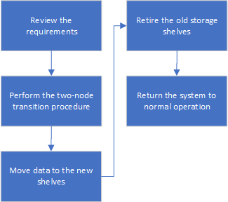

= Transition sans interruption de la FC MetroCluster vers l'IP MetroCluster lors de la désactivation des tiroirs de stockage (ONTAP 9.8 et versions ultérieures)
:allow-uri-read: 
:icons: font
:imagesdir: ../media/

[role="lead"]
Avec ONTAP 9.8, vous pouvez effectuer la transition d'une configuration FC MetroCluster à deux nœuds sans interruption vers une configuration IP MetroCluster à quatre nœuds et retirer les tiroirs de stockage existants. Elle comprend des étapes pour déplacer les données des tiroirs disques existants vers la nouvelle configuration, puis retirer les anciens tiroirs.

* Cette procédure permet de désactiver les tiroirs de stockage existants et de déplacer toutes les données vers les nouveaux tiroirs de la configuration IP MetroCluster.
* Les tiroirs de stockage existants doivent être pris en charge par les nouveaux nœuds IP MetroCluster.
* Cette procédure est prise en charge sur les systèmes exécutant ONTAP 9.8 et versions ultérieures.
* Cette procédure est perturbatrice.
* Cette procédure s'applique uniquement à une configuration FC MetroCluster à deux nœuds.
+
Si vous disposez d'une configuration FC MetroCluster à quatre nœuds, reportez-vous à la section link:concept_choosing_your_transition_procedure_mcc_transition.html["Choix de la procédure de transition"].

* Vous devez répondre à toutes les exigences et suivre toutes les étapes de la procédure.

== Exigences de transition lors de la retrait d'anciens tiroirs

Avant de lancer le processus de transition, vous devez vérifier que la configuration FC MetroCluster existante répond aux exigences.

* Il doit s'agir d'une configuration Fabric-Attached à deux nœuds ou Stretch MetroCluster et tous les nœuds doivent exécuter ONTAP 9.8 ou une version ultérieure.
+
Les nouveaux modules de contrôleur IP MetroCluster doivent exécuter la même version de ONTAP 9.8.

* Les plateformes existantes et nouvelles doivent être prises en charge pour la transition.
+
link:concept_supported_platforms_for_transition.html["Plateformes prises en charge pour une transition sans interruption"]

* Il doit répondre à toutes les exigences et à tous les câbles, comme décrit dans les _MetroCluster installation and Configuration Guides_.
+
link:../install-fc/index.html["Installation et configuration de la solution Fabric-Attached MetroCluster"]

La nouvelle configuration doit également répondre aux exigences suivantes :

* Les nouveaux modèles de plateforme IP MetroCluster doivent prendre en charge les anciens modèles de tiroirs de stockage.
+
https://hwu.netapp.com["NetApp Hardware Universe"^]

* En fonction des disques de spare disponibles dans les tiroirs existants, il faut ajouter des disques supplémentaires.
+
Cela peut nécessiter des tiroirs disques supplémentaires.

+
Vous devez disposer de 14 à 18 disques supplémentaires pour chaque contrôleur :

+
** Trois pools de disques 0
** Trois disques du pool 1
** Deux disques de secours
** Six à dix lecteurs pour le volume système

* Vous devez vous assurer que la configuration, y compris les nouveaux nœuds, ne dépasse pas les limites de plateforme pour la configuration, y compris le nombre de disques, la capacité de la taille de l'agrégat racine, etc
+
Ces informations sont disponibles pour chaque modèle de plate-forme à l'adresse https://hwu.netapp.com["NetApp Hardware Universe"^]

Vous devez disposer d'un accès à distance à la console pour les six nœuds depuis le site MetroCluster ou prévoir un déplacement entre les sites, selon la procédure à suivre.

== Workflow de transition fluide lors du déplacement des données et de la désactivation des anciens tiroirs de stockage

Vous devez suivre le flux de travail spécifique pour assurer une transition réussie.

Pendant que vous préparez la transition, planifiez les déplacements entre les sites. Notez qu'une fois les nœuds distants mis en rack et câblés, vous devez accéder aux nœuds à partir d'un terminal série. L'accès au processeur de service n'est pas disponible tant que les nœuds ne sont pas configurés.

== Transition de la configuration

Vous devez suivre la procédure de transition détaillée.

Dans les étapes suivantes, vous êtes dirigé vers d'autres procédures. Vous devez effectuer les étapes de chaque procédure référencée dans l'ordre indiqué.

.Étapes
. Planifiez le mappage des ports à l'aide des étapes de la section link:../transition/concept_requirements_for_fc_to_ip_transition_2n_mcc_transition.html#mapping-ports-from-the-metrocluster-fc-nodes-to-the-metrocluster-ip-nodes["Mappage des ports des nœuds FC MetroCluster sur les nœuds IP MetroCluster"].
. Préparez les contrôleurs IP MetroCluster à l'aide des étapes de la section link:../transition/concept_requirements_for_fc_to_ip_transition_2n_mcc_transition.html#preparing-the-metrocluster-ip-controllers["Préparation des contrôleurs IP MetroCluster"].
. Vérifier l'état de santé de la configuration MetroCluster FC.
+
Suivez les étapes de la section link:../transition/concept_requirements_for_fc_to_ip_transition_2n_mcc_transition.html#verifying-the-health-of-the-metrocluster-fc-configuration["Vérification de l'état de santé de la configuration MetroCluster FC"].

. Collecte des informations de la configuration FC MetroCluster
+
Suivez les étapes de la section link:task_transition_the_mcc_fc_nodes_2n_mcc_transition_supertask.html#gathering-information-from-the-existing-controller-modules-before-the-transition["Collecte des informations des modules de contrôleur existants avant la transition"].

. Retirer le disjoncteur d'attache si nécessaire
+
Suivez les étapes de la section link:../transition/concept_requirements_for_fc_to_ip_transition_2n_mcc_transition.html#verifying-the-health-of-the-metrocluster-fc-configuration["Suppression de la configuration existante du logiciel disjoncteur d'attache ou autre logiciel de surveillance"].

. Préparez et supprimez les nœuds MetroCluster FC existants.
+
Suivez les étapes de la section link:task_transition_the_mcc_fc_nodes_2n_mcc_transition_supertask.html["Transition des nœuds FC MetroCluster"].

. Connectez les nouveaux nœuds IP MetroCluster.
+
Suivez les étapes de la section link:task_connect_the_mcc_ip_controller_modules_2n_mcc_transition_supertask.html["Connexion des modules de contrôleur IP MetroCluster"].

. Configurez les nouveaux nœuds IP MetroCluster et effectuez la transition.
+
Suivez les étapes de la section link:task_configure_the_new_nodes_and_complete_transition.html["Configuration des nouveaux nœuds et fin de la transition"].

== Migration des agrégats racine

Une fois la transition terminée, migrez les agrégats racine existants restants de la configuration MetroCluster FC vers les nouveaux tiroirs de la configuration IP MetroCluster.

Cette tâche déplace les agrégats racine des nœuds_A_1-FC et node_B_1-FC vers les tiroirs disques des nouveaux contrôleurs IP MetroCluster :

.Étapes
. Assigner 0 disques pool sur le nouveau tiroir de stockage local au contrôleur dont la racine est migrée (par exemple, si la racine du nœud_A_1-FC est en cours de migration, affecter 0 disques pool sur le nouveau tiroir au nœud_A_1-IP)
+
Notez que la migration _supprime et ne recrée pas le miroir racine_, donc il n'est pas nécessaire d'affecter les disques du pool 1 avant d'exécuter la commande migration

. Définissez le mode de privilège sur Avancé :
+
`set priv advanced`

. Migrer l'agrégat racine :
+
`system node migrate-root -node node-name -disklist disk-id1,disk-id2,diskn -raid-type raid-type`

+
** Le nom du nœud est le nœud sur lequel l'agrégat racine est en cours de migration.
** L'identifiant de disque identifie le pool 0 disques sur le nouveau shelf.
** Le type raid est normalement le même que le type raid de l'agrégat racine existant.
** Vous pouvez utiliser la commande `job show -idjob-id-instance` pour vérifier l'état de la migration, où id-travail est la valeur fournie lors de l'émission de la commande migrate-root.
+
Par exemple, si l'agrégat racine du nœud_A_1-FC comprenait trois disques avec raid_dp, la commande suivante devrait être utilisée pour migrer la racine vers un nouveau tiroir 11 :

+
[listing]
----
system node migrate-root -node node_A_1-IP -disklist 3.11.0,3.11.1,3.11.2 -raid-type raid_dp
----

. Attendez la fin de l'opération de migration et le nœud redémarre automatiquement.
. Attribuez 1 disques au pool pour l'agrégat racine sur un nouveau shelf directement connecté au cluster distant.
. Mettre en miroir l'agrégat racine migré.
. Attendre la fin de la resynchronisation de l'agrégat racine.
+
Vous pouvez utiliser la commande Storage aggrégats show pour vérifier l'état de synchronisation des agrégats.

. Répétez ces étapes pour l'autre agrégat root.

== Migration des agrégats de données

Créez des agrégats de données sur les nouveaux tiroirs et utilisez le déplacement des volumes pour transférer les volumes de données des anciens tiroirs vers les agrégats du nouveau tiroir.

. Déplacez les volumes de données vers des agrégats des nouveaux contrôleurs, un volume à la fois.
+
http://docs.netapp.com/platstor/topic/com.netapp.doc.hw-upgrade-controller/GUID-AFE432F6-60AD-4A79-86C0-C7D12957FA63.html["Création d'un agrégat et déplacement des volumes vers les nouveaux nœuds"^]

== Retrait des tiroirs déplacés du nœud_A_1-FC et du nœud_A_2-FC

Vous retirez les anciens tiroirs de stockage de la configuration FC MetroCluster d'origine. Ces tiroirs étaient initialement détenus par les nœuds node_A_1-FC et node_A_2-FC.

. Identifiez les agrégats des anciens tiroirs du cluster_B qui doivent être supprimés.
+
Dans cet exemple, les agrégats de données suivants sont hébergés sur le cluster MetroCluster FC cluster_B et doivent être supprimés : aggr_Data_a1 et aggr_Data_a2.

+

NOTE: Vous devez effectuer les étapes permettant d'identifier, de mettre hors ligne et de supprimer les agrégats de données des tiroirs. L'exemple est pour un seul cluster.

+
[listing]
----
cluster_B::> aggr show

Aggregate     Size Available Used% State   #Vols  Nodes            RAID Status
--------- -------- --------- ----- ------- ------ ---------------- ------------
aggr0_node_A_1-FC
           349.0GB   16.83GB   95% online       1 node_A_1-IP      raid_dp,
                                                                   mirrored,
                                                                   normal
aggr0_node_A_2-IP
           349.0GB   16.83GB   95% online       1 node_A_2-IP      raid_dp,
                                                                   mirrored,
                                                                   normal
...
8 entries were displayed.

cluster_B::>
----
. Vérifiez si les agrégats de données sont dotés de volumes MDV_aud et supprimez-les avant de supprimer les agrégats.
+
Vous devez supprimer les volumes MDV_aud car ils ne peuvent pas être déplacés.

. Mettre chacun des agrégats hors ligne, puis les supprimer :
+
.. Mettre l'agrégat hors ligne :
+
`storage aggregate offline -aggregate aggregate-name`

+
L'exemple suivant montre l'agrégat node_B_1_aggr0 mis hors ligne :

+
[listing]
----
cluster_B::> storage aggregate offline -aggregate node_B_1_aggr0

Aggregate offline successful on aggregate: node_B_1_aggr0
----
.. Supprimer l'agrégat :
+
`storage aggregate delete -aggregate aggregate-name`

+
Vous pouvez détruire le plex lorsque vous y êtes invité.

+
L'exemple suivant montre l'agrégat node_B_1_aggr0 en cours de suppression.

+
[listing]
----
cluster_B::> storage aggregate delete -aggregate node_B_1_aggr0
Warning: Are you sure you want to destroy aggregate "node_B_1_aggr0"? {y|n}: y
[Job 123] Job succeeded: DONE

cluster_B::>
----

. Après avoir supprimé tous les agrégats, mettez hors tension, déconnectez et retirez les tiroirs.
. Répétez la procédure ci-dessus pour retirer les tiroirs cluster_A.

== Fin de la transition

Lorsque les anciens modules de contrôleur sont supprimés, vous pouvez terminer le processus de transition.

.Étape
. Terminez le processus de transition.
+
Suivez les étapes de la section link:task_return_the_system_to_normal_operation_2n_mcc_transition_supertask.html["Rétablir le fonctionnement normal du système"].

