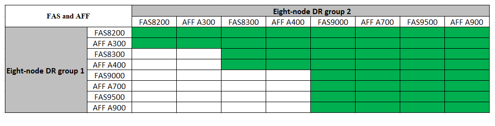

= Extension d'une configuration FC MetroCluster à quatre nœuds à une configuration à huit nœuds
:allow-uri-read: 
:icons: font
:imagesdir: ../media/

[role="lead"]
L'extension d'une configuration FC MetroCluster à quatre nœuds à une configuration FC MetroCluster à huit nœuds implique l'ajout de deux contrôleurs à chaque cluster pour former une seconde paire haute disponibilité sur chaque site MetroCluster, puis l'exécution de la configuration FC MetroCluster.

.Description de la tâche
* Les nœuds doivent exécuter ONTAP 9 dans une configuration MetroCluster FC.
+
Cette procédure n'est pas prise en charge sur les versions antérieures de ONTAP ou dans les configurations MetroCluster IP.

* La configuration FC MetroCluster existante doit être saine.
* L'équipement que vous ajoutez doit être pris en charge et répondre à toutes les exigences décrites dans link:../install-fc/index.html["Installation et configuration de la solution Fabric-Attached MetroCluster"]
* Vous devez disposer de ports de commutateurs FC disponibles pour prendre en charge les nouveaux contrôleurs et les nouveaux ponts.
* Vous avez besoin du mot de passe d'administration et de l'accès à un serveur FTP ou SCP.
* Cette procédure s'applique uniquement aux configurations MetroCluster FC.
* Cette procédure ne génère aucune interruption et prend environ un jour (sauf le rack et la pile) lors de la mise à zéro des disques.

Avant d'effectuer cette procédure, la configuration FC MetroCluster se compose de quatre nœuds, avec une paire haute disponibilité sur chaque site :

image::../media/mcc_dr_groups_4_node.gif[mcc dr groups, nœud 4]

Au terme de cette procédure, la configuration FC MetroCluster est constituée de deux paires HA sur chaque site :

image::../media/mcc_dr_groups_8_node.gif[mcc dr groups, nœud 8]

Les deux sites doivent être étendus de la même manière. Une configuration MetroCluster FC ne peut pas comprendre un nombre irrégulier de nœuds.

== Combinaisons de plateformes prises en charge lors de l'ajout d'un deuxième groupe de reprise après incident

Le tableau suivant présente les combinaisons de plateformes prises en charge pour les configurations FC MetroCluster à 8 nœuds.

[IMPORTANT]
====
* Les combinaisons indiquées dans ce tableau s'appliquent uniquement aux configurations à huit nœuds standard ou permanentes.
* Les combinaisons de plates-formes de ce tableau *ne* s'appliquent pas si vous utilisez les procédures de transition ou d'actualisation.
* Tous les nœuds d'un groupe de reprise après incident doivent être du même type et de la même configuration.

====

