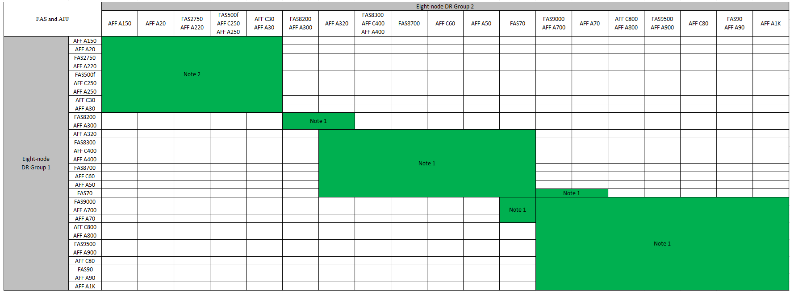

= Développez une configuration MetroCluster IP
:allow-uri-read: 
:icons: font
:imagesdir: ../media/

[role="lead"]
Selon votre version de ONTAP, vous pouvez étendre votre configuration MetroCluster IP en ajoutant quatre nouveaux nœuds en tant que nouveau groupe de reprise sur incident.

À partir de ONTAP 9.13.1, vous pouvez développer temporairement une configuration MetroCluster à huit nœuds pour actualiser les contrôleurs et le stockage. Voir link:task_refresh_4n_mcc_ip.html["Actualisation d'une configuration IP MetroCluster à quatre ou huit nœuds (ONTAP 9.8 et versions ultérieures)"] pour en savoir plus.

Depuis ONTAP 9.9.1, vous pouvez ajouter quatre nouveaux nœuds à la configuration IP de MetroCluster en tant que second groupe de reprise après incident. Cela crée une configuration MetroCluster à huit nœuds.

.Avant de commencer
* L'ancien et le nouveau nœud doivent exécuter la même version de ONTAP.
* Cette procédure décrit les étapes requises pour ajouter un groupe DR à quatre nœuds à une configuration IP MetroCluster existante. Si vous actualisez une configuration à huit nœuds, vous devez répéter l'intégralité de la procédure pour chaque groupe de reprise après incident, en l'ajoutant un à la fois.
* Vérifier que les anciens et nouveaux modèles de plate-forme sont pris en charge pour le mélange de plate-forme.
+
https://hwu.netapp.com["NetApp Hardware Universe"^]

* Vérifiez que les anciens et les nouveaux modèles de plate-forme sont pris en charge par les commutateurs IP.
+
https://hwu.netapp.com["NetApp Hardware Universe"^]

* Si vous l'êtes link:task_refresh_4n_mcc_ip.html["Actualisation d'une configuration IP MetroCluster à quatre ou huit nœuds"], les nouveaux nœuds doivent disposer d'un espace de stockage suffisant pour prendre en charge les données des anciens nœuds, ainsi que les disques appropriés pour les agrégats racine et les disques de secours.
* Vérifiez qu'un domaine de diffusion par défaut est créé sur les anciens nœuds.
+
Lorsque vous ajoutez de nouveaux nœuds à un cluster existant sans broadcast domain par défaut, les LIFs de node-management sont créées pour les nouveaux nœuds à l'aide d'UUID (Universal unique identifier) à la place des noms attendus. Pour plus d'informations, consultez l'article de la base de connaissances https://kb.netapp.com/onprem/ontap/os/Node_management_LIFs_on_newly-added_nodes_generated_with_UUID_names["Les LIF de gestion de nœuds sur les nouveaux nœuds ajoutés sont générées avec des noms UUID"^].

== Activer la journalisation de la console

NetApp vous recommande vivement d'activer la journalisation de la console sur les périphériques que vous utilisez et d'effectuer les actions suivantes lors de l'exécution de cette procédure :

* Laissez AutoSupport activé pendant la maintenance.
* Déclencher un message AutoSupport de maintenance avant et après la maintenance pour désactiver la création de dossiers pendant la durée de l'activité de maintenance.
+
Consultez l'article de la base de connaissances link:https://kb.netapp.com/Support_Bulletins/Customer_Bulletins/SU92["Comment supprimer la création automatique de dossier pendant les fenêtres de maintenance planifiées"^].

* Activer la journalisation de session pour toute session CLI. Pour obtenir des instructions sur l'activation de la journalisation des sessions, consultez la section « consignation des sorties de session » de l'article de la base de connaissances link:https://kb.netapp.com/on-prem/ontap/Ontap_OS/OS-KBs/How_to_configure_PuTTY_for_optimal_connectivity_to_ONTAP_systems["Comment configurer PuTTY pour une connectivité optimale aux systèmes ONTAP"^].

== Exemple de dénomination dans cette procédure

Cette procédure utilise des exemples de noms au cours de l'ensemble pour identifier les groupes de reprise sur incident, les nœuds et les commutateurs impliqués.

|===

| Groupes de reprise sur incident | Cluster_A au site_A | Cluster_B au niveau du site_B 

 a| 
dr_group_1-old
 a| 
* Node_A_1-Old
* Node_A_2-Old

 a| 
* Node_B_1-Old
* Node_B_2-Old

 a| 
dr_group_2-new
 a| 
* Node_A_3-New
* Node_A_4-New

 a| 
* Node_B_3-New
* Node_B_4-New

|===

== Combinaisons de plateformes prises en charge lors de l'ajout d'un deuxième groupe de reprise après incident

Les tableaux suivants présentent les combinaisons de plateformes prises en charge pour les configurations IP MetroCluster à huit nœuds.

[IMPORTANT]
====
* Tous les nœuds de la configuration MetroCluster doivent exécuter la même version de ONTAP. Par exemple, si vous avez une configuration à huit nœuds, les huit nœuds doivent exécuter la même version de ONTAP. Reportez-vous au link:https://hwu.netapp.com["Hardware Universe"^]pour connaître la version minimale de ONTAP prise en charge pour votre combinaison.
* Les combinaisons indiquées dans ce tableau s'appliquent uniquement aux configurations à huit nœuds standard ou permanentes.
* Les combinaisons de plates-formes indiquées dans ce tableau *ne* s'appliquent pas si vous utilisez les procédures de transition ou d'actualisation.
* Tous les nœuds d'un groupe de reprise après incident doivent être du même type et de la même configuration.

====
.Combinaisons d'extension IP AFF et FAS MetroCluster prises en charge
Le tableau suivant présente les combinaisons de plateformes prises en charge pour l'extension d'un système AFF ou FAS dans une configuration IP MetroCluster :

* *Note 1* : ONTAP 9.9.1 ou version ultérieure (ou la version minimale de ONTAP prise en charge sur la plate-forme) est requise pour ces combinaisons.
* *Note 2* : ONTAP 9.13.1 ou version ultérieure (ou la version minimale de ONTAP prise en charge sur la plate-forme) est requise pour ces combinaisons.

.Combinaisons d'extension IP ASA MetroCluster prises en charge
Le tableau suivant présente les combinaisons de plateformes prises en charge pour l'extension d'un système ASA dans une configuration MetroCluster IP :

image::../media/8node_comb_ip_asa.png[Combinaisons de plateformes pour configurations à 8 nœuds]

== Envoi d'un message AutoSupport personnalisé avant la maintenance

Avant d'effectuer la maintenance, vous devez envoyer un message AutoSupport pour informer le support technique de NetApp que la maintenance est en cours. Informer le support technique que la maintenance est en cours empêche l'ouverture d'un dossier en supposant une interruption de l'activité.

.Description de la tâche
Cette tâche doit être effectuée sur chaque site MetroCluster.

.Étapes
. Pour éviter la génération automatique de dossiers de demande de support, envoyez un message AutoSupport pour indiquer que la mise à niveau est en cours.
+
.. Exécutez la commande suivante :
+
`system node autosupport invoke -node * -type all -message "MAINT=10h Upgrading <old-model> to <new-model>`

+
Cet exemple spécifie une fenêtre de maintenance de 10 heures. Selon votre plan, il est possible que vous souhaitiez accorder plus de temps.

+
Si la maintenance est terminée avant le temps écoulé, vous pouvez appeler un message AutoSupport indiquant la fin de la période de maintenance :

+
`system node autosupport invoke -node * -type all -message MAINT=end`

.. Répétez la commande sur le cluster partenaire.

== Considérations relatives aux VLAN lors de l'ajout d'un nouveau groupe DR

* Les considérations VLAN suivantes s'appliquent lors de l'extension d'une configuration MetroCluster IP :
+
Certaines plates-formes utilisent un VLAN pour l'interface IP de MetroCluster. Par défaut, chacun des deux ports utilise un VLAN différent : 10 et 20.

+
Si elle est prise en charge, vous pouvez également spécifier un VLAN différent (non par défaut) supérieur à 100 (entre 101 et 4095) en utilisant le `-vlan-id` paramètre de la `metrocluster configuration-settings interface create` commande.

+
Les plates-formes suivantes ne prennent pas en charge le `-vlan-id` paramètre :

+
** FAS8200 ET AFF A300
** AFF A320
** FAS9000 et AFF A700
** AFF C800, ASA C800, AFF A800 et ASA A800
+
Toutes les autres plates-formes prennent en charge le `-vlan-id` paramètre.

+
Les affectations de VLAN par défaut et valides dépendent du fait que la plate-forme prend en charge le `-vlan-id` paramètre :

+
[role="tabbed-block"]
====
.Les plateformes qui prennent en charge <code>-vlan-</code>
--
VLAN par défaut :

*** Lorsque le `-vlan-id` paramètre n'est pas spécifié, les interfaces sont créées avec le VLAN 10 pour les ports "A" et le VLAN 20 pour les ports "B".
*** Le VLAN spécifié doit correspondre au VLAN sélectionné dans la FCR.

Plages VLAN valides :

*** VLAN 10 et 20 par défaut
*** VLAN 101 et supérieur (entre 101 et 4095)

--
.Les plateformes qui ne prennent pas en charge <code>-vlan-</code>
--
VLAN par défaut :

*** Sans objet L'interface ne nécessite pas la spécification d'un VLAN sur l'interface MetroCluster. Le port du commutateur définit le VLAN utilisé.

Plages VLAN valides :

*** Tous les VLAN non explicitement exclus lors de la génération de la FCR. Le RCF vous avertit si le VLAN n'est pas valide.

--
====

* Les deux groupes de reprise sur incident utilisent les mêmes VLAN lorsque vous effectuez un développement à partir d'une configuration à quatre nœuds vers une configuration MetroCluster à huit nœuds.
* Si les deux groupes DR ne peuvent pas être configurés à l'aide du même VLAN, vous devez mettre à niveau le groupe DR qui ne prend pas en charge `vlan-id` le paramètre pour utiliser un VLAN pris en charge par l'autre groupe DR.
* Selon votre version de ONTAP, vous pouvez modifier certaines propriétés de l'interface IP de MetroCluster après la configuration initiale. Reportez-vous link:../maintain/task-modify-ip-netmask-properties.html["Modifiez les propriétés d'une interface IP MetroCluster"] à pour plus de détails sur ce qui est pris en charge.

== Vérification de l'état de santé de la configuration MetroCluster

Vous devez vérifier l'intégrité et la connectivité de la configuration MetroCluster avant d'effectuer l'extension.

.Étapes
. Vérifier le fonctionnement de la configuration MetroCluster dans ONTAP :
+
.. Vérifier si le système est multipathed :
+
`node run -node <node-name> sysconfig -a`

.. Vérifier si des alertes d'intégrité sont disponibles sur les deux clusters :
+
`system health alert show`

.. Vérifier la configuration MetroCluster et que le mode opérationnel est normal :
+
`metrocluster show`

.. Effectuer une vérification MetroCluster :
+
`metrocluster check run`

.. Afficher les résultats de la vérification MetroCluster :
+
`metrocluster check show`

.. Exécutez Config Advisor.
+
https://mysupport.netapp.com/site/tools/tool-eula/activeiq-configadvisor["Téléchargement NetApp : Config Advisor"]

.. Une fois Config Advisor exécuté, vérifiez les résultats de l'outil et suivez les recommandations fournies dans la sortie pour résoudre tous les problèmes détectés.

. Vérifiez que le cluster fonctionne correctement :
+
`cluster show`

+
[listing]
----
cluster_A::> cluster show
Node           Health  Eligibility
-------------- ------  -----------
node_A_1       true    true
node_A_2       true    true

cluster_A::>
----
. Vérifier que tous les ports du cluster sont bien :
+
`network port show -ipspace Cluster`

+
[listing]
----
cluster_A::> network port show -ipspace Cluster

Node: node_A_1-old

                                                  Speed(Mbps) Health
Port      IPspace      Broadcast Domain Link MTU  Admin/Oper  Status
--------- ------------ ---------------- ---- ---- ----------- --------
e0a       Cluster      Cluster          up   9000  auto/10000 healthy
e0b       Cluster      Cluster          up   9000  auto/10000 healthy

Node: node_A_2-old

                                                  Speed(Mbps) Health
Port      IPspace      Broadcast Domain Link MTU  Admin/Oper  Status
--------- ------------ ---------------- ---- ---- ----------- --------
e0a       Cluster      Cluster          up   9000  auto/10000 healthy
e0b       Cluster      Cluster          up   9000  auto/10000 healthy

4 entries were displayed.

cluster_A::>
----
. Vérifier que toutes les LIFs de cluster sont opérationnelles :
+
`network interface show -vserver Cluster`

+
Chaque LIF de cluster doit afficher « true » pour is Home et avoir un Status Admin/Oper of up/up »

+
[listing]
----
cluster_A::> network interface show -vserver cluster

            Logical      Status     Network          Current       Current Is
Vserver     Interface  Admin/Oper Address/Mask       Node          Port    Home
----------- ---------- ---------- ------------------ ------------- ------- -----
Cluster
            node_A_1-old_clus1
                       up/up      169.254.209.69/16  node_A_1   e0a     true
            node_A_1-old_clus2
                       up/up      169.254.49.125/16  node_A_1   e0b     true
            node_A_2-old_clus1
                       up/up      169.254.47.194/16  node_A_2   e0a     true
            node_A_2-old_clus2
                       up/up      169.254.19.183/16  node_A_2   e0b     true

4 entries were displayed.

cluster_A::>
----
. Vérifiez que la fonction de restauration automatique est activée sur l'ensemble des LIFs du cluster :
+
`network interface show -vserver Cluster -fields auto-revert`

+
[listing]
----
cluster_A::> network interface show -vserver Cluster -fields auto-revert

          Logical
Vserver   Interface     Auto-revert
--------- ------------- ------------
Cluster
           node_A_1-old_clus1
                        true
           node_A_1-old_clus2
                        true
           node_A_2-old_clus1
                        true
           node_A_2-old_clus2
                        true

    4 entries were displayed.

cluster_A::>
----

== Suppression de la configuration des applications de surveillance

Si la configuration existante est contrôlée avec le logiciel MetroCluster Tiebreaker, le médiateur ONTAP ou d'autres applications tierces (par exemple, ClusterLion) qui peuvent lancer un basculement, vous devez supprimer la configuration MetroCluster du logiciel de surveillance avant la mise à niveau.

.Étapes
. Supprimez la configuration MetroCluster existante du logiciel disjoncteur d'attache, du médiateur ou d'autres logiciels pouvant initier le basculement.
+
[cols="2*"]
|===

| Si vous utilisez... | Utilisez cette procédure... 

 a| 
Disjoncteur d'attache
 a| 
link:../tiebreaker/concept_configuring_the_tiebreaker_software.html#commands-for-modifying-metrocluster-tiebreaker-configurations["Suppression des configurations MetroCluster"].

 a| 
Médiateur
 a| 
Exécutez la commande suivante depuis l'invite ONTAP :

`metrocluster configuration-settings mediator remove`

 a| 
Applications tierces
 a| 
Reportez-vous à la documentation du produit.

|===
. Supprimez la configuration MetroCluster existante de toute application tierce pouvant effectuer le basculement.
+
Reportez-vous à la documentation de l'application.

== Préparation des nouveaux modules de contrôleur

Vous devez préparer les quatre nouveaux nœuds MetroCluster et installer la version correcte de ONTAP.

.Description de la tâche
Cette tâche doit être effectuée sur chacun des nouveaux nœuds :

* Node_A_3-New
* Node_A_4-New
* Node_B_3-New
* Node_B_4-New

Dans ces étapes, vous effacez la configuration sur les nœuds et désactivez la zone de la boîte aux lettres sur les nouveaux lecteurs.

.Étapes
. Installez les nouveaux contrôleurs.
. Reliez les nouveaux nœuds IP MetroCluster aux commutateurs IP, comme illustré à la link:../install-ip/using_rcf_generator.html["Câblez les commutateurs IP"].
. Configurez les nœuds IP MetroCluster à l'aide des procédures suivantes :
+
.. link:../install-ip/task_sw_config_gather_info.html["Collectez les informations requises"]
.. link:../install-ip/task_sw_config_restore_defaults.html["Restaurez les paramètres par défaut du système sur un module de contrôleur"]
.. link:../install-ip/task_sw_config_verify_haconfig.html["Vérifiez l'état des composants HA-config"]
.. link:../install-ip/task_sw_config_assign_pool0.html#manually-assigning-drives-for-pool-0-ontap-9-4-and-later["Attribution manuelle de disques pour le pool 0 (ONTAP 9.4 et versions ultérieures)"]

. Depuis le mode maintenance, lancer la commande halt pour quitter le mode Maintenance, puis lancer la commande boot_ontap pour démarrer le système et obtenir le setup du cluster.
+
Ne terminez pas encore l'assistant de cluster ou l'assistant de nœud pour le moment.

== Mettre à niveau les fichiers RCF

Si vous installez un nouveau firmware du commutateur, vous devez installer le micrologiciel du commutateur avant de mettre à niveau le fichier RCF.

.Description de la tâche
Cette procédure perturbe le trafic sur le commutateur où le fichier RCF est mis à niveau. Le trafic reprend lorsque le nouveau fichier RCF est appliqué.

.Étapes
. Vérification de l'état de santé de la configuration.
+
.. Vérifiez que les composants MetroCluster sont sains :
+
`metrocluster check run`

+
[listing]
----
cluster_A::*> metrocluster check run

----

+
L'opération s'exécute en arrière-plan.

+
.. Après le `metrocluster check run` opération terminée, exécution `metrocluster check show` pour afficher les résultats.
+
Après environ cinq minutes, les résultats suivants s'affichent :

+
[listing]
----
-----------
::*> metrocluster check show

Component           Result
------------------- ---------
nodes               ok
lifs                ok
config-replication  ok
aggregates          ok
clusters            ok
connections         not-applicable
volumes             ok
7 entries were displayed.
----
.. Vérifier l'état de l'opération de vérification MetroCluster en cours :
+
`metrocluster operation history show -job-id 38`

.. Vérifiez qu'il n'y a pas d'alerte de santé :
+
`system health alert show`

. Préparez les commutateurs IP pour l'application des nouveaux fichiers RCF.
+
Suivez les étapes pour votre fournisseur de commutateur :

+
** link:../install-ip/task_switch_config_broadcom.html["Réinitialisez les paramètres par défaut du commutateur IP Broadcom"]
** link:../install-ip/task_switch_config_cisco.html["Réinitialisez le commutateur IP Cisco sur les paramètres d'usine par défaut"]
** link:../install-ip/task_switch_config_nvidia.html["Réinitialisez les paramètres par défaut du commutateur NVIDIA IP SN2100"]

. Téléchargez et installez le fichier RCF IP, selon votre fournisseur de commutateur.
+

NOTE: Mettre à jour les interrupteurs dans l'ordre suivant : Switch_A_1, Switch_B_1, Switch_A_2, Switch_B_2

+
** link:../install-ip/task_switch_config_broadcom.html["Téléchargez et installez les fichiers RCF IP Broadcom"]
** link:../install-ip/task_switch_config_cisco.html["Téléchargez et installez les fichiers RCF IP Cisco"]
** link:../install-ip/task_switch_config_nvidia.html["Téléchargez et installez les fichiers RCF IP de NVIDIA"]
+

NOTE: Si vous disposez d'une configuration réseau L2 partagée ou L3, il se peut que vous deviez ajuster les ports ISL sur les commutateurs intermédiaire/client. Le mode du port du commutateur peut passer du mode d'accès au mode de jonction. Ne procédez à la mise à niveau de la deuxième paire de commutateurs (A_2, B_2) que si la connectivité réseau entre les commutateurs A_1 et B_1 est pleinement opérationnelle et que le réseau fonctionne correctement.

== Reliez les nouveaux nœuds aux clusters

Vous devez ajouter les quatre nouveaux nœuds IP MetroCluster à la configuration MetroCluster existante.

.Description de la tâche
Vous devez effectuer cette tâche sur les deux clusters.

.Étapes
. Ajoutez les nouveaux nœuds IP MetroCluster à la configuration MetroCluster existante.
+
.. Associez le premier nouveau nœud IP MetroCluster (node_A_1-New) à la configuration IP MetroCluster existante.
+
[listing]
----

Welcome to the cluster setup wizard.

You can enter the following commands at any time:
  "help" or "?" - if you want to have a question clarified,
  "back" - if you want to change previously answered questions, and
  "exit" or "quit" - if you want to quit the cluster setup wizard.
     Any changes you made before quitting will be saved.

You can return to cluster setup at any time by typing "cluster setup".
To accept a default or omit a question, do not enter a value.

This system will send event messages and periodic reports to NetApp Technical
Support. To disable this feature, enter
autosupport modify -support disable
within 24 hours.

Enabling AutoSupport can significantly speed problem determination and
resolution, should a problem occur on your system.
For further information on AutoSupport, see:
http://support.netapp.com/autosupport/

Type yes to confirm and continue {yes}: yes

Enter the node management interface port [e0M]: 172.17.8.93

172.17.8.93 is not a valid port.

The physical port that is connected to the node management network. Examples of
node management ports are "e4a" or "e0M".

You can type "back", "exit", or "help" at any question.

Enter the node management interface port [e0M]:
Enter the node management interface IP address: 172.17.8.93
Enter the node management interface netmask: 255.255.254.0
Enter the node management interface default gateway: 172.17.8.1
A node management interface on port e0M with IP address 172.17.8.93 has been created.

Use your web browser to complete cluster setup by accessing https://172.17.8.93

Otherwise, press Enter to complete cluster setup using the command line
interface:

Do you want to create a new cluster or join an existing cluster? {create, join}:
join

Existing cluster interface configuration found:

Port    MTU     IP              Netmask
e0c     9000    169.254.148.217 255.255.0.0
e0d     9000    169.254.144.238 255.255.0.0

Do you want to use this configuration? {yes, no} [yes]: yes
.
.
.
----
.. Associez le second nœud IP MetroCluster (node_A_2-New) à la configuration IP MetroCluster existante.

. Répétez ces étapes pour joindre le noeud_B_1-New et le noeud_B_2-New à cluster_B.

== Configuration des LIFs intercluster, création des interfaces MetroCluster, et mise en miroir des agrégats racines

Vous devez créer des LIF de peering de cluster, créer les interfaces MetroCluster sur les nouveaux nœuds IP MetroCluster.

.Description de la tâche
* Le port home utilisé dans les exemples est spécifique à la plate-forme. Vous devez utiliser le port home spécifique à votre plate-forme de nœuds IP MetroCluster.
* Consultez les informations de la section <<Considérations relatives aux VLAN lors de l'ajout d'un nouveau groupe DR>> avant d'effectuer cette tâche.

.Étapes
. Sur les nouveaux nœuds IP MetroCluster, configurer les LIFs intercluster à l'aide des procédures suivantes :
+
link:../install-ip/task_sw_config_configure_clusters.html#peering-the-clusters["Configuration des LIFs intercluster sur des ports dédiés"]

+
link:../install-ip/task_sw_config_configure_clusters.html#peering-the-clusters["Configuration des LIFs intercluster sur des ports data partagés"]

. Sur chaque site, vérifiez que le peering de cluster est configuré :
+
`cluster peer show`

+
L'exemple suivant montre la configuration de peering de cluster sur cluster_A :

+
[listing]
----
cluster_A:> cluster peer show
Peer Cluster Name         Cluster Serial Number Availability   Authentication
------------------------- --------------------- -------------- --------------
cluster_B                 1-80-000011           Available      ok
----
+
L'exemple suivant montre la configuration de peering de cluster sur cluster_B :

+
[listing]
----
cluster_B:> cluster peer show
Peer Cluster Name         Cluster Serial Number Availability   Authentication
------------------------- --------------------- -------------- --------------
cluster_A                 1-80-000011           Available      ok
cluster_B::>
----
. Créez le groupe DR pour les nœuds IP MetroCluster :
+
`metrocluster configuration-settings dr-group create -partner-cluster`

+
Pour plus d'informations sur les paramètres de configuration et les connexions du MetroCluster, reportez-vous aux sections suivantes :

+
link:../install-ip/concept_considerations_mcip.html["Considérations relatives aux configurations MetroCluster IP"]

+
link:../install-ip/task_sw_config_configure_clusters.html#creating-the-dr-group["Création du groupe DR"]

+
[listing]
----
cluster_A::> metrocluster configuration-settings dr-group create -partner-cluster
cluster_B -local-node node_A_1-new -remote-node node_B_1-new
[Job 259] Job succeeded: DR Group Create is successful.
cluster_A::>
----
. Vérifiez que le groupe DR a été créé.
+
`metrocluster configuration-settings dr-group show`

+
[listing]
----
cluster_A::> metrocluster configuration-settings dr-group show

DR Group ID Cluster                    Node               DR Partner Node
----------- -------------------------- ------------------ ------------------
1           cluster_A
                                       node_A_1-old        node_B_1-old
                                       node_A_2-old        node_B_2-old
            cluster_B
                                       node_B_1-old        node_A_1-old
                                       node_B_2-old        node_A_2-old
2           cluster_A
                                       node_A_1-new        node_B_1-new
                                       node_A_2-new        node_B_2-new
            cluster_B
                                       node_B_1-new        node_A_1-new
                                       node_B_2-new        node_A_2-new
8 entries were displayed.

cluster_A::>
----
. Configurez les interfaces IP MetroCluster pour les nœuds IP MetroCluster nouvellement rejoints :
+
[NOTE]
====
** Si elle est prise en charge, vous pouvez spécifier un VLAN différent (non par défaut) supérieur à 100 (entre 101 et 4095) en utilisant le `-vlan-id` paramètre de la `metrocluster configuration-settings interface create` commande. Reportez-vous <<Considérations relatives aux VLAN lors de l'ajout d'un nouveau groupe DR>> à pour obtenir des informations sur la plate-forme prise en charge
** Vous pouvez configurer les interfaces IP MetroCluster depuis n'importe quel cluster.

====
+
`metrocluster configuration-settings interface create -cluster-name`

+
[listing]
----
cluster_A::> metrocluster configuration-settings interface create -cluster-name cluster_A -home-node node_A_1-new -home-port e1a -address 172.17.26.10 -netmask 255.255.255.0
[Job 260] Job succeeded: Interface Create is successful.

cluster_A::> metrocluster configuration-settings interface create -cluster-name cluster_A -home-node node_A_1-new -home-port e1b -address 172.17.27.10 -netmask 255.255.255.0
[Job 261] Job succeeded: Interface Create is successful.

cluster_A::> metrocluster configuration-settings interface create -cluster-name cluster_A -home-node node_A_2-new -home-port e1a -address 172.17.26.11 -netmask 255.255.255.0
[Job 262] Job succeeded: Interface Create is successful.

cluster_A::> :metrocluster configuration-settings interface create -cluster-name cluster_A -home-node node_A_2-new -home-port e1b -address 172.17.27.11 -netmask 255.255.255.0
[Job 263] Job succeeded: Interface Create is successful.

cluster_A::> metrocluster configuration-settings interface create -cluster-name cluster_B -home-node node_B_1-new -home-port e1a -address 172.17.26.12 -netmask 255.255.255.0
[Job 264] Job succeeded: Interface Create is successful.

cluster_A::> metrocluster configuration-settings interface create -cluster-name cluster_B -home-node node_B_1-new -home-port e1b -address 172.17.27.12 -netmask 255.255.255.0
[Job 265] Job succeeded: Interface Create is successful.

cluster_A::> metrocluster configuration-settings interface create -cluster-name cluster_B -home-node node_B_2-new -home-port e1a -address 172.17.26.13 -netmask 255.255.255.0
[Job 266] Job succeeded: Interface Create is successful.

cluster_A::> metrocluster configuration-settings interface create -cluster-name cluster_B -home-node node_B_2-new -home-port e1b -address 172.17.27.13 -netmask 255.255.255.0
[Job 267] Job succeeded: Interface Create is successful.
----

. Vérifiez que les interfaces IP MetroCluster sont créées :
+
`metrocluster configuration-settings interface show`

+
[listing]
----
cluster_A::>metrocluster configuration-settings interface show

DR                                                                    Config
Group Cluster Node    Network Address Netmask         Gateway         State
----- ------- ------- --------------- --------------- --------------- ---------
1     cluster_A
             node_A_1-old
                 Home Port: e1a
                      172.17.26.10    255.255.255.0   -               completed
                 Home Port: e1b
                      172.17.27.10    255.255.255.0   -               completed
              node_A_2-old
                 Home Port: e1a
                      172.17.26.11    255.255.255.0   -               completed
                 Home Port: e1b
                      172.17.27.11    255.255.255.0   -               completed
      cluster_B
             node_B_1-old
                 Home Port: e1a
                      172.17.26.13    255.255.255.0   -               completed
                 Home Port: e1b
                      172.17.27.13    255.255.255.0   -               completed
              node_B_1-old
                 Home Port: e1a
                      172.17.26.12    255.255.255.0   -               completed
                 Home Port: e1b
                      172.17.27.12    255.255.255.0   -               completed
2     cluster_A
             node_A_3-new
                 Home Port: e1a
                      172.17.28.10    255.255.255.0   -               completed
                 Home Port: e1b
                      172.17.29.10    255.255.255.0   -               completed
              node_A_3-new
                 Home Port: e1a
                      172.17.28.11    255.255.255.0   -               completed
                 Home Port: e1b
                      172.17.29.11    255.255.255.0   -               completed
      cluster_B
             node_B_3-new
                 Home Port: e1a
                      172.17.28.13    255.255.255.0   -               completed
                 Home Port: e1b
                      172.17.29.13    255.255.255.0   -               completed
              node_B_3-new
                 Home Port: e1a
                      172.17.28.12    255.255.255.0   -               completed
                 Home Port: e1b
                      172.17.29.12    255.255.255.0   -               completed
8 entries were displayed.

cluster_A>
----
. Connectez les interfaces IP MetroCluster :
+
`metrocluster configuration-settings connection connect`

+

NOTE: Cette commande peut prendre plusieurs minutes.

+
[listing]
----
cluster_A::> metrocluster configuration-settings connection connect

cluster_A::>
----
. Vérifiez que les connexions sont correctement établies : `metrocluster configuration-settings connection show`
+
[listing]
----
cluster_A::> metrocluster configuration-settings connection show

DR                    Source          Destination
Group Cluster Node    Network Address Network Address Partner Type Config State
----- ------- ------- --------------- --------------- ------------ ------------
1     cluster_A
              node_A_1-old
                 Home Port: e1a
                      172.17.28.10    172.17.28.11    HA Partner   completed
                 Home Port: e1a
                      172.17.28.10    172.17.28.12    DR Partner   completed
                 Home Port: e1a
                      172.17.28.10    172.17.28.13    DR Auxiliary completed
                 Home Port: e1b
                      172.17.29.10    172.17.29.11    HA Partner   completed
                 Home Port: e1b
                      172.17.29.10    172.17.29.12    DR Partner   completed
                 Home Port: e1b
                      172.17.29.10    172.17.29.13    DR Auxiliary completed
              node_A_2-old
                 Home Port: e1a
                      172.17.28.11    172.17.28.10    HA Partner   completed
                 Home Port: e1a
                      172.17.28.11    172.17.28.13    DR Partner   completed
                 Home Port: e1a
                      172.17.28.11    172.17.28.12    DR Auxiliary completed
                 Home Port: e1b
                      172.17.29.11    172.17.29.10    HA Partner   completed
                 Home Port: e1b
                      172.17.29.11    172.17.29.13    DR Partner   completed
                 Home Port: e1b
                      172.17.29.11    172.17.29.12    DR Auxiliary completed

DR                    Source          Destination
Group Cluster Node    Network Address Network Address Partner Type Config State
----- ------- ------- --------------- --------------- ------------ ------------
1     cluster_B
              node_B_2-old
                 Home Port: e1a
                      172.17.28.13    172.17.28.12    HA Partner   completed
                 Home Port: e1a
                      172.17.28.13    172.17.28.11    DR Partner   completed
                 Home Port: e1a
                      172.17.28.13    172.17.28.10    DR Auxiliary completed
                 Home Port: e1b
                      172.17.29.13    172.17.29.12    HA Partner   completed
                 Home Port: e1b
                      172.17.29.13    172.17.29.11    DR Partner   completed
                 Home Port: e1b
                      172.17.29.13    172.17.29.10    DR Auxiliary completed
              node_B_1-old
                 Home Port: e1a
                      172.17.28.12    172.17.28.13    HA Partner   completed
                 Home Port: e1a
                      172.17.28.12    172.17.28.10    DR Partner   completed
                 Home Port: e1a
                      172.17.28.12    172.17.28.11    DR Auxiliary completed
                 Home Port: e1b
                      172.17.29.12    172.17.29.13    HA Partner   completed
                 Home Port: e1b
                      172.17.29.12    172.17.29.10    DR Partner   completed
                 Home Port: e1b
                      172.17.29.12    172.17.29.11    DR Auxiliary completed

DR                    Source          Destination
Group Cluster Node    Network Address Network Address Partner Type Config State
----- ------- ------- --------------- --------------- ------------ ------------
2     cluster_A
              node_A_1-new**
                 Home Port: e1a
                      172.17.26.10    172.17.26.11    HA Partner   completed
                 Home Port: e1a
                      172.17.26.10    172.17.26.12    DR Partner   completed
                 Home Port: e1a
                      172.17.26.10    172.17.26.13    DR Auxiliary completed
                 Home Port: e1b
                      172.17.27.10    172.17.27.11    HA Partner   completed
                 Home Port: e1b
                      172.17.27.10    172.17.27.12    DR Partner   completed
                 Home Port: e1b
                      172.17.27.10    172.17.27.13    DR Auxiliary completed
              node_A_2-new
                 Home Port: e1a
                      172.17.26.11    172.17.26.10    HA Partner   completed
                 Home Port: e1a
                      172.17.26.11    172.17.26.13    DR Partner   completed
                 Home Port: e1a
                      172.17.26.11    172.17.26.12    DR Auxiliary completed
                 Home Port: e1b
                      172.17.27.11    172.17.27.10    HA Partner   completed
                 Home Port: e1b
                      172.17.27.11    172.17.27.13    DR Partner   completed
                 Home Port: e1b
                      172.17.27.11    172.17.27.12    DR Auxiliary completed

DR                    Source          Destination
Group Cluster Node    Network Address Network Address Partner Type Config State
----- ------- ------- --------------- --------------- ------------ ------------
2     cluster_B
              node_B_2-new
                 Home Port: e1a
                      172.17.26.13    172.17.26.12    HA Partner   completed
                 Home Port: e1a
                      172.17.26.13    172.17.26.11    DR Partner   completed
                 Home Port: e1a
                      172.17.26.13    172.17.26.10    DR Auxiliary completed
                 Home Port: e1b
                      172.17.27.13    172.17.27.12    HA Partner   completed
                 Home Port: e1b
                      172.17.27.13    172.17.27.11    DR Partner   completed
                 Home Port: e1b
                      172.17.27.13    172.17.27.10    DR Auxiliary completed
              node_B_1-new
                 Home Port: e1a
                      172.17.26.12    172.17.26.13    HA Partner   completed
                 Home Port: e1a
                      172.17.26.12    172.17.26.10    DR Partner   completed
                 Home Port: e1a
                      172.17.26.12    172.17.26.11    DR Auxiliary completed
                 Home Port: e1b
                      172.17.27.12    172.17.27.13    HA Partner   completed
                 Home Port: e1b
                      172.17.27.12    172.17.27.10    DR Partner   completed
                 Home Port: e1b
                      172.17.27.12    172.17.27.11    DR Auxiliary completed
48 entries were displayed.

cluster_A::>
----
. Vérifiez l'affectation automatique et le partitionnement des disques :
+
`disk show -pool Pool1`

+
[listing]
----
cluster_A::> disk show -pool Pool1
                     Usable           Disk    Container   Container
Disk                   Size Shelf Bay Type    Type        Name      Owner
---------------- ---------- ----- --- ------- ----------- --------- --------
1.10.4                    -    10   4 SAS     remote      -         node_B_2
1.10.13                   -    10  13 SAS     remote      -         node_B_2
1.10.14                   -    10  14 SAS     remote      -         node_B_1
1.10.15                   -    10  15 SAS     remote      -         node_B_1
1.10.16                   -    10  16 SAS     remote      -         node_B_1
1.10.18                   -    10  18 SAS     remote      -         node_B_2
...
2.20.0              546.9GB    20   0 SAS     aggregate   aggr0_rha1_a1 node_a_1
2.20.3              546.9GB    20   3 SAS     aggregate   aggr0_rha1_a2 node_a_2
2.20.5              546.9GB    20   5 SAS     aggregate   rha1_a1_aggr1 node_a_1
2.20.6              546.9GB    20   6 SAS     aggregate   rha1_a1_aggr1 node_a_1
2.20.7              546.9GB    20   7 SAS     aggregate   rha1_a2_aggr1 node_a_2
2.20.10             546.9GB    20  10 SAS     aggregate   rha1_a1_aggr1 node_a_1
...
43 entries were displayed.

cluster_A::>
----
. Mettez en miroir les agrégats racine :
+
`storage aggregate mirror -aggregate aggr0_node_A_1-new`

+

NOTE: Cette étape doit être effectuée sur chaque nœud IP MetroCluster.

+
[listing]
----
cluster_A::> aggr mirror -aggregate aggr0_node_A_1-new

Info: Disks would be added to aggregate "aggr0_node_A_1-new"on node "node_A_1-new"
      in the following manner:

      Second Plex

        RAID Group rg0, 3 disks (block checksum, raid_dp)
                                                            Usable Physical
          Position   Disk                      Type           Size     Size
          ---------- ------------------------- ---------- -------- --------
          dparity    4.20.0                    SAS               -        -
          parity     4.20.3                    SAS               -        -
          data       4.20.1                    SAS         546.9GB  558.9GB

      Aggregate capacity available forvolume use would be 467.6GB.

Do you want to continue? {y|n}: y

cluster_A::>
----
. Vérifier que les agrégats racine sont mis en miroir :
+
`storage aggregate show`

+
[listing]
----
cluster_A::> aggr show

Aggregate     Size Available Used% State   #Vols  Nodes            RAID Status
--------- -------- --------- ----- ------- ------ ---------------- ------------
aggr0_node_A_1-old
           349.0GB   16.84GB   95% online       1 node_A_1-old      raid_dp,
                                                                   mirrored,
                                                                   normal
aggr0_node_A_2-old
           349.0GB   16.84GB   95% online       1 node_A_2-old      raid_dp,
                                                                   mirrored,
                                                                   normal
aggr0_node_A_1-new
           467.6GB   22.63GB   95% online       1 node_A_1-new      raid_dp,
                                                                   mirrored,
                                                                   normal
aggr0_node_A_2-new
           467.6GB   22.62GB   95% online       1 node_A_2-new      raid_dp,
                                                                   mirrored,
                                                                   normal
aggr_data_a1
            1.02TB    1.01TB    1% online       1 node_A_1-old      raid_dp,
                                                                   mirrored,
                                                                   normal
aggr_data_a2
            1.02TB    1.01TB    1% online       1 node_A_2-old      raid_dp,
                                                                   mirrored,
----

== Finalisation de l'ajout des nouveaux nœuds

Vous devez intégrer le nouveau groupe de reprise après incident à la configuration MetroCluster et créer des agrégats de données en miroir sur les nouveaux nœuds.

.Étapes
. Actualisez la configuration MetroCluster :
+
.. Entrer en mode de privilège avancé :
+
`set -privilege advanced`

.. Actualiser la configuration MetroCluster sur l'un des nœuds :
+
[cols="30,70"]
|===

| Si votre configuration MetroCluster possède... | Alors, procédez comme ça... 

 a| 
Plusieurs agrégats de données
 a| 
À partir de l'invite de n'importe quel nœud, exécutez :

`metrocluster configure <node-name>`

 a| 
Un seul agrégat de données en miroir sur un ou les deux sites
 a| 
Depuis l'invite d'un nœud, configurez le MetroCluster avec le `-allow-with-one-aggregate true` paramètre :

`metrocluster configure -allow-with-one-aggregate true <node-name>`

|===
.. Rebooter chacun des nouveaux nœuds :
+
`node reboot -node <node_name> -inhibit-takeover true`

+

NOTE: Vous n'avez pas besoin de redémarrer les nœuds dans un ordre spécifique, mais vous devez attendre qu'un nœud soit entièrement démarré et que toutes les connexions soient établies avant de redémarrer le nœud suivant.

.. Revenir en mode de privilège admin :
+
`set -privilege admin`

. Créez des agrégats de données en miroir sur chacun des nouveaux nœuds MetroCluster :
+
`storage aggregate create -aggregate <aggregate-name> -node <node-name> -diskcount <no-of-disks> -mirror true`

+

NOTE: Vous devez créer au moins un agrégat de données en miroir par site. Il est recommandé d'avoir deux agrégats de données en miroir par site sur des nœuds IP MetroCluster pour héberger les volumes MDV. Cependant, un seul agrégat par site est pris en charge (mais non recommandé). Il est acceptable qu'un site du MetroCluster dispose d'un seul agrégat de données en miroir et que l'autre site possède plusieurs agrégats en miroir.

+
L'exemple suivant montre la création d'un agrégat du node_A_1-New.

+
[listing]
----
cluster_A::> storage aggregate create -aggregate data_a3 -node node_A_1-new -diskcount 10 -mirror t

Info: The layout for aggregate "data_a3" on node "node_A_1-new" would be:

      First Plex

        RAID Group rg0, 5 disks (block checksum, raid_dp)
                                                            Usable Physical
          Position   Disk                      Type           Size     Size
          ---------- ------------------------- ---------- -------- --------
          dparity    5.10.15                   SAS               -        -
          parity     5.10.16                   SAS               -        -
          data       5.10.17                   SAS         546.9GB  547.1GB
          data       5.10.18                   SAS         546.9GB  558.9GB
          data       5.10.19                   SAS         546.9GB  558.9GB

      Second Plex

        RAID Group rg0, 5 disks (block checksum, raid_dp)
                                                            Usable Physical
          Position   Disk                      Type           Size     Size
          ---------- ------------------------- ---------- -------- --------
          dparity    4.20.17                   SAS               -        -
          parity     4.20.14                   SAS               -        -
          data       4.20.18                   SAS         546.9GB  547.1GB
          data       4.20.19                   SAS         546.9GB  547.1GB
          data       4.20.16                   SAS         546.9GB  547.1GB

      Aggregate capacity available for volume use would be 1.37TB.

Do you want to continue? {y|n}: y
[Job 440] Job succeeded: DONE

cluster_A::>
----
. Vérifiez que les nœuds sont ajoutés à leur groupe de reprise après incident.
+
[listing]
----
cluster_A::*> metrocluster node show

DR                               Configuration  DR
Group Cluster Node               State          Mirroring Mode
----- ------- ------------------ -------------- --------- --------------------
1     cluster_A
              node_A_1-old        configured     enabled   normal
              node_A_2-old        configured     enabled   normal
      cluster_B
              node_B_1-old        configured     enabled   normal
              node_B_2-old        configured     enabled   normal
2     cluster_A
              node_A_3-new        configured     enabled   normal
              node_A_4-new        configured     enabled   normal
      cluster_B
              node_B_3-new        configured     enabled   normal
              node_B_4-new        configured     enabled   normal
8 entries were displayed.

cluster_A::*>
----
. Déplacez les volumes MDV_CRS en mode privilèges avancés.
+
.. Afficher les volumes pour identifier les volumes MDV :
+
Si vous disposez d'un seul agrégat de données en miroir par site, déplacez les deux volumes MDV vers cet agrégat unique. Si vous disposez de deux agrégats de données en miroir ou plus, déplacez chaque volume MDV vers un agrégat différent.

+
Si vous étendez une configuration MetroCluster à quatre nœuds à une configuration permanente à huit nœuds, vous devez déplacer l'un des volumes MDV vers le nouveau groupe DR.

+
L'exemple suivant montre les volumes MDV dans `volume show` résultat :

+
[listing]
----
cluster_A::> volume show
Vserver   Volume       Aggregate    State      Type       Size  Available Used%
--------- ------------ ------------ ---------- ---- ---------- ---------- -----
...

cluster_A   MDV_CRS_2c78e009ff5611e9b0f300a0985ef8c4_A
                       aggr_b1      -          RW            -          -     -
cluster_A   MDV_CRS_2c78e009ff5611e9b0f300a0985ef8c4_B
                       aggr_b2      -          RW            -          -     -
cluster_A   MDV_CRS_d6b0b313ff5611e9837100a098544e51_A
                       aggr_a1      online     RW         10GB     9.50GB    0%
cluster_A   MDV_CRS_d6b0b313ff5611e9837100a098544e51_B
                       aggr_a2      online     RW         10GB     9.50GB    0%
...
11 entries were displayed.mple
----
.. Définissez le niveau de privilège avancé :
+
`set -privilege advanced`

.. Déplacer les volumes MDV, un par un :
+
`volume move start -volume <mdv-volume> -destination-aggregate <aggr-on-new-node> -vserver <svm-name>`

+
L'exemple suivant montre la commande et la sortie pour le déplacement de "MDV_CRS_d6b0b313ff5611e9837100a098544e51_A" vers "Data_a3" sur "node_A_3".

+
[listing]
----
cluster_A::*> vol move start -volume MDV_CRS_d6b0b313ff5611e9837100a098544e51_A -destination-aggregate data_a3 -vserver cluster_A

Warning: You are about to modify the system volume
         "MDV_CRS_d6b0b313ff5611e9837100a098544e51_A". This might cause severe
         performance or stability problems. Do not proceed unless directed to
         do so by support. Do you want to proceed? {y|n}: y
[Job 494] Job is queued: Move "MDV_CRS_d6b0b313ff5611e9837100a098544e51_A" in Vserver "cluster_A" to aggregate "data_a3". Use the "volume move show -vserver cluster_A -volume MDV_CRS_d6b0b313ff5611e9837100a098544e51_A" command to view the status of this operation.
----
.. Utilisez la commande volume show pour vérifier que le volume MDV a bien été déplacé :
+
`volume show <mdv-name>`

+
Le résultat suivant indique que le volume MDV a été déplacé avec succès.

+
[listing]
----
cluster_A::*> vol show MDV_CRS_d6b0b313ff5611e9837100a098544e51_B
Vserver     Volume       Aggregate    State      Type       Size  Available Used%
---------   ------------ ------------ ---------- ---- ---------- ---------- -----
cluster_A   MDV_CRS_d6b0b313ff5611e9837100a098544e51_B
                       aggr_a2      online     RW         10GB     9.50GB    0%
----

. Déplacement d'epsilon d'un ancien nœud vers un nouveau nœud :
+
.. Identifier le nœud qui possède actuellement epsilon :
+
`cluster show -fields epsilon`

+
[listing]
----
cluster_B::*> cluster show -fields epsilon
node             epsilon
---------------- -------
node_A_1-old      true
node_A_2-old      false
node_A_3-new      false
node_A_4-new      false
4 entries were displayed.
----
.. Définir epsilon sur false sur l'ancien nœud (node_A_1-Old) :
+
`cluster modify -node <old-node> -epsilon false*`

.. Défini sur true sur le nouveau nœud (node_A_3-New) :
+
`cluster modify -node <new-node> -epsilon true`

.. Vérifier que epsilon a déplacé vers le nœud approprié :
+
`cluster show -fields epsilon`

+
[listing]
----
cluster_A::*> cluster show -fields epsilon
node             epsilon
---------------- -------
node_A_1-old      false
node_A_2-old      false
node_A_3-new      true
node_A_4-new      false
4 entries were displayed.
----

. Si votre système prend en charge le chiffrement de bout en bout, vous pouvez le faire link:../maintain/task-configure-encryption.html#enable-end-to-end-encryption["Chiffrez vos données de bout en bout"] Sur le nouveau groupe DR.

