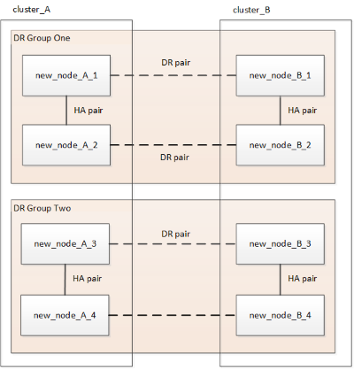

= Actualisation d'une configuration IP MetroCluster à quatre ou huit nœuds (ONTAP 9.8 et versions ultérieures)
:allow-uri-read: 
:icons: font
:imagesdir: ../media/

[role="lead"]
Vous pouvez utiliser cette procédure pour mettre à niveau les contrôleurs et le stockage dans des configurations à quatre ou huit nœuds.

À partir de ONTAP 9.13.1, vous pouvez mettre à niveau les contrôleurs et le stockage dans une configuration IP MetroCluster à huit nœuds en développant la configuration pour devenir une configuration temporaire à douze nœuds, puis en supprimant les anciens groupes de reprise après incident.

À partir de ONTAP 9.8, vous pouvez mettre à niveau les contrôleurs et le stockage d'une configuration IP MetroCluster à quatre nœuds en développant la configuration pour devenir une configuration temporaire à huit nœuds, puis en supprimant l'ancien groupe DR.

.Informations importantes si vous ajoutez un modèle de plate-forme plus ancien
Les conseils suivants concernent un scénario peu courant dans lequel vous devez ajouter un ancien modèle de plate-forme (plates-formes publiées avant ONTAP 9.15.1) à une configuration MetroCluster existante qui contient un modèle de plate-forme plus récent (plates-formes publiées dans ONTAP 9.15.1 ou plus tard).

Si votre configuration MetroCluster existante contient une plate-forme qui utilise des ports *shared cluster/HA* (plates-formes publiées dans ONTAP 9.15.1 ou plus tard), vous ne pouvez pas ajouter une plate-forme qui utilise des ports *shared MetroCluster/HA* (plates-formes publiées avant ONTAP 9.15.1) sans mettre à niveau tous les nœuds de la configuration vers ONTAP 9.15.1P11 ou ONTAP 9.16.1P4 ou plus tard.

[CAUTION]
====
L'ajout d'un ancien modèle de plate-forme qui utilise des ports *partagés/MetroCluster HA* à un MetroCluster contenant un modèle de plate-forme plus récent qui utilise des ports *partagés cluster/HA* est un scénario peu courant et la plupart des combinaisons ne sont pas affectées.

====
Utilisez le tableau suivant pour vérifier si votre combinaison est affectée. Si votre plate-forme existante est répertoriée dans la première colonne et que la plate-forme que vous souhaitez ajouter à la configuration est répertoriée dans la deuxième colonne, tous les nœuds de la configuration doivent exécuter ONTAP 9.15.1P11 ou ONTAP 9.16.1P4 ou une version ultérieure pour ajouter le nouveau groupe DR.

[cols="20,20,20,20,20"]
|===
2+| Si votre MetroCluster existant contient... 2+| Et la plateforme que vous ajoutez est... | Alors... 

 a| 
Un système AFF utilisant des *ports de cluster/HA partagés* :

* AFF A20
* AFF A30
* AFF C30
* AFF A50
* AFF C60
* AFF C80
* AFF A70
* AFF A90
* AFF A1K

 a| 
Un système FAS utilisant des *ports de cluster/HA partagés* :

* FAS50
* FAS70
* FAS90

 a| 
Un système AFF utilisant des *ports MetroCluster/HA partagés* :

* AFF A150, ASA A150
* AVEC AFF A220
* AFF C250, ASA C250
* AFF A250, ASA A250
* AFF A300
* AFF A320
* AFF C400, ASA C400
* AFF A400, ASA A400
* AFF A700
* AFF C800, ASA C800
* AFF A800, ASA A800
* AFF A900, ASA A900

 a| 
Un système FAS utilisant des *ports MetroCluster/HA partagés* :

* FAS2750
* FAS500f
* FAS8200
* FAS8300
* FAS8700
* FAS9000
* FAS9500

| Avant d'ajouter la nouvelle plateforme à votre configuration MetroCluster existante, mettez à niveau tous les nœuds de la configuration existante et nouvelle vers ONTAP 9.15.1P11 ou ONTAP 9.16.1P4 ou version ultérieure. 
|===
.Description de la tâche
* Si vous avez une configuration à huit nœuds, votre système doit exécuter ONTAP 9.13.1 ou une version ultérieure.
* Si vous avez une configuration à quatre nœuds, votre système doit exécuter ONTAP 9.8 ou une version ultérieure.
* Si vous mettez également à niveau les commutateurs IP, vous devez les mettre à niveau avant d'effectuer cette procédure d'actualisation.
* Cette procédure décrit les étapes requises pour actualiser un groupe DR à quatre nœuds. Si vous avez une configuration à huit nœuds (deux groupes DR), vous pouvez actualiser l'un des groupes DR, ou les deux.
+
....
 Refresh DR groups one at a time.
* References to "old nodes" mean the nodes that you intend to replace.
* For eight-node configurations, the source and target eight-node MetroCluster platform combination must be supported.
....
+

NOTE: Si vous actualisez les deux groupes DR, il se peut que la combinaison de plateformes ne soit pas prise en charge après l'actualisation du premier groupe DR. Vous devez actualiser les deux groupes DR pour obtenir une configuration à huit nœuds prise en charge.

* Vous ne pouvez actualiser que des modèles de plate-forme spécifiques en suivant cette procédure dans une configuration MetroCluster IP.
+
** Pour plus d'informations sur les combinaisons de mise à niveau de la plate-forme prises en charge, consultez le tableau d'actualisation de l'IP MetroCluster dans link:../upgrade/concept_choosing_tech_refresh_mcc.html#supported-metrocluster-ip-tech-refresh-combinations["Choix d'une méthode de renouvellement du système"].

* Les limites inférieures des plates-formes source et cible s'appliquent. Si vous passez à une plateforme supérieure, les limites de la nouvelle plateforme ne s'appliquent qu'à la fin de la mise à jour technologique de tous les groupes de reprise après incident.
* Si vous effectuez une mise à jour technologique sur une plateforme dont les limites sont inférieures à celles de la plateforme source, vous devez ajuster et réduire les limites à atteindre ou à une valeur inférieure aux limites de la plateforme cible avant d'effectuer cette procédure.

== Activer la journalisation de la console

NetApp vous recommande vivement d'activer la journalisation de la console sur les périphériques que vous utilisez et d'effectuer les actions suivantes lors de l'exécution de cette procédure :

* Laissez AutoSupport activé pendant la maintenance.
* Déclencher un message AutoSupport de maintenance avant et après la maintenance pour désactiver la création de dossiers pendant la durée de l'activité de maintenance.
+
Consultez l'article de la base de connaissances link:https://kb.netapp.com/Support_Bulletins/Customer_Bulletins/SU92["Comment supprimer la création automatique de dossier pendant les fenêtres de maintenance planifiées"^].

* Activer la journalisation de session pour toute session CLI. Pour obtenir des instructions sur l'activation de la journalisation des sessions, consultez la section « consignation des sorties de session » de l'article de la base de connaissances link:https://kb.netapp.com/on-prem/ontap/Ontap_OS/OS-KBs/How_to_configure_PuTTY_for_optimal_connectivity_to_ONTAP_systems["Comment configurer PuTTY pour une connectivité optimale aux systèmes ONTAP"^].

== Effectuez la procédure d'actualisation

Procédez comme suit pour actualiser la configuration IP de MetroCluster.

.Étapes
. Vérifiez qu'un domaine de diffusion par défaut est créé sur les anciens nœuds.
+
Lorsque vous ajoutez de nouveaux nœuds à un cluster existant sans broadcast domain par défaut, les LIFs de node-management sont créées pour les nouveaux nœuds à l'aide d'UUID (Universal unique identifier) à la place des noms attendus. Pour plus d'informations, consultez l'article de la base de connaissances https://kb.netapp.com/onprem/ontap/os/Node_management_LIFs_on_newly-added_nodes_generated_with_UUID_names["Les LIF de gestion de nœuds sur les nouveaux nœuds ajoutés sont générées avec des noms UUID"^].

. Collecte des informations des anciens nœuds.
+
À ce stade, la configuration à quatre nœuds apparaît comme illustré sur l'image suivante :

+
image::../media/mcc_dr_group_a.png[Configuration de MetroCluster IP à quatre nœuds avant extension]

+
La configuration à huit nœuds s'affiche comme illustré dans l'image suivante :

+
image::../media/mcc_dr_groups_8_node.gif[Configuration MetroCluster IP avec huit nœuds après extension]

. Pour éviter la génération automatique de dossiers de demande de support, envoyez un message AutoSupport pour indiquer que la mise à niveau est en cours.
+
.. Lancer la commande suivante : +
`system node autosupport invoke -node * -type all -message "MAINT=10h Upgrading _old-model_ to _new-model"_`
+
L'exemple suivant spécifie une fenêtre de maintenance de 10 heures. Prévoyez un délai supplémentaire en fonction de votre plan.

+
Si la maintenance est terminée avant le temps écoulé, vous pouvez appeler un message AutoSupport indiquant la fin de la période de maintenance :

+
`system node autosupport invoke -node * -type all -message MAINT=end`

.. Répétez la commande sur le cluster partenaire.

. Si le chiffrement de bout en bout est activé, suivez les étapes à link:../maintain/task-configure-encryption.html#disable-end-to-end-encryption["Désactivez le chiffrement de bout en bout"].
. Supprimez la configuration MetroCluster existante du logiciel disjoncteur d'attache, du médiateur ou d'autres logiciels pouvant initier le basculement.
+
[cols="2*"]
|===

| Si vous utilisez... | Utilisez cette procédure... 

 a| 
Disjoncteur d'attache
 a| 
.. Utiliser l'interface de ligne de commande Tiebreaker `monitor remove` Commande permettant de supprimer la configuration MetroCluster.
+
Dans l'exemple suivant, « cluster_A » est supprimé du logiciel :

+
[listing]
----

NetApp MetroCluster Tiebreaker :> monitor remove -monitor-name cluster_A
Successfully removed monitor from NetApp MetroCluster Tiebreaker
software.
----
.. Vérifiez que la configuration MetroCluster a été supprimée correctement à l'aide de l'interface de ligne de commande de Tiebreaker `monitor show -status` commande.
+
[listing]
----

NetApp MetroCluster Tiebreaker :> monitor show -status
----

 a| 
Médiateur
 a| 
Exécutez la commande suivante depuis l'invite ONTAP :

`metrocluster configuration-settings mediator remove`

 a| 
Applications tierces
 a| 
Reportez-vous à la documentation du produit.

|===
. Effectuez toutes les étapes de la section link:../upgrade/task_expand_a_four_node_mcc_ip_configuration.html["Développement d'une configuration IP MetroCluster"^] pour ajouter les nouveaux nœuds et stockage à la configuration.
+
Une fois la procédure d'extension terminée, la configuration temporaire s'affiche comme illustré dans les images suivantes :

+
.Configuration temporaire à huit nœuds
image::../media/mcc_dr_group_b.png[Configuration de MetroCluster après expansion et migration des volumes CRS]

+
.Configuration temporaire à douze nœuds
image::../media/mcc_dr_group_c4.png[Configuration temporaire de MetroCluster à douze nœuds]

. Vérifier que le basculement est possible et que les nœuds sont connectés en exécutant la commande suivante sur les deux clusters :
+
`storage failover show`

+
[listing]
----
cluster_A::> storage failover show
                                    Takeover
Node           Partner              Possible    State Description
-------------- -------------------- ---------   ------------------
Node_FC_1      Node_FC_2              true      Connected to Node_FC_2
Node_FC_2      Node_FC_1              true      Connected to Node_FC_1
Node_IP_1      Node_IP_2              true      Connected to Node_IP_2
Node_IP_2      Node_IP_1              true      Connected to Node_IP_1
----
. Déplacez les volumes CRS.
+
Suivez les étapes de la section link:../maintain/task_move_a_metadata_volume_in_mcc_configurations.html["Déplacement d'un volume de métadonnées dans les configurations MetroCluster"^].

. Déplacez les données des anciens nœuds vers les nouveaux nœuds en procédant comme suit :
+
.. Effectuez toutes les étapes de la section https://docs.netapp.com/us-en/ontap-systems-upgrade/upgrade/upgrade-create-aggregate-move-volumes.html["Création d'un agrégat et déplacement des volumes vers les nouveaux nœuds"^].
+

NOTE: Vous pouvez choisir de mettre en miroir l'agrégat lors de sa création ou après sa création.

.. Effectuez toutes les étapes de la section https://docs.netapp.com/us-en/ontap-systems-upgrade/upgrade/upgrade-move-lifs-to-new-nodes.html["Déplacez les LIF de données non-SAN et les LIF de cluster-management vers les nouveaux nœuds"^].

. Modifiez l'adresse IP de l'homologue de cluster des nœuds transférés pour chaque cluster :
+
.. Identifiez l'homologue cluster_A à l'aide de `cluster peer show` commande :
+
[listing]
----
cluster_A::> cluster peer show
Peer Cluster Name         Cluster Serial Number Availability   Authentication
------------------------- --------------------- -------------- --------------
cluster_B         1-80-000011           Unavailable    absent
----
+
... Modifiez l'adresse IP du poste cluster_A :
+
`cluster peer modify -cluster cluster_A -peer-addrs node_A_3_IP -address-family ipv4`

.. Identifiez l'homologue cluster_B à l'aide de `cluster peer show` commande :
+
[listing]
----
cluster_B::> cluster peer show
Peer Cluster Name         Cluster Serial Number Availability   Authentication
------------------------- --------------------- -------------- --------------
cluster_A         1-80-000011           Unavailable    absent
----
+
... Modifiez l'adresse IP de l'homologue cluster_B :
+
`cluster peer modify -cluster cluster_B -peer-addrs node_B_3_IP -address-family ipv4`

.. Vérifiez que l'adresse IP de l'homologue de cluster est mise à jour pour chaque cluster :
+
... Vérifiez que l'adresse IP est mise à jour pour chaque cluster à l'aide de `cluster peer show -instance` commande.
+
Le `Remote Intercluster Addresses` Dans les exemples suivants, le champ affiche l'adresse IP mise à jour.

+
Exemple pour cluster_A :

+
[listing]
----
cluster_A::> cluster peer show -instance

Peer Cluster Name: cluster_B
           Remote Intercluster Addresses: 172.21.178.204, 172.21.178.212
      Availability of the Remote Cluster: Available
                     Remote Cluster Name: cluster_B
                     Active IP Addresses: 172.21.178.212, 172.21.178.204
                   Cluster Serial Number: 1-80-000011
                    Remote Cluster Nodes: node_B_3-IP,
                                          node_B_4-IP
                   Remote Cluster Health: true
                 Unreachable Local Nodes: -
          Address Family of Relationship: ipv4
    Authentication Status Administrative: use-authentication
       Authentication Status Operational: ok
                        Last Update Time: 4/20/2023 18:23:53
            IPspace for the Relationship: Default
Proposed Setting for Encryption of Inter-Cluster Communication: -
Encryption Protocol For Inter-Cluster Communication: tls-psk
  Algorithm By Which the PSK Was Derived: jpake

cluster_A::>

----
+
Exemple pour cluster_B.

+
[listing]
----
cluster_B::> cluster peer show -instance

                       Peer Cluster Name: cluster_A
           Remote Intercluster Addresses: 172.21.178.188, 172.21.178.196 <<<<<<<< Should reflect the modified address
      Availability of the Remote Cluster: Available
                     Remote Cluster Name: cluster_A
                     Active IP Addresses: 172.21.178.196, 172.21.178.188
                   Cluster Serial Number: 1-80-000011
                    Remote Cluster Nodes: node_A_3-IP,
                                          node_A_4-IP
                   Remote Cluster Health: true
                 Unreachable Local Nodes: -
          Address Family of Relationship: ipv4
    Authentication Status Administrative: use-authentication
       Authentication Status Operational: ok
                        Last Update Time: 4/20/2023 18:23:53
            IPspace for the Relationship: Default
Proposed Setting for Encryption of Inter-Cluster Communication: -
Encryption Protocol For Inter-Cluster Communication: tls-psk
  Algorithm By Which the PSK Was Derived: jpake

cluster_B::>
----

. Suivez les étapes de la section link:concept_removing_a_disaster_recovery_group.html["Suppression d'un groupe de reprise après incident"] Pour supprimer l'ancien groupe DR.
. Si vous devez rafraîchir les deux groupes DR dans une configuration à huit nœuds, répétez l'ensemble de la procédure pour chaque groupe DR.
+
Après avoir supprimé l'ancien groupe DR, la configuration s'affiche comme illustré dans les images suivantes :

+
.Configuration à quatre nœuds
image::../media/mcc_dr_group_d.png[Configuration de MetroCluster après suppression de l'ancien groupe DR]

+
.Configuration à huit nœuds

. Vérifier le mode opérationnel de la configuration MetroCluster et effectuer un contrôle MetroCluster.
+
.. Vérifier la configuration MetroCluster et que le mode opérationnel est normal :
+
`metrocluster show`

.. Vérifiez que tous les nœuds attendus s'affichent :
+
`metrocluster node show`

.. Exécutez la commande suivante :
+
`metrocluster check run`

.. Afficher les résultats de la vérification MetroCluster :
+
`metrocluster check show`

. Si vous avez désactivé le chiffrement de bout en bout avant d'ajouter de nouveaux nœuds, vous pouvez le réactiver en suivant les étapes de la section link:../maintain/task-configure-encryption.html#enable-end-to-end-encryption["Chiffrez vos données de bout en bout"].
. Restaurer la surveillance si nécessaire, en suivant la procédure de configuration.
+
[cols="2*"]
|===

| Si vous utilisez... | Suivre cette procédure 

 a| 
Disjoncteur d'attache
 a| 
link:../tiebreaker/concept_configuring_the_tiebreaker_software.html#add-metrocluster-configurations["Ajout des configurations MetroCluster"] dans _Installation et configuration du bris d'égalité MetroCluster_.

 a| 
Médiateur
 a| 
link:https://docs.netapp.com/us-en/ontap-metrocluster/install-ip/concept_mediator_requirements.html["Configurer ONTAP Mediator à partir d'une configuration IP MetroCluster"] dans _Installation et configuration IP MetroCluster_.

 a| 
Applications tierces
 a| 
Reportez-vous à la documentation du produit.

|===
. Pour reprendre la génération automatique de dossier de support, envoyez un message AutoSupport pour indiquer que la maintenance est terminée.
+
.. Exécutez la commande suivante :
+
`system node autosupport invoke -node * -type all -message MAINT=end`

.. Répétez la commande sur le cluster partenaire.

