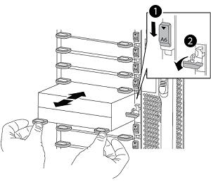

= Mise à niveau des contrôleurs AFF A700/FAS9000 vers AFF A900/FAS9500 en configuration FC MetroCluster avec basculement et rétablissement (ONTAP 9.10.1 ou version ultérieure)
:allow-uri-read: 
:icons: font
:imagesdir: ../media/

[role="lead"]
Il est possible d'utiliser le basculement MetroCluster pour fournir un service sans interruption aux clients pendant la mise à niveau des modules de contrôleur du cluster partenaire. Dans le cadre de cette procédure, vous ne pouvez pas mettre à niveau d'autres composants (par exemple, des tiroirs de stockage ou des commutateurs).

.Description de la tâche
* Cette procédure ne peut être utilisée que pour la mise à niveau du contrôleur.
+
Vous ne pouvez pas mettre à niveau d'autres composants de la configuration, par exemple des tiroirs de stockage ou des commutateurs, en même temps.

* Cette procédure permet de mettre à niveau un système AFF A700 vers un système AFF A900 avec ONTAP 9.10.1 ou version ultérieure.
* Cette procédure permet de mettre à niveau un système FAS9000 vers un système FAS9500 avec ONTAP 9.10.1P3 ou version ultérieure.
+
** Les configurations à quatre et huit nœuds sont prises en charge par ONTAP 9.10.1 et les versions ultérieures.
+

NOTE: Le système AFF A900 n'est pris en charge que dans ONTAP 9.10.1 ou version ultérieure.

+
https://hwu.netapp.com/["NetApp Hardware Universe"^]

* Tous les contrôleurs de la configuration doivent être mis à niveau pendant la même période de maintenance.
+
Le tableau suivant présente la matrice de modèles prise en charge pour la mise à niveau du contrôleur.

+
|===

| Ancien modèle de plateforme | Nouveau modèle de plateforme 

 a| 
** AFF A700

 a| 
** AFF A900

 a| 
** FAS9000

 a| 
** FAS9500

|===
* Durant la procédure de mise à niveau, vous devez modifier la structure MetroCluster, notamment la FCR et les modifications physiques du câblage. Vous pouvez modifier la FCR et le câblage avant d'effectuer la mise à niveau du contrôleur.
* Cette procédure de mise à niveau ne requiert pas de modifier les connexions de stockage, FC et Ethernet entre les nœuds d'origine et les nouveaux nœuds.
* Durant la procédure de mise à niveau, vous ne devez pas ajouter ou supprimer d'autres cartes des systèmes AFF A700 ou FAS9000. Pour plus d'informations, reportez-vous à la section https://hwu.netapp.com/["NetApp Hardware Universe"^]

Les exemples de noms suivants sont utilisés dans les exemples et les graphiques de cette procédure :

* Site_A
+
** Avant la mise à niveau :
+
*** Nœud_A_1-A700
*** Nœud_A_2-A700

** Après la mise à niveau :
+
*** Node_A_1-A900
*** Node_A_2-A900

* Site_B
+
** Avant la mise à niveau :
+
*** Node_B_1-A700
*** Node_B_2-A700

** Après la mise à niveau :
+
*** Node_B_1-A900
*** Node_B_2-A900

== Activer la journalisation de la console

NetApp vous recommande vivement d'activer la journalisation de la console sur les périphériques que vous utilisez et d'effectuer les actions suivantes lors de l'exécution de cette procédure :

* Laissez AutoSupport activé pendant la maintenance.
* Déclencher un message AutoSupport de maintenance avant et après la maintenance pour désactiver la création de dossiers pendant la durée de l'activité de maintenance.
+
Consultez l'article de la base de connaissances link:https://kb.netapp.com/Support_Bulletins/Customer_Bulletins/SU92["Comment supprimer la création automatique de dossier pendant les fenêtres de maintenance planifiées"^].

* Activer la journalisation de session pour toute session CLI. Pour obtenir des instructions sur l'activation de la journalisation des sessions, consultez la section « consignation des sorties de session » de l'article de la base de connaissances link:https://kb.netapp.com/on-prem/ontap/Ontap_OS/OS-KBs/How_to_configure_PuTTY_for_optimal_connectivity_to_ONTAP_systems["Comment configurer PuTTY pour une connectivité optimale aux systèmes ONTAP"^].

== Préparation à la mise à niveau

Avant d'apporter des modifications à la configuration MetroCluster existante, vous devez vérifier l'état de santé de la configuration, modifier les fichiers RCF et le câblage afin qu'ils correspondent à la nouvelle topologie de connectivité des ports requise pour la configuration AFF A900 ou FAS9000 Fabric MetroCluster, et effectuer d'autres tâches diverses.

== Dégager le slot 7 sur le contrôleur AFF A700

La configuration MetroCluster sur un système AFF A900 ou FAS9500 requiert 8 ports FC-VI sur les cartes FC-VI, dans les emplacements 5 et 7. Avant de commencer la mise à niveau, si des cartes se trouvent dans l'emplacement 7 des systèmes AFF A700 ou FAS9000, vous devez les déplacer vers d'autres emplacements pour tous les nœuds du cluster.

=== Vérifier l'état de santé de la configuration MetroCluster

Avant de mettre à jour les fichiers RCF et le câblage de la configuration Fabric MetroCluster AFF A900 ou FAS9500, vous devez vérifier l'état et la connectivité de la configuration.

CAUTION: Après avoir mis à niveau les contrôleurs sur le premier site et avant de mettre à niveau le second, exécutez  `metrocluster check run` suivi de  `metrocluster check show` renvoie une erreur dans le  `config-replication` Champ. Cette erreur indique une incompatibilité de taille de NVRAM entre les nœuds de chaque site. Il s'agit du comportement attendu lorsque les modèles de plateforme sont différents sur les deux sites. Vous pouvez ignorer cette erreur jusqu'à ce que la mise à niveau du contrôleur soit terminée pour tous les nœuds du groupe DR.

.Étapes
. Vérifier le fonctionnement de la configuration MetroCluster dans ONTAP :
+
.. Vérifiez si les nœuds sont multipathed : +
`node run -node _node-name_ sysconfig -a`
+
Vous devez exécuter cette commande pour chaque nœud de la configuration MetroCluster.

.. Vérifier qu'il n'y a aucun disque défectueux dans la configuration :
+
`storage disk show -broken`

+
Vous devez exécuter cette commande sur chaque nœud de la configuration MetroCluster.

.. Vérifiez si des alertes d'intégrité sont émises :
+
`system health alert show`

+
Vous devez exécuter cette commande sur chaque cluster.

.. Vérifier les licences sur les clusters :
+
`system license show`

+
Vous devez exécuter cette commande sur chaque cluster.

.. Vérifiez les périphériques connectés aux nœuds :
+
`network device-discovery show`

+
Vous devez exécuter cette commande sur chaque cluster.

.. Vérifiez que le fuseau horaire et l'heure sont correctement définis sur les deux sites :
+
`cluster date show`

+
Vous devez exécuter cette commande sur chaque cluster. Vous pouvez utiliser le `cluster date` commandes permettant de configurer le fuseau horaire et le fuseau horaire.

. Vérifier la présence d'alertes d'intégrité sur les commutateurs (le cas échéant) :
+
`storage switch show`

+
Vous devez exécuter cette commande sur chaque cluster.

. Vérifier le mode opérationnel de la configuration MetroCluster et effectuer un contrôle MetroCluster.
+
.. Vérifier la configuration MetroCluster et que le mode opérationnel est normal :
+
`metrocluster show`

.. Vérifiez que tous les nœuds attendus s'affichent :
+
`metrocluster node show`

.. Exécutez la commande suivante :
+
`metrocluster check run`

.. Afficher les résultats de la vérification MetroCluster :
+
`metrocluster check show`

. Vérifiez le câblage MetroCluster à l'aide de l'outil Config Advisor.
+
.. Téléchargez et exécutez Config Advisor.
+
https://mysupport.netapp.com/site/tools/tool-eula/activeiq-configadvisor["Téléchargement NetApp : Config Advisor"^]

.. Une fois Config Advisor exécuté, vérifiez les résultats de l'outil et suivez les recommandations fournies dans la sortie pour résoudre tous les problèmes détectés.

=== Mettre à jour les fichiers RCF de commutateur de structure

La structure MetroCluster AFF A900 ou FAS9500 exige deux adaptateurs FC-VI à quatre ports par nœud contre un seul adaptateur FC-VI à quatre ports requis par un système AFF A700. Avant de commencer la mise à niveau du contrôleur vers le contrôleur AFF A900 ou FAS9500, vous devez modifier les fichiers RCF de commutateur de structure pour prendre en charge la topologie de connexion AFF A900 ou FAS9500.

. À partir du https://mysupport.netapp.com/site/products/all/details/metrocluster-rcf/downloads-tab["Page de téléchargement du fichier RCF MetroCluster"^], Téléchargez le fichier RCF approprié pour un MetroCluster de structure AFF A900 ou FAS9500 et le modèle de switch utilisé avec la configuration AFF A700 ou FAS9000.
. [[Update-RCF]]mettre à jour le fichier RCF sur les commutateurs de la structure A, commutateur A1 et commutateur B1 en suivant les étapes de la link:../disaster-recovery/task_cfg_switches_mcfc.html["Configuration des commutateurs FC"].
+

NOTE: La mise à jour du fichier RCF pour prendre en charge la configuration AFF A900 ou FAS9500 Fabric MetroCluster n'affecte pas le port ni les connexions utilisés pour la configuration AFF A700 ou FAS9000 Fabric MetroCluster.

. Après la mise à jour des fichiers RCF sur les commutateurs de la structure A, toutes les connexions FC-VI et de stockage doivent être mises en ligne. Vérifier les connexions FC-VI :
+
`metrocluster interconnect mirror show`

+
.. Vérifiez que les disques des sites locaux et distants sont répertoriés dans le `sysconfig` sortie.

. [[revérifier-Healthy]]vous devez vérifier que MetroCluster est en état de santé après la mise à jour du fichier RCF pour les commutateurs de la structure A.
+
.. Vérifier les connexions du cluster en métro :
`metrocluster interconnect mirror show`
.. Exécuter la vérification MetroCluster :
`metrocluster check run`
.. Consultez les résultats de l'exécution MetroCluster une fois l'exécution terminée :
`metrocluster check show`

. Mettre à jour les commutateurs de la structure B (commutateurs 2 et 4) en répétant <<Update-RCF,Étape 2>> à <<verify-healthy,Étape 5>>.

=== Vérifiez l'état de santé de la configuration MetroCluster après la mise à jour du fichier RCF

Vous devez vérifier l'état et la connectivité de la configuration MetroCluster avant d'effectuer la mise à niveau.

.Étapes
. Vérifier le fonctionnement de la configuration MetroCluster dans ONTAP :
+
.. Vérifiez si les nœuds sont multipathed : +
`node run -node _node-name_ sysconfig -a`
+
Vous devez exécuter cette commande pour chaque nœud de la configuration MetroCluster.

.. Vérifier qu'il n'y a aucun disque défectueux dans la configuration :
+
`storage disk show -broken`

+
Vous devez exécuter cette commande sur chaque nœud de la configuration MetroCluster.

.. Vérifiez si des alertes d'intégrité sont émises :
+
`system health alert show`

+
Vous devez exécuter cette commande sur chaque cluster.

.. Vérifier les licences sur les clusters :
+
`system license show`

+
Vous devez exécuter cette commande sur chaque cluster.

.. Vérifiez les périphériques connectés aux nœuds :
+
`network device-discovery show`

+
Vous devez exécuter cette commande sur chaque cluster.

.. Vérifiez que le fuseau horaire et l'heure sont correctement définis sur les deux sites :
+
`cluster date show`

+
Vous devez exécuter cette commande sur chaque cluster. Vous pouvez utiliser le `cluster date` commandes permettant de configurer le fuseau horaire et le fuseau horaire.

. Vérifier la présence d'alertes d'intégrité sur les commutateurs (le cas échéant) :
+
`storage switch show`

+
Vous devez exécuter cette commande sur chaque cluster.

. Vérifier le mode opérationnel de la configuration MetroCluster et effectuer un contrôle MetroCluster.
+
.. Vérifier la configuration MetroCluster et que le mode opérationnel est normal :
+
`metrocluster show`

.. Vérifiez que tous les nœuds attendus s'affichent :
+
`metrocluster node show`

.. Exécutez la commande suivante :
+
`metrocluster check run`

.. Afficher les résultats de la vérification MetroCluster :
+
`metrocluster check show`

. Vérifiez le câblage MetroCluster à l'aide de l'outil Config Advisor.
+
.. Téléchargez et exécutez Config Advisor.
+
https://mysupport.netapp.com/site/tools/tool-eula/activeiq-configadvisor["Téléchargement NetApp : Config Advisor"^]

.. Une fois Config Advisor exécuté, vérifiez les résultats de l'outil et suivez les recommandations fournies dans la sortie pour résoudre tous les problèmes détectés.

=== Mappez les ports des nœuds AFF A700 ou FAS9000 sur les nœuds AFF A900 ou FAS9500

Durant le processus de mise à niveau du contrôleur, il faut uniquement modifier les connexions mentionnées dans cette procédure.

Si le connecteur 7 des contrôleurs AFF A700 ou FAS9000 est associé à une carte, vous devez la déplacer vers un autre emplacement avant de lancer la procédure de mise à niveau du contrôleur. Vous devez disposer d'un emplacement 7 disponible pour l'ajout du deuxième adaptateur FC-VI requis pour le fonctionnement de Fabric MetroCluster sur les contrôleurs AFF A900 ou FAS9500.

=== Recueillez les informations avant la mise à niveau

Avant de procéder à la mise à niveau, vous devez recueillir des informations pour chacun des anciens nœuds et, si nécessaire, ajuster les domaines de diffusion réseau, supprimer les VLAN et les groupes d'interface et collecter des informations de chiffrement.

.Description de la tâche
Cette tâche s'effectue sur la configuration FC MetroCluster existante.

.Étapes
. Collectez les ID système du nœud de configuration MetroCluster :
+
`metrocluster node show -fields node-systemid,dr-partner-systemid`

+
Au cours de la procédure de mise à niveau, vous remplacerez ces anciens ID système par les ID système des modules de contrôleur.

+
Dans cet exemple de configuration FC MetroCluster à quatre nœuds, les anciens ID système suivants sont récupérés :

+
** Node_A_1-A700 : 537037649
** Node_A_2-A700 : 537407030
** Node_B_1-A700 : 0537407114
** Node_B_2-A700 : 537035354

+
[listing]
----
Cluster_A::*> metrocluster node show -fields node-systemid,ha-partner-systemid,dr-partner-systemid,dr-auxiliary-systemid
dr-group-id cluster    node           node-systemid ha-partner-systemid dr-partner-systemid dr-auxiliary-systemid
----------- ------------------------- ------------- ------------------- ------------------- ---------------------
1           Cluster_A  nodeA_1-A700   537407114     537035354           537411005           537410611
1           Cluster_A  nodeA_2-A700   537035354     537407114           537410611           537411005
1           Cluster_B  nodeB_1-A700   537410611     537411005           537035354           537407114
1           Cluster_B  nodeB_2-A700   537411005

4 entries were displayed.
----
. Collecte des informations relatives aux ports et aux LIF pour chaque ancien nœud.
+
Vous devez collecter les valeurs de sortie des commandes suivantes pour chaque nœud :

+
** `network interface show -role cluster,node-mgmt`
** `network port show -node _node-name_ -type physical`
** `network port vlan show -node _node-name_`
** `network port ifgrp show -node _node_name_ -instance`
** `network port broadcast-domain show`
** `network port reachability show -detail`
** `network ipspace show`
** `volume show`
** `storage aggregate show`
** `system node run -node _node-name_ sysconfig -a`

. Si les nœuds MetroCluster se trouvent dans une configuration SAN, collectez les informations pertinentes.
+
Vous devez collecter le résultat des commandes suivantes :

+
** `fcp adapter show -instance`
** `fcp interface show -instance`
** `iscsi interface show`
** `ucadmin show`

. Si le volume racine est chiffré, collectez et enregistrez la phrase secrète utilisée pour le gestionnaire de clés :
+
`security key-manager backup show`

. Si les nœuds MetroCluster utilisent le chiffrement pour des volumes ou des agrégats, copiez les informations concernant les clés et les clés de phrase secrète.
+
Pour plus d'informations, reportez-vous à la section https://docs.netapp.com/us-en/ontap/encryption-at-rest/backup-key-management-information-manual-task.html["Sauvegarde manuelle des informations de gestion intégrée des clés"^].

+
.. Si le gestionnaire de clés intégré est configuré :
+
`security key-manager onboard show-backup`

+
Vous aurez besoin de la phrase de passe plus tard dans la procédure de mise à niveau.

.. Si le protocole KMIP (Enterprise Key Management) est configuré, exécutez les commandes suivantes :
+
`security key-manager external show -instance`

+
`security key-manager key query`

=== Supprimez la configuration existante du logiciel disjoncteur d'attache ou tout autre logiciel de surveillance

Si la configuration existante est contrôlée avec la configuration MetroCluster Tiebreaker ou d'autres applications tierces (telles que ClusterLion) capables d'effectuer un basculement, vous devez supprimer la configuration MetroCluster du logiciel disjoncteur d'attache ou d'autres logiciels avant la transition.

.Étapes
. Supprimer la configuration MetroCluster existante du logiciel disjoncteur d'attache
+
link:../tiebreaker/concept_configuring_the_tiebreaker_software.html#remove-metrocluster-configurations["Suppression des configurations MetroCluster"]

. Supprimez la configuration MetroCluster existante de toute application tierce pouvant effectuer le basculement.
+
Reportez-vous à la documentation de l'application.

=== Envoyer un message AutoSupport personnalisé avant la maintenance

Avant d'effectuer la maintenance, vous devez envoyer un message AutoSupport pour informer le support technique de NetApp que la maintenance est en cours. Informer le support technique que la maintenance est en cours empêche l'ouverture d'un dossier en supposant une interruption de l'activité.

.Description de la tâche
Cette tâche doit être effectuée sur chaque site MetroCluster.

.Étapes
. Pour éviter la génération automatique de dossiers de demande de support, envoyez un message AutoSupport pour indiquer que la maintenance est en cours.
+
.. Exécutez la commande suivante :
+
`system node autosupport invoke -node * -type all -message MAINT=__maintenance-window-in-hours__`

+
`maintenance-window-in-hours` spécifie la durée de la fenêtre de maintenance, avec un maximum de 72 heures. Si la maintenance est terminée avant le temps écoulé, vous pouvez appeler un message AutoSupport indiquant la fin de la période de maintenance :

+
`system node autosupport invoke -node * -type all -message MAINT=end`

.. Répétez la commande sur le cluster partenaire.

== Basculer la configuration MetroCluster

Vous devez basculer la configuration vers site_A afin de pouvoir mettre à niveau les plateformes du site_B.

.Description de la tâche
Cette tâche doit être effectuée sur site_A.

Une fois cette tâche effectuée, site_A est actif et transmet les données aux deux sites. Site_B est inactif et prêt à commencer le processus de mise à niveau, comme indiqué dans l'illustration suivante. (Cette illustration s'applique également à la mise à niveau d'un système FAS9000 vers un contrôleur FAS9500.)

image::../media/mcc_upgrade_cluster_a_in_switchover_A900.png[Site_B inactif et prêt à être mis à niveau]

.Étapes
. Basculer la configuration MetroCluster sur site_A afin de mettre à niveau les nœuds site_B :
+
.. Exécutez la commande suivante sur site_A :
+
`metrocluster switchover -controller-replacement true`

+
L'opération peut prendre plusieurs minutes.

.. Surveiller le fonctionnement du basculement :
+
`metrocluster operation show`

.. Une fois l'opération terminée, vérifiez que les nœuds sont en état de basculement :
+
`metrocluster show`

.. Vérifier l'état des nœuds MetroCluster :
+
`metrocluster node show`

. Corriger les agrégats de données.
+
.. Réparation des agrégats de données :
+
`metrocluster heal data-aggregates`

.. Vérifiez que l'opération de correction est terminée en exécutant le `metrocluster operation show` commande sur le cluster sain :
+
[listing]
----

cluster_A::> metrocluster operation show
  Operation: heal-aggregates
      State: successful
 Start Time: 7/29/2020 20:54:41
   End Time: 7/29/2020 20:54:42
     Errors: -
----

. Corriger les agrégats racine.
+
.. Réparation des agrégats de données :
+
`metrocluster heal root-aggregates`

.. Vérifiez que l'opération de correction est terminée en exécutant le `metrocluster operation show` commande sur le cluster sain :
+
[listing]
----

cluster_A::> metrocluster operation show
  Operation: heal-root-aggregates
      State: successful
 Start Time: 7/29/2020 20:58:41
   End Time: 7/29/2020 20:59:42
     Errors: -
----

== Retirez le module de contrôleur AFF A700 ou FAS9000 et le système NVS sur site_B

Vous devez supprimer les anciens contrôleurs de la configuration.

Cette tâche est effectuée sur site_B.

.Avant de commencer
Si vous n'êtes pas déjà mis à la terre, mettez-vous à la terre correctement.

.Étapes
. Se connecter à la console série des anciens contrôleurs (node_B_1-700 et node_B_2-700) au site_B et vérifier qu'il affiche le `LOADER` à l'invite.
. Rassemblez les valeurs de bootarg à partir des deux nœuds sur site_B : `printenv`
. Mettez le châssis hors tension au niveau du site_B.

== Retirez le module de contrôleur et NVS des deux nœuds du site_B.

=== Retirez le module de contrôleur AFF A700 ou FAS9000

Suivre la procédure suivante pour retirer le module de contrôleur AFF A700 ou FAS9000.

.Étapes
. Détachez le câble de la console, le cas échéant, et le câble de gestion du module de contrôleur avant de retirer le module de contrôleur.
. Déverrouiller et retirer le module de contrôleur du châssis.
+
.. Faites glisser le bouton orange sur la poignée de came vers le bas jusqu'à ce qu'il se déverrouille.
+
image:../media/drw_9500_remove_PCM.png["contrôleur"]

+
|===

| image:../media/number1.png["Numéro 1"] | Bouton de déverrouillage de la poignée de came 

| image:../media/number2.png["Numéro 2"] | Poignée de came 
|===
.. Faites pivoter la poignée de came de façon à ce qu'elle désengage complètement le module de contrôleur du châssis, puis faites glisser le module de contrôleur hors du châssis. Assurez-vous de prendre en charge la partie inférieure du module de contrôleur lorsque vous le faites glisser hors du châssis.

=== Retirez le module NVS AFF A700 ou FAS9000

Utilisez la procédure suivante pour retirer le module NVS AFF A700 ou FAS9000.

NOTE: Le module NVS AFF A700 ou FAS9000 est situé dans l'emplacement 6 et double la hauteur par rapport aux autres modules du système.

. Déverrouillez et retirez le NVS du logement 6.
+
.. Appuyer sur le bouton à came numéroté et numéroté. Le bouton de came s'éloigne du châssis.
.. Faites pivoter le loquet de came vers le bas jusqu'à ce qu'il soit en position horizontale. Le NVS se désengage du châssis et se déplace de quelques pouces.
.. Retirez le NVS du châssis en tirant sur les languettes de traction situées sur les côtés de la face du module.
+

+
|===

| image:../media/number1.png["Numéro 1"] | Loquet de came d'E/S numéroté et numéroté 

| image:../media/number2.png["Numéro 2"] | Loquet d'E/S complètement déverrouillé 
|===

[NOTE]
====
* Ne transférez pas les modules d'extension utilisés comme périphériques de vidage de mémoire sur le module de stockage non volatile AFF A700 dans le logement 6 vers le module NVS AFF A900. Ne transférez aucune pièce du contrôleur AFF A700 et des modules NVS vers le module de contrôleur AFF A900.
* Pour les mises à niveau du FAS9000 vers le système FAS9500, vous devez uniquement transférer les modules Flash cache sur le module NVS FAS9000 vers le module NVS FAS9500. Ne transférez aucune autre pièce du contrôleur FAS9000 et des modules NVS vers le module de contrôleur FAS9500.

====

== Installez le AFF A900 ou FAS9500 NVS et le module de contrôleur

Vous devez installer les NVS et le module de contrôleur AFF A900 ou FAS9500 à partir du kit de mise à niveau sur les deux nœuds du site_B. Ne déplacez pas le dispositif de coredump du module NVS AFF A700 ou FAS9000 vers le module NVS AFF A900 ou FAS9500.

.Avant de commencer
Si vous n'êtes pas déjà mis à la terre, mettez-vous à la terre correctement.

=== Installez les NVS AFF A900 ou FAS9500

Utilisez la procédure suivante pour installer les NVS AFF A900 ou FAS9500 dans le logement 6 des deux nœuds du site_B.

.Étapes
. Alignez le système NVS sur les bords de l'ouverture du châssis dans le logement 6.
. Faites glisser doucement le système NVS dans le logement jusqu'à ce que le loquet de came d'E/S numéroté et numéroté commence à s'engager avec la goupille de came d'E/S, puis poussez le loquet de came d'E/S jusqu'à ce qu'il s'enclenche pour verrouiller le système NVS en place.
+

+
|===

| image:../media/number1.png["Numéro 1"] | Loquet de came d'E/S numéroté et numéroté 

| image:../media/number2.png["Numéro 2"] | Loquet d'E/S complètement déverrouillé 
|===

=== Installez le module de contrôleur AFF A900 ou FAS9500

Utilisez la procédure suivante pour installer le module de contrôleur AFF A900 ou FAS9500.

.Étapes
. Alignez l'extrémité du module de contrôleur avec l'ouverture du châssis, puis poussez doucement le module de contrôleur à mi-course dans le système.
. Poussez fermement le module de contrôleur dans le châssis jusqu'à ce qu'il rencontre le fond de panier central et qu'il soit bien en place. Le loquet de verrouillage s'élève lorsque le module de contrôleur est bien en place.
+

CAUTION: Ne forcez pas trop lorsque vous faites glisser le module de contrôleur dans le châssis pour éviter d'endommager les connecteurs.

. Reliez les ports de gestion et de console au module de contrôleur.
+
image:../media/drw_9500_remove_PCM.png["contrôleur"]

+
|===

| image:../media/number1.png["Numéro 1"] | Bouton de déverrouillage de la poignée de came 

| image:../media/number2.png["Numéro 2"] | Poignée de came 
|===
. Installez la seconde carte X91129A dans le logement 7 de chaque nœud.
+
.. Connectez les ports FC-VI du connecteur 7 aux commutateurs. Reportez-vous à la link:../install-fc/index.html["Installation et configuration en attachement au fabric"] Documentation et accédez à la configuration requise pour la connexion MetroCluster de la structure AFF A900 ou FAS9500 pour le type de commutateur de votre environnement.

. Mettez le châssis SOUS tension et connectez-vous à la console série.
. Après l'initialisation du BIOS, si le nœud commence à AUTOBOOT, interrompez l'AUTOBOOT en appuyant sur Control-C.
. Après avoir interrompu l'AUTOBOOT, les nœuds s'arrêtent à l'invite DU CHARGEUR. Si vous n'interrompez pas AUTOBOOT à temps et que le nœud 1 commence le démarrage, attendez que l'invite appuyez sur Control-C pour accéder au menu de démarrage. Une fois le nœud arrêté au menu de démarrage, utilisez l'option 8 pour redémarrer le nœud et interrompre l'AUTOBOOT pendant le redémarrage.
. Au `LOADER` à l'invite, définissez les variables d'environnement par défaut : `set-defaults`
. Enregistrez les paramètres des variables d'environnement par défaut : `saveenv`

=== NetBoot les nœuds sur site_B

Après avoir remplacé le module de contrôleur AFF A900 ou FAS9500 par un système NVS, vous devez netboot les nœuds AFF A900 ou FAS9500 et installer la même version et le même niveau de patch de ONTAP qui s'exécute sur le cluster. Terme utilisé `netboot` Signifie que vous démarrez à partir d'une image ONTAP stockée sur un serveur distant. Lors de la préparation `netboot`, Vous devez ajouter une copie de l'image de démarrage ONTAP 9 sur un serveur Web auquel le système peut accéder.

Il n'est pas possible de vérifier la version de ONTAP installée sur le support de démarrage d'un module de contrôleur AFF A900 ou FAS9500, sauf s'il est installé dans un châssis et sous tension. La version ONTAP du support de démarrage AFF A900 ou FAS9500 doit être identique à la version de ONTAP exécutée sur un système AFF A700 ou FAS9000 à mettre à niveau. Les images de démarrage primaire et de sauvegarde doivent correspondre. Vous pouvez configurer les images en exécutant un `netboot` suivi de `wipeconfig` commande dans le menu de démarrage. Si le module de contrôleur était auparavant utilisé dans un autre cluster, le `wipeconfig` commande efface toute configuration résiduelle sur le support d'amorçage.

.Avant de commencer
* Vérifiez que vous pouvez accéder à un serveur HTTP avec le système.
* Vous devez télécharger les fichiers système nécessaires pour votre système et la version correcte de ONTAP à partir du link:https://mysupport.netapp.com/site/["Support NetApp"^] le site. A propos de cette tâche vous devez `netboot` Les nouveaux contrôleurs si la version de ONTAP installée n'est pas identique à celle installée sur les contrôleurs d'origine. Après avoir installé chaque nouveau contrôleur, vous démarrez le système à partir de l'image ONTAP 9 stockée sur le serveur Web. Vous pouvez ensuite télécharger les fichiers corrects sur le périphérique de démarrage pour les démarrages suivants du système.

.Étapes
. L'accès link:https://mysupport.netapp.com/site/["Support NetApp"^] pour télécharger les fichiers requis pour effectuer un démarrage sur le réseau système utilisé pour effectuer le démarrage sur le réseau du système.
. [[step2-download-Software]]Télécharger le logiciel ONTAP approprié depuis la section de téléchargement de logiciels du site de support NetApp et stocker le `<ontap_version>_image.tgz` fichier dans un répertoire accessible sur le web.
. Accédez au répertoire accessible sur le Web et vérifiez que les fichiers dont vous avez besoin sont disponibles. Votre liste de répertoires devrait contenir `<ontap_version>_image.tgz`.
. Configurer le `netboot` connexion en choisissant l'une des actions suivantes. Remarque : vous devez utiliser le port de gestion et l'adresse IP comme `netboot` connexion. N'utilisez pas d'IP de la LIF de données et ne subit aucune panne pendant l'exécution de la mise à niveau.
+
|===

| Si le protocole DHCP (Dynamic Host Configuration Protocol) est... | Alors... 

| Exécution | Configurez la connexion automatiquement à l'aide de la commande suivante à l'invite de l'environnement d'initialisation :
`ifconfig e0M -auto` 

| Non en cours d'exécution | Configurez manuellement la connexion à l'aide de la commande suivante à l'invite de l'environnement d'initialisation :
`ifconfig e0M -addr=<filer_addr> -mask=<netmask> -gw=<gateway> - dns=<dns_addr> domain=<dns_domain>`

`<filer_addr>` Est l'adresse IP du système de stockage.
`<netmask>` est le masque de réseau du système de stockage.
`<gateway>` est la passerelle du système de stockage.
`<dns_addr>` Est l'adresse IP d'un serveur de noms sur votre réseau. Ce paramètre est facultatif.
`<dns_domain>` Est le nom de domaine DNS (Domain Name Service). Ce paramètre est facultatif. REMARQUE : d'autres paramètres peuvent être nécessaires pour votre interface. Entrez help ifconfig à l'invite du micrologiciel pour plus de détails. 
|===
. Optimisation `netboot` sur le nœud 1 :
`netboot http://<web_server_ip/path_to_web_accessible_directory>/netboot/kernel`Le `<path_to_the_web-accessible_directory>` vous devez indiquer où vous avez téléchargé le `<ontap_version>_image.tgz` dans <<step2-download-software,Étape 2>>.
+

NOTE: N'interrompez pas l'amorçage.

. Attendez que le nœud 1 s'exécute sur le module de contrôleur AFF A900 ou FAS9500 pour démarrer et afficher les options du menu de démarrage comme illustré ci-dessous :
+
[listing]
----
Please choose one of the following:

(1)  Normal Boot.
(2)  Boot without /etc/rc.
(3)  Change password.
(4)  Clean configuration and initialize all disks.
(5)  Maintenance mode boot.
(6)  Update flash from backup config.
(7)  Install new software first.
(8)  Reboot node.
(9)  Configure Advanced Drive Partitioning.
(10) Set Onboard Key Manager recovery secrets.
(11) Configure node for external key management.
Selection (1-11)?
----
. Dans le menu de démarrage, sélectionnez option `(7) Install new software first`. Cette option de menu permet de télécharger et d'installer la nouvelle image ONTAP sur le périphérique d'amorçage.
+

NOTE: Ne tenez pas compte du message suivant : `This procedure is not supported for Non-Disruptive Upgrade on an HA pair.` Cette remarque s'applique aux mises à niveau logicielles ONTAP sans interruption et non aux mises à niveau du contrôleur. Utilisez toujours netboot pour mettre à jour le nouveau nœud vers l'image souhaitée. Si vous utilisez une autre méthode pour installer l'image sur le nouveau contrôleur, il est possible que la mauvaise image soit installée. Ce problème s'applique à toutes les versions de ONTAP.

. Si vous êtes invité à poursuivre la procédure, entrez `y`, Et lorsque vous êtes invité à saisir l'URL du pack :
+
`\http://<web_server_ip/path_to_web-accessible_directory>/<ontap_version>_image.tgz`

. Procédez comme suit pour redémarrer le module de contrôleur :
+
.. Entrer `n` pour ignorer la restauration de la sauvegarde lorsque vous voyez l'invite suivante :
+
[listing]
----
Do you want to restore the backup configuration now? {y|n} n
----
.. Entrer `y` redémarrez lorsque vous voyez l'invite suivante :
+
`The node must be rebooted to start using the newly installed software. Do you want to reboot now? {y|n} y`

+
Le module de contrôleur redémarre mais s'arrête au menu d'amorçage car le périphérique d'amorçage a été reformaté et les données de configuration doivent être restaurées.

+

NOTE: Vous devez redémarrer le nœud pour pouvoir utiliser le logiciel nouvellement installé.

. À l'invite, exécutez le `wipeconfig` pour effacer toute configuration précédente sur le support de démarrage :
+
.. Lorsque vous voyez le message ci-dessous, répondez `yes`:
`This will delete critical system configuration, including cluster membership.
Warning: do not run this option on a HA node that has been taken over.
Are you sure you want to continue?:`
.. Le nœud redémarre pour terminer le `wipeconfig` puis s'arrête au menu de démarrage.

. Sélectionnez option `5` pour passer en mode maintenance à partir du menu de démarrage. Réponse `yes` sur les invites jusqu'à ce que le nœud s'arrête en mode maintenance et à l'invite de commande `*>`.

=== Restaurez la configuration HBA

En fonction de la présence et de la configuration des cartes HBA dans le module de contrôleur, vous devez les configurer correctement pour l'utilisation de votre site.

.Étapes
. En mode Maintenance, configurez les paramètres de tous les HBA du système :
+
.. Vérifiez les paramètres actuels des ports : `ucadmin show`
.. Mettez à jour les paramètres de port selon vos besoins.

+
|===

| Si vous disposez de ce type de HBA et du mode souhaité... | Utilisez cette commande... 

 a| 
FC CNA
 a| 
`ucadmin modify -m fc -t initiator _adapter-name_`

 a| 
Ethernet CNA
 a| 
`ucadmin modify -mode cna _adapter-name_`

 a| 
Cible FC
 a| 
`fcadmin config -t target _adapter-name_`

 a| 
Initiateur FC
 a| 
`fcadmin config -t initiator _adapter-name_`

|===

=== Définissez l'état de haute disponibilité sur les nouveaux contrôleurs et châssis

Vous devez vérifier l'état haute disponibilité des contrôleurs et du châssis, et mettre à jour si nécessaire l'état en fonction de la configuration du système.

.Étapes
. En mode Maintenance, afficher l'état HA du module de contrôleur et du châssis :
+
`ha-config show`

+
L'état HA pour tous les composants doit être mcc.

. Si l'état système affiché du contrôleur ou du châssis n'est pas correct, définissez l'état HA :
+
`ha-config modify controller mcc`

+
`ha-config modify chassis mcc`

. Arrêter le nœud : `halt`Le nœud doit s'arrêter au niveau du `LOADER>` à l'invite.
. Sur chaque nœud, vérifiez la date, l'heure et le fuseau horaire du système : `Show date`
. Si nécessaire, définissez la date en heure UTC ou GMT (GMT) : `set date <mm/dd/yyyy>`
. Vérifiez l'heure à l'aide de la commande suivante à l'invite de l'environnement d'amorçage : `show time`
. Si nécessaire, définissez l'heure en UTC ou GMT : `set time <hh:mm:ss>`
. Enregistrer les paramètres : `saveenv`
. Collecter les variables d'environnement : `printenv`
. Redémarrez le nœud en mode maintenance pour que les modifications de configuration prennent effet :
`boot_ontap maint`
. Vérifiez que les modifications que vous avez effectuées sont efficaces et ucadmin affiche les ports d'initiateur FC en ligne.
+
|===

| Si vous avez ce type de HBA… | Utilisez cette commande… 

 a| 
CNA
 a| 
`ucadmin show`

 a| 
FC
 a| 
`fcadmin show`

|===
. Vérifiez le mode ha-config : `ha-config show`
+
.. Vérifiez que vous disposez du résultat suivant :
+
[listing]
----
*> ha-config show
Chassis HA configuration: mcc
Controller HA configuration: mcc
----

=== Définissez l'état de haute disponibilité sur les nouveaux contrôleurs et châssis

Vous devez vérifier l'état haute disponibilité des contrôleurs et du châssis, et mettre à jour si nécessaire l'état en fonction de la configuration du système.

.Étapes
. En mode Maintenance, afficher l'état HA du module de contrôleur et du châssis :
+
`ha-config show`

+
L'état HA pour tous les composants doit être mcc.

+
|===

| Si la configuration MetroCluster a... | L'état de la HA doit être... 

 a| 
Deux nœuds
 a| 
mcc-2n

 a| 
Quatre ou huit nœuds
 a| 
mcc

|===
. Si l'état du système affiché du contrôleur n'est pas correct, définissez l'état HA pour le module de contrôleur et le châssis :
+
|===

| Si la configuration MetroCluster a... | Lancer ces commandes... 

 a| 
*Deux nœuds*
 a| 
`ha-config modify controller mcc-2n`

`ha-config modify chassis mcc-2n`

 a| 
*Quatre ou huit noeuds*
 a| 
`ha-config modify controller mcc`

`ha-config modify chassis mcc`

|===

=== Réallouer les disques racine de l'agrégat

Réaffectez les disques de l'agrégat racine au nouveau module de contrôleur, en utilisant les sysids réunis précédemment

.Description de la tâche
Cette tâche est effectuée en mode Maintenance.

Les anciens ID système ont été identifiés dans link:task_upgrade_controllers_in_a_four_node_fc_mcc_us_switchover_and_switchback_mcc_fc_4n_cu.html["Collecte des informations avant la mise à niveau"].

Les exemples de cette procédure utilisent des contrôleurs avec les ID système suivants :

|===

| Nœud | Ancien ID système | Nouvel ID système 

 a| 
Nœud_B_1
 a| 
4068741254
 a| 
1574774970

|===
.Étapes
. Reliez toutes les autres connexions aux nouveaux modules de contrôleur (FC-VI, stockage, interconnexion de cluster, etc.).
. Arrêtez le système et démarrez en mode maintenance à partir du `LOADER` invite :
+
`boot_ontap maint`

. Afficher les disques détenus par le nœud_B_1-A700 :
+
`disk show -a`

+
L'exemple de sortie montre l'ID système du nouveau module de contrôleur (1574774970). Cependant, les disques de l'agrégat racine appartiennent toujours à l'ancien ID système (4068741254). Dans cet exemple, les disques qui appartiennent aux autres nœuds de la configuration MetroCluster ne s'affichent pas.

+
[listing]
----
*> disk show -a
Local System ID: 1574774970

  DISK         OWNER                     POOL   SERIAL NUMBER    HOME                      DR HOME
------------   -------------             -----  -------------    -------------             -------------
...
rr18:9.126L44 node_B_1-A700(4068741254)   Pool1  PZHYN0MD         node_B_1-A700(4068741254)  node_B_1-A700(4068741254)
rr18:9.126L49 node_B_1-A700(4068741254)   Pool1  PPG3J5HA         node_B_1-A700(4068741254)  node_B_1-A700(4068741254)
rr18:8.126L21 node_B_1-A700(4068741254)   Pool1  PZHTDSZD         node_B_1-A700(4068741254)  node_B_1-A700(4068741254)
rr18:8.126L2  node_B_1-A700(4068741254)   Pool0  S0M1J2CF         node_B_1-A700(4068741254)  node_B_1-A700(4068741254)
rr18:8.126L3  node_B_1-A700(4068741254)   Pool0  S0M0CQM5         node_B_1-A700(4068741254)  node_B_1-A700(4068741254)
rr18:9.126L27 node_B_1-A700(4068741254)   Pool0  S0M1PSDW         node_B_1-A700(4068741254)  node_B_1-A700(4068741254)
...
----
. Réallouer les disques racine de l'agrégat sur les tiroirs disques vers le nouveau contrôleur :
+
`disk reassign -s _old-sysid_ -d _new-sysid_`

+
L'exemple suivant montre la réaffectation de disques :

+
[listing]
----
*> disk reassign -s 4068741254 -d 1574774970
Partner node must not be in Takeover mode during disk reassignment from maintenance mode.
Serious problems could result!!
Do not proceed with reassignment if the partner is in takeover mode. Abort reassignment (y/n)? n

After the node becomes operational, you must perform a takeover and giveback of the HA partner node to ensure disk reassignment is successful.
Do you want to continue (y/n)? Jul 14 19:23:49 [localhost:config.bridge.extra.port:error]: Both FC ports of FC-to-SAS bridge rtp-fc02-41-rr18:9.126L0 S/N [FB7500N107692] are attached to this controller.
y
Disk ownership will be updated on all disks previously belonging to Filer with sysid 4068741254.
Do you want to continue (y/n)? y
----
. Vérifier que tous les disques sont réaffectés comme prévu : `disk show`
+
[listing]
----
*> disk show
Local System ID: 1574774970

  DISK        OWNER                      POOL   SERIAL NUMBER   HOME                      DR HOME
------------  -------------              -----  -------------   -------------             -------------
rr18:8.126L18 node_B_1-A900(1574774970)   Pool1  PZHYN0MD        node_B_1-A900(1574774970)  node_B_1-A900(1574774970)
rr18:9.126L49 node_B_1-A900(1574774970)   Pool1  PPG3J5HA        node_B_1-A900(1574774970)  node_B_1-A900(1574774970)
rr18:8.126L21 node_B_1-A900(1574774970)   Pool1  PZHTDSZD        node_B_1-A900(1574774970)  node_B_1-A900(1574774970)
rr18:8.126L2  node_B_1-A900(1574774970)   Pool0  S0M1J2CF        node_B_1-A900(1574774970)  node_B_1-A900(1574774970)
rr18:9.126L29 node_B_1-A900(1574774970)   Pool0  S0M0CQM5        node_B_1-A900(1574774970)  node_B_1-A900(1574774970)
rr18:8.126L1  node_B_1-A900(1574774970)   Pool0  S0M1PSDW        node_B_1-A900(1574774970)  node_B_1-A900(1574774970)
*>
----
. Afficher le statut de l'agrégat : `aggr status`
+
[listing]
----
*> aggr status
           Aggr            State       Status           Options
aggr0_node_b_1-root    online      raid_dp, aggr    root, nosnap=on,
                           mirrored                     mirror_resync_priority=high(fixed)
                           fast zeroed
                           64-bit
----
. Répétez les étapes ci-dessus sur le nœud partenaire (node_B_2-A900).

=== Démarrer les nouveaux contrôleurs

Vous devez redémarrer les contrôleurs à partir du menu de démarrage pour mettre à jour l'image flash du contrôleur. Des étapes supplémentaires sont nécessaires si le chiffrement est configuré.

.Description de la tâche
Cette tâche doit être effectuée sur tous les nouveaux contrôleurs.

.Étapes
. Arrêter le nœud : `halt`
. Si le gestionnaire de clés externe est configuré, définissez les paramètres bootargs associés :
+
`setenv bootarg.kmip.init.ipaddr _ip-address_`

+
`setenv bootarg.kmip.init.netmask _netmask_`

+
`setenv bootarg.kmip.init.gateway _gateway-address_`

+
`setenv bootarg.kmip.init.interface _interface-id_`

. Afficher le menu de démarrage : `boot_ontap menu`
. Si le cryptage racine est utilisé, lancez la commande boot menu pour votre configuration de gestion des clés.
+
|===

| Si vous utilisez... | Sélectionnez cette option de menu de démarrage... 

 a| 
Gestion intégrée des clés
 a| 
Option 10 et suivez les invites pour fournir les entrées requises pour récupérer ou restaurer la configuration du gestionnaire de clés

 a| 
Gestion externe des clés
 a| 
Option 11 et suivez les invites pour fournir les entrées requises pour récupérer ou restaurer la configuration du gestionnaire de clés

|===
. Si AUTOBOOT est activé, interrompez l'AUTOBOOT en appuyant sur Control-C.
. Dans le menu de démarrage, exécutez l'option (6).
+

NOTE: Avec l'option 6, le nœud redémarre deux fois avant de terminer.

+
Répondez `y` aux invites de changement d'id système. Attendez les deuxième messages de redémarrage :

+
[listing]
----
Successfully restored env file from boot media...

Rebooting to load the restored env file...
----
. Vérifiez que le partenaire-sysid est correct : `printenv partner-sysid`
+
Si le partenaire-sysid n'est pas correct, définissez-le : `setenv partner-sysid _partner-sysID_`

. Si le cryptage racine est utilisé, relancez la commande de menu de démarrage pour votre configuration de gestion des clés.
+
|===

| Si vous utilisez... | Sélectionnez cette option de menu de démarrage... 

 a| 
Gestion intégrée des clés
 a| 
Option 10 et suivez les invites pour fournir les entrées requises pour récupérer ou restaurer la configuration du gestionnaire de clés

 a| 
Gestion externe des clés
 a| 
Option 11 et suivez les invites pour fournir les entrées requises pour récupérer ou restaurer la configuration du gestionnaire de clés

|===
+
Vous devrez peut-être émettre le `recover_xxxxxxxx_keymanager` commande à l'invite du menu de démarrage plusieurs fois jusqu'à ce que les nœuds démarrent entièrement.

. Démarrez les nœuds : `boot_ontap`
. Attendez que les nœuds remplacés démarrent.
+
Si l'un des nœuds est en mode basculement, exécutez un retour à l'aide du `storage failover giveback` commande.

. Vérifier que tous les ports se trouvent dans un broadcast domain :
+
.. Afficher les domaines de diffusion :
+
`network port broadcast-domain show`

.. Ajoutez n'importe quel port à un broadcast domain si nécessaire.
+
link:https://docs.netapp.com/us-en/ontap/networking/add_or_remove_ports_from_a_broadcast_domain97.html["Ajouter ou supprimer des ports d'un broadcast domain"^]

.. Ajoutez le port physique qui hébergera les LIFs intercluster sur le Broadcast domain correspondant.
.. Modifier les LIFs intercluster de façon à utiliser le nouveau port physique en tant que port de départ.
.. Une fois les LIFs intercluster configurées, vérifiez le statut des clusters et redéfinissez le peering de cluster si nécessaire.
+
Vous devrez peut-être reconfigurer le peering de cluster.

+
link:https://docs.netapp.com/us-en/ontap-metrocluster/install-fc/concept_configure_the_mcc_software_in_ontap.html#peering-the-clusters["Création d'une relation entre clusters"]

.. Recréez les VLAN et les groupes d'interfaces selon les besoins.
+
L'appartenance au VLAN et aux groupes d'interfaces peut être différente de celle de l'ancien nœud.

+
link:https://docs.netapp.com/us-en/ontap/networking/configure_vlans_over_physical_ports.html#create-a-vlan["Création d'un VLAN"^]

+
link:https://docs.netapp.com/us-en/ontap/networking/combine_physical_ports_to_create_interface_groups.html["Combinaison de ports physiques pour créer des groupes d'interfaces"^]

. Si le chiffrement est utilisé, restaurez les clés à l'aide de la commande correcte pour la configuration de la gestion des clés.
+
|===

| Si vous utilisez... | Utilisez cette commande... 

 a| 
Gestion intégrée des clés
 a| 
`security key-manager onboard sync`

Pour plus d'informations, voir link:https://docs.netapp.com/us-en/ontap/encryption-at-rest/restore-onboard-key-management-encryption-keys-task.html["Restauration des clés de chiffrement intégrées de gestion des clés"^].

 a| 
Gestion externe des clés
 a| 
`security key-manager external restore -vserver _SVM_ -node _node_ -key-server _host_name|IP_address:port_ -key-id key_id -key-tag key_tag _node-name_`

Pour plus d'informations, voir link:https://docs.netapp.com/us-en/ontap/encryption-at-rest/restore-external-encryption-keys-93-later-task.html["Restauration des clés de chiffrement externes de gestion des clés"^].

|===

=== Vérifier la configuration de LIF

Vérifiez que les LIF sont hébergées sur le nœud/port approprié avant le rétablissement. Les étapes suivantes doivent être effectuées

.Description de la tâche
Cette tâche s'effectue sur site_B, où les nœuds ont été démarrés avec des agrégats racine.

.Étapes
. Vérifiez que les LIF sont hébergées sur le nœud et les ports appropriés avant le rétablissement.
+
.. Changement au niveau de privilège avancé :
+
`set -privilege advanced`

.. Remplacez la configuration des ports pour assurer un placement LIF approprié :
+
`vserver config override -command "network interface modify" -vserver _vserver_name_ -home-port _active_port_after_upgrade_ -lif _lif_name_ -home-node _new_node_name_"`

+
Lors de la saisie du `network interface modify` dans la commande `vserver config override` vous ne pouvez pas utiliser la fonction de saisie semi-automatique de l'onglet. Vous pouvez créer le `network interface modify` à l'aide de la commande auto complete, puis placez-la dans le `vserver config override` commande.

.. Revenir au niveau de privilège admin : +
`set -privilege admin`

. Revert les interfaces sur leur home node :
+
`network interface revert * -vserver _vserver-name_`

+
Suivez cette étape sur tous les SVM, si nécessaire.

== Retournez la configuration MetroCluster

Une fois les nouveaux contrôleurs configurés, il suffit de revenir à la configuration MetroCluster pour rétablir le fonctionnement normal.

.Description de la tâche
Cette tâche vous permet d'effectuer le rétablissement et de rétablir le fonctionnement normal de la configuration MetroCluster. Les nœuds du site_A sont toujours en attente de mise à niveau, comme illustré ci-dessous. (Cette illustration s'applique également à la mise à niveau d'un système FAS9000 vers un contrôleur FAS9500).

image::../media/mcc_upgrade_cluster_a_switchback_A900.png[MetroCluster à quatre nœuds]

.Étapes
. Émettez le `metrocluster node show` Commande on site_B et vérifiez la sortie.
+
.. Vérifiez que les nouveaux nœuds sont correctement représentés.
.. Vérifiez que les nouveaux nœuds sont en attente de rétablissement.

. Rétablissement du cluster :
+
`metrocluster switchback`

. Vérifier la progression de l'opération de rétablissement :
+
`metrocluster show`

+
L'opération de rétablissement est toujours en cours lorsque la sortie s'affiche `waiting-for-switchback`:

+
[listing]
----
cluster_B::> metrocluster show
Cluster                   Entry Name          State
------------------------- ------------------- -----------
 Local: cluster_B         Configuration state configured
                          Mode                switchover
                          AUSO Failure Domain -
Remote: cluster_A         Configuration state configured
                          Mode                waiting-for-switchback
                          AUSO Failure Domain -
----
+
L'opération de rétablissement est terminée lorsque la sortie s'affiche `normal`:

+
[listing]
----
cluster_B::> metrocluster show
Cluster                   Entry Name          State
------------------------- ------------------- -----------
 Local: cluster_B         Configuration state configured
                          Mode                normal
                          AUSO Failure Domain -
Remote: cluster_A         Configuration state configured
                          Mode                normal
                          AUSO Failure Domain -
----
+
Si un rétablissement prend beaucoup de temps, vous pouvez vérifier l'état des lignes de base en cours en utilisant le `metrocluster config-replication resync-status show` commande. Cette commande est au niveau de privilège avancé.

== Vérifier l'état de santé de la configuration MetroCluster

Après la mise à niveau des modules de contrôleur, vous devez vérifier l'état de santé de la configuration MetroCluster.

.Description de la tâche
Cette tâche peut être effectuée sur n'importe quel nœud de la configuration MetroCluster.

.Étapes
. Vérifier le fonctionnement de la configuration MetroCluster :
+
.. Vérifier la configuration MetroCluster et que le mode opérationnel est normal :
+
`metrocluster show`

.. Effectuer une vérification MetroCluster :
+
`metrocluster check run`

.. Afficher les résultats de la vérification MetroCluster :
+
`metrocluster check show`

+
Après avoir exécuté le `metrocluster check run` et `metrocluster check show` commandes, une erreur similaire à l'exemple suivant peut s'afficher :

+
[listing]
----
Cluster_A:: node_A_1 (non-overridable veto): DR partner NVLog mirroring is not online. Make sure that the links between the two sites are healthy and properly configured.
----
+
Cette erreur se produit en raison d'une incompatibilité de contrôleur pendant le processus de mise à niveau. Vous pouvez ignorer l'erreur en toute sécurité et procéder à la mise à niveau des nœuds sur site_A.

== Mettre à niveau les nœuds du site_A

Vous devez répéter les tâches de mise à niveau sur site_A.

.Étape
. Répétez les étapes pour mettre à niveau les nœuds du site_A, en commençant par link:task_upgrade_controllers_in_a_four_node_fc_mcc_us_switchover_and_switchback_mcc_fc_4n_cu.html["Préparation à la mise à niveau"].
+
Lorsque vous effectuez les tâches, toutes les références aux sites et aux nœuds sont inversées. Par exemple, lorsque l'exemple est donné pour basculer du site_A, vous effectuez le basculement du site_B.

== Envoyez un message AutoSupport personnalisé après la maintenance

Une fois la mise à niveau terminée, envoyer un message AutoSupport indiquant la fin de la maintenance. La création automatique de dossier peut reprendre.

.Étape
. Pour reprendre la génération automatique de dossier de support, envoyez un message AutoSupport pour indiquer que la maintenance est terminée.
+
.. Exécutez la commande suivante :
+
`system node autosupport invoke -node * -type all -message MAINT=end`

.. Répétez la commande sur le cluster partenaire.

== Restaurez la surveillance du logiciel disjoncteur d'attache

Si le logiciel disjoncteur d'attache a déjà été configuré pour la surveillance de la configuration MetroCluster, vous pouvez restaurer la connexion ce dernier.

. Suivez les étapes décrites dans : link:../tiebreaker/concept_configuring_the_tiebreaker_software.html#add-metrocluster-configurations["Ajout des configurations MetroCluster"] dans la section _Installation et configuration du système de départage MetroCluster_.

