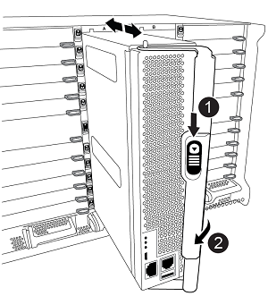

= Mise à niveau des contrôleurs AFF A700/FAS9000 vers AFF A900/FAS9500 dans une configuration IP MetroCluster avec basculement et rétablissement (ONTAP 9.10.1 ou version ultérieure)
:allow-uri-read: 

[role="lead"]
Il est possible d'utiliser le basculement MetroCluster pour fournir un service sans interruption aux clients pendant la mise à niveau des modules de contrôleur du cluster partenaire. Dans le cadre de cette procédure, d'autres composants (tels que des tiroirs de stockage ou des commutateurs) ne peuvent pas être mis à niveau.

.Description de la tâche
* Pour mettre à niveau les modules de contrôleur AFF A700 vers AFF A900, les contrôleurs doivent exécuter ONTAP 9.10.1 ou une version ultérieure.
* Pour mettre à niveau les modules de contrôleur FAS9000 vers le système FAS9500, les contrôleurs doivent exécuter ONTAP 9.10.1P3 ou version ultérieure.
* Tous les contrôleurs de la configuration doivent être mis à niveau pendant la même période de maintenance.
+
L'exploitation de la configuration MetroCluster avec un système AFF A700 et un système AFF A900, ou un système FAS9000 et un contrôleur FAS9500 n'est pas prise en charge en dehors de cette activité de maintenance.

* Les commutateurs IP doivent exécuter une version de micrologiciel prise en charge.
* Vous allez réutiliser les adresses IP, les masques réseau et les passerelles des plates-formes d'origine sur les nouvelles plates-formes.
* Les noms d'exemple suivants sont utilisés dans cette procédure, dans les exemples et les graphiques :
+
** Site_A
+
*** Avant la mise à niveau :
+
**** Nœud_A_1-A700
**** Nœud_A_2-A700

*** Après la mise à niveau :
+
**** Node_A_1-A900
**** Node_A_2-A900

** Site_B
+
*** Avant la mise à niveau :
+
**** Node_B_1-A700
**** Node_B_2-A700

*** Après la mise à niveau :
+
**** Node_B_1-A900
**** Node_B_2-A900

== Flux de production de mise à niveau des contrôleurs dans une configuration MetroCluster IP

Vous pouvez utiliser le diagramme de workflow pour planifier les tâches de mise à niveau.

image::../media/workflow_ip_upgrade.png[mise à niveau ip du workflow]

== Préparation à la mise à niveau

Avant d'apporter des modifications à la configuration MetroCluster existante, vous devez vérifier l'état de santé de la configuration, préparer les nouvelles plateformes et effectuer d'autres tâches diverses.

=== Désactivez le connecteur 7 sur le contrôleur AFF A700 ou FAS9000

La configuration MetroCluster d'un AFF A900 ou FAS9500 utilise l'un de chacun des ports des cartes de reprise sur incident situées dans les emplacements 5 et 7. Avant de commencer la mise à niveau, si des cartes se trouvent dans l'emplacement 7 des systèmes AFF A700 ou FAS9000, vous devez les déplacer vers d'autres emplacements pour tous les nœuds du cluster.

=== Mettre à jour les fichiers RCF des commutateurs MetroCluster avant de mettre à niveau les contrôleurs

Vous devez mettre à jour les fichiers RCF sur les commutateurs MetroCluster lors de cette mise à niveau. Le tableau suivant fournit les plages de VLAN prises en charge pour les configurations IP MetroCluster AFF A900/FAS9500.

|===

| Modèle de plateforme | ID de VLAN pris en charge 

 a| 
* AFF A900 OU FAS9500

 a| 
* 10
* 20
* Toute valeur comprise entre 101 et 4096 inclus.

|===
* Si le commutateur n'est pas configuré avec la version minimale du fichier RCF pris en charge, vous devez mettre à jour le fichier RCF. Pour connaître la version de fichier RCF appropriée pour votre modèle de commutateur, reportez-vous à link:https://mysupport.netapp.com/site/tools/tool-eula/rcffilegenerator["Outil RcfFileGenerator"^]. Les étapes suivantes sont destinées à l'application du fichier RCF.

.Étapes
. Préparez les commutateurs IP pour l'application des nouveaux fichiers RCF.
+
Suivez les étapes de la section pour votre fournisseur de commutateurs :

+
** link:../install-ip/task_switch_config_broadcom.html#resetting-the-broadcom-ip-switch-to-factory-defaults["Réinitialisez les paramètres par défaut du commutateur IP Broadcom"]
** link:../install-ip/task_switch_config_cisco.html#resetting-the-cisco-ip-switch-to-factory-defaults["Réinitialisez le commutateur IP Cisco sur les paramètres d'usine par défaut"]
** link:../install-ip/task_switch_config_nvidia.html#reset-the-nvidia-ip-sn2100-switch-to-factory-defaults["Réinitialise les paramètres d'usine du commutateur IP NVIDIA"]

. Téléchargez et installez les fichiers RCF.
+
Suivez les étapes de la section pour votre fournisseur de commutateurs :

+
** link:../install-ip/task_switch_config_broadcom.html#downloading-and-installing-the-broadcom-rcf-files["Téléchargez et installez les fichiers RCF Broadcom"]
** link:../install-ip/task_switch_config_cisco.html#downloading-and-installing-the-cisco-ip-rcf-files["Téléchargez et installez les fichiers RCF IP Cisco"]
** link:../install-ip/task_switch_config_nvidia.html#download-and-install-the-nvidia-rcf-files["Téléchargez et installez les fichiers RCF IP de NVIDIA"]

=== Mappage des ports des anciens nœuds sur les nouveaux nœuds

Lors de la mise à niveau d'un système AFF A700 vers un système AFF A900, ou FAS9000 vers un système FAS9500, vous ne devez pas modifier les ports du réseau de données, les ports d'adaptateur SAN FCP et les ports de stockage SAS et NVMe. Les LIF de données restent au même endroit pendant et après la mise à niveau. Vous n'avez donc pas besoin de mapper les ports réseau des anciens nœuds sur les nouveaux nœuds.

=== Vérifier l'état de santé des MetroCluster avant la mise à niveau du site

Vous devez vérifier l'état de santé et la connectivité de la configuration MetroCluster avant d'effectuer la mise à niveau.

.Étapes
. Vérifier le fonctionnement de la configuration MetroCluster dans ONTAP :
+
.. Vérifiez si les nœuds sont multipathed : +
`node run -node _node-name_ sysconfig -a`
+
Vous devez exécuter cette commande pour chaque nœud de la configuration MetroCluster.

.. Vérifier qu'il n'y a pas de disques défectueux dans la configuration : +
`storage disk show -broken`
+
Vous devez exécuter cette commande sur chaque nœud de la configuration MetroCluster.

.. Vérifiez si des alertes d'intégrité sont émises :
+
`system health alert show`

+
Vous devez exécuter cette commande sur chaque cluster.

.. Vérifier les licences sur les clusters :
+
`system license show`

+
Vous devez exécuter cette commande sur chaque cluster.

.. Vérifiez les périphériques connectés aux nœuds :
+
`network device-discovery show`

+
Vous devez exécuter cette commande sur chaque cluster.

.. Vérifiez que le fuseau horaire et l'heure sont correctement définis sur les deux sites :
+
`cluster date show`

+
Vous devez exécuter cette commande sur chaque cluster. Vous pouvez utiliser le `cluster date` commande pour configurer le fuseau horaire et le fuseau horaire.

. Vérifier le mode opérationnel de la configuration MetroCluster et effectuer un contrôle MetroCluster.
+
.. Confirmer la configuration MetroCluster et la présence du mode opérationnel `normal`: +
`metrocluster show`
.. Confirmer que tous les nœuds attendus sont affichés : +
`metrocluster node show`
.. Exécutez la commande suivante :
+
`metrocluster check run`

.. Afficher les résultats de la vérification MetroCluster :
+
`metrocluster check show`

. Vérifiez le câblage MetroCluster à l'aide de l'outil Config Advisor.
+
.. Téléchargez et exécutez Config Advisor.
+
https://mysupport.netapp.com/site/tools/tool-eula/activeiq-configadvisor["Téléchargement NetApp : Config Advisor"^]

.. Une fois Config Advisor exécuté, vérifiez les résultats de l'outil et suivez les recommandations fournies dans la sortie pour résoudre tous les problèmes détectés.

=== Recueillez les informations avant la mise à niveau

Avant la mise à niveau, vous devez collecter les informations de chacun des nœuds et, si nécessaire, ajuster les domaines de diffusion réseau, supprimer tous les VLAN et groupes d'interfaces et collecter des informations de cryptage.

.Étapes
. Notez le câblage physique de chaque nœud et étiqueteuse les câbles si nécessaire pour permettre un câblage correct des nouveaux nœuds.
. Collectez les valeurs de sortie des commandes suivantes pour chaque nœud :
+
** `metrocluster interconnect show`
** `metrocluster configuration-settings connection show`
** `network interface show -role cluster,node-mgmt`
** `network port show -node node_name -type physical`
** `network port vlan show -node _node-name_`
** `network port ifgrp show -node _node_name_ -instance`
** `network port broadcast-domain show`
** `network port reachability show -detail`
** `network ipspace show`
** `volume show`
** `storage aggregate show`
** `system node run -node _node-name_ sysconfig -a`
** `vserver fcp initiator show`
** `storage disk show`
** `metrocluster configuration-settings interface show`

. Rassemblez les UUID du site_B (site dont les plates-formes sont actuellement mises à niveau) : `metrocluster node show -fields node-cluster-uuid, node-uuid`
+
Ces valeurs doivent être configurées avec précision sur les nouveaux modules de contrôleur site_B pour garantir la réussite de la mise à niveau. Copiez les valeurs dans un fichier afin de pouvoir les copier dans les commandes appropriées ultérieurement dans le processus de mise à niveau. + l'exemple suivant montre la sortie de la commande avec les UID :

+
[listing]
----
cluster_B::> metrocluster node show -fields node-cluster-uuid, node-uuid
   (metrocluster node show)
dr-group-id cluster     node   node-uuid                            node-cluster-uuid
----------- --------- -------- ------------------------------------ ------------------------------
1           cluster_A node_A_1-A700 f03cb63c-9a7e-11e7-b68b-00a098908039 ee7db9d5-9a82-11e7-b68b-00a098908039
1           cluster_A node_A_2-A700 aa9a7a7a-9a81-11e7-a4e9-00a098908c35 ee7db9d5-9a82-11e7-b68b-00a098908039
1           cluster_B node_B_1-A700 f37b240b-9ac1-11e7-9b42-00a098c9e55d 07958819-9ac6-11e7-9b42-00a098c9e55d
1           cluster_B node_B_2-A700 bf8e3f8f-9ac4-11e7-bd4e-00a098ca379f 07958819-9ac6-11e7-9b42-00a098c9e55d
4 entries were displayed.
cluster_B::*

----
+
Il est recommandé d'enregistrer les UUID dans un tableau similaire à ce qui suit.

+
|===

| Cluster ou nœud | UUID 

 a| 
Cluster_B
 a| 
07958819-9ac6-11e7-9b42-00a098c9e55d

 a| 
Node_B_1-A700
 a| 
f37b240b-9ac1-11e7-9b42-00a098c9e55d

 a| 
Node_B_2-A700
 a| 
bf8e3f8f-9ac4-11e7-bd4e-00a098ca379f

 a| 
Cluster_A
 a| 
ee7db9d5-9a82-11e7-b68b-00a098908039

 a| 
Nœud_A_1-A700
 a| 
f03cb63c-9a7e-11e7-b68b-00a098908039

 a| 
Nœud_A_2-A700
 a| 
aa9a7a7a-9a81-11e7-a4e9-00a098908c35

|===
. Si les nœuds MetroCluster se trouvent dans une configuration SAN, collectez les informations pertinentes.
+
Vous devez collecter le résultat des commandes suivantes :

+
** `fcp adapter show -instance`
** `fcp interface show -instance`
** `iscsi interface show`
** `ucadmin show`

. Si le volume racine est chiffré, collectez et enregistrez la phrase secrète utilisée pour le gestionnaire de clés :
`security key-manager backup show`
. Si les nœuds MetroCluster utilisent le chiffrement pour des volumes ou des agrégats, copiez les informations concernant les clés et les clés de phrase secrète. Pour plus d'informations, reportez-vous à la section https://docs.netapp.com/us-en/ontap/encryption-at-rest/backup-key-management-information-manual-task.html["Sauvegarde manuelle des informations de gestion intégrée des clés"^].
+
.. Si le gestionnaire de clés intégré est configuré : `security key-manager onboard show-backup`+ vous aurez besoin de la phrase de passe plus tard dans la procédure de mise à niveau.
.. Si le protocole KMIP (Enterprise Key Management) est configuré, exécutez les commandes suivantes :
+
....
security key-manager external show -instance
security key-manager key query
....

. Collectez les ID système des nœuds existants :
`metrocluster node show -fields node-systemid,ha-partner-systemid,dr-partner-systemid,dr-auxiliary-systemid`
+
Le résultat suivant montre les disques réattribués.

+
[listing]
----
::> metrocluster node show -fields node-systemid,ha-partner-systemid,dr-partner-systemid,dr-auxiliary-systemid

dr-group-id cluster     node     node-systemid ha-partner-systemid dr-partner-systemid dr-auxiliary-systemid
----------- ----------- -------- ------------- ------------------- ------------------- ---------------------
1           cluster_A node_A_1-A700   537403324     537403323           537403321           537403322
1           cluster_A node_A_2-A700   537403323     537403324           537403322          537403321
1           cluster_B node_B_1-A700   537403322     537403321           537403323          537403324
1           cluster_B node_B_2-A700   537403321     537403322           537403324          537403323
4 entries were displayed.
----

=== Retirer le système de surveillance du médiateur ou du disjoncteur d'attache

Avant de mettre à niveau les plates-formes, vous devez supprimer la surveillance si la configuration MetroCluster est surveillée à l'aide de l'utilitaire Tiebreaker ou Mediator.

.Étapes
. Collectez les valeurs de sortie de la commande suivante :
+
`storage iscsi-initiator show`

. Supprimez la configuration MetroCluster existante du logiciel disjoncteur d'attache, du médiateur ou d'autres logiciels pouvant initier le basculement.
+
|===

| Si vous utilisez... | Utilisez cette procédure... 

 a| 
Disjoncteur d'attache
 a| 
link:../tiebreaker/concept_configuring_the_tiebreaker_software.html#removing-metrocluster-configurations["Suppression des configurations MetroCluster"] Dans le contenu _MetroCluster Tiebreaker installation et configuration_

 a| 
Médiateur
 a| 
Exécutez la commande suivante depuis l'invite ONTAP :

`metrocluster configuration-settings mediator remove`

 a| 
Applications tierces
 a| 
Reportez-vous à la documentation du produit.

|===

=== Envoyer un message AutoSupport personnalisé avant la maintenance

Avant d'effectuer la maintenance, vous devez envoyer un message AutoSupport pour informer le support technique que la maintenance est en cours. Informer le support technique que la maintenance est en cours empêche l'ouverture d'un dossier en supposant une interruption de l'activité.

.Description de la tâche
Cette tâche doit être effectuée sur chaque site MetroCluster.

.Étapes
. Connectez-vous au cluster.
. Appelez un message AutoSupport indiquant le début de la maintenance :
+
`system node autosupport invoke -node * -type all -message MAINT=__maintenance-window-in-hours__`

+
Le `maintenance-window-in-hours` le paramètre spécifie la longueur de la fenêtre de maintenance, avec un maximum de 72 heures. Si la maintenance est terminée avant le temps écoulé, vous pouvez appeler un message AutoSupport indiquant la fin de la période de maintenance :

+
`system node autosupport invoke -node * -type all -message MAINT=end`

. Répétez cette procédure sur le site du partenaire.

== Basculer la configuration MetroCluster

Vous devez basculer la configuration vers site_A afin de pouvoir mettre à niveau les plateformes du site_B.

.Description de la tâche
Cette tâche doit être effectuée sur site_A.

Une fois cette tâche effectuée, site_A est actif et transmet les données aux deux sites. Site_B est inactif et prêt à commencer le processus de mise à niveau.

image::../media/mcc_upgrade_cluster_a_in_switchover_A900.png[mcc mise à niveau du cluster a dans le cadre du basculement A900]

.Étapes
. Basculer la configuration MetroCluster sur site_A afin de mettre à niveau les nœuds site_B :
+
.. Exécutez la commande suivante sur site_A :
+
`metrocluster switchover -controller-replacement true`

+
L'opération peut prendre plusieurs minutes.

.. Surveiller le fonctionnement du basculement :
+
`metrocluster operation show`

.. Une fois l'opération terminée, vérifiez que les nœuds sont en état de basculement :
+
`metrocluster show`

.. Vérifier l'état des nœuds MetroCluster :
+
`metrocluster node show`

+
La fonctionnalité de correction automatique des agrégats après le basculement négocié est désactivée lors de la mise à niveau du contrôleur. Les nœuds du site_B sont arrêtés et arrêtés au niveau du `LOADER` à l'invite.

== Retirez le module de contrôleur de la plateforme AFF A700 ou FAS9000 et le NVS

.Description de la tâche
Si vous n'êtes pas déjà mis à la terre, mettez-vous à la terre correctement.

.Étapes
. Rassemblez les valeurs de bootarg à partir des deux nœuds sur site_B : `printenv`
. Mettez le châssis hors tension au niveau du site_B.

=== Retirez le module de contrôleur AFF A700 ou FAS9000

Suivre la procédure suivante pour retirer le module de contrôleur AFF A700 ou FAS9000

.Étapes
. Détachez le câble de la console, le cas échéant, et le câble de gestion du module de contrôleur avant de retirer le module de contrôleur.
. Déverrouiller et retirer le module de contrôleur du châssis.
+
.. Faites glisser le bouton orange sur la poignée de came vers le bas jusqu'à ce qu'il se déverrouille.
+

+
|===

| image:../media/number1.png["Numéro 1"] | Bouton de déverrouillage de la poignée de came 

| image:../media/number2.png["nombre2"] | Poignée de came 
|===
.. Faites pivoter la poignée de came de façon à ce qu'elle désengage complètement le module de contrôleur du châssis, puis faites glisser le module de contrôleur hors du châssis. Assurez-vous de prendre en charge la partie inférieure du module de contrôleur lorsque vous le faites glisser hors du châssis.

=== Retirez le module NVS AFF A700 ou FAS9000

Utilisez la procédure suivante pour retirer le module NVS AFF A700 ou FAS9000.

Remarque : le module NVS est dans le logement 6 et représente une hauteur double par rapport aux autres modules du système.

.Étapes
. Déverrouillez et retirez le NVS du logement 6.
+
.. Appuyer sur le bouton « came » numéroté et numéroté. Le bouton de came s'éloigne du châssis.
.. Faites pivoter le loquet de came vers le bas jusqu'à ce qu'il soit en position horizontale. Le NVS se désengage du châssis et se déplace de quelques pouces.
.. Retirez le NVS du châssis en tirant sur les languettes de traction situées sur les côtés de la face du module.
+
image::../media/drw_a900_move-remove_NVRAM_module.png[déposer le module]

+
|===

| image:../media/number1.png["Numéro 1"] | Loquet de came d'E/S numéroté et numéroté 

| image:../media/number2.png["Numéro 2"] | Loquet d'E/S complètement déverrouillé 
|===

. Si vous utilisez des modules d'extension utilisés comme périphériques coredump sur les systèmes AFF A700 ou FAS9000 NVS, ne les transférez pas vers les systèmes AFF A900 ou FAS9500 NVS. Ne transférez aucune pièce du module de contrôleur AFF A700 ou FAS9000, et NVS, vers le module AFF A900 ou FAS9500.

== Installez les AFF A900 ou FAS9500 NVS et les modules de contrôleur

Vous devez installer les NVS et le module de contrôleur AFF A900 ou FAS9500 que vous avez reçus dans le kit de mise à niveau sur les deux nœuds du site_B. Ne déplacez pas le dispositif de coredump du module NVS AFF A700 ou FAS9000 vers le module NVS AFF A900 ou FAS9500.

.Description de la tâche
Si vous n'êtes pas déjà mis à la terre, mettez-vous à la terre correctement.

=== Installez les NVS AFF A900 ou FAS9500

Utilisez la procédure suivante pour installer les NVS AFF A900 ou FAS9500 dans le logement 6 des deux nœuds du site_B.

.Étapes
. Alignez le système NVS sur les bords de l'ouverture du châssis dans le logement 6.
. Faites glisser doucement le système NVS dans le logement jusqu'à ce que le loquet de came d'E/S numéroté et numéroté commence à s'engager avec la goupille de came d'E/S, puis poussez le loquet de came d'E/S jusqu'à ce qu'il s'enclenche pour verrouiller le système NVS en place.
+
image::../media/drw_a900_move-remove_NVRAM_module.png[déposer le module]

+
|===

| image:../media/number1.png["Numéro 1"] | Loquet de came d'E/S numéroté et numéroté 

| image:../media/number2.png["Numéro 2"] | Loquet d'E/S complètement déverrouillé 
|===

=== Installez le module de contrôleur AFF A900 ou FAS9500.

Utilisez la procédure suivante pour installer le module de contrôleur AFF A900 ou FAS9500.

.Étapes
. Alignez l'extrémité du module de contrôleur avec l'ouverture du châssis, puis poussez doucement le module de contrôleur à mi-course dans le système.
. Poussez fermement le module de contrôleur dans le châssis jusqu'à ce qu'il rencontre le fond de panier central et qu'il soit bien en place. Le loquet de verrouillage s'élève lorsque le module de contrôleur est bien en place. Attention : pour éviter d'endommager les connecteurs, ne pas exercer de force excessive lors du déplacement du module de contrôleur dans le châssis.
. Reliez les ports de gestion et de console au module de contrôleur.
+

+
|===

| image:../media/number1.png["Numéro 1"] | Bouton de déverrouillage de la poignée de came 

| image:../media/number2.png["nombre2"] | Poignée de came 
|===
. Installez la deuxième carte X91146A dans l'emplacement 7 de chaque nœud.
+
.. Déplacer la connexion e5b vers e7b.
.. Placer la connexion e5a sur e5b.
+

NOTE: Le slot 7 sur tous les nœuds du cluster doit être vide comme indiqué dans la <<upgrade_a700_a900_ip_map,Mappage des ports des anciens nœuds sur les nouveaux nœuds>> section.

. Mettez le châssis SOUS tension et connectez-vous à la console série.
. Après l'initialisation du BIOS, si le nœud démarre AUTOBOOT, interrompez le AUTOBOOT en appuyant sur Control-C.
. Une fois l'AUTOBOOT interrompue, les nœuds s'arrêtent dans l'invite DU CHARGEUR. Si vous n'interrompez pas AUTOBOOT à l'heure et que le nœud 1 commence le démarrage, attendez que l'invite appuie sur Ctrl-C pour accéder au menu de démarrage. Une fois le nœud arrêté dans le menu de démarrage, utilisez l'option 8 pour redémarrer le nœud et interrompre l'AUTOBOOT pendant le redémarrage.
. À l'invite DU CHARGEUR, définissez les variables d'environnement par défaut : valeurs par défaut
. Enregistrez les paramètres des variables d'environnement par défaut :
`saveenv`

=== Nœuds NetBoot sur site_B

Après avoir remplacé le module de contrôleur AFF A900 ou FAS9500 par un système NVS, vous devez netboot les nœuds AFF A900 ou FAS9500 et installer la même version et le même niveau de patch de ONTAP qui s'exécute sur le cluster. Le terme netboot signifie que vous êtes en cours de démarrage à partir d'une image ONTAP stockée sur un serveur distant. Pour vous préparer à netboot, vous devez ajouter une copie de l'image de démarrage ONTAP 9 sur un serveur web auquel le système peut accéder. Il n'est pas possible de vérifier la version de ONTAP installée sur le support de démarrage d'un module de contrôleur AFF A900 ou FAS9500, sauf s'il est installé dans un châssis et sous tension. La version ONTAP du support de démarrage AFF A900 ou FAS9500 doit être identique à la version ONTAP exécutée sur un système AFF A700 ou FAS9000 mis à niveau, et les images de démarrage primaire et de sauvegarde doivent correspondre. Vous pouvez configurer les images en effectuant un démarrage suivi de l' `wipeconfig` commande dans le menu de démarrage. Si le module de contrôleur était auparavant utilisé dans un autre cluster, le `wipeconfig` commande efface toute configuration résiduelle sur le support d'amorçage.

.Avant de commencer
* Vérifiez que vous pouvez accéder à un serveur HTTP avec le système.
* Vous devez télécharger les fichiers système nécessaires pour votre système et la version correcte de ONTAP sur le site de support NetApp.

.Description de la tâche
Vous devez netboot les nouveaux contrôleurs, si la version de ONTAP installée n'est pas identique à la version installée sur les contrôleurs d'origine. Après avoir installé chaque nouveau contrôleur, vous démarrez le système à partir de l'image ONTAP 9 stockée sur le serveur Web. Vous pouvez ensuite télécharger les fichiers corrects sur le périphérique de démarrage pour les démarrages suivants du système.

.Étapes
. Accédez au https://mysupport.netapp.com/site/["Site de support NetApp"^] pour télécharger les fichiers utilisés pour effectuer le démarrage sur le réseau du système.
. [[step2-download-Software]]Télécharger le logiciel ONTAP approprié depuis la section de téléchargement de logiciels du site de support NetApp et stocker le `ontap-version_image.tgz` fichier dans un répertoire accessible sur le web.
. Accédez au répertoire accessible sur le Web et vérifiez que les fichiers dont vous avez besoin sont disponibles.
. La liste de vos répertoires doit contenir ontap_version\_image.tgz.
. Configurez la connexion netboot en choisissant l'une des opérations suivantes.
+

NOTE: Vous devez utiliser le port de gestion et l'IP comme connexion netboot. N'utilisez pas d'IP de la LIF de données et ne subit aucune panne pendant l'exécution de la mise à niveau.

+
|===

| Si le protocole DCHP (Dynamic Host Configuration Protocol) est... | Alors... 

 a| 
Exécution
 a| 
Configurez la connexion automatiquement à l'aide de la commande suivante à l'invite de l'environnement d'initialisation :
`ifconfig e0M -auto`

 a| 
Non en cours d'exécution
 a| 
Configurez manuellement la connexion à l'aide de la commande suivante à l'invite de l'environnement d'initialisation :
`ifconfig e0M -addr=<filer_addr> -mask=<netmask> -gw=<gateway> - dns=<dns_addr> domain=<dns_domain>`

`<filer_addr>` Est l'adresse IP du système de stockage. `<netmask>` est le masque de réseau du système de stockage.
`<gateway>` est la passerelle du système de stockage.
`<dns_addr>` Est l'adresse IP d'un serveur de noms sur votre réseau. Ce paramètre est facultatif.
`<dns_domain>` Est le nom de domaine DNS (Domain Name Service). Ce paramètre est facultatif. REMARQUE : d'autres paramètres peuvent être nécessaires pour votre interface. Entrez `help ifconfig` à l'invite du micrologiciel pour plus de détails.

|===
. Démarrage sur le nœud_B_1 :
`netboot` `\http://<web_server_ip/path_to_web_accessible_directory>/netboot/kernel`
+
Le `<path_to_the_web-accessible_directory>` vous devez indiquer où vous avez téléchargé le `<ontap_version>\_image.tgz` dans <<step2-download-software,Étape 2>>.

+

NOTE: N'interrompez pas l'amorçage.

. Attendez que le nœud_B_1 s'exécute maintenant sur le module de contrôleur AFF A900 ou FAS9500 pour démarrer et afficher les options du menu de démarrage comme indiqué ci-dessous :
+
[listing]
----
Please choose one of the following:

(1)  Normal Boot.
(2)  Boot without /etc/rc.
(3)  Change password.
(4)  Clean configuration and initialize all disks.
(5)  Maintenance mode boot.
(6)  Update flash from backup config.
(7)  Install new software first.
(8)  Reboot node.
(9)  Configure Advanced Drive Partitioning.
(10) Set Onboard Key Manager recovery secrets.
(11) Configure node for external key management.
Selection (1-11)?
----
. Dans le menu de démarrage, sélectionnez option ``(7) Install new software first.``Cette option de menu permet de télécharger et d'installer la nouvelle image ONTAP sur le périphérique d'amorçage. REMARQUE : ignorez le message suivant : `This procedure is not supported for Non-Disruptive Upgrade on an HA pair.` Cette remarque s'applique aux mises à niveau logicielles ONTAP sans interruption et non aux mises à niveau du contrôleur.
+
Utilisez toujours netboot pour mettre à jour le nouveau nœud vers l'image souhaitée. Si vous utilisez une autre méthode pour installer l'image sur le nouveau contrôleur, il est possible que l'image incorrecte soit installée. Ce problème s'applique à toutes les versions de ONTAP.

. Si vous êtes invité à poursuivre la procédure, entrez `y`, Et lorsque vous êtes invité à saisir l'URL du pack :
`\http://<web_server_ip/path_to_web-accessible_directory>/<ontap_version>\_image.tgz`
. Procédez comme suit pour redémarrer le module de contrôleur :
+
.. Entrez `n` pour ignorer la récupération de sauvegarde lorsque l'invite suivante s'affiche :
`Do you want to restore the backup configuration now? {y|n}`
.. Entrez ``y to reboot when you see the following prompt:
`The node must be rebooted to start using the newly installed software. Do you want to reboot now? {y|n}``Le module de contrôleur redémarre mais s'arrête au menu d'amorçage car le périphérique d'amorçage a été reformaté et les données de configuration doivent être restaurées.

. À l'invite, exécutez le `wipeconfig` pour effacer toute configuration précédente sur le support de démarrage :
+
.. Lorsque vous voyez le message suivant, répondez `yes`:
`This will delete critical system configuration, including cluster membership.
Warning: do not run this option on a HA node that has been taken over.
Are you sure you want to continue?:`
.. Le nœud redémarre pour terminer le `wipeconfig` puis s'arrête au menu de démarrage.

. Sélectionnez option `5` pour passer en mode maintenance à partir du menu de démarrage. Réponse `yes` sur les invites jusqu'à ce que le nœud s'arrête en mode maintenance et à l'invite de commande \*.
. Répétez cette procédure pour netboot node_B_2.

=== Restaurez la configuration HBA

En fonction de la présence et de la configuration des cartes HBA dans le module de contrôleur, vous devez les configurer correctement pour l'utilisation de votre site.

.Étapes
. En mode Maintenance, configurez les paramètres de tous les HBA du système :
+
.. Vérifiez les paramètres actuels des ports :
+
`ucadmin show`

.. Mettez à jour les paramètres de port selon vos besoins.

+
|===

| Si vous disposez de ce type de HBA et du mode souhaité... | Utilisez cette commande... 

 a| 
FC CNA
 a| 
`ucadmin modify -m fc -t initiator _adapter-name_`

 a| 
Ethernet CNA
 a| 
`ucadmin modify -mode cna _adapter-name_`

 a| 
Cible FC
 a| 
`fcadmin config -t target _adapter-name_`

 a| 
Initiateur FC
 a| 
`fcadmin config -t initiator _adapter-name_`

|===
. Quitter le mode Maintenance :
+
`halt`

+
Une fois que vous avez exécuté la commande, attendez que le nœud s'arrête à l'invite DU CHARGEUR.

. Redémarrez le nœud en mode maintenance pour que les modifications de configuration prennent effet :
+
`boot_ontap maint`

. Vérifiez les modifications que vous avez effectuées :
+
|===

| Si vous disposez de ce type de HBA... | Utilisez cette commande... 

 a| 
CNA
 a| 
`ucadmin show`

 a| 
FC
 a| 
`fcadmin show`

|===

=== Définissez l'état de haute disponibilité sur les nouveaux contrôleurs et châssis

Vous devez vérifier l'état haute disponibilité des contrôleurs et du châssis, et mettre à jour si nécessaire l'état en fonction de la configuration du système.

.Étapes
. En mode Maintenance, afficher l'état HA du module de contrôleur et du châssis :
+
`ha-config show`

+
L'état de haute disponibilité de tous les composants doit être `mccip`.

. Si l'état système affiché du contrôleur ou du châssis n'est pas correct, définissez l'état HA :
+
`ha-config modify controller mccip`

+
`ha-config modify chassis mccip`

. Arrêter le nœud : `halt`
+
Le nœud doit s'arrêter au niveau du `LOADER>` à l'invite.

. Sur chaque nœud, vérifiez la date, l'heure et le fuseau horaire du système : `show date`
. Si nécessaire, définissez la date en UTC ou GMT : `set date <mm/dd/yyyy>`
. Vérifiez l'heure à l'aide de la commande suivante à l'invite de l'environnement d'amorçage : `show time`
. Si nécessaire, définissez l'heure en UTC ou GMT : `set time <hh:mm:ss>`
. Enregistrer les paramètres : `saveenv`
. Collecter les variables d'environnement : `printenv`

== Mettre à jour les fichiers RCF de commutateur afin de s'adapter aux nouvelles plateformes

Vous devez mettre à jour les commutateurs vers une configuration prenant en charge les nouveaux modèles de plate-forme.

.Description de la tâche
Vous pouvez effectuer cette tâche sur le site contenant les contrôleurs en cours de mise à niveau. Dans les exemples présentés dans cette procédure, nous mettons d'abord à niveau site_B.

Les commutateurs du site_A seront mis à niveau lorsque les contrôleurs du site_A sont mis à niveau.

.Étapes
. Préparez les commutateurs IP pour l'application des nouveaux fichiers RCF.
+
Suivez les étapes de la section pour votre fournisseur de commutateurs :

+
** link:../install-ip/task_switch_config_broadcom.html#resetting-the-broadcom-ip-switch-to-factory-defaults["Réinitialisez les paramètres par défaut du commutateur IP Broadcom"]
** link:../install-ip/task_switch_config_cisco.html#resetting-the-cisco-ip-switch-to-factory-defaults["Réinitialisez le commutateur IP Cisco sur les paramètres d'usine par défaut"]
** link:../install-ip/task_switch_config_nvidia.html#reset-the-nvidia-ip-sn2100-switch-to-factory-defaults["Réinitialisez les paramètres par défaut du commutateur NVIDIA IP SN2100"]

. Téléchargez et installez les fichiers RCF.
+
Suivez les étapes de la section pour votre fournisseur de commutateurs :

+
** link:../install-ip/task_switch_config_broadcom.html#downloading-and-installing-the-broadcom-rcf-files["Téléchargez et installez les fichiers RCF Broadcom"]
** link:../install-ip/task_switch_config_cisco.html#downloading-and-installing-the-cisco-ip-rcf-files["Téléchargez et installez les fichiers RCF IP Cisco"]
** link:../install-ip/task_switch_config_nvidia.html#download-and-install-the-nvidia-rcf-files["Téléchargez et installez les fichiers RCF IP de NVIDIA"]

== Configuration des nouveaux contrôleurs

Les nouveaux contrôleurs doivent être prêts et câblés à ce stade.

=== Définissez les variables bootarg IP MetroCluster

Certaines valeurs d'amorçage MetroCluster IP doivent être configurées sur les nouveaux modules de contrôleur. Les valeurs doivent correspondre à celles configurées sur les anciens modules de contrôleur.

.Description de la tâche
Dans cette tâche, vous utiliserez les UID et les ID système identifiés précédemment dans la procédure de mise à niveau de <<Recueillez les informations avant la mise à niveau>>.

.Étapes
. Au `LOADER>` À l'invite, définissez les bootargs suivants sur les nouveaux nœuds à site_B :
+
`setenv bootarg.mcc.port_a_ip_config _local-IP-address/local-IP-mask,0,HA-partner-IP-address,DR-partner-IP-address,DR-aux-partnerIP-address,vlan-id_`

+
`setenv bootarg.mcc.port_b_ip_config _local-IP-address/local-IP-mask,0,HA-partner-IP-address,DR-partner-IP-address,DR-aux-partnerIP-address,vlan-id_`

+
L'exemple suivant définit les valeurs pour node_B_1-A900 à l'aide du VLAN 120 pour le premier réseau et du VLAN 130 pour le second réseau :

+
[listing]
----
setenv bootarg.mcc.port_a_ip_config 172.17.26.10/23,0,172.17.26.11,172.17.26.13,172.17.26.12,120
setenv bootarg.mcc.port_b_ip_config 172.17.27.10/23,0,172.17.27.11,172.17.27.13,172.17.27.12,130
----
+
L'exemple suivant définit les valeurs pour node_B_2-A900 à l'aide du VLAN 120 pour le premier réseau et du VLAN 130 pour le second réseau :

+
[listing]
----
setenv bootarg.mcc.port_a_ip_config 172.17.26.11/23,0,172.17.26.10,172.17.26.12,172.17.26.13,120
setenv bootarg.mcc.port_b_ip_config 172.17.27.11/23,0,172.17.27.10,172.17.27.12,172.17.27.13,130
----
. Dans les nouveaux nœuds » `LOADER` À l'invite, définissez les UUID :
+
`setenv bootarg.mgwd.partner_cluster_uuid _partner-cluster-UUID_`

+
`setenv bootarg.mgwd.cluster_uuid _local-cluster-UUID_`

+
`setenv bootarg.mcc.pri_partner_uuid _DR-partner-node-UUID_`

+
`setenv bootarg.mcc.aux_partner_uuid _DR-aux-partner-node-UUID_`

+
`setenv bootarg.mcc_iscsi.node_uuid _local-node-UUID_`

+
.. Définissez les UUID sur le noeud_B_1-A900.
+
L'exemple suivant montre les commandes de paramétrage des UID sur node_B_1-A900 :

+
[listing]
----
setenv bootarg.mgwd.cluster_uuid ee7db9d5-9a82-11e7-b68b-00a098908039
setenv bootarg.mgwd.partner_cluster_uuid 07958819-9ac6-11e7-9b42-00a098c9e55d
setenv bootarg.mcc.pri_partner_uuid f37b240b-9ac1-11e7-9b42-00a098c9e55d
setenv bootarg.mcc.aux_partner_uuid bf8e3f8f-9ac4-11e7-bd4e-00a098ca379f
setenv bootarg.mcc_iscsi.node_uuid f03cb63c-9a7e-11e7-b68b-00a098908039
----
.. Définissez les UUID sur le noeud_B_2-A900 :
+
L'exemple suivant montre les commandes de paramétrage des UID sur node_B_2-A900 :

+
[listing]
----
setenv bootarg.mgwd.cluster_uuid ee7db9d5-9a82-11e7-b68b-00a098908039
setenv bootarg.mgwd.partner_cluster_uuid 07958819-9ac6-11e7-9b42-00a098c9e55d
setenv bootarg.mcc.pri_partner_uuid bf8e3f8f-9ac4-11e7-bd4e-00a098ca379f
setenv bootarg.mcc.aux_partner_uuid f37b240b-9ac1-11e7-9b42-00a098c9e55d
setenv bootarg.mcc_iscsi.node_uuid aa9a7a7a-9a81-11e7-a4e9-00a098908c35
----

. Si les systèmes d'origine ont été configurés pour ADP, à l'invite DU CHARGEUR des nœuds de remplacement, activez ADP :
+
`setenv bootarg.mcc.adp_enabled true`

. Définissez les variables suivantes :
+
`setenv bootarg.mcc.local_config_id _original-sys-id_`

+
`setenv bootarg.mcc.dr_partner _dr-partner-sys-id_`

+

NOTE: Le `setenv bootarg.mcc.local_config_id` La variable doit être définie sur sys-ID du module de contrôleur *Original*, node_B_1-A700.

+
.. Définissez les variables sur Node_B_1-A900.
+
L'exemple suivant montre les commandes de paramétrage des valeurs sur node_B_1-A900 :

+
[listing]
----
setenv bootarg.mcc.local_config_id 537403322
setenv bootarg.mcc.dr_partner 537403324
----
.. Définissez les variables sur Node_B_2-A900.
+
L'exemple suivant montre les commandes de paramétrage des valeurs sur node_B_2-A900 :

+
[listing]
----
setenv bootarg.mcc.local_config_id 537403321
setenv bootarg.mcc.dr_partner 537403323
----

. Si vous utilisez le chiffrement avec un gestionnaire de clés externe, définissez les paramètres d'amorçage requis :
+
`setenv bootarg.kmip.init.ipaddr`

+
`setenv bootarg.kmip.kmip.init.netmask`

+
`setenv bootarg.kmip.kmip.init.gateway`

+
`setenv bootarg.kmip.kmip.init.interface`

=== Réallouer les disques racine de l'agrégat

Réaffectez les disques de l'agrégat racine au nouveau module de contrôleur, en utilisant les sysids réunis précédemment.

.Description de la tâche
Ces étapes sont réalisées en mode Maintenance.

.Étapes
. Démarrez le système en mode maintenance :
+
`boot_ontap maint`

. Afficher les disques du nœud_B_1-A900 à partir de l'invite du mode maintenance :
+
`disk show -a`

+
Le résultat de la commande affiche l'ID système du nouveau module de contrôleur (1574774970). Cependant, les disques de l'agrégat racine appartiennent toujours à l'ancien ID système (537403322). Dans cet exemple, les disques qui appartiennent aux autres nœuds de la configuration MetroCluster ne s'affichent pas.

+
[listing]
----
*> disk show -a
Local System ID: 1574774970
DISK                  OWNER                 POOL   SERIAL NUMBER   HOME                  DR HOME
------------          ---------             -----  -------------   -------------         -------------
prod3-rk18:9.126L44   node_B_1-A700(537403322)  Pool1  PZHYN0MD     node_B_1-A700(537403322)  node_B_1-A700(537403322)
prod4-rk18:9.126L49  node_B_1-A700(537403322)  Pool1  PPG3J5HA     node_B_1-A700(537403322)  node_B_1-700(537403322)
prod4-rk18:8.126L21   node_B_1-A700(537403322)  Pool1  PZHTDSZD     node_B_1-A700(537403322)  node_B_1-A700(537403322)
prod2-rk18:8.126L2    node_B_1-A700(537403322)  Pool0  S0M1J2CF     node_B_1-(537403322)  node_B_1-A700(537403322)
prod2-rk18:8.126L3    node_B_1-A700(537403322)  Pool0  S0M0CQM5     node_B_1-A700(537403322)  node_B_1-A700(537403322)
prod1-rk18:9.126L27   node_B_1-A700(537403322)  Pool0  S0M1PSDW     node_B_1-A700(537403322)  node_B_1-A700(537403322)
.
.
.
----
. Réallouer les disques racine de l'agrégat sur les tiroirs disques vers les nouveaux contrôleurs.
+
|===

| Si vous utilisez ADP... | Utilisez ensuite cette commande... 

 a| 
Oui.
 a| 
`disk reassign -s _old-sysid_ -d _new-sysid_ -r _dr-partner-sysid_`

 a| 
Non
 a| 
`disk reassign -s _old-sysid_ -d _new-sysid_`

|===
. Réallouer les disques root de l'agrégat sur les tiroirs disques vers les nouveaux contrôleurs :
+
`disk reassign -s old-sysid -d new-sysid`

+
L'exemple suivant montre la réaffectation de disques dans une configuration non ADP :

+
[listing]
----
*> disk reassign -s 537403322 -d 1574774970
Partner node must not be in Takeover mode during disk reassignment from maintenance mode.
Serious problems could result!!
Do not proceed with reassignment if the partner is in takeover mode. Abort reassignment (y/n)? n

After the node becomes operational, you must perform a takeover and giveback of the HA partner node to ensure disk reassignment is successful.
Do you want to continue (y/n)? y
Disk ownership will be updated on all disks previously belonging to Filer with sysid 537403322.
Do you want to continue (y/n)? y
----
. Vérifier que les disques de l'agrégat racine sont correctement réaffectés Old-remove :
+
`disk show`

+
`storage aggr status`

+
[listing]
----

*> disk show
Local System ID: 537097247

  DISK                    OWNER                    POOL   SERIAL NUMBER   HOME                     DR HOME
------------              -------------            -----  -------------   -------------            -------------
prod03-rk18:8.126L18 node_B_1-A900(537097247)  Pool1  PZHYN0MD        node_B_1-A900(537097247)   node_B_1-A900(537097247)
prod04-rk18:9.126L49 node_B_1-A900(537097247)  Pool1  PPG3J5HA        node_B_1-A900(537097247)   node_B_1-A900(537097247)
prod04-rk18:8.126L21 node_B_1-A900(537097247)  Pool1  PZHTDSZD        node_B_1-A900(537097247)   node_B_1-A900(537097247)
prod02-rk18:8.126L2  node_B_1-A900(537097247)  Pool0  S0M1J2CF        node_B_1-A900(537097247)   node_B_1-A900(537097247)
prod02-rk18:9.126L29 node_B_1-A900(537097247)  Pool0  S0M0CQM5        node_B_1-A900(537097247)   node_B_1-A900(537097247)
prod01-rk18:8.126L1  node_B_1-A900(537097247)  Pool0  S0M1PSDW        node_B_1-A900(537097247)   node_B_1-A900(537097247)
::>
::> aggr status
           Aggr          State           Status                Options
aggr0_node_B_1           online          raid_dp, aggr         root, nosnap=on,
                                         mirrored              mirror_resync_priority=high(fixed)
                                         fast zeroed
                                         64-bit
----

=== Démarrer les nouveaux contrôleurs

Vous devez démarrer les nouveaux contrôleurs, en vous assurant que les variables bootarg sont correctes et, si nécessaire, effectuez les étapes de récupération du cryptage.

.Étapes
. Arrêter les nouveaux nœuds :
+
`halt`

. Si le gestionnaire de clés externe est configuré, définissez les paramètres bootargs associés :
+
`setenv bootarg.kmip.init.ipaddr _ip-address_`

+
`setenv bootarg.kmip.init.netmask _netmask_`

+
`setenv bootarg.kmip.init.gateway _gateway-address_`

+
`setenv bootarg.kmip.init.interface _interface-id_`

. Vérifiez si le Partner-sysid est le courant :
+
`printenv partner-sysid`

+
Si le partenaire-sysid n'est pas correct, définissez-le :

+
`setenv partner-sysid _partner-sysID_`

. Afficher le menu de démarrage ONTAP :
+
`boot_ontap menu`

. Si le cryptage racine est utilisé, sélectionnez l'option de menu de démarrage pour votre configuration de gestion des clés.
+
|===

| Si vous utilisez... | Sélectionnez cette option de menu de démarrage... 

 a| 
Gestion intégrée des clés
 a| 
Option 10 et suivez les invites pour fournir les entrées requises pour récupérer ou restaurer la configuration du gestionnaire de clés

 a| 
Gestion externe des clés
 a| 
Option 11 et suivez les invites pour fournir les entrées requises pour récupérer ou restaurer la configuration du gestionnaire de clés

|===
. Dans le menu de démarrage, sélectionnez `(6) Update flash from backup config`.
+

NOTE: Avec l'option 6, le nœud redémarre deux fois avant de terminer.

+
Répondez `y` aux invites de changement d'id système. Attendez les deuxième messages de redémarrage :

+
[listing]
----
Successfully restored env file from boot media...

Rebooting to load the restored env file...
----
. Interrompez l'AUTOBOOT pour arrêter les contrôleurs du CHARGEUR.
+

NOTE: Sur chaque nœud, vérifiez les bootargs définis dans link:task_upgrade_controllers_in_a_four_node_ip_mcc_us_switchover_and_switchback_mcc_ip.html["Définition des variables bootarg IP MetroCluster"] et corriger toute valeur incorrecte. Ne passez à l'étape suivante qu'après avoir vérifié les valeurs de bootarg.

. Vérifiez que le partenaire-sysid est correct :
+
`printenv partner-sysid`

+
Si le partenaire-sysid n'est pas correct, définissez-le :

+
`setenv partner-sysid _partner-sysID_`

. Si le cryptage racine est utilisé, sélectionnez l'option de menu de démarrage pour votre configuration de gestion des clés.
+
|===

| Si vous utilisez... | Sélectionnez cette option de menu de démarrage... 

 a| 
Gestion intégrée des clés
 a| 
Option 10 et suivez les invites pour fournir les entrées requises pour récupérer ou restaurer la configuration du gestionnaire de clés

 a| 
Gestion externe des clés
 a| 
Option 11 et suivez les invites pour fournir les entrées requises pour récupérer ou restaurer la configuration du gestionnaire de clés

|===
+
Vous devez effectuer la procédure de récupération en sélectionnant l'option 10 ou l'option 11 selon le paramètre du gestionnaire de clés et l'option 6 à l'invite du menu de démarrage. Pour démarrer complètement les nœuds, il peut être nécessaire d'effectuer la procédure de restauration suite à l'option 1 (démarrage normal).

. Attendez que les nouveaux nœuds, Node_B_1-A900 et node_B_2-A900, démarrent.
+
Si l'un des nœuds est en mode basculement, exécutez un retour à l'aide du `storage failover giveback` commande.

. Si le chiffrement est utilisé, restaurez les clés à l'aide de la commande correcte pour la configuration de la gestion des clés.
+
|===

| Si vous utilisez... | Utilisez cette commande... 

 a| 
Gestion intégrée des clés
 a| 
`security key-manager onboard sync`

Pour plus d'informations, voir https://docs.netapp.com/us-en/ontap/encryption-at-rest/restore-onboard-key-management-encryption-keys-task.html["Restauration des clés de chiffrement intégrées de gestion des clés"^].

 a| 
Gestion externe des clés
 a| 
`security key-manager external restore -vserver _SVM_ -node _node_ -key-server _host_name|IP_address:port_ -key-id key_id -key-tag key_tag _node-name_`

Pour plus d'informations, voir https://docs.netapp.com/us-en/ontap/encryption-at-rest/restore-external-encryption-keys-93-later-task.html["Restauration des clés de chiffrement externes de gestion des clés"^].

|===
. Vérifier que tous les ports se trouvent dans un broadcast domain :
+
.. Afficher les domaines de diffusion :
+
`network port broadcast-domain show`

.. Ajoutez n'importe quel port à un broadcast domain si nécessaire.
+
https://docs.netapp.com/us-en/ontap/networking/add_or_remove_ports_from_a_broadcast_domain97.html["Ajout ou suppression de ports d'un broadcast domain"^]

.. Recréez les VLAN et les groupes d'interfaces selon les besoins.
+
L'appartenance au VLAN et aux groupes d'interfaces peut être différente de celle de l'ancien nœud.

+
https://docs.netapp.com/us-en/ontap/networking/configure_vlans_over_physical_ports.html#create-a-vlan["Création d'un VLAN"^]

+
https://docs.netapp.com/us-en/ontap/networking/combine_physical_ports_to_create_interface_groups.html["Combinaison de ports physiques pour créer des groupes d'interfaces"^]

=== Vérification et restauration de la configuration LIF

Vérifiez que les LIFs sont hébergées sur des nœuds et des ports appropriés, tels qu'ils sont mappés au début de la procédure de mise à niveau.

.Description de la tâche
* Cette tâche est effectuée sur site_B.
* Voir le plan de mappage de port que vous avez créé dans <<upgrade_a700_a900_ip_map,Mappage des ports des anciens nœuds sur les nouveaux nœuds>>

.Étapes
. Vérifiez que les LIF sont hébergées sur le nœud et les ports appropriés avant le rétablissement.
+
.. Changement au niveau de privilège avancé :
+
`set -privilege advanced`

.. Remplacez la configuration des ports pour assurer un placement LIF approprié :
+
`vserver config override -command "network interface modify -vserver _vserver_name_ -home-port _active_port_after_upgrade_ -lif _lif_name_ -home-node _new_node_name_"`

+
Lors de la saisie de la commande network interface modify dans le `vserver config override` vous ne pouvez pas utiliser la fonction de saisie semi-automatique de l'onglet. Vous pouvez créer le réseau `interface modify` à l'aide de la commande auto complete, puis placez-la dans le `vserver config override` commande.

.. Retour au niveau de privilège admin :
+
`set -privilege admin`

. Revert les interfaces sur leur home node :
+
`network interface revert * -vserver _vserver-name_`

+
Suivez cette étape sur tous les SVM, si nécessaire.

== Retournez la configuration MetroCluster

Cette tâche vous permet d'effectuer le rétablissement, et la configuration MetroCluster revient à un fonctionnement normal. Les nœuds du site_A sont toujours en attente de mise à niveau.

image::../media/mcc_upgrade_cluster_a_switchback_A900.png[cluster de mise à niveau mcc a rétablissement A900]

.Étapes
. Émettez le `metrocluster node show` Commande du site_B et vérifiez la sortie.
+
.. Vérifiez que les nouveaux nœuds sont correctement représentés.
.. Vérifiez que les nouveaux nœuds sont en attente de rétablissement.

. Exécutez ce rétablissement et ce rétablissement en exécutant les commandes requises depuis n'importe quel nœud du cluster actif (cluster non mis à niveau).
+
.. Réparation des agrégats de données : +
`metrocluster heal aggregates`
.. Corriger les agrégats racine :
+
`metrocluster heal root`

.. Rétablissement du cluster :
+
`metrocluster switchback`

. Vérifier la progression de l'opération de rétablissement :
+
`metrocluster show`

+
L'opération de rétablissement est toujours en cours lorsque la sortie s'affiche `waiting-for-switchback`:

+
[listing]
----
cluster_B::> metrocluster show
Cluster                   Entry Name          State
------------------------- ------------------- -----------
 Local: cluster_B         Configuration state configured
                          Mode                switchover
                          AUSO Failure Domain -
Remote: cluster_A         Configuration state configured
                          Mode                waiting-for-switchback
                          AUSO Failure Domain -
----
+
L'opération de rétablissement est terminée lorsque la sortie affiche normal :

+
[listing]
----
cluster_B::> metrocluster show
Cluster                   Entry Name          State
------------------------- ------------------- -----------
 Local: cluster_B         Configuration state configured
                          Mode                normal
                          AUSO Failure Domain -
Remote: cluster_A         Configuration state configured
                          Mode                normal
                          AUSO Failure Domain -
----
+
Si un rétablissement prend beaucoup de temps, vous pouvez vérifier l'état des lignes de base en cours en utilisant le `metrocluster config-replication resync-status show` commande. Cette commande est au niveau de privilège avancé.

== Vérifier l'état de santé de la configuration MetroCluster

Après la mise à niveau des modules de contrôleur, vous devez vérifier l'état de santé de la configuration MetroCluster.

.Description de la tâche
Cette tâche peut être effectuée sur n'importe quel nœud de la configuration MetroCluster.

.Étapes
. Vérifier le fonctionnement de la configuration MetroCluster :
+
.. Vérifier la configuration MetroCluster et que le mode opérationnel est normal : +
`metrocluster show`
.. Effectuer une vérification MetroCluster : +
`metrocluster check run`
.. Afficher les résultats de la vérification MetroCluster :
+
`metrocluster check show`

. Vérifiez la connectivité et le statut de MetroCluster.
+
.. Vérifiez les connexions IP du MetroCluster :
+
`storage iscsi-initiator show`

.. Vérifiez que les nœuds fonctionnent :
+
`metrocluster node show`

.. Vérifier que les interfaces IP MetroCluster sont bien les suivantes :
+
`metrocluster configuration-settings interface show`

.. Vérifier que le basculement local est activé :
+
`storage failover show`

== Mettre à niveau les nœuds du site_A

Vous devez répéter les tâches de mise à niveau sur site_A.

.Étapes
. Répétez les étapes pour mettre à niveau les nœuds sur site_A, en commençant par <<upgrade_a700_a900_ip_prepare,Préparation à la mise à niveau>>.
+
Lorsque vous effectuez les tâches, toutes les références aux sites et aux nœuds sont inversées. Par exemple, si l'exemple est donné pour effectuer un basculement à partir de site_A, vous effectuez un basculement à partir de site_B.

== Restaurer la surveillance du disjoncteur d'attache ou du médiateur

Après avoir effectué la mise à niveau de la configuration MetroCluster, vous pouvez reprendre la surveillance avec l'utilitaire Tiebreaker ou Mediator.

.Étapes
. Restaurer la surveillance si nécessaire, en suivant la procédure de configuration.
+
|===
| Si vous utilisez... | Suivre cette procédure 

 a| 
Disjoncteur d'attache
 a| 
link:../tiebreaker/concept_configuring_the_tiebreaker_software.html#adding-metrocluster-configurations["Ajout des configurations MetroCluster"] Dans la section _MetroCluster Tiebreaker installation and Configuration_.

 a| 
Médiateur
 a| 
link:../install-ip/concept_mediator_requirements.html["Configuration du service médiateur ONTAP à partir d'une configuration IP MetroCluster"] Dans la section _MetroCluster IP installation and Configuration_.

 a| 
Applications tierces
 a| 
Reportez-vous à la documentation du produit.

|===

== Envoyez un message AutoSupport personnalisé après la maintenance

Une fois la mise à niveau terminée, envoyer un message AutoSupport indiquant la fin de la maintenance. La création automatique de dossier peut reprendre.

.Étapes
. Pour reprendre la génération automatique de dossier de support, envoyez un message AutoSupport pour indiquer que la maintenance est terminée.
+
.. Lancer la commande suivante : +
`system node autosupport invoke -node * -type all -message MAINT=end`
.. Répétez la commande sur le cluster partenaire.

