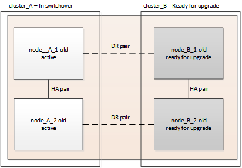

= Mettez à niveau les contrôleurs d'une configuration MetroCluster FC en utilisant le basculement et le rétablissement
:allow-uri-read: 
:icons: font
:imagesdir: ../media/

[role="lead"]
Il est possible d'utiliser le basculement MetroCluster pour fournir un service sans interruption aux clients pendant la mise à niveau des modules de contrôleur du cluster partenaire. Dans le cadre de cette procédure, d'autres composants (tels que des tiroirs de stockage ou des commutateurs) ne peuvent pas être mis à niveau.

== Combinaisons de plateformes prises en charge

Vous pouvez mettre à niveau certaines plateformes en utilisant l'opération de basculement et de rétablissement dans une configuration MetroCluster FC.

Pour en savoir plus sur les combinaisons de mise à niveau de plateforme prises en charge, consultez le tableau des mises à niveau FC MetroCluster dans  link:concept_choosing_controller_upgrade_mcc.html#supported-metrocluster-fc-controller-upgrades["Choisir la procédure de mise à niveau du contrôleur"].

Reportez-vous à la section https://docs.netapp.com/us-en/ontap-metrocluster/upgrade/concept_choosing_an_upgrade_method_mcc.html["Choisissez une méthode de mise à niveau ou de rafraîchissement"] pour les procédures supplémentaires.

== Description de la tâche

* Cette procédure ne peut être utilisée que pour la mise à niveau du contrôleur.
+
Les autres composants de la configuration, tels que les tiroirs de stockage ou les commutateurs, ne peuvent pas être mis à niveau simultanément.

* Vous pouvez utiliser cette procédure avec certaines versions de ONTAP :
+
** Les configurations à deux nœuds sont prises en charge par ONTAP 9.3 et versions ultérieures.
** Les configurations à quatre et huit nœuds sont prises en charge dans ONTAP 9.8 et versions ultérieures.
+
N'utilisez pas cette procédure pour des configurations à quatre ou huit nœuds exécutant les versions ONTAP antérieures à 9.8.

* Vos plateformes d'origine et nouvelles doivent être compatibles et prises en charge.
+
https://hwu.netapp.com["NetApp Hardware Universe"]

+

NOTE: Si les plateformes d'origine ou nouvelles sont des systèmes FAS8020 ou AFF8020 utilisant les ports 1c et 1D en mode FC-VI, consultez l'article de la base de connaissances link:https://kb.netapp.com/Advice_and_Troubleshooting/Data_Protection_and_Security/MetroCluster/Upgrading_controllers_when_FCVI_connections_on_existing_FAS8020_or_AFF8020_nodes_use_ports_1c_and_1d["Mise à niveau des contrôleurs lors des connexions FCVI sur les nœuds FAS8020 ou AFF8020 existants utilisent les ports 1c et 1D."^]

* Les licences des deux sites doivent correspondre. Vous pouvez obtenir de nouvelles licences à partir de link:https://mysupport.netapp.com/site/["Support NetApp"^].
* Cette procédure s'applique aux modules de contrôleur dans une configuration MetroCluster FC (MetroCluster extensible à deux nœuds ou une configuration MetroCluster à deux, quatre ou huit nœuds).
* Tous les contrôleurs d'un même groupe de reprise sur incident doivent être mis à niveau pendant la même période de maintenance.
+
L'exploitation de la configuration MetroCluster avec différents types de contrôleurs dans le même groupe de reprise sur incident n'est pas prise en charge en dehors de cette activité de maintenance. Pour les configurations MetroCluster à 8 nœuds, les contrôleurs d'un groupe de reprise après incident doivent être identiques, mais les deux groupes de reprise après incident peuvent utiliser différents types de contrôleur.

* Le mappage anticipé des connexions de stockage, FC et Ethernet entre les nœuds d'origine et les nouveaux nœuds est recommandé.
* Si la nouvelle plate-forme comporte moins de slots que le système d'origine ou si elle comporte moins ou différents types de ports, vous devrez peut-être ajouter un adaptateur au nouveau système.
+
Pour plus d'informations, reportez-vous à la section https://hwu.netapp.com/["NetApp Hardware Universe"^]

Les exemples de noms suivants sont utilisés dans cette procédure :

* Site_A
+
** Avant la mise à niveau :
+
*** Node_A_1-Old
*** Node_A_2-Old

** Après la mise à niveau :
+
*** Node_A_1-New
*** Node_A_2-New

* Site_B
+
** Avant la mise à niveau :
+
*** Node_B_1-Old
*** Node_B_2-Old

** Après la mise à niveau :
+
*** Node_B_1-New
*** Node_B_2-New

== Activer la journalisation de la console

NetApp vous recommande vivement d'activer la journalisation de la console sur les périphériques que vous utilisez et d'effectuer les actions suivantes lors de l'exécution de cette procédure :

* Laissez AutoSupport activé pendant la maintenance.
* Déclencher un message AutoSupport de maintenance avant et après la maintenance pour désactiver la création de dossiers pendant la durée de l'activité de maintenance.
+
Consultez l'article de la base de connaissances link:https://kb.netapp.com/Support_Bulletins/Customer_Bulletins/SU92["Comment supprimer la création automatique de dossier pendant les fenêtres de maintenance planifiées"^].

* Activer la journalisation de session pour toute session CLI. Pour obtenir des instructions sur l'activation de la journalisation des sessions, consultez la section « consignation des sorties de session » de l'article de la base de connaissances link:https://kb.netapp.com/on-prem/ontap/Ontap_OS/OS-KBs/How_to_configure_PuTTY_for_optimal_connectivity_to_ONTAP_systems["Comment configurer PuTTY pour une connectivité optimale aux systèmes ONTAP"^].

== Préparation à la mise à niveau

Avant d'apporter des modifications à la configuration MetroCluster existante, vous devez vérifier l'état de santé de la configuration, préparer les nouvelles plateformes et effectuer d'autres tâches diverses.

=== Vérifier l'état de santé de la configuration MetroCluster

Vous vérifiez l’intégrité et la connectivité de la configuration MetroCluster avant d’effectuer la mise à niveau.

CAUTION: Après avoir mis à niveau les contrôleurs sur le premier site et avant de mettre à niveau le second, exécutez  `metrocluster check run` suivi de  `metrocluster check show` renvoie une erreur dans le  `config-replication` Champ. Cette erreur indique une incompatibilité de taille de NVRAM entre les nœuds de chaque site. Il s'agit du comportement attendu lorsque les modèles de plateforme sont différents sur les deux sites. Vous pouvez ignorer cette erreur jusqu'à ce que la mise à niveau du contrôleur soit terminée pour tous les nœuds du groupe DR.

.Étapes
. Vérifier le fonctionnement de la configuration MetroCluster dans ONTAP :
+
.. Vérifiez si les nœuds sont multipathed : +
`node run -node _node-name_ sysconfig -a`
+
Vous devez exécuter cette commande pour chaque nœud de la configuration MetroCluster.

.. Vérifier qu'il n'y a aucun disque défectueux dans la configuration :
+
`storage disk show -broken`

+
Vous devez exécuter cette commande sur chaque nœud de la configuration MetroCluster.

.. Vérifiez si des alertes d'intégrité sont émises :
+
`system health alert show`

+
Vous devez exécuter cette commande sur chaque cluster.

.. Vérifier les licences sur les clusters :
+
`system license show`

+
Vous devez exécuter cette commande sur chaque cluster.

.. Vérifiez les périphériques connectés aux nœuds :
+
`network device-discovery show`

+
Vous devez exécuter cette commande sur chaque cluster.

.. Vérifiez que le fuseau horaire et l'heure sont correctement définis sur les deux sites :
+
`cluster date show`

+
Vous devez exécuter cette commande sur chaque cluster. Vous pouvez utiliser le `cluster date` commandes permettant de configurer le fuseau horaire et le fuseau horaire.

. Vérifier la présence d'alertes d'intégrité sur les commutateurs (le cas échéant) :
+
`storage switch show`

+
Vous devez exécuter cette commande sur chaque cluster.

. Vérifier le mode opérationnel de la configuration MetroCluster et effectuer un contrôle MetroCluster.
+
.. Vérifier la configuration MetroCluster et que le mode opérationnel est normal :
+
`metrocluster show`

.. Vérifiez que tous les nœuds attendus s'affichent :
+
`metrocluster node show`

.. Exécutez la commande suivante :
+
`metrocluster check run`

.. Afficher les résultats de la vérification MetroCluster :
+
`metrocluster check show`

. Vérifiez le câblage MetroCluster à l'aide de l'outil Config Advisor.
+
.. Téléchargez et exécutez Config Advisor.
+
https://mysupport.netapp.com/site/tools/tool-eula/activeiq-configadvisor["Téléchargement NetApp : Config Advisor"]

.. Une fois Config Advisor exécuté, vérifiez les résultats de l'outil et suivez les recommandations fournies dans la sortie pour résoudre tous les problèmes détectés.

=== Mappage des ports des anciens nœuds sur les nouveaux nœuds

Vous devez planifier le mappage des LIFs sur les ports physiques des anciens nœuds sur les ports physiques des nouveaux nœuds.

.Description de la tâche
Une fois le nouveau nœud démarré au cours du processus de mise à niveau, la configuration la plus récente de l'ancien nœud qu'il remplace est retraitée. Lorsque vous démarrez node_A_1-New, ONTAP tente d'héberger les LIFs sur les mêmes ports qui ont été utilisés sur node_A_1-Old. Par conséquent, dans le cadre de la mise à niveau, vous devez ajuster la configuration du port et de la LIF afin qu'elle soit compatible avec celle de l'ancien nœud. Durant la procédure de mise à niveau, vous effectuez les étapes des anciens et nouveaux nœuds afin d'assurer une configuration correcte du cluster, de la gestion et de la LIF de données.

Le tableau suivant présente des exemples de modifications de configuration liées aux exigences de port des nouveaux nœuds.

[cols="1,1,3"]
|===

3+| Ports physiques d'interconnexion de cluster 

| Ancien contrôleur | Nouveau contrôleur | Action requise 

 a| 
e0a, e0b
 a| 
e3a, e3b
 a| 
Aucun port correspondant. Après la mise à niveau, recréez les ports du cluster. link:task_prepare_cluster_ports_on_the_exist_controller.html["Préparer les ports de cluster sur un module de contrôleur existant"]

 a| 
e0c, e0d
 a| 
e0a,e0b,e0c,e0d
 a| 
e0c et e0d sont des ports correspondants. Vous n'avez pas à modifier la configuration, mais après une mise à niveau, vous pouvez répartir les LIF de cluster entre les ports disponibles.

|===
.Étapes
. Identifiez les ports physiques disponibles sur les nouveaux contrôleurs et les LIFs peuvent être hébergées sur les ports.
+
L'utilisation des ports du contrôleur dépend du module de plate-forme et des commutateurs que vous utiliserez dans la configuration IP de MetroCluster. Vous pouvez collecter l'utilisation des ports des nouvelles plates-formes à partir du link:https://hwu.netapp.com["NetApp Hardware Universe"^].

+
Identifier également l'utilisation du slot de carte FC-VI.

. Planifiez l'utilisation de vos ports et, le cas échéant, remplissez les tableaux suivants pour vous y référer pour chacun des nouveaux nœuds.
+
Vous vous référez au tableau lors de la procédure de mise à niveau.

+
|===

|  3+| Node_A_1-Old 3+| Node_A_1-New 

| LIF | Ports | Les IPspaces | Les domaines de diffusion | Ports | Les IPspaces | Les domaines de diffusion 

 a| 
Cluster 1
 a| 
 a| 
 a| 
 a| 
 a| 
 a| 

 a| 
Cluster 2
 a| 
 a| 
 a| 
 a| 
 a| 
 a| 

 a| 
Cluster 3
 a| 
 a| 
 a| 
 a| 
 a| 
 a| 

 a| 
Cluster 4
 a| 
 a| 
 a| 
 a| 
 a| 
 a| 

 a| 
Gestion de nœuds
 a| 
 a| 
 a| 
 a| 
 a| 
 a| 

 a| 
Gestion du cluster
 a| 
 a| 
 a| 
 a| 
 a| 
 a| 

 a| 
Données 1
 a| 
 a| 
 a| 
 a| 
 a| 
 a| 

 a| 
Données 2
 a| 
 a| 
 a| 
 a| 
 a| 
 a| 

 a| 
Données 3
 a| 
 a| 
 a| 
 a| 
 a| 
 a| 

 a| 
Données 4
 a| 
 a| 
 a| 
 a| 
 a| 
 a| 

 a| 
SAN
 a| 
 a| 
 a| 
 a| 
 a| 
 a| 

 a| 
Port intercluster
 a| 
 a| 
 a| 
 a| 
 a| 
 a| 

|===

=== Recueillez les informations avant la mise à niveau

Avant de procéder à la mise à niveau, vous devez recueillir des informations pour chacun des anciens nœuds et, si nécessaire, ajuster les domaines de diffusion réseau, supprimer les VLAN et les groupes d'interface et collecter des informations de chiffrement.

.Description de la tâche
Cette tâche s'effectue sur la configuration FC MetroCluster existante.

.Étapes
. Etiqueter les câbles pour les contrôleurs existants, afin de faciliter l'identification des câbles lors de la configuration des nouveaux contrôleurs.
. Collectez les ID système des nœuds de la configuration MetroCluster :
+
`metrocluster node show -fields node-systemid,dr-partner-systemid`

+
Au cours de la procédure de mise à niveau, vous remplacerez ces anciens ID système par les ID système des nouveaux modules de contrôleur.

+
Dans cet exemple de configuration FC MetroCluster à quatre nœuds, les anciens ID système suivants sont récupérés :

+
** Node_A_1-Old : 4068741258
** Node_A_2-Old : 4068741260
** Node_B_1-Old : 4068741254
** Node_B_2-Old : 4068741256
+
[listing]
----
metrocluster-siteA::> metrocluster node show -fields node-systemid,ha-partner-systemid,dr-partner-systemid,dr-auxiliary-systemid
dr-group-id   cluster                       node                   node-systemid          ha-partner-systemid     dr-partner-systemid    dr-auxiliary-systemid
-----------        ------------------------- ------------------    -------------                   -------------------                 -------------------              ---------------------
1                    Cluster_A                  Node_A_1-old   4068741258              4068741260                        4068741256                    4068741256
1                    Cluster_A                    Node_A_2-old   4068741260              4068741258                        4068741254                    4068741254
1                    Cluster_B                    Node_B_1-old   4068741254              4068741256                         4068741258                    4068741260
1                    Cluster_B                    Node_B_2-old   4068741256              4068741254                        4068741260                    4068741258
4 entries were displayed.
----
+
Dans cet exemple de configuration FC MetroCluster à deux nœuds, les anciens ID système suivants sont récupérés :

** Node_A_1 : 4068741258
** Node_B_1 : 4068741254

+
[listing]
----
metrocluster node show -fields node-systemid,dr-partner-systemid

dr-group-id cluster    node      node-systemid dr-partner-systemid
----------- ---------- --------  ------------- ------------
1           Cluster_A  Node_A_1-old  4068741258    4068741254
1           Cluster_B  node_B_1-old  -             -
2 entries were displayed.
----
. Collecte des informations relatives aux ports et aux LIF pour chaque ancien nœud.
+
Vous devez collecter les valeurs de sortie des commandes suivantes pour chaque nœud :

+
** `network interface show -role cluster,node-mgmt`
** `network port show -node _node-name_ -type physical`
** `network port vlan show -node _node-name_`
** `network port ifgrp show -node _node_name_ -instance`
** `network port broadcast-domain show`
** `network port reachability show -detail`
** `network ipspace show`
** `volume show`
** `storage aggregate show`
** `system node run -node _node-name_ sysconfig -a`

. Si les nœuds MetroCluster se trouvent dans une configuration SAN, collectez les informations pertinentes.
+
Vous devez collecter le résultat des commandes suivantes :

+
** `fcp adapter show -instance`
** `fcp interface show -instance`
** `iscsi interface show`
** `ucadmin show`

. Si le volume racine est chiffré, collectez et enregistrez la phrase secrète utilisée pour le gestionnaire de clés :
+
`security key-manager backup show`

. Si les nœuds MetroCluster utilisent le chiffrement pour des volumes ou des agrégats, copiez les informations concernant les clés et les clés de phrase secrète.
+
Pour plus d'informations, reportez-vous à la section https://docs.netapp.com/ontap-9/topic/com.netapp.doc.pow-nve/GUID-1677AE0A-FEF7-45FA-8616-885AA3283BCF.html["Sauvegarde manuelle des informations de gestion intégrée des clés"].

+
.. Si le gestionnaire de clés intégré est configuré :
+
`security key-manager onboard show-backup`

+
Vous aurez besoin de la phrase de passe plus tard dans la procédure de mise à niveau.

.. Si le protocole KMIP (Enterprise Key Management) est configuré, exécutez les commandes suivantes :
+
`security key-manager external show -instance`

+
`security key-manager key query`

=== Supprimez la configuration existante du logiciel disjoncteur d'attache ou tout autre logiciel de surveillance

Si la configuration existante est contrôlée avec la configuration MetroCluster Tiebreaker ou d'autres applications tierces (telles que ClusterLion) capables d'effectuer un basculement, vous devez supprimer la configuration MetroCluster du logiciel disjoncteur d'attache ou d'autres logiciels avant la transition.

.Étapes
. Supprimer la configuration MetroCluster existante du logiciel disjoncteur d'attache
+
link:../tiebreaker/concept_configuring_the_tiebreaker_software.html#remove-metrocluster-configurations["Supprimer les configurations MetroCluster"]

. Supprimez la configuration MetroCluster existante de toute application tierce pouvant effectuer le basculement.
+
Reportez-vous à la documentation de l'application.

=== Envoyer un message AutoSupport personnalisé avant la maintenance

Avant d'effectuer la maintenance, vous devez envoyer un message AutoSupport pour informer le support technique de NetApp que la maintenance est en cours. Informer le support technique que la maintenance est en cours empêche l'ouverture d'un dossier en supposant une interruption de l'activité.

.Description de la tâche
Cette tâche doit être effectuée sur chaque site MetroCluster.

.Étapes
. Pour éviter la génération automatique de dossiers de demande de support, envoyez un message AutoSupport pour indiquer que la maintenance est en cours.
+
.. Exécutez la commande suivante :
+
`system node autosupport invoke -node * -type all -message MAINT=__maintenance-window-in-hours__`

+
`maintenance-window-in-hours` spécifie la durée de la fenêtre de maintenance, avec un maximum de 72 heures. Si la maintenance est terminée avant le temps écoulé, vous pouvez appeler un message AutoSupport indiquant la fin de la période de maintenance :

+
`system node autosupport invoke -node * -type all -message MAINT=end`

.. Répétez la commande sur le cluster partenaire.

== Basculer la configuration MetroCluster

Vous devez basculer la configuration vers site_A afin de pouvoir mettre à niveau les plateformes du site_B.

.Description de la tâche
Cette tâche doit être effectuée sur site_A.

Une fois cette tâche terminée, cluster_A est actif et assure le service des données des deux sites. Cluster_B est inactif et prêt à démarrer le processus de mise à niveau, comme illustré ci-dessous.

.Étapes
. Basculer la configuration MetroCluster sur site_A afin de mettre à niveau les nœuds site_B :
+
.. Sélectionnez l'option qui correspond à votre configuration et exécutez la commande appropriée sur cluster_A :
+
[role="tabbed-block"]
====
.Option 1 : configuration FC à quatre ou huit nœuds exécutant ONTAP 9.8 ou une version ultérieure
--
Lancer la commande : `metrocluster switchover -controller-replacement true`

--
.Option 2 : configuration FC à deux nœuds exécutant ONTAP 9.3 et versions ultérieures
--
Lancer la commande : `metrocluster switchover`

--
====
+
L'opération peut prendre plusieurs minutes.

.. Surveiller le fonctionnement du basculement :
+
`metrocluster operation show`

.. Une fois l'opération terminée, vérifiez que les nœuds sont en état de basculement :
+
`metrocluster show`

.. Vérifier l'état des nœuds MetroCluster :
+
`metrocluster node show`

. Corriger les agrégats de données.
+
.. Réparation des agrégats de données :
+
`metrocluster heal data-aggregates`

.. Vérifiez que l'opération de correction est terminée en exécutant le `metrocluster operation show` commande sur le cluster sain :
+
[listing]
----

cluster_A::> metrocluster operation show
  Operation: heal-aggregates
      State: successful
 Start Time: 7/29/2020 20:54:41
   End Time: 7/29/2020 20:54:42
     Errors: -
----

. Corriger les agrégats racine.
+
.. Réparation des agrégats de données :
+
`metrocluster heal root-aggregates`

.. Vérifiez que l'opération de correction est terminée en exécutant le `metrocluster operation show` commande sur le cluster sain :
+
[listing]
----

cluster_A::> metrocluster operation show
  Operation: heal-root-aggregates
      State: successful
 Start Time: 7/29/2020 20:58:41
   End Time: 7/29/2020 20:59:42
     Errors: -
----

== Préparer la configuration réseau des anciens contrôleurs

Pour assurer la reprise du réseau correctement sur les nouveaux contrôleurs, vous devez déplacer les LIF vers un port commun, puis supprimer la configuration réseau des anciens contrôleurs.

.Description de la tâche
* Cette tâche doit être effectuée sur chacun des anciens nœuds.
* Vous utiliserez les informations recueillies dans link:task_upgrade_controllers_in_a_four_node_fc_mcc_us_switchover_and_switchback_mcc_fc_4n_cu.html["Mappage des ports des anciens nœuds sur les nouveaux nœuds"].

.Étapes
. Démarrez les anciens nœuds, puis connectez-vous aux nœuds :
+
`boot_ontap`

. Assignez le port de base de toutes les LIFs de données de l'ancien contrôleur à un port commun identique sur les anciens et les nouveaux modules de contrôleur.
+
.. Afficher les LIFs :
+
`network interface show`

+
Toutes LES LIF de données, y compris SAN et NAS, seront administrative et hors service, car celles-ci fonctionnent sur le site basculement (cluster_A).

.. Vérifiez le résultat de cette commande pour trouver un port réseau physique commun identique sur l'ancien et le nouveau contrôleur qui n'est pas utilisé comme port du cluster.
+
Ainsi, le port e0d est un port physique des anciens contrôleurs et il est également présent sur les nouveaux contrôleurs. e0d n'est pas utilisé comme port de cluster ou autre sur les nouveaux contrôleurs.

+
Pour l'utilisation des ports pour les modèles de plate-forme, reportez-vous à la section https://hwu.netapp.com/["NetApp Hardware Universe"]

.. Modifier toutes LES LIFS de données pour utiliser le port commun comme port de base :
+
`network interface modify -vserver _svm-name_ -lif _data-lif_ -home-port _port-id_`

+
Dans l'exemple suivant, il s'agit de « e0d ».

+
Par exemple :

+
[listing]
----
network interface modify -vserver vs0 -lif datalif1 -home-port e0d
----

. Modifier les domaines de diffusion pour supprimer les vlan et les ports physiques qui doivent être supprimés :
+
`broadcast-domain remove-ports -broadcast-domain _broadcast-domain-name_ -ports _node-name:port-id_`

+
Répétez cette étape pour tous les réseaux VLAN et les ports physiques.

. Retirez tous les ports VLAN utilisant les ports de cluster comme ports membres et ifgrps utilisant les ports de cluster comme ports membres.
+
.. Supprimer les ports VLAN :
+
`network port vlan delete -node _node-name_ -vlan-name _portid-vlandid_`

+
Par exemple :

+
[listing]
----
network port vlan delete -node node1 -vlan-name e1c-80
----
.. Supprimez les ports physiques des groupes d'interface :
+
`network port ifgrp remove-port -node _node-name_ -ifgrp _interface-group-name_ -port _portid_`

+
Par exemple :

+
[listing]
----
network port ifgrp remove-port -node node1 -ifgrp a1a -port e0d
----
.. Supprimer les ports VLAN et group d'interface de broadcast domain :
+
`network port broadcast-domain remove-ports -ipspace _ipspace_ -broadcast-domain _broadcast-domain-name_ -ports _nodename:portname,nodename:portname_,..`

.. Modifiez les ports du groupe d'interface pour utiliser d'autres ports physiques comme membre :
+
`ifgrp add-port -node _node-name_ -ifgrp _interface-group-name_ -port _port-id_`

. Arrêter les nœuds :
+
`halt -inhibit-takeover true -node _node-name_`

+
Cette étape doit être effectuée sur les deux nœuds.

== Supprimer les anciennes plateformes

Les anciens contrôleurs doivent être supprimés de la configuration.

.Description de la tâche
Cette tâche est effectuée sur site_B.

.Étapes
. Se connecter à la console série des anciens contrôleurs (node_B_1-Old et node_B_2-Old) au site_B et vérifier qu'il affiche l'invite DU CHARGEUR.
. Déconnectez les connexions de stockage et de réseau du nœud_B_1-Old et du nœud_B_2-Old et étiquetez les câbles pour qu'ils puissent être reconnectés aux nouveaux nœuds.
. Déconnectez les câbles d'alimentation du nœud_B_1-Old et du nœud_B_2-Old.
. Retirez le rack des contrôleurs node_B_1-Old et node_B_2-Old.

== Configuration des nouveaux contrôleurs

Vous devez installer et installer les contrôleurs, effectuer la configuration requise en mode maintenance, puis démarrer les contrôleurs, et vérifier la configuration LIF sur les contrôleurs.

=== Configurer les nouveaux contrôleurs

Vous devez installer et câbler les nouveaux contrôleurs.

.Étapes
. Planifiez le positionnement des nouveaux modules de contrôleur et tiroirs de stockage en fonction des besoins.
+
L'espace rack dépend du modèle de plateforme des modules de contrôleur, des types de switchs et du nombre de tiroirs de stockage de votre configuration.

. Mettez-vous à la terre.
. Installez les modules de contrôleur sur le rack ou l'armoire.
+
https://docs.netapp.com/platstor/index.jsp["Documentation des systèmes matériels ONTAP"^]

. Si les nouveaux modules de contrôleur ne sont pas livrés avec eux-mêmes des cartes FC-VI et si les cartes FC-VI des anciens contrôleurs sont compatibles avec les nouveaux contrôleurs, remplacez les cartes FC-VI et installez-les dans les connecteurs appropriés.
+
Voir la link:https://hwu.netapp.com["NetApp Hardware Universe"^] Pour les informations sur les slots pour les cartes FC-VI.

. Reliez les connexions d'alimentation, de console série et de gestion des contrôleurs, comme décrit dans les _MetroCluster - Guides d'installation et de configuration_.
+
Ne connectez pas d'autres câbles ayant été débranchés des anciens contrôleurs à l'heure actuelle.

+
https://docs.netapp.com/platstor/index.jsp["Documentation des systèmes matériels ONTAP"^]

. Mettez les nouveaux nœuds sous tension et appuyez sur Ctrl-C lorsque vous êtes invité à afficher l'invite DU CHARGEUR.

=== NetBoot les nouveaux contrôleurs

Une fois les nouveaux nœuds installés, vous devez démarrage sur le réseau pour vous assurer que la version des nouveaux nœuds exécute la même version de ONTAP que les nœuds d'origine. Le terme netboot signifie que vous êtes en cours de démarrage à partir d'une image ONTAP stockée sur un serveur distant. Lorsque vous vous préparez à netboot, vous devez placer une copie de l'image de démarrage ONTAP 9 sur un serveur web auquel le système peut accéder.

Cette tâche est effectuée sur chacun des nouveaux modules de contrôleur.

.Étapes
. Accédez au link:https://mysupport.netapp.com/site/["Site de support NetApp"^] pour télécharger les fichiers utilisés pour effectuer le démarrage sur le réseau du système.
. Téléchargez le logiciel ONTAP approprié depuis la section de téléchargement de logiciels du site du support NetApp et stockez le fichier ontap-version_image.tgz dans un répertoire accessible en ligne.
. Accédez au répertoire accessible sur le Web et vérifiez que les fichiers dont vous avez besoin sont disponibles.
+
|===

| Si le modèle de plateforme est... | Alors... 

| Systèmes de la gamme FAS/AFF8000 | Extrayez le contenu d'ontap-version_image.tgzfile dans le répertoire cible : tar -zxvf ontap-version_image.tgz REMARQUE : si vous extrayez le contenu sous Windows, utilisez 7-Zip ou WinRAR pour extraire l'image netboot. Votre liste de répertoires doit contenir un dossier netboot avec un fichier de noyau:netboot/kernel 

| Tous les autres systèmes | Votre liste de répertoires doit contenir un dossier netboot avec un fichier du noyau : ontap-version_image.tgz vous n'avez pas besoin d'extraire le fichier ontap-version_image.tgz. 
|===
. À l'invite DU CHARGEUR, configurez la connexion netboot pour les LIF de gestion :
+
** Si l'adressage IP est DHCP, configurez la connexion automatique :
+
`ifconfig e0M -auto`

** Si l'adressage IP est statique, configurez la connexion manuelle :
+
`ifconfig e0M -addr=ip_addr -mask=netmask` `-gw=gateway`

. Effectuer la démarrage sur le réseau.
+
** Si la plate-forme est un système de la série 80xx, utilisez la commande suivante :
+
`netboot \http://web_server_ip/path_to_web-accessible_directory/netboot/kernel`

** Si la plateforme est un autre système, utilisez la commande suivante :
+
`netboot \http://web_server_ip/path_to_web-accessible_directory/ontap-version_image.tgz`

. Dans le menu de démarrage, sélectionnez l'option *(7) installer le nouveau logiciel en premier* pour télécharger et installer la nouvelle image logicielle sur le périphérique d'amorçage.
+
 Disregard the following message: "This procedure is not supported for Non-Disruptive Upgrade on an HA pair". It applies to nondisruptive upgrades of software, not to upgrades of controllers.
. Si vous êtes invité à poursuivre la procédure, entrez `y`, Et lorsque vous êtes invité à saisir l'URL du fichier image : `\http://web_server_ip/path_to_web-accessible_directory/ontap-version_image.tgz`
+
....
Enter username/password if applicable, or press Enter to continue.
....
. Assurez-vous d'entrer `n` pour ignorer la restauration de la sauvegarde lorsque vous voyez une invite similaire à la suivante :
+
....
Do you want to restore the backup configuration now? {y|n}
....
. Redémarrez en entrant `y` lorsque vous voyez une invite similaire à la suivante :
+
....
The node must be rebooted to start using the newly installed software. Do you want to reboot now? {y|n}
....

=== Effacez la configuration d'un module de contrôleur

Avant d'utiliser un nouveau module de contrôleur dans la configuration MetroCluster, il faut effacer la configuration existante.

.Étapes
. Si nécessaire, arrêtez le nœud pour afficher l' `LOADER`invite :
+
`halt`

. À l' `LOADER`invite, définissez les variables d'environnement sur les valeurs par défaut :
+
`set-defaults`

. Enregistrez l'environnement :
+
`saveenv`

. À l' `LOADER`invite, lancez le menu de démarrage :
+
`boot_ontap menu`

. À l'invite du menu de démarrage, effacez la configuration :
+
`wipeconfig`

+
Répondez `yes` à l'invite de confirmation.

+
Le nœud redémarre et le menu de démarrage s'affiche de nouveau.

. Dans le menu de démarrage, sélectionnez l'option *5* pour démarrer le système en mode Maintenance.
+
Répondez `yes` à l'invite de confirmation.

=== Restaurez la configuration HBA

En fonction de la présence et de la configuration des cartes HBA dans le module de contrôleur, vous devez les configurer correctement pour l'utilisation de votre site.

.Étapes
. En mode Maintenance, configurez les paramètres de tous les HBA du système :
+
.. Vérifiez les paramètres actuels des ports : `ucadmin show`
.. Mettez à jour les paramètres de port selon vos besoins.

+
[cols="1,3"]
|===

| Si vous disposez de ce type de HBA et du mode souhaité... | Utilisez cette commande... 

 a| 
FC CNA
 a| 
`ucadmin modify -m fc -t initiator _adapter-name_`

 a| 
Ethernet CNA
 a| 
`ucadmin modify -mode cna _adapter-name_`

 a| 
Cible FC
 a| 
`fcadmin config -t target _adapter-name_`

 a| 
Initiateur FC
 a| 
`fcadmin config -t initiator _adapter-name_`

|===
. Quitter le mode Maintenance :
+
`halt`

+
Une fois que vous avez exécuté la commande, attendez que le nœud s'arrête à l'invite DU CHARGEUR.

. Redémarrez le nœud en mode maintenance pour que les modifications de configuration prennent effet :
+
`boot_ontap maint`

. Vérifiez les modifications que vous avez effectuées :
+
|===

| Si vous disposez de ce type de HBA... | Utilisez cette commande... 

 a| 
CNA
 a| 
`ucadmin show`

 a| 
FC
 a| 
`fcadmin show`

|===

=== Définissez l'état de haute disponibilité sur les nouveaux contrôleurs et châssis

Vous devez vérifier l'état haute disponibilité des contrôleurs et du châssis, et mettre à jour si nécessaire l'état en fonction de la configuration du système.

.Étapes
. En mode Maintenance, afficher l'état HA du module de contrôleur et du châssis :
+
`ha-config show`

+
L'état HA pour tous les composants doit être mcc.

+
|===

| Si la configuration MetroCluster a... | L'état de la HA doit être... 

 a| 
Deux nœuds
 a| 
mcc-2n

 a| 
Quatre ou huit nœuds
 a| 
mcc

|===
. Si l'état du système affiché du contrôleur n'est pas correct, définissez l'état HA pour le module de contrôleur et le châssis :
+
|===

| Si la configuration MetroCluster a... | Lancer ces commandes... 

 a| 
*Deux nœuds*
 a| 
`ha-config modify controller mcc-2n`

`ha-config modify chassis mcc-2n`

 a| 
*Quatre ou huit noeuds*
 a| 
`ha-config modify controller mcc`

`ha-config modify chassis mcc`

|===

=== Réallouer les disques racine de l'agrégat

Réaffectez les disques de l'agrégat racine au nouveau module de contrôleur, en utilisant les sysids réunis précédemment

.Description de la tâche
Cette tâche est effectuée en mode Maintenance.

Les anciens ID système ont été identifiés dans link:task_upgrade_controllers_in_a_four_node_fc_mcc_us_switchover_and_switchback_mcc_fc_4n_cu.html["Recueillez les informations avant la mise à niveau"].

Les exemples de cette procédure utilisent des contrôleurs avec les ID système suivants :

|===

| Nœud | Ancien ID système | Nouvel ID système 

 a| 
Nœud_B_1
 a| 
4068741254
 a| 
1574774970

|===
.Étapes
. Reliez toutes les autres connexions aux nouveaux modules de contrôleur (FC-VI, stockage, interconnexion de cluster, etc.).
. Arrêtez le système et démarrez en mode maintenance à partir de l'invite DU CHARGEUR :
+
`boot_ontap maint`

. Afficher les disques détenus par le nœud_B_1-Old :
+
`disk show -a`

+
Le résultat de la commande affiche l'ID système du nouveau module de contrôleur (1574774970). Cependant, les disques de l'agrégat racine appartiennent toujours à l'ancien ID système (4068741254). Dans cet exemple, les disques qui appartiennent aux autres nœuds de la configuration MetroCluster ne s'affichent pas.

+
[listing]
----
*> disk show -a
Local System ID: 1574774970

  DISK         OWNER                     POOL   SERIAL NUMBER    HOME                      DR HOME
------------   -------------             -----  -------------    -------------             -------------
...
rr18:9.126L44 node_B_1-old(4068741254)   Pool1  PZHYN0MD         node_B_1-old(4068741254)  node_B_1-old(4068741254)
rr18:9.126L49 node_B_1-old(4068741254)   Pool1  PPG3J5HA         node_B_1-old(4068741254)  node_B_1-old(4068741254)
rr18:8.126L21 node_B_1-old(4068741254)   Pool1  PZHTDSZD         node_B_1-old(4068741254)  node_B_1-old(4068741254)
rr18:8.126L2  node_B_1-old(4068741254)   Pool0  S0M1J2CF         node_B_1-old(4068741254)  node_B_1-old(4068741254)
rr18:8.126L3  node_B_1-old(4068741254)   Pool0  S0M0CQM5         node_B_1-old(4068741254)  node_B_1-old(4068741254)
rr18:9.126L27 node_B_1-old(4068741254)   Pool0  S0M1PSDW         node_B_1-old(4068741254)  node_B_1-old(4068741254)
...
----
. Réallouer les disques racine de l'agrégat sur les tiroirs disques vers le nouveau contrôleur :
+
`disk reassign -s _old-sysid_ -d _new-sysid_`

+
L'exemple suivant montre la réaffectation de disques :

+
[listing]
----
*> disk reassign -s 4068741254 -d 1574774970
Partner node must not be in Takeover mode during disk reassignment from maintenance mode.
Serious problems could result!!
Do not proceed with reassignment if the partner is in takeover mode. Abort reassignment (y/n)? n

After the node becomes operational, you must perform a takeover and giveback of the HA partner node to ensure disk reassignment is successful.
Do you want to continue (y/n)? Jul 14 19:23:49 [localhost:config.bridge.extra.port:error]: Both FC ports of FC-to-SAS bridge rtp-fc02-41-rr18:9.126L0 S/N [FB7500N107692] are attached to this controller.
y
Disk ownership will be updated on all disks previously belonging to Filer with sysid 4068741254.
Do you want to continue (y/n)? y
----
. Vérifier que tous les disques sont réaffectés comme prévu :
+
`disk show`

+
[listing]
----
*> disk show
Local System ID: 1574774970

  DISK        OWNER                      POOL   SERIAL NUMBER   HOME                      DR HOME
------------  -------------              -----  -------------   -------------             -------------
rr18:8.126L18 node_B_1-new(1574774970)   Pool1  PZHYN0MD        node_B_1-new(1574774970)  node_B_1-new(1574774970)
rr18:9.126L49 node_B_1-new(1574774970)   Pool1  PPG3J5HA        node_B_1-new(1574774970)  node_B_1-new(1574774970)
rr18:8.126L21 node_B_1-new(1574774970)   Pool1  PZHTDSZD        node_B_1-new(1574774970)  node_B_1-new(1574774970)
rr18:8.126L2  node_B_1-new(1574774970)   Pool0  S0M1J2CF        node_B_1-new(1574774970)  node_B_1-new(1574774970)
rr18:9.126L29 node_B_1-new(1574774970)   Pool0  S0M0CQM5        node_B_1-new(1574774970)  node_B_1-new(1574774970)
rr18:8.126L1  node_B_1-new(1574774970)   Pool0  S0M1PSDW        node_B_1-new(1574774970)  node_B_1-new(1574774970)
*>
----
. Afficher le statut de l'agrégat :
+
`aggr status`

+
[listing]
----
*> aggr status
           Aggr            State       Status           Options
aggr0_node_b_1-root    online      raid_dp, aggr    root, nosnap=on,
                           mirrored                     mirror_resync_priority=high(fixed)
                           fast zeroed
                           64-bit
----
. Répétez les étapes ci-dessus sur le nœud partenaire (node_B_2-New).

=== Démarrer les nouveaux contrôleurs

Vous devez redémarrer les contrôleurs à partir du menu de démarrage pour mettre à jour l'image flash du contrôleur. Des étapes supplémentaires sont nécessaires si le chiffrement est configuré.

.Description de la tâche
Cette tâche doit être effectuée sur tous les nouveaux contrôleurs.

.Étapes
. Arrêter le nœud :
+
`halt`

. Si le gestionnaire de clés externe est configuré, définissez les paramètres bootargs associés :
+
`setenv bootarg.kmip.init.ipaddr _ip-address_`

+
`setenv bootarg.kmip.init.netmask _netmask_`

+
`setenv bootarg.kmip.init.gateway _gateway-address_`

+
`setenv bootarg.kmip.init.interface _interface-id_`

. Afficher le menu de démarrage :
+
`boot_ontap menu`

. Si le cryptage racine est utilisé, en fonction de la version de ONTAP que vous utilisez, sélectionnez l'option du menu de démarrage ou lancez la commande du menu de démarrage pour votre configuration de gestion des clés.
+
[role="tabbed-block"]
====
.ONTAP 9.8 et versions ultérieures
--
Depuis ONTAP 9.8, sélectionnez l'option de menu de démarrage.

|===

| Si vous utilisez... | Sélectionnez cette option de menu de démarrage... 

 a| 
Gestion intégrée des clés
 a| 
Option « 10 »

Suivez les invites pour fournir les entrées requises pour récupérer et restaurer la configuration du gestionnaire de clés.

 a| 
Gestion externe des clés
 a| 
Option « 11 »

Suivez les invites pour fournir les entrées requises pour récupérer et restaurer la configuration du gestionnaire de clés.

|===
--
.ONTAP 9.7 et versions antérieures
--
Pour ONTAP 9.7 et les versions antérieures, exécutez la commande boot menu.

|===

| Si vous utilisez... | Exécutez cette commande à l'invite du menu de démarrage... 

 a| 
Gestion intégrée des clés
 a| 
`recover_onboard_keymanager`

 a| 
Gestion externe des clés
 a| 
`recover_external_keymanager`

|===
--
====
. Si AUTOBOOT est activé, interrompez l'AUTOBOOT en appuyant sur CTRL-C.
. Dans le menu de démarrage, exécutez l'option « 6 ».
+

NOTE: L'option « 6 » redémarre le nœud deux fois avant de terminer.

+
Répondez « y » aux invites de changement d'ID système. Attendez les deuxième messages de redémarrage :

+
[listing]
----
Successfully restored env file from boot media...

Rebooting to load the restored env file...
----
. Vérifiez que le partenaire-sysid est correct :
+
`printenv partner-sysid`

+
Si le partenaire-sysid n'est pas correct, définissez-le :

+
`setenv partner-sysid _partner-sysID_`

. Si le cryptage racine est utilisé, en fonction de la version de ONTAP que vous utilisez, sélectionnez l'option du menu de démarrage ou exécutez de nouveau la commande du menu de démarrage pour la configuration de la gestion des clés.
+
[role="tabbed-block"]
====
.ONTAP 9.8 et versions ultérieures
--
Depuis ONTAP 9.8, sélectionnez l'option de menu de démarrage.

|===

| Si vous utilisez... | Sélectionnez cette option de menu de démarrage... 

 a| 
Gestion intégrée des clés
 a| 
Option « 10 »

Suivez les invites pour fournir les entrées requises pour récupérer et restaurer la configuration du gestionnaire de clés.

 a| 
Gestion externe des clés
 a| 
Option « 11 »

Suivez les invites pour fournir les entrées requises pour récupérer et restaurer la configuration du gestionnaire de clés.

|===
Selon le paramètre du gestionnaire de clés, effectuez la procédure de récupération en sélectionnant l'option « 10 » ou « 11 », suivie de l'option « 6 » à la première invite du menu d'amorçage. Pour démarrer complètement les nœuds, il est possible que vous deviez répéter la procédure de restauration suite à l'option « 1 » (démarrage normal).

--
.ONTAP 9.7 et versions antérieures
--
Pour ONTAP 9.7 et les versions antérieures, exécutez la commande boot menu.

|===

| Si vous utilisez... | Exécutez cette commande à l'invite du menu de démarrage... 

 a| 
Gestion intégrée des clés
 a| 
`recover_onboard_keymanager`

 a| 
Gestion externe des clés
 a| 
`recover_external_keymanager`

|===
Vous devrez peut-être émettre le `recover_xxxxxxxx_keymanager` commande à l'invite du menu de démarrage plusieurs fois jusqu'à ce que les nœuds démarrent entièrement.

--
====
. Démarrez les nœuds :
+
`boot_ontap`

. Attendez que les nœuds remplacés démarrent.
+
Si l'un des nœuds est en mode basculement, exécutez un retour :

+
`storage failover giveback`

. Vérifier que tous les ports se trouvent dans un broadcast domain :
+
.. Afficher les domaines de diffusion :
+
`network port broadcast-domain show`

.. Ajoutez n'importe quel port à un broadcast domain si nécessaire.
+
https://docs.netapp.com/ontap-9/topic/com.netapp.doc.dot-cm-nmg/GUID-003BDFCD-58A3-46C9-BF0C-BA1D1D1475F9.html["Ajouter ou supprimer des ports d'un broadcast domain"]

.. Ajoutez le port physique qui hébergera les LIFs intercluster sur le Broadcast domain correspondant.
.. Modifier les LIFs intercluster de façon à utiliser le nouveau port physique en tant que port de départ.
.. Une fois les LIFs intercluster configurées, vérifiez le statut des clusters et redéfinissez le peering de cluster si nécessaire.
+
Vous devrez peut-être reconfigurer le peering de cluster.

+
link:../install-fc/concept_configure_the_mcc_software_in_ontap.html#peering-the-clusters["Créer une relation entre clusters"]

.. Recréez les VLAN et les groupes d'interfaces selon les besoins.
+
L'appartenance au VLAN et aux groupes d'interfaces peut être différente de celle de l'ancien nœud.

+
https://docs.netapp.com/ontap-9/topic/com.netapp.doc.dot-cm-nmg/GUID-8929FCE2-5888-4051-B8C0-E27CAF3F2A63.html["Créer un VLAN"^]

+
https://docs.netapp.com/ontap-9/topic/com.netapp.doc.dot-cm-nmg/GUID-DBC9DEE2-EAB7-430A-A773-4E3420EE2AA1.html["Combinaison de ports physiques pour créer des groupes d'interfaces"^]

. Si le chiffrement est utilisé, restaurez les clés à l'aide de la commande correcte pour la configuration de la gestion des clés.
+
|===

| Si vous utilisez... | Utilisez cette commande... 

 a| 
Gestion intégrée des clés
 a| 
`security key-manager onboard sync`

Pour plus d'informations, voir https://docs.netapp.com/ontap-9/topic/com.netapp.doc.pow-nve/GUID-E4AB2ED4-9227-4974-A311-13036EB43A3D.html["Restauration des clés de chiffrement intégrées de gestion des clés"^].

 a| 
Gestion externe des clés
 a| 
`security key-manager external restore -vserver _SVM_ -node _node_ -key-server _host_name|IP_address:port_ -key-id key_id -key-tag key_tag _node-name_`

Pour plus d'informations, voir https://docs.netapp.com/ontap-9/topic/com.netapp.doc.pow-nve/GUID-32DA96C3-9B04-4401-92B8-EAF323C3C863.html["Restauration des clés de chiffrement externes de gestion des clés"^].

|===

=== Vérifier la configuration de LIF

Vérifiez que les LIF sont hébergées sur le nœud/port approprié avant le rétablissement. Les étapes suivantes doivent être effectuées

.Description de la tâche
Cette tâche s'effectue sur site_B, où les nœuds ont été démarrés avec des agrégats racine.

.Étapes
. Vérifiez que les LIF sont hébergées sur le nœud et les ports appropriés avant le rétablissement.
+
.. Changement au niveau de privilège avancé :
+
`set -privilege advanced`

.. Remplacez la configuration des ports pour assurer un placement LIF approprié :
+
`vserver config override -command "network interface modify -vserver _vserver_name_ -home-port _active_port_after_upgrade_ -lif _lif_name_ -home-node _new_node_name_"`

+
Lors de la saisie du `network interface modify` dans la commande `vserver config override` vous ne pouvez pas utiliser la fonction de saisie semi-automatique de l'onglet. Vous pouvez créer le `network interface modify` à l'aide de la commande auto complete, puis placez-la dans le `vserver config override` commande.

.. Revenir au niveau de privilège admin : +
`set -privilege admin`

. Revert les interfaces sur leur home node :
+
`network interface revert * -vserver _vserver-name_`

+
Suivez cette étape sur tous les SVM, si nécessaire.

=== Installez les nouvelles licences

Avant l'opération de rétablissement, vous devez installer les licences des nouveaux contrôleurs.

.Étapes
. link:task_install_licenses_on_the_new_controller_module_cluster_mode.html["Installation des licences pour le nouveau module de contrôleur"]

== Retournez la configuration MetroCluster

Une fois les nouveaux contrôleurs configurés, il suffit de revenir à la configuration MetroCluster pour rétablir le fonctionnement normal.

.Description de la tâche
Cette tâche vous permet d'effectuer le rétablissement et de rétablir le fonctionnement normal de la configuration MetroCluster. Les nœuds du site_A sont toujours en attente de mise à niveau.

image::../media/mcc_upgrade_cluster_a_switchback.png[Site_A en attente d'une mise à niveau après le basculement de MetroCluster]

.Étapes
. Émettez le `metrocluster node show` Commande on site_B et vérifiez la sortie.
+
.. Vérifiez que les nouveaux nœuds sont correctement représentés.
.. Vérifiez que les nouveaux nœuds sont en attente de rétablissement.

. Rétablissement du cluster :
+
`metrocluster switchback`

. Vérifier la progression de l'opération de rétablissement :
+
`metrocluster show`

+
L'opération de rétablissement est toujours en cours lorsque la sortie s'affiche `waiting-for-switchback`:

+
[listing]
----
cluster_B::> metrocluster show
Cluster                   Entry Name          State
------------------------- ------------------- -----------
 Local: cluster_B         Configuration state configured
                          Mode                switchover
                          AUSO Failure Domain -
Remote: cluster_A         Configuration state configured
                          Mode                waiting-for-switchback
                          AUSO Failure Domain -
----
+
L'opération de rétablissement est terminée lorsque la sortie s'affiche `normal`:

+
[listing]
----
cluster_B::> metrocluster show
Cluster                   Entry Name          State
------------------------- ------------------- -----------
 Local: cluster_B         Configuration state configured
                          Mode                normal
                          AUSO Failure Domain -
Remote: cluster_A         Configuration state configured
                          Mode                normal
                          AUSO Failure Domain -
----
+
Si un rétablissement prend beaucoup de temps, vous pouvez vérifier l'état des lignes de base en cours en utilisant le `metrocluster config-replication resync-status show` commande. Cette commande est au niveau de privilège avancé.

== Vérifier l'état de santé de la configuration MetroCluster

Après la mise à niveau des modules de contrôleur, vous devez vérifier l'état de santé de la configuration MetroCluster.

.Description de la tâche
Cette tâche peut être effectuée sur n'importe quel nœud de la configuration MetroCluster.

.Étapes
. Vérifier le fonctionnement de la configuration MetroCluster :
+
.. Vérifier la configuration MetroCluster et que le mode opérationnel est normal :
+
`metrocluster show`

.. Effectuer une vérification MetroCluster :
+
`metrocluster check run`

.. Afficher les résultats de la vérification MetroCluster :
+
`metrocluster check show`

+

NOTE: Après avoir exécuté `metrocluster check run` et `metrocluster check show`, un message d'erreur similaire à ce qui suit s'affiche :

+
.Exemple
[listing]
----
Failed to validate the node and cluster components before the switchover operation.
                  Cluster_A:: node_A_1 (non-overridable veto): DR partner NVLog mirroring is not online. Make sure that the links between the two sites are healthy and properly configured.
----
+
Ce comportement est attendu en raison d'une incompatibilité du contrôleur pendant le processus de mise à niveau et le message d'erreur peut être ignoré en toute sécurité.

== Mettre à niveau les nœuds sur cluster_A

Vous devez répéter les tâches de mise à niveau sur cluster_A.

.Étape
. Répétez les étapes pour mettre à niveau les nœuds sur cluster_A, en commençant par link:task_upgrade_controllers_in_a_four_node_fc_mcc_us_switchover_and_switchback_mcc_fc_4n_cu.html["Préparation à la mise à niveau"].
+
Lorsque vous répétez la procédure, toutes les références d’exemple aux clusters et aux nœuds sont inversées. Par exemple, si vous avez l'intention de basculer du cluster_A, vous effectuez le basculement du cluster_B.

== Envoyez un message AutoSupport personnalisé après la maintenance

Une fois la mise à niveau terminée, envoyer un message AutoSupport indiquant la fin de la maintenance. La création automatique de dossier peut reprendre.

.Étape
. Pour reprendre la génération automatique de dossier de support, envoyez un message AutoSupport pour indiquer que la maintenance est terminée.
+
.. Exécutez la commande suivante :
+
`system node autosupport invoke -node * -type all -message MAINT=end`

.. Répétez la commande sur le cluster partenaire.

== Restaurez la surveillance du logiciel disjoncteur d'attache

Si le logiciel disjoncteur d'attache a déjà été configuré pour la surveillance de la configuration MetroCluster, vous pouvez restaurer la connexion ce dernier.

. Suivez les étapes de  http://docs.netapp.com/ontap-9/topic/com.netapp.doc.hw-metrocluster-tiebreaker/GUID-7259BCA4-104C-49C6-BAD0-1068CA2A3DA5.html["Ajouter des configurations MetroCluster"^] dans _Installation et configuration de MetroCluster Tiebreaker_.

