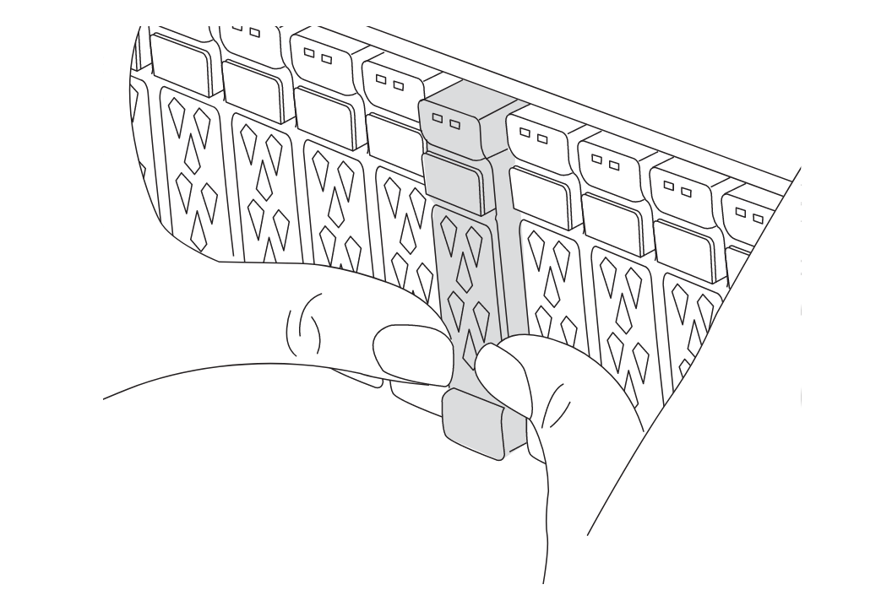

= Mise à niveau des contrôleurs d'une configuration IP MetroCluster à quatre nœuds via le basculement et le rétablissement à l'aide des commandes « system Controller replace » (ONTAP 9.13.1 et versions ultérieures)
:allow-uri-read: 
:icons: font
:imagesdir: ../media/

[role="lead"]
Vous pouvez utiliser cette opération de basculement automatisé MetroCluster guidée pour effectuer une mise à niveau sans interruption du contrôleur sur une configuration IP MetroCluster à quatre nœuds. Dans le cadre de cette procédure, d'autres composants (tels que des tiroirs de stockage ou des commutateurs) ne peuvent pas être mis à niveau.

== Mises à niveau de contrôleurs IP MetroCluster prises en charge à l'aide de commandes « system Controller replace »

Trouvez votre plate-forme *Source* dans les tableaux de mise à niveau du contrôleur MetroCluster de cette section. Si l'intersection de la ligne de plate-forme *Source* et de la colonne de plate-forme *Target* est vide, la mise à niveau n'est pas prise en charge.

Avant de commencer la mise à niveau, vérifiez les points suivants afin de vous assurer que votre configuration est prise en charge.

* Si votre plate-forme n'est pas répertoriée, aucune combinaison de mise à niveau du contrôleur n'est prise en charge.
* Lorsque vous effectuez une mise à niveau du contrôleur, l'ancien et le nouveau type de plate-forme *doivent* correspondre :
+
** Vous pouvez mettre à niveau un système FAS vers un système FAS ou un système AFF A-Series vers un système AFF A-Series.
** Vous ne pouvez pas mettre à niveau un système FAS vers un système AFF A-Series ou un système AFF A-Series vers un système AFF C-Series.
+
Par exemple, si la plateforme que vous souhaitez mettre à niveau est un système FAS8200, vous pouvez effectuer une mise à niveau vers un système FAS9000. Vous ne pouvez pas mettre à niveau un système FAS8200 vers un système AFF A700.

* Tous les nœuds (anciens et nouveaux) de la configuration MetroCluster doivent exécuter la même version de ONTAP.

.Mises à niveau des contrôleurs IP AFF et FAS MetroCluster prises en charge
Le tableau suivant présente les combinaisons de plateformes prises en charge pour la mise à niveau d'un système AFF ou FAS dans une configuration IP MetroCluster à l'aide des commandes « system Controller replace » :

image::../media/mcc_ip_system_controller_replace_aff_fas.png[le contrôleur du système mcc ip remplace AFF FAS]

* Remarque 1 : les mises à niveau des contrôleurs sont prises en charge sur les systèmes exécutant ONTAP 9.13.1 ou version ultérieure.
* Remarque 2 : la plateforme cible ne peut pas avoir de disques internes tant que la mise à niveau du contrôleur n'est pas terminée. Vous pouvez ajouter les lecteurs internes après la mise à niveau.
* Remarque 3 : nécessite le remplacement des modules de contrôleur.

.Mises à niveau du contrôleur IP ASA MetroCluster prises en charge
La mise à niveau des contrôleurs à l'aide de `system controller replace` commandes sur les systèmes ASA n'est pas prise en charge.

Reportez-vous à la section link:https://docs.netapp.com/us-en/ontap-metrocluster/upgrade/concept_choosing_an_upgrade_method_mcc.html["Choisissez une méthode de mise à niveau ou de rafraîchissement"] pour les procédures supplémentaires.

== Description de la tâche

* Cette procédure ne peut être utilisée que pour la mise à niveau du contrôleur.
+
Les autres composants de la configuration, tels que les tiroirs de stockage ou les commutateurs, ne peuvent pas être mis à niveau simultanément.

* Les commutateurs IP MetroCluster (type de commutateur, fournisseur et modèle) et la version du micrologiciel doivent être pris en charge sur les contrôleurs existants et nouveaux de votre configuration de mise à niveau.
+
Reportez-vous link:https://hwu.netapp.com["NetApp Hardware Universe"^] au ou au link:https://imt.netapp.com/matrix/["IMT"^] pour connaître les versions de micrologiciel et les commutateurs pris en charge.

* Les systèmes MetroCluster doivent exécuter la même version de ONTAP sur les deux sites.
* Vous pouvez utiliser cette procédure pour mettre à niveau les contrôleurs d'une configuration IP MetroCluster à quatre nœuds à l'aide du basculement et du rétablissement automatisés basés sur NSO.
+

NOTE: Une mise à niveau avec transfert d'agrégats (ARL) à l'aide de commandes « remplacement du contrôleur système » n'est pas prise en charge dans une configuration IP MetroCluster à quatre nœuds.

* S'il est activé sur votre système, link:../maintain/task-configure-encryption.html#disable-end-to-end-encryption["désactivez le chiffrement de bout en bout"] avant d'effectuer la mise à niveau.
* Vous devez utiliser la procédure de mise à niveau automatisée du contrôleur NSO pour mettre à niveau les contrôleurs dans l'ordre sur les deux sites.
* Cette procédure de mise à niveau automatisée du contrôleur NSO-5 vous permet de lancer le remplacement du contrôleur sur un site de reprise après incident MetroCluster. Vous pouvez effectuer le remplacement d'un contrôleur uniquement sur un site à la fois.
* Pour lancer un remplacement du contrôleur sur le site A, vous devez exécuter la commande de démarrage du remplacement du contrôleur depuis le site B. L'opération vous guide à remplacer les contrôleurs des deux nœuds sur le site A uniquement. Pour remplacer les contrôleurs sur le site B, vous devez exécuter la commande de démarrage de remplacement du contrôleur depuis le site A. Un message indique le site sur lequel les contrôleurs sont remplacés.

Les exemples de noms suivants sont utilisés dans cette procédure :

* Site_A
+
** Avant la mise à niveau :
+
*** Node_A_1-Old
*** Node_A_2-Old

** Après la mise à niveau :
+
*** Node_A_1-New
*** Node_A_2-New

* Site_B
+
** Avant la mise à niveau :
+
*** Node_B_1-Old
*** Node_B_2-Old

** Après la mise à niveau :
+
*** Node_B_1-New
*** Node_B_2-New

== Définissez le démarrage requis sur le système existant

Si vous effectuez une mise à niveau vers un système AFF A70, AFF A90 ou AFF A1K, suivez les étapes pour définir le `hw.cxgbe.toe_keepalive_disable=1` démarrage.

CAUTION: Si vous effectuez une mise à niveau vers un système AFF A70, AFF A90 ou AFF A1K, vous *devez* effectuer cette tâche avant d'effectuer la mise à niveau. Cette tâche *uniquement* s'applique aux mises à niveau vers un système AFF A70, AFF A90 ou AFF A1K à partir d'un système pris en charge. Pour toutes les autres mises à niveau, vous pouvez ignorer cette tâche et accéder directement à <<prepare_system_replace_upgrade,Préparation à la mise à niveau>>.

.Étapes
. Arrêtez un nœud sur chaque site et permettez à son partenaire haute disponibilité d'effectuer une prise de contrôle du stockage du nœud :
+
`halt  -node <node_name>`

. À `LOADER` l'invite du nœud interrompu, entrez les informations suivantes :
+
`setenv hw.cxgbe.toe_keepalive_disable 1`

+
`saveenv`

+
`printenv hw.cxgbe.toe_keepalive_disable`

. Démarrez le nœud :
+
`boot_ontap`

. Au démarrage du nœud, effectuez un rétablissement pour le nœud à l'invite :
+
`storage failover giveback -ofnode <node_name>`

. Répétez les étapes pour chaque nœud du groupe de reprise sur incident en cours de mise à niveau.

== Préparation à la mise à niveau

Pour préparer la mise à niveau du contrôleur, vous devez effectuer des contrôles préalables du système et collecter les informations de configuration.

Avant le démarrage des contrôles préalables, si le Mediator ONTAP est installé, il est automatiquement détecté et supprimé. Pour confirmer la suppression, vous êtes invité à entrer un nom d'utilisateur et un mot de passe. Lorsque vous avez terminé la mise à niveau, ou si les contrôles préalables échouent ou si vous choisissez de ne pas poursuivre la mise à niveau, vous devez <<man_reconfig_mediator,Reconfigurer manuellement le médiateur ONTAP>>.

À n'importe quel stade de la mise à niveau, vous pouvez exécuter le `system controller replace show` ou `system controller replace show-details` Commande du site A pour vérifier le statut. Si les commandes renvoient une sortie vide, attendez quelques minutes et exécutez à nouveau la commande.

.Étapes
. Lancer la procédure de remplacement automatisé du contrôleur depuis le site A pour remplacer les contrôleurs du site B :
+
`system controller replace start -nso true`

+
L'opération automatisée exécute les contrôles préalables. Si aucun problème n'est trouvé, l'opération s'interrompt pour que vous puissiez collecter manuellement les informations relatives à la configuration.

+
[NOTE]
====
** Si vous n'exécutez pas le `system controller replace start -nso true` La procédure de mise à niveau du contrôleur choisit le basculement et le rétablissement automatisés basés sur NSO comme procédure par défaut sur les systèmes IP MetroCluster.
** Le système source actuel et tous les systèmes cible compatibles sont affichés. Si vous avez remplacé le contrôleur source par un contrôleur possédant une version ONTAP différente ou une plateforme non compatible, l'opération d'automatisation s'arrête et signale une erreur après le démarrage des nouveaux nœuds. Pour rétablir l'état sain du cluster, il est nécessaire de suivre la procédure de restauration manuelle.
+
Le `system controller replace start` la commande peut signaler l'erreur de vérification préalable suivante :

+
[listing]
----
Cluster-A::*>system controller replace show
Node        Status         Error-Action
----------- -------------- ------------------------------------
Node-A-1    Failed         MetroCluster check failed. Reason : MCC check showed errors in component aggregates
----
+
Vérifiez si cette erreur s'est produite parce que vous avez des agrégats non mis en miroir ou en raison d'un autre problème d'agrégat. Vérifiez que tous les agrégats en miroir sont sains et ne sont pas dégradés ou ne sont pas dégradés. Si cette erreur est due uniquement aux agrégats non mis en miroir, vous pouvez annuler cette erreur en sélectionnant le `-skip-metrocluster-check true` sur le `system controller replace start` commande. Si le stockage distant est accessible, les agrégats sans miroir sont connectés après le basculement. En cas de défaillance de la liaison de stockage distante, les agrégats non mis en miroir ne parviennent pas à se mettre en ligne.

====
. Collectez manuellement les informations de configuration en se connectant sur le site B et en suivant les commandes répertoriées dans le message de la console sous le `system controller replace show` ou `system controller replace show-details` commande.

=== Recueillez les informations avant la mise à niveau

Avant de procéder à la mise à niveau, si le volume racine est chiffré, vous devez vous fournir la clé de sauvegarde ainsi que d'autres informations permettant de démarrer les nouveaux contrôleurs avec les anciens volumes root chiffrés.

.Description de la tâche
Cette tâche est effectuée sur la configuration IP MetroCluster existante.

.Étapes
. Etiqueter les câbles pour les contrôleurs existants afin de faciliter l'identification des câbles lors de la configuration des nouveaux contrôleurs.
. Afficher les commandes pour capturer la clé de sauvegarde et d'autres informations :
+
`system controller replace show`

+
Exécutez les commandes répertoriées sous le `show` commande provenant du cluster partenaire.

+
Le `show` Le résultat des commandes affiche trois tableaux contenant les adresses IP de l'interface MetroCluster, les ID système et les UUID du système. Ces informations sont requises plus tard dans la procédure pour définir les bootargs lorsque vous démarrez le nouveau noeud.

. Collectez les ID système des nœuds de la configuration MetroCluster :
+
--
`metrocluster node show -fields node-systemid,dr-partner-systemid`

Au cours de la procédure de mise à niveau, vous remplacerez ces anciens ID système par les ID système des nouveaux modules de contrôleur.

Dans cet exemple, pour une configuration IP MetroCluster à quatre nœuds, les anciens ID de système suivants sont récupérés :

** Node_A_1-Old : 4068741258
** Node_A_2-Old : 4068741260
** Node_B_1-Old : 4068741254
** Node_B_2-Old : 4068741256

[listing]
----
metrocluster-siteA::> metrocluster node show -fields node-systemid,ha-partner-systemid,dr-partner-systemid,dr-auxiliary-systemid
dr-group-id        cluster           node            node-systemid     ha-partner-systemid     dr-partner-systemid    dr-auxiliary-systemid
-----------        ---------------   ----------      -------------     -------------------     -------------------    ---------------------
1                    Cluster_A       Node_A_1-old    4068741258        4068741260              4068741256             4068741256
1                    Cluster_A       Node_A_2-old    4068741260        4068741258              4068741254             4068741254
1                    Cluster_B       Node_B_1-old    4068741254        4068741256              4068741258             4068741260
1                    Cluster_B       Node_B_2-old    4068741256        4068741254              4068741260             4068741258
4 entries were displayed.
----
Dans cet exemple, pour une configuration IP MetroCluster à deux nœuds, les anciens ID de système suivants sont récupérés :

** Node_A_1 : 4068741258
** Node_B_1 : 4068741254

[listing]
----
metrocluster node show -fields node-systemid,dr-partner-systemid

dr-group-id cluster    node          node-systemid dr-partner-systemid
----------- ---------- --------      ------------- ------------
1           Cluster_A  Node_A_1-old  4068741258    4068741254
1           Cluster_B  node_B_1-old  -             -
2 entries were displayed.
----
--
. Collecte des informations relatives aux ports et aux LIF pour chaque ancien nœud.
+
Vous devez collecter les valeurs de sortie des commandes suivantes pour chaque nœud :

+
** `network interface show -role cluster,node-mgmt`
** `network port show -node <node-name> -type physical`
** `network port vlan show -node <node-name>`
** `network port ifgrp show -node <node-name> -instance`
** `network port broadcast-domain show`
** `network port reachability show -detail`
** `network ipspace show`
** `volume show`
** `storage aggregate show`
** `system node run -node <node-name> sysconfig -a`
** `aggr show -r`
** `disk show`
** `system node run <node-name> disk show`
** `vol show -fields type`
** `vol show -fields type , space-guarantee`
** `vserver fcp initiator show`
** `storage disk show`
** `metrocluster configuration-settings interface show`

. Si les nœuds MetroCluster se trouvent dans une configuration SAN, collectez les informations pertinentes.
+
Vous devez collecter le résultat des commandes suivantes :

+
** `fcp adapter show -instance`
** `fcp interface show -instance`
** `iscsi interface show`
** `ucadmin show`

. Si le volume racine est chiffré, collectez et enregistrez la phrase secrète utilisée pour le gestionnaire de clés :
+
`security key-manager backup show`

. Si les nœuds MetroCluster utilisent le chiffrement pour des volumes ou des agrégats, copiez les informations concernant les clés et les clés de phrase secrète.
+
Pour plus d'informations, reportez-vous à la section https://docs.netapp.com/ontap-9/topic/com.netapp.doc.pow-nve/GUID-1677AE0A-FEF7-45FA-8616-885AA3283BCF.html["Sauvegarde manuelle des informations de gestion intégrée des clés"^].

+
.. Si le gestionnaire de clés intégré est configuré :
+
`security key-manager onboard show-backup`

+
Vous aurez besoin de la phrase de passe plus tard dans la procédure de mise à niveau.

.. Si le protocole KMIP (Enterprise Key Management) est configuré, exécutez les commandes suivantes :
+
`security key-manager external show -instance`

+
`security key-manager key query`

. Une fois que vous avez terminé de collecter les informations de configuration, reprenez l'opération :
+
`system controller replace resume`

=== Supprimez la configuration existante du logiciel disjoncteur d'attache ou tout autre logiciel de surveillance

Si la configuration existante est contrôlée avec la configuration MetroCluster Tiebreaker ou d'autres applications tierces (telles que ClusterLion) capables d'effectuer un basculement, vous devez supprimer la configuration MetroCluster du logiciel disjoncteur d'attache ou autre logiciel avant de remplacer l'ancien contrôleur.

.Étapes
. link:../tiebreaker/concept_configuring_the_tiebreaker_software.html#removing-metrocluster-configurations["Supprimez la configuration MetroCluster existante"] À partir du logiciel disjoncteur d'attache.
. Supprimez la configuration MetroCluster existante de toute application tierce pouvant effectuer le basculement.
+
Reportez-vous à la documentation de l'application.

== Remplacez les anciens contrôleurs et démarrez les nouveaux contrôleurs

Une fois que vous avez recueilli des informations et que vous reprenez l'opération, l'automatisation procède à l'opération de basculement.

.Description de la tâche
L'opération d'automatisation lance les opérations de basculement. Une fois ces opérations terminées, l'opération s'interrompt à *interrompu pour l'intervention de l'utilisateur*. Vous pouvez ainsi installer les contrôleurs, démarrer les contrôleurs partenaires et réaffecter les disques d'agrégat racine au nouveau module de contrôleur à partir de la sauvegarde flash à l'aide de `sysids` rassemblés plus tôt.

.Avant de commencer
Avant de lancer le basculement, l'automatisation s'interrompt pour que vous puissiez vérifier manuellement que toutes les LIF sont « en service » sur le site B. Si nécessaire, apportez toutes les LIF « propres » à « UP » et reprenez l'opération d'automatisation à l'aide du `system controller replace resume` commande.

=== Préparer la configuration réseau des anciens contrôleurs

Pour assurer la reprise du réseau correctement sur les nouveaux contrôleurs, vous devez déplacer les LIF vers un port commun, puis supprimer la configuration réseau des anciens contrôleurs.

.Description de la tâche
* Cette tâche doit être effectuée sur chacun des anciens nœuds.
* Vous utiliserez les informations recueillies dans <<prepare_system_replace_upgrade,Préparation à la mise à niveau>>.

.Étapes
. Démarrez les anciens nœuds, puis connectez-vous aux nœuds :
+
`boot_ontap`

. Modifier les LIFs intercluster sur les anciens contrôleurs de manière à utiliser un port home différent de celui des ports utilisés pour l'interconnexion haute disponibilité ou l'interconnexion MetroCluster IP DR sur les nouveaux contrôleurs.
+

NOTE: Cette étape est requise pour une mise à niveau réussie.

+
Les LIF intercluster des anciens contrôleurs doivent utiliser un port home différent de celui des ports utilisés pour l'interconnexion haute disponibilité ou l'interconnexion MetroCluster IP DR sur les nouveaux contrôleurs. Par exemple, lorsque vous effectuez une mise à niveau vers des contrôleurs AFF A90, les ports d'interconnexion haute disponibilité sont e1a et e7a et les ports d'interconnexion pour la reprise après incident IP MetroCluster sont e2b et e3b. Vous devez déplacer les LIFs intercluster sur les anciens contrôleurs s'ils sont hébergés sur les ports e1a, e7a, e2b ou e3b.

+
Pour la distribution et l'allocation des ports sur les nouveaux nœuds, reportez-vous à la https://hwu.netapp.com["NetApp Hardware Universe"].

+
.. Sur les anciens contrôleurs, afficher les LIFs intercluster :
+
`network interface show  -role intercluster`

+
Effectuez l'une des actions suivantes si les LIF intercluster des anciens contrôleurs utilisent les mêmes ports que les ports utilisés pour l'interconnexion haute disponibilité ou l'interconnexion MetroCluster IP DR sur les nouveaux contrôleurs.

+
[cols="2*"]
|===
| Si les LIFs intercluster... | Aller à... 

| Utilisez le même port de base | <<controller_replace_upgrade_prepare_network_ports_2b,Sous-étape b>> 

| Utilisez un autre port de base | <<controller_replace_upgrade_prepare_network_ports_3,Étape 3>> 
|===
.. [[Controller_replace_upgrade_prepare_network_ports_2b]]modifiez les LIFs intercluster pour utiliser un autre port home :
+
`network interface modify -vserver <vserver> -lif <intercluster_lif> -home-port <port-not-used-for-ha-interconnect-or-mcc-ip-dr-interconnect-on-new-nodes>`

.. Vérifier que toutes les LIFs intercluster se trouvent sur leurs nouveaux ports home :
+
`network interface show -role intercluster -is-home  false`

+
La sortie de la commande doit être vide, ce qui indique que toutes les LIFs intercluster se trouvent sur leurs ports home respectifs.

.. S'il existe des LIFs qui ne se trouvent pas sur leurs ports home, les redeviennent à l'aide de la commande suivante :
+
`network interface revert -lif <intercluster_lif>`

+
Répéter la commande pour chaque LIF intercluster qui ne se trouve pas sur le home port.

. [[Controller_replace_upgrade_prepare_network_ports_3]]affectez le port home de toutes les LIFs de données de l'ancien contrôleur à un port commun identique sur l'ancien et le nouveau module de contrôleur.
+
.. Afficher les LIFs :
+
`network interface show`

+
Toutes LES LIF de données, y compris SAN et NAS, seront admin « up » et « possède » des opérations, car celles-ci se trouvent sur le site de basculement (cluster_A).

.. Vérifiez le résultat de cette commande pour trouver un port réseau physique commun identique sur l'ancien et le nouveau contrôleur qui n'est pas utilisé comme port du cluster.
+
Par exemple, « e0d » est un port physique des anciens contrôleurs et est également présent sur les nouveaux contrôleurs. « e0d » n'est pas utilisé comme port de cluster ou autre sur les nouveaux contrôleurs.

+
Pour l'utilisation des ports pour les modèles de plate-forme, reportez-vous à la section link:https://hwu.netapp.com/["NetApp Hardware Universe"^]

.. Modifier toutes LES LIFS de données pour utiliser le port commun comme port de base :
+
`network interface modify -vserver <svm-name> -lif <data-lif> -home-port <port-id>`

+
Dans l'exemple suivant, il s'agit de ""e0d"".

+
Par exemple :

+
[listing]
----
network interface modify -vserver vs0 -lif datalif1 -home-port e0d
----

. Modifier les domaines de diffusion pour supprimer les VLAN et les ports physiques qui doivent être supprimés :
+
`broadcast-domain remove-ports -broadcast-domain <broadcast-domain-name>-ports <node-name:port-id>`

+
Répétez cette étape pour tous les réseaux VLAN et les ports physiques.

. Supprimez tous les ports VLAN utilisant des ports de cluster comme ports membres et groupes d'interfaces utilisant des ports de cluster comme ports membres.
+
.. Supprimer les ports VLAN :
+
`network port vlan delete -node <node-name> -vlan-name <portid-vlandid>`

+
Par exemple :

+
[listing]
----
network port vlan delete -node node1 -vlan-name e1c-80
----
.. Supprimez les ports physiques des groupes d'interface :
+
`network port ifgrp remove-port -node <node-name> -ifgrp <interface-group-name> -port <portid>`

+
Par exemple :

+
[listing]
----
network port ifgrp remove-port -node node1 -ifgrp a1a -port e0d
----
.. Supprimez les ports VLAN et de groupe d'interfaces du broadcast domain :
+
`network port broadcast-domain remove-ports -ipspace <ipspace> -broadcast-domain <broadcast-domain-name>-ports <nodename:portname,nodename:portname>,..`

.. Modifiez les ports du groupe d'interface pour utiliser d'autres ports physiques comme membre :
+
`ifgrp add-port -node <node-name> -ifgrp <interface-group-name> -port <port-id>`

. Arrêter les nœuds :
+
`halt -inhibit-takeover true -node <node-name>`

+
Cette étape doit être effectuée sur les deux nœuds.

. Vérifiez que les nœuds se trouvent à `LOADER` l'invite et collectez et conservez les variables d'environnement actuelles.
. Rassemblez les valeurs de bootarg :
+
`printenv`

. Mettez les nœuds et les tiroirs hors tension sur le site de mise à niveau du contrôleur.

=== Configurer les nouveaux contrôleurs

Vous devez installer et câbler les nouveaux contrôleurs.

.Étapes
. Planifiez le positionnement des nouveaux modules de contrôleur et tiroirs de stockage en fonction des besoins.
+
L'espace rack dépend du modèle de plateforme des modules de contrôleur, des types de switchs et du nombre de tiroirs de stockage de votre configuration.

. Mettez-vous à la terre.
. Si votre mise à niveau nécessite le remplacement des modules de contrôleur, par exemple la mise à niveau d'un système AFF 800 vers un système AFF A90, vous devez retirer le module de contrôleur du châssis lorsque vous remplacez le module de contrôleur. Pour toutes les autres mises à niveau, passez à <<ip_upgrades_replace_4,Étape 4>>.
+
À l'avant du châssis, enfoncez fermement chaque disque jusqu'à ce que vous sentiez un arrêt positif. Cela permet de vérifier que les disques sont fermement installés contre le fond de panier central du châssis.

+

. [[ip_upgrades_replace_4]] installez les modules de contrôleur.
+

NOTE: Les étapes d'installation que vous suivez dépendent si votre mise à niveau nécessite le remplacement des modules de contrôleur, comme une mise à niveau d'un système AFF 800 vers un système AFF A90.

+
[role="tabbed-block"]
====
.Mises à niveau nécessitant le remplacement du module de contrôleur
--
L'installation séparée des nouveaux contrôleurs n'est pas applicable pour la mise à niveau des systèmes intégrés avec des disques et des contrôleurs dans le même châssis, par exemple d'un système AFF A800 vers un système AFF A90. Les nouveaux modules de contrôleur et les nouvelles cartes d'E/S doivent être échangés après la mise hors tension des anciens contrôleurs, comme illustré dans l'image ci-dessous.

L'exemple d'image ci-dessous est représenté uniquement. Les modules de contrôleur et les cartes d'E/S peuvent varier d'un système à l'autre.

image::../media/a90_a70_pcm_swap.png[Affiche le remplacement du module de contrôleur]

--
.Toutes les autres mises à niveau
--
Installez les modules de contrôleur sur le rack ou l'armoire.

--
====
. Reliez l'alimentation, la console série et les connexions de gestion des contrôleurs, comme décrit dans la section link:../install-ip/using_rcf_generator.html["Câblage des commutateurs IP MetroCluster"]
+
Ne connectez pas d'autres câbles ayant été débranchés des anciens contrôleurs à l'heure actuelle.

+
https://docs.netapp.com/us-en/ontap-systems/index.html["Documentation des systèmes matériels ONTAP"^]

. Mettez les nouveaux nœuds sous tension et appuyez sur Ctrl-C lorsque vous êtes invité à afficher l' `LOADER` invite.

=== NetBoot les nouveaux contrôleurs

Une fois les nouveaux nœuds installés, vous devez démarrage sur le réseau pour vous assurer que la version des nouveaux nœuds exécute la même version de ONTAP que les nœuds d'origine. Le terme netboot signifie que vous êtes en cours de démarrage à partir d'une image ONTAP stockée sur un serveur distant. Lorsque vous vous préparez à netboot, vous devez placer une copie de l'image de démarrage ONTAP 9 sur un serveur web auquel le système peut accéder.

Cette tâche est effectuée sur chacun des nouveaux modules de contrôleur.

.Étapes
. Accédez au link:https://mysupport.netapp.com/site/["Site de support NetApp"^] pour télécharger les fichiers utilisés pour effectuer le démarrage sur le réseau du système.
. Téléchargez le logiciel ONTAP approprié depuis la section de téléchargement de logiciels du site du support NetApp et stockez le fichier ontap-version_image.tgz dans un répertoire accessible en ligne.
. Accédez au répertoire accessible sur le Web et vérifiez que les fichiers dont vous avez besoin sont disponibles.
+
Votre liste de répertoires doit contenir un dossier netboot avec un fichier noyau : ontap-version_image.tgz

+
Il n'est pas nécessaire d'extraire le fichier ontap-version_image.tgz.

. À `LOADER` l'invite, configurer la connexion netboot pour une LIF de gestion :
+
** Si l'adressage IP est DHCP, configurez la connexion automatique :
+
`ifconfig e0M -auto`

** Si l'adressage IP est statique, configurez la connexion manuelle :
+
`ifconfig e0M -addr=ip_addr -mask=netmask` `-gw=gateway`

. Effectuer la démarrage sur le réseau.
+
`netboot \http://web_server_ip/path_to_web-accessible_directory/ontap-version_image.tgz`

. Dans le menu de démarrage, sélectionnez l'option *(7) installer le nouveau logiciel en premier* pour télécharger et installer la nouvelle image logicielle sur le périphérique d'amorçage.
+
 Disregard the following message: "This procedure is not supported for Non-Disruptive Upgrade on an HA pair". It applies to nondisruptive upgrades of software, not to upgrades of controllers.
. Si vous êtes invité à poursuivre la procédure, entrez `y`, Et lorsque vous êtes invité à saisir l'URL du fichier image : `\http://web_server_ip/path_to_web-accessible_directory/ontap-version_image.tgz`
+
....
Enter username/password if applicable, or press Enter to continue.
....
. Assurez-vous d'entrer `n` pour ignorer la restauration de la sauvegarde lorsque vous voyez une invite similaire à la suivante :
+
....
Do you want to restore the backup configuration now? {y|n}
....
. Redémarrez en entrant `y` lorsque vous voyez une invite similaire à la suivante :
+
....
The node must be rebooted to start using the newly installed software. Do you want to reboot now? {y|n}
....

=== Effacez la configuration d'un module de contrôleur

[role="lead"]
Avant d'utiliser un nouveau module de contrôleur dans la configuration MetroCluster, il faut effacer la configuration existante.

.Étapes
. Si nécessaire, arrêtez le nœud pour afficher l'invite DU CHARGEUR :
+
`halt`

. Dans l'invite DU CHARGEUR, définissez les variables environnementales sur les valeurs par défaut :
+
`set-defaults`

. Enregistrez l'environnement :
+
`saveenv`

. À l'invite DU CHARGEUR, lancez le menu de démarrage :
+
`boot_ontap menu`

. À l'invite du menu de démarrage, effacez la configuration :
+
`wipeconfig`

+
Répondez `yes` à l'invite de confirmation.

+
Le nœud redémarre et le menu de démarrage s'affiche de nouveau.

. Dans le menu de démarrage, sélectionnez l'option *5* pour démarrer le système en mode Maintenance.
+
Répondez `yes` à l'invite de confirmation.

=== Restaurez la configuration HBA

En fonction de la présence et de la configuration des cartes HBA dans le module de contrôleur, vous devez les configurer correctement pour l'utilisation de votre site.

.Étapes
. En mode Maintenance, configurez les paramètres de tous les HBA du système :
+
.. Vérifiez les paramètres actuels des ports : `ucadmin show`
.. Mettez à jour les paramètres de port selon vos besoins.

+
|===

| Si vous disposez de ce type de HBA et du mode souhaité... | Utilisez cette commande... 

 a| 
FC CNA
 a| 
`ucadmin modify -m fc -t initiator <adapter-name>`

 a| 
Ethernet CNA
 a| 
`ucadmin modify -mode cna <adapter-name>`

 a| 
Cible FC
 a| 
`fcadmin config -t target <adapter-name>`

 a| 
Initiateur FC
 a| 
`fcadmin config -t initiator <adapter-name>`

|===
. Quitter le mode Maintenance :
+
`halt`

+
Après avoir exécuté la commande, attendez que le nœud s'arrête à l' `LOADER` invite.

. Redémarrez le nœud en mode maintenance pour que les modifications de configuration prennent effet :
+
`boot_ontap maint`

. Vérifiez les modifications que vous avez effectuées :
+
|===

| Si vous disposez de ce type de HBA... | Utilisez cette commande... 

 a| 
CNA
 a| 
`ucadmin show`

 a| 
FC
 a| 
`fcadmin show`

|===

=== Définissez l'état de haute disponibilité sur les nouveaux contrôleurs et châssis

Vous devez vérifier l'état haute disponibilité des contrôleurs et du châssis, et mettre à jour si nécessaire l'état en fonction de la configuration du système.

.Étapes
. En mode Maintenance, afficher l'état HA du module de contrôleur et du châssis :
+
`ha-config show`

+
L'état de haute disponibilité de tous les composants doit être `mccip`.

. Si l'état système affiché du contrôleur ou du châssis n'est pas correct, définissez l'état HA :
+
`ha-config modify controller mccip`

+
`ha-config modify chassis mccip`

. Vérifiez et modifiez les ports Ethernet connectés aux tiroirs NS224 ou aux commutateurs de stockage.
+
.. Vérifiez les ports Ethernet connectés aux tiroirs NS224 ou aux commutateurs de stockage :
+
`storage port show`

.. Configurez tous les ports Ethernet connectés aux tiroirs Ethernet ou aux commutateurs de stockage, y compris les commutateurs partagés pour le stockage et le cluster sur le `storage` mode :
+
`storage port modify -p <port> -m storage`

+
Exemple :

+
[listing]
----
*> storage port modify -p e5b -m storage
Changing NVMe-oF port e5b to storage mode
----
+

NOTE: Ce paramètre doit être défini sur tous les ports concernés pour que la mise à niveau soit réussie.

+
Les disques des tiroirs connectés aux ports Ethernet sont indiqués dans la `sysconfig -v` sortie.

+
Pour plus d'informations sur les ports de stockage du système vers lequel vous effectuez la mise à niveau, reportez-vous link:https://hwu.netapp.com["NetApp Hardware Universe"^] au.

.. Vérifier que `storage` le mode est défini et vérifier que les ports sont à l'état online :
+
`storage port show`

. Arrêter le nœud : `halt`
+
Le nœud doit s'arrêter au niveau du `LOADER>` à l'invite.

. Sur chaque nœud, vérifiez la date, l'heure et le fuseau horaire du système : `show date`
. Si nécessaire, définissez la date en UTC ou GMT : `set date <mm/dd/yyyy>`
. Vérifiez l'heure à l'aide de la commande suivante à l'invite de l'environnement d'amorçage : `show time`
. Si nécessaire, définissez l'heure en UTC ou GMT : `set time <hh:mm:ss>`
. Enregistrer les paramètres : `saveenv`
. Collecter les variables d'environnement : `printenv`

=== Mettre à jour les fichiers RCF de commutateur afin de s'adapter aux nouvelles plateformes

Vous devez mettre à jour les commutateurs vers une configuration prenant en charge les nouveaux modèles de plate-forme.

.Description de la tâche
Vous pouvez effectuer cette tâche sur le site contenant les contrôleurs en cours de mise à niveau. Dans les exemples présentés dans cette procédure, nous mettons d'abord à niveau site_B.

Les commutateurs du site_A seront mis à niveau lorsque les contrôleurs du site_A sont mis à niveau.

.Étapes
. Préparez les commutateurs IP pour l'application des nouveaux fichiers RCF.
+
Suivez les étapes de la section pour votre fournisseur de commutateurs :

+
** link:../install-ip/task_switch_config_broadcom.html#resetting-the-broadcom-ip-switch-to-factory-defaults["Réinitialisez les paramètres par défaut du commutateur IP Broadcom"]
** link:../install-ip/task_switch_config_cisco.html#resetting-the-cisco-ip-switch-to-factory-defaults["Réinitialisez le commutateur IP Cisco sur les paramètres d'usine par défaut"]
** link:../install-ip/task_switch_config_nvidia.html#reset-the-nvidia-ip-sn2100-switch-to-factory-defaults["Réinitialisez les paramètres par défaut du commutateur NVIDIA IP SN2100"]

. Téléchargez et installez les fichiers RCF.
+
Suivez les étapes de la section pour votre fournisseur de commutateurs :

+
** link:../install-ip/task_switch_config_broadcom.html#downloading-and-installing-the-broadcom-rcf-files["Téléchargez et installez les fichiers RCF Broadcom"]
** link:../install-ip/task_switch_config_cisco.html#downloading-and-installing-the-cisco-ip-rcf-files["Téléchargez et installez les fichiers RCF IP Cisco"]
** link:../install-ip/task_switch_config_nvidia.html#download-and-install-the-nvidia-rcf-files["Téléchargez et installez les fichiers RCF IP de NVIDIA"]

=== Définissez les variables bootarg IP MetroCluster

Certaines valeurs d'amorçage MetroCluster IP doivent être configurées sur les nouveaux modules de contrôleur. Les valeurs doivent correspondre à celles configurées sur les anciens modules de contrôleur.

.Description de la tâche
Dans cette tâche, vous utiliserez les UID et les ID système identifiés précédemment dans la procédure de mise à niveau de <<gather_info_system_replace,Recueillez les informations avant la mise à niveau>>.

.Étapes
. Au `LOADER>` À l'invite, définissez les bootargs suivants sur les nouveaux nœuds à site_B :
+
`setenv bootarg.mcc.port_a_ip_config <local-IP-address/local-IP-mask,0,HA-partner-IP-address,DR-partner-IP-address,DR-aux-partnerIP-address,vlan-id>`

+
`setenv bootarg.mcc.port_b_ip_config <local-IP-address/local-IP-mask,0,HA-partner-IP-address,DR-partner-IP-address,DR-aux-partnerIP-address,vlan-id>`

+
L'exemple suivant définit les valeurs de node_B_1 en utilisant VLAN 120 pour le premier réseau et VLAN 130 pour le second réseau :

+
[listing]
----
setenv bootarg.mcc.port_a_ip_config 172.17.26.10/23,0,172.17.26.11,172.17.26.13,172.17.26.12,120
setenv bootarg.mcc.port_b_ip_config 172.17.27.10/23,0,172.17.27.11,172.17.27.13,172.17.27.12,130
----
+
L'exemple suivant définit les valeurs de node_B_2 en utilisant VLAN 120 pour le premier réseau et VLAN 130 pour le second réseau :

+
[listing]
----
setenv bootarg.mcc.port_a_ip_config 172.17.26.11/23,0,172.17.26.10,172.17.26.12,172.17.26.13,120
setenv bootarg.mcc.port_b_ip_config 172.17.27.11/23,0,172.17.27.10,172.17.27.12,172.17.27.13,130
----
+
L'exemple suivant définit les valeurs de node_B_1 en utilisant des VLAN par défaut pour toutes les connexions MetroCluster IP DR :

+
[listing]
----
setenv bootarg.mcc.port_a_ip_config
172.17.26.10/23,0,172.17.26.11,172.17.26.13,172.17.26.12
setenv bootarg.mcc.port_b_ip_config
172.17.27.10/23,0,172.17.27.11,172.17.27.13,172.17.27.12
----
+
L'exemple suivant définit les valeurs de node_B_2 en utilisant des VLAN par défaut pour toutes les connexions MetroCluster IP DR :

+
[listing]
----
setenv bootarg.mcc.port_a_ip_config
172.17.26.11/23,0,172.17.26.10,172.17.26.12,172.17.26.13
setenv bootarg.mcc.port_b_ip_config
172.17.27.11/23,0,172.17.27.10,172.17.27.12,172.17.27.13
----
. Dans les nouveaux nœuds » `LOADER` À l'invite, définissez les UUID :
+
`setenv bootarg.mgwd.partner_cluster_uuid <partner-cluster-UUID>`

+
`setenv bootarg.mgwd.cluster_uuid <local-cluster-UUID>`

+
`setenv bootarg.mcc.pri_partner_uuid <DR-partner-node-UUID>`

+
`setenv bootarg.mcc.aux_partner_uuid <DR-aux-partner-node-UUID>`

+
`setenv bootarg.mcc_iscsi.node_uuid <local-node-UUID>`

+
.. Définissez les UUID sur node_B_1.
+
L'exemple suivant montre les commandes permettant de définir les UUID sur node_B_1 :

+
[listing]
----
setenv bootarg.mgwd.cluster_uuid ee7db9d5-9a82-11e7-b68b-00a098908039
setenv bootarg.mgwd.partner_cluster_uuid 07958819-9ac6-11e7-9b42-00a098c9e55d
setenv bootarg.mcc.pri_partner_uuid f37b240b-9ac1-11e7-9b42-00a098c9e55d
setenv bootarg.mcc.aux_partner_uuid bf8e3f8f-9ac4-11e7-bd4e-00a098ca379f
setenv bootarg.mcc_iscsi.node_uuid f03cb63c-9a7e-11e7-b68b-00a098908039
----
.. Définissez les UUID sur node_B_2 :
+
L'exemple suivant montre les commandes permettant de définir les UUID sur node_B_2 :

+
[listing]
----
setenv bootarg.mgwd.cluster_uuid ee7db9d5-9a82-11e7-b68b-00a098908039
setenv bootarg.mgwd.partner_cluster_uuid 07958819-9ac6-11e7-9b42-00a098c9e55d
setenv bootarg.mcc.pri_partner_uuid bf8e3f8f-9ac4-11e7-bd4e-00a098ca379f
setenv bootarg.mcc.aux_partner_uuid f37b240b-9ac1-11e7-9b42-00a098c9e55d
setenv bootarg.mcc_iscsi.node_uuid aa9a7a7a-9a81-11e7-a4e9-00a098908c35
----

. Déterminez si les systèmes d'origine ont été configurés pour le partitionnement de disque avancé (ADP) en exécutant la commande suivante depuis le site actif :
+
`disk show`

+
La colonne « type de conteneur » affiche « partagé » dans la `disk show` sortie si ADP est configuré. Si le « type de conteneur » a une autre valeur, ADP n'est pas configuré sur le système. L'exemple de résultat suivant montre un système configuré avec ADP :

+
[listing]
----
::> disk show
                    Usable               Disk    Container   Container
Disk                Size       Shelf Bay Type    Type        Name      Owner

Info: This cluster has partitioned disks. To get a complete list of spare disk
      capacity use "storage aggregate show-spare-disks".
----------------    ---------- ----- --- ------- ----------- --------- --------
1.11.0              894.0GB    11    0   SSD      shared     testaggr  node_A_1
1.11.1              894.0GB    11    1   SSD      shared     testaggr  node_A_1
1.11.2              894.0GB    11    2   SSD      shared     testaggr  node_A_1
----
. Si les systèmes d'origine ont été configurés pour ADP, à l'invite de chacun des nœuds de remplacement `LOADER` , activez ADP :
+
`setenv bootarg.mcc.adp_enabled true`

. Définissez les variables suivantes :
+
`setenv bootarg.mcc.local_config_id <original-sys-id>`

+
`setenv bootarg.mcc.dr_partner <dr-partner-sys-id>`

+

NOTE: Le `setenv bootarg.mcc.local_config_id` La variable doit être définie sur l'ID système du module de contrôleur *Original*, node_B_1.

+
.. Définissez les variables sur node_B_1.
+
L'exemple suivant montre les commandes permettant de définir les valeurs sur node_B_1 :

+
[listing]
----
setenv bootarg.mcc.local_config_id 537403322
setenv bootarg.mcc.dr_partner 537403324
----
.. Définissez les variables sur node_B_2.
+
L'exemple suivant montre les commandes permettant de définir les valeurs sur node_B_2 :

+
[listing]
----
setenv bootarg.mcc.local_config_id 537403321
setenv bootarg.mcc.dr_partner 537403323
----

. Si vous utilisez le chiffrement avec un gestionnaire de clés externe, définissez les paramètres d'amorçage requis :
+
`setenv bootarg.kmip.init.ipaddr`

+
`setenv bootarg.kmip.kmip.init.netmask`

+
`setenv bootarg.kmip.kmip.init.gateway`

+
`setenv bootarg.kmip.kmip.init.interface`

=== Réallouer les disques racine de l'agrégat

Réallouer les disques de l'agrégat racine vers le nouveau module de contrôleur, à l'aide du `sysids` rassemblés plus tôt

.Description de la tâche
Cette tâche est effectuée en mode Maintenance.

Les anciens ID système ont été identifiés dans <<gather_info_system_replace,Recueillez les informations avant la mise à niveau>>.

Les exemples de cette procédure utilisent des contrôleurs avec les ID système suivants :

|===

| Nœud | Ancien ID système | Nouvel ID système 

 a| 
Nœud_B_1
 a| 
4068741254
 a| 
1574774970

|===
.Étapes
. Reliez toutes les autres connexions aux nouveaux modules de contrôleur (FC-VI, stockage, interconnexion de cluster, etc.).
. Arrêtez le système et démarrez en mode maintenance à partir du `LOADER` invite :
+
`boot_ontap maint`

. Afficher les disques détenus par le nœud_B_1-Old :
+
`disk show -a`

+
Le résultat de la commande affiche l'ID système du nouveau module de contrôleur (1574774970). Cependant, les disques de l'agrégat racine appartiennent toujours à l'ancien ID système (4068741254). Dans cet exemple, les disques qui appartiennent aux autres nœuds de la configuration MetroCluster ne s'affichent pas.

+

CAUTION: Avant de procéder à la réaffectation des disques, vous devez vérifier que les disques pool0 et pool1 appartenant à l'agrégat racine du nœud sont affichés dans le `disk show` résultat. Dans l'exemple suivant, le résultat répertorie les disques pool0 et pool1 appartenant à node_B_1-Old.

+
[listing]
----
*> disk show -a
Local System ID: 1574774970

  DISK         OWNER                     POOL   SERIAL NUMBER    HOME                      DR HOME
------------   -------------             -----  -------------    -------------             -------------
...
rr18:9.126L44 node_B_1-old(4068741254)   Pool1  PZHYN0MD         node_B_1-old(4068741254)  node_B_1-old(4068741254)
rr18:9.126L49 node_B_1-old(4068741254)   Pool1  PPG3J5HA         node_B_1-old(4068741254)  node_B_1-old(4068741254)
rr18:8.126L21 node_B_1-old(4068741254)   Pool1  PZHTDSZD         node_B_1-old(4068741254)  node_B_1-old(4068741254)
rr18:8.126L2  node_B_1-old(4068741254)   Pool0  S0M1J2CF         node_B_1-old(4068741254)  node_B_1-old(4068741254)
rr18:8.126L3  node_B_1-old(4068741254)   Pool0  S0M0CQM5         node_B_1-old(4068741254)  node_B_1-old(4068741254)
rr18:9.126L27 node_B_1-old(4068741254)   Pool0  S0M1PSDW         node_B_1-old(4068741254)  node_B_1-old(4068741254)
...
----
. Réallouer les disques racine de l'agrégat sur les tiroirs disques vers le nouveau contrôleur :
+
`disk reassign -s <old-sysid> -d <new-sysid>`

+

NOTE: Si votre système MetroCluster IP est configuré avec le partitionnement de disque avancé, vous devez inclure l'identifiant système partenaire de reprise sur incident en exécutant `disk reassign -s old-sysid -d new-sysid -r dr-partner-sysid` commande.

+
L'exemple suivant montre la réaffectation de disques :

+
[listing]
----
*> disk reassign -s 4068741254 -d 1574774970
Partner node must not be in Takeover mode during disk reassignment from maintenance mode.
Serious problems could result!!
Do not proceed with reassignment if the partner is in takeover mode. Abort reassignment (y/n)? n

After the node becomes operational, you must perform a takeover and giveback of the HA partner node to ensure disk reassignment is successful.
Do you want to continue (y/n)? Jul 14 19:23:49 [localhost:config.bridge.extra.port:error]: Both FC ports of FC-to-SAS bridge rtp-fc02-41-rr18:9.126L0 S/N [FB7500N107692] are attached to this controller.
y
Disk ownership will be updated on all disks previously belonging to Filer with sysid 4068741254.
Do you want to continue (y/n)? y
----
. Vérifier que tous les disques sont réaffectés comme prévu :
+
`disk show`

+
[listing]
----
*> disk show
Local System ID: 1574774970

  DISK        OWNER                      POOL   SERIAL NUMBER   HOME                      DR HOME
------------  -------------              -----  -------------   -------------             -------------
rr18:8.126L18 node_B_1-new(1574774970)   Pool1  PZHYN0MD        node_B_1-new(1574774970)  node_B_1-new(1574774970)
rr18:9.126L49 node_B_1-new(1574774970)   Pool1  PPG3J5HA        node_B_1-new(1574774970)  node_B_1-new(1574774970)
rr18:8.126L21 node_B_1-new(1574774970)   Pool1  PZHTDSZD        node_B_1-new(1574774970)  node_B_1-new(1574774970)
rr18:8.126L2  node_B_1-new(1574774970)   Pool0  S0M1J2CF        node_B_1-new(1574774970)  node_B_1-new(1574774970)
rr18:9.126L29 node_B_1-new(1574774970)   Pool0  S0M0CQM5        node_B_1-new(1574774970)  node_B_1-new(1574774970)
rr18:8.126L1  node_B_1-new(1574774970)   Pool0  S0M1PSDW        node_B_1-new(1574774970)  node_B_1-new(1574774970)
*>
----
. Afficher le statut de l'agrégat :
+
`aggr status`

+
[listing]
----
*> aggr status
           Aggr            State       Status           Options
aggr0_node_b_1-root        online      raid_dp, aggr    root, nosnap=on,
                           mirrored                     mirror_resync_priority=high(fixed)
                           fast zeroed
                           64-bit
----
. Répétez les étapes ci-dessus sur le nœud partenaire (node_B_2-New).

=== Démarrer les nouveaux contrôleurs

Vous devez redémarrer les contrôleurs à partir du menu de démarrage pour mettre à jour l'image flash du contrôleur. Des étapes supplémentaires sont nécessaires si le chiffrement est configuré.

Vous pouvez reconfigurer les VLAN et les groupes d'interface. Si nécessaire, modifier manuellement les ports des LIFs de cluster et des détails de broadcast domain avant de reprendre l'opération en utilisant le `system controller replace resume` commande.

.Description de la tâche
Cette tâche doit être effectuée sur tous les nouveaux contrôleurs.

.Étapes
. Arrêter le nœud :
+
`halt`

. Si le gestionnaire de clés externe est configuré, définissez les paramètres bootargs associés :
+
`setenv bootarg.kmip.init.ipaddr <ip-address>`

+
`setenv bootarg.kmip.init.netmask <netmask>`

+
`setenv bootarg.kmip.init.gateway <gateway-address>`

+
`setenv bootarg.kmip.init.interface <interface-id>`

. Afficher le menu de démarrage :
+
`boot_ontap menu`

. Si le cryptage racine est utilisé, sélectionnez l'option de menu de démarrage pour votre configuration de gestion des clés.
+
|===

| Si vous utilisez... | Sélectionnez cette option de menu de démarrage... 

 a| 
Gestion intégrée des clés
 a| 
Option « 10 »

Suivez les invites pour fournir les entrées requises pour récupérer et restaurer la configuration du gestionnaire de clés.

 a| 
Gestion externe des clés
 a| 
Option « 11 »

Suivez les invites pour fournir les entrées requises pour récupérer et restaurer la configuration du gestionnaire de clés.

|===
. Dans le menu de démarrage, exécutez l'option « 6 ».
+

NOTE: L'option « 6 » redémarre le nœud deux fois avant de terminer.

+
Répondez « y » aux invites de changement d'ID système. Attendez les deuxième messages de redémarrage :

+
[listing]
----
Successfully restored env file from boot media...

Rebooting to load the restored env file...
----
+
Au cours de l'un des redémarrages après l'option « 6 », l'invite de confirmation `Override system ID? {y|n}` s'affiche. Entrez `y`.

. Si le cryptage racine est utilisé, sélectionnez à nouveau l'option de menu d'amorçage pour la configuration de votre gestion des clés.
+
|===

| Si vous utilisez... | Sélectionnez cette option de menu de démarrage... 

 a| 
Gestion intégrée des clés
 a| 
Option « 10 »

Suivez les invites pour fournir les entrées requises pour récupérer et restaurer la configuration du gestionnaire de clés.

 a| 
Gestion externe des clés
 a| 
Option « 11 »

Suivez les invites pour fournir les entrées requises pour récupérer et restaurer la configuration du gestionnaire de clés.

|===
+
Selon le paramètre du gestionnaire de clés, effectuez la procédure de récupération en sélectionnant l'option « 10 » ou « 11 », suivie de l'option « 6 » à la première invite du menu d'amorçage. Pour démarrer complètement les nœuds, il est possible que vous deviez répéter la procédure de restauration suite à l'option « 1 » (démarrage normal).

. Démarrez les nœuds :
+
`boot_ontap`

. Attendez que les nœuds remplacés démarrent.
+
Si l'un des nœuds est en mode basculement, exécutez un retour à l'aide du `storage failover giveback` commande.

. Vérifier que tous les ports se trouvent dans un broadcast domain :
+
.. Afficher les domaines de diffusion :
+
`network port broadcast-domain show`

.. Si un nouveau broadcast domain est créé pour les ports de données sur les nouveaux contrôleurs mis à niveau, supprimez le broadcast domain :
+

NOTE: Supprimez uniquement le nouveau domaine de diffusion. Ne supprimez aucun des domaines de diffusion existants avant de démarrer la mise à niveau.

+
`broadcast-domain delete -broadcast-domain <broadcast_domain_name>`

.. Ajoutez n'importe quel port à un broadcast domain si nécessaire.
+
https://docs.netapp.com/ontap-9/topic/com.netapp.doc.dot-cm-nmg/GUID-003BDFCD-58A3-46C9-BF0C-BA1D1D1475F9.html["Ajout ou suppression de ports d'un broadcast domain"^]

.. Ajoutez le port physique qui hébergera les LIFs intercluster sur le broadcast domain correspondant.
.. Modifier les LIFs intercluster de façon à utiliser le nouveau port physique en tant que port de départ.
.. Une fois les LIFs intercluster configurées, vérifiez le statut des clusters et redéfinissez le peering de cluster si nécessaire.
+
Vous devrez peut-être reconfigurer le peering de cluster.

+
link:../install-ip/task_sw_config_configure_clusters.html#peering-the-clusters["Création d'une relation entre clusters"]

.. Recréez les VLAN et les groupes d'interfaces selon les besoins.
+
L'appartenance au VLAN et aux groupes d'interfaces peut être différente de celle de l'ancien nœud.

+
https://docs.netapp.com/ontap-9/topic/com.netapp.doc.dot-cm-nmg/GUID-8929FCE2-5888-4051-B8C0-E27CAF3F2A63.html["Création d'un VLAN"^]

+
https://docs.netapp.com/ontap-9/topic/com.netapp.doc.dot-cm-nmg/GUID-DBC9DEE2-EAB7-430A-A773-4E3420EE2AA1.html["Combinaison de ports physiques pour créer des groupes d'interfaces"^]

.. Vérifier que le cluster partenaire est accessible et que la configuration a été resynchronisée sur le cluster partenaire :
+
`metrocluster switchback -simulate true`

. Si le chiffrement est utilisé, restaurez les clés à l'aide de la commande correcte pour la configuration de la gestion des clés.
+
|===

| Si vous utilisez... | Utilisez cette commande... 

 a| 
Gestion intégrée des clés
 a| 
`security key-manager onboard sync`

Pour plus d'informations, voir https://docs.netapp.com/ontap-9/topic/com.netapp.doc.pow-nve/GUID-E4AB2ED4-9227-4974-A311-13036EB43A3D.html["Restauration des clés de chiffrement intégrées de gestion des clés"^].

 a| 
Gestion externe des clés
 a| 
`security key-manager external restore -vserver <svm-name> -node <node-name> -key-server <host_name|IP_address:port> -key-id <key_id> -key-tag key_tag <node-name>`

Pour plus d'informations, voir https://docs.netapp.com/ontap-9/topic/com.netapp.doc.pow-nve/GUID-32DA96C3-9B04-4401-92B8-EAF323C3C863.html["Restauration des clés de chiffrement externes de gestion des clés"^].

|===
. Avant de reprendre l'opération, vérifiez que le MetroCluster est configuré correctement. Vérifier l'état du nœud :
+
`metrocluster node show`

+
Vérifiez que les nouveaux nœuds (site_B) sont dans *en attente de l'état de rétablissement* à partir de site_A.

. Reprendre l'opération :
+
`system controller replace resume`

== Terminez la mise à niveau

L'automatisation exécute des vérifications du système, puis s'interrompt pour que vous puissiez vérifier la capacité d'accès au réseau. Une fois la vérification terminée, la phase de récupération des ressources est lancée, et l'opération d'automatisation exécute le rétablissement sur le site A et s'interrompt après les vérifications de mise à niveau. Une fois que vous avez rétabli l'opération d'automatisation, il effectue les vérifications post-mise à niveau et, si aucune erreur n'est détectée, marque la mise à niveau comme terminée.

.Étapes
. Vérifiez l'accessibilité du réseau en suivant le message de la console.
. Une fois la vérification terminée, reprendre l'opération :
+
`system controller replace resume`

. L'opération d'automatisation est effectuée `heal-aggregate`, `heal-root-aggregate`, Et les opérations de rétablissement sur le site A, et les vérifications post-mise à niveau. Lorsque l'opération s'interrompt, vérifier manuellement le statut LIF SAN et vérifier la configuration du réseau en suivant le message de la console.
. Une fois la vérification terminée, reprendre l'opération :
+
`system controller replace resume`

. Vérifier l'état des vérifications post-mise à niveau :
+
`system controller replace show`

+
Si les vérifications post-mise à niveau n'ont pas signalé d'erreurs, la mise à niveau est terminée.

. Une fois la mise à niveau du contrôleur terminée, connectez-vous au site B et vérifiez que les contrôleurs remplacés sont configurés correctement.

=== Reconfigurer le médiateur ONTAP

Configurez manuellement le médiateur ONTAP qui a été automatiquement supprimé avant de commencer la mise à niveau.

. Suivez les étapes de la section link:../install-ip/task_configuring_the_ontap_mediator_service_from_a_metrocluster_ip_configuration.html["Configurez le service Mediator ONTAP à partir d'une configuration IP MetroCluster"].

=== Restaurez la surveillance du logiciel disjoncteur d'attache

Si le logiciel disjoncteur d'attache a déjà été configuré pour la surveillance de la configuration MetroCluster, vous pouvez restaurer la connexion ce dernier.

. Suivez les étapes de la section http://docs.netapp.com/ontap-9/topic/com.netapp.doc.hw-metrocluster-tiebreaker/GUID-7259BCA4-104C-49C6-BAD0-1068CA2A3DA5.html["Ajout des configurations MetroCluster"].

=== Configurez le chiffrement de bout en bout

Si votre système le prend en charge, vous pouvez chiffrer le trafic back-end, tel que les données NVlog et de réplication du stockage, entre les sites IP MetroCluster. Reportez-vous à la section link:../maintain/task-configure-encryption.html["Configurez le chiffrement de bout en bout"] pour en savoir plus.
